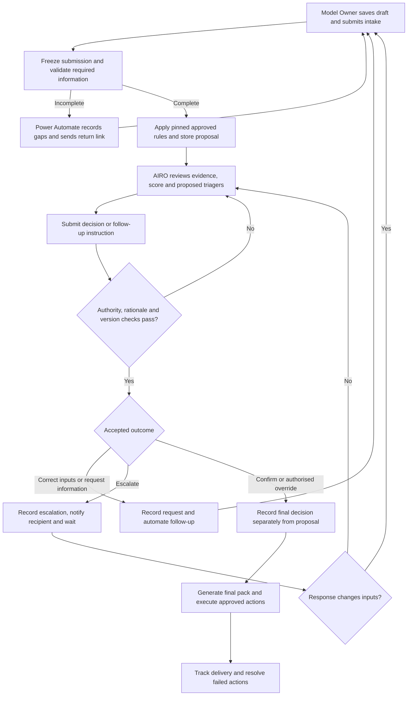
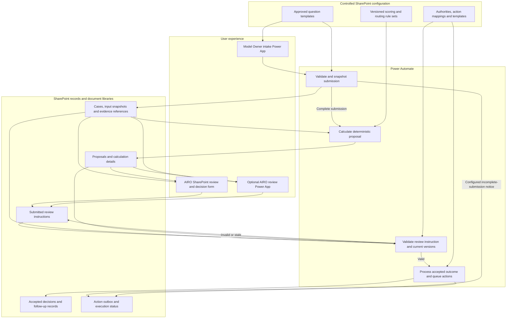
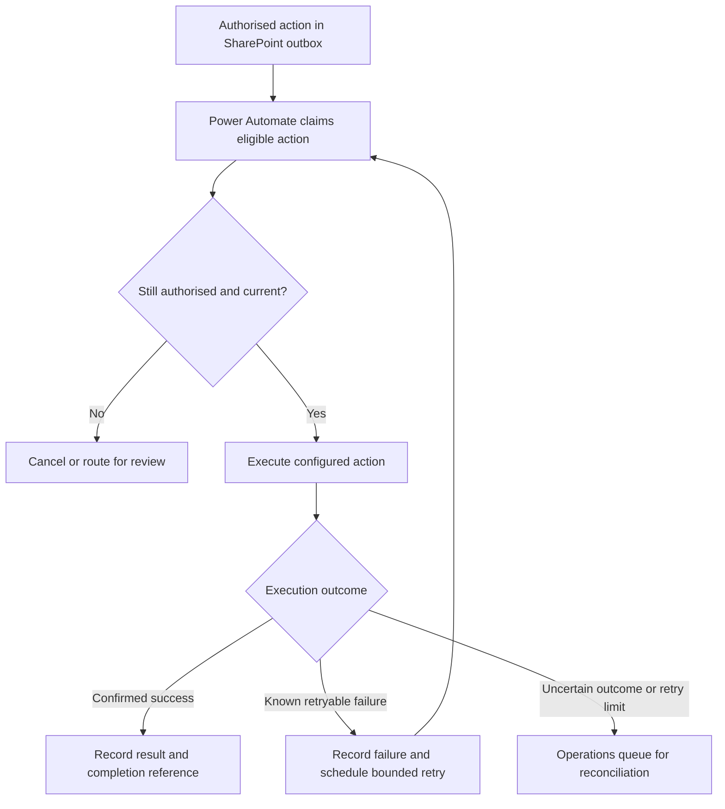
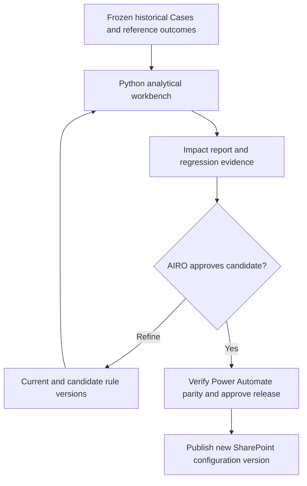

# AI Risk Triage Version 1 Blueprint

**Status:** Proposed design for AIRO feedback and implementation planning  
**Scope:** Deterministic Power Platform workflow, with AIRO review  
**Revision:** Updated to reflect automated execution of AIRO outcomes

## Purpose and design principle

Provide a quick operational workflow for Model Owners to submit use-case information and for AI Risk Oversight (AIRO) to review materiality scores, deal-breakers and proposed second-line (2LoD) triagers. Power Automate handles processing, records and approved follow-up. This document describes requirements to implement and verify, rather than asserting that these controls already exist.

> The system validates, calculates and proposes. AIRO reviews and makes the controlled decision. Power Automate validates the decision submission, records the accepted outcome and executes the authorised actions.

Use one focused Power App for intake because it must load configurable questions. Start AIRO review with SharePoint views and standard forms. Add another Power App only where user testing demonstrates a material gap. Version 1 has no LLMs or agents. A separate Python analytical workbench supports rule testing and calibration. Future AI enhancements are a separate phase.

## 1. User journey

The Model Owner enters information once and returns to the same Case when additional information is needed. AIRO reviews through a linked SharePoint workspace. Emails provide notifications and links back to the Case so that structured responses and decisions remain recorded.

### Review outcomes and automated execution

| AIRO outcome | Human responsibility | Power Automate responsibility |
|---|---|---|
| Confirm | Accept the current proposal | Validate authority and freshness, save the decision, generate the pack and execute approved actions |
| Correct input | Identify factual corrections and the person authorised to make them | Return the relevant fields, retain history, create a new submission version and recalculate before confirmation |
| Authorised override | Specify the permitted change and record why it is justified | Validate override authority, preserve the calculated proposal and record the distinct final outcome |
| Request information | Identify the questions or evidence required | Record the request, update status, email the return link and track the response |
| Escalate | Identify the issue and authorised recipient | Record the escalation, notify the recipient and track the response before review resumes |

An information request or escalation does not create a final triage result. A factual correction is not an override: changed inputs require recalculation. AIRO may edit inputs only where the agreed role permissions permit this, with the source and reason recorded.

Automated mandatory-field reminders and incomplete-submission notices may run under an approved standing rule. They do not require a new AIRO decision on every occasion. Version 1 still requires AIRO confirmation or an authorised override for the final triage outcome.

## 2. Technical design

The architecture separates input records, system proposals, submitted review instructions, accepted decisions and action execution. Both review interfaces use the same processing controls.

The optional Power App is an alternative interface, not an extra review step. Rejected instructions retain a rejection reason and do not authorise downstream actions. Every processing stage writes audit events, omitted from this diagram for readability.

### Automated action execution

Supported action types include information-request emails, escalation notifications, Case status updates, final-pack generation and approved 2LoD referrals or tasks. A referral notification does not mean the receiving team has accepted or completed the work. Track those separately if required.

## 3. Configurable questions and deterministic rules

AIRO owns the methodology. Authorised administrators maintain draft configuration through SharePoint Lists. Power Automate implements a limited, documented set of rule operators, such as equality, membership, numeric comparisons and approved combinations. New operators or changes to calculation semantics require development and testing.

| Configuration | Contents | Change approach |
|---|---|---|
| Questionnaire | Stable question and option IDs, wording, ordering and sections | Publish a new questionnaire version |
| Response requirements | Required answers, rationale, evidence and supported conditional display | Validate through both intake and submission processing |
| Materiality scoring | Option scores, weights, aggregation and missing-value treatment | Test current and candidate rule sets |
| Rating bands | Thresholds and inclusive/exclusive boundaries | Verify boundary Cases and approve a new version |
| Deal-breakers | Conditions, consequences, precedence and reason codes | Explicit regression tests and AIRO approval |
| 2LoD routing | Trigger conditions, team identifiers and routing reasons | AIRO approval with relevant 2LoD agreement |
| Authorities and outcomes | Reviewer roles, override permissions and permitted transitions | Controlled access and workflow change |
| Actions and templates | Outcome-to-action mappings, recipients, notification content and pack layout | Review recipient rules and test generated outputs |

### Version lifecycle

1. **Draft:** administrator creates a candidate version with a change reason.
2. **Test:** run configuration validation, relevant analytical tests and end-to-end regression checks.
3. **Approve:** AIRO approves methodology changes and the designated release owner approves deployment.
4. **Publish:** activate one compatible release bundle with an effective date.
5. **Retire:** retain earlier versions for reproduction and controlled rollback.

A release bundle references the exact questionnaire, rule-set and applicable policy/template versions. Treat publication as a controlled release with a single active bundle pointer so flows cannot combine partially published settings.

At draft creation, retain the questionnaire version displayed to the Model Owner. At submission, create an input snapshot and resolve an approved compatible rule set. If the draft version is no longer eligible, explain the change and require an explicit migration or resubmission. Never silently reinterpret old answers against new questions.

Every calculation pins the input, evidence, questionnaire, rule-set and calculation implementation versions. Resubmissions retain the Case ID and create a new input version. Use the existing rule set when policy permits, or record an explicit approved migration. Publishing a new configuration does not automatically rewrite historical results.

## 4. SharePoint records and evidence storage

These are logical records. Related configuration entities can share physical lists where permissions and versioning remain clear. Keep the first implementation small, while preserving distinct input, proposal and decision records.

| Logical record | Suggested list or library | Minimum information |
|---|---|---|
| Case register | `AI_Use_Cases` | Case ID, owner, current input/proposal/decision references and lifecycle status |
| Submission snapshot | `Case_Submissions` | Case ID, input version, questionnaire version, release reference, submitter, timestamp and processing status |
| Answers | `Case_Answers` | Submission ID, question ID, option ID, rationale and evidence references |
| Evidence register | `Evidence_Register` | Evidence ID, Case ID, document location and version, uploader and date |
| Evidence files | `Case_Evidence` document library | Versioned files with access appropriate to the Case |
| Triage proposals | `Triage_Proposals` | Proposal ID, pinned versions, computed score/rating, deal-breakers, triagers and freshness status |
| Calculation details | `Triage_Result_Details` | Rule IDs, input references, score contributions, matched conditions and reason codes |
| Review submissions | `AIRO_Review_Requests` | Requested outcome, proposal/input version, authenticated submitter, rationale and processing status |
| Accepted decisions | `AIRO_Decisions` | Decision ID, accepted outcome, final rating/routing, reviewer, timestamp, proposal reference and override reason |
| Follow-up tracking | `Case_Follow_Ups` | Request/escalation ID, source instruction, questions, recipient, due date, response and status |
| Action outbox | `Action_Outbox` | Unique action key, authority reference, action type, recipient, payload reference, attempts and execution outcome |
| Audit events | `Triage_Audit_Log` | Event ID, Case and version references, actor, time, event type, outcome and correlation ID |
| Final packs | `Triage_Packs` document library | Pack ID/version, accepted decision reference, generation status and publication location |
| Configuration | Versioned configuration lists | Release register, questionnaires/options, scoring/bands, deal-breakers, routing, authorities and templates |
| Analytical runs | Separate workbench run register | Dataset snapshot, code and candidate rule versions, results and approval references |

Do not store final authority in a freely editable Case status field. The accepted decision record authorises finalisation. Treat summary fields on the Case register as derived views of the underlying records.

Enable and configure SharePoint version history for relevant lists and libraries. It supports tracking and restoring changes, while explicit business version IDs connect the complete calculation and decision. See [Microsoft guidance on version history](https://support.microsoft.com/en-us/sharepoint/lists/documents-and-library/how-versioning-works-in-lists-and-libraries).

## 5. Processing, lifecycle and operational controls

### Flow responsibilities

| Flow | Trigger and responsibility |
|---|---|
| Submission processing | Process a submitted input version, validate requirements and create a reproducible proposal or structured gap request |
| Review processing | Process a submitted review instruction, validate the authenticated reviewer and current proposal, then record the accepted outcome |
| Action execution | Execute eligible outbox actions, respect dependencies and record outcomes |
| Reconciliation | Find incomplete multi-record updates, stuck runs, missing actions and uncertain delivery outcomes |
| Configuration release | Validate and activate an approved compatible release bundle |

Use trigger conditions and explicit processing states to prevent a flow from repeatedly triggering itself when it updates a SharePoint item. Microsoft describes this pattern in [Power Automate anti-pattern guidance](https://learn.microsoft.com/en-us/power-automate/guidance/coding-guidelines/avoid-anti-patterns).

### Lifecycle

| Case status | Meaning and exit condition |
|---|---|
| Draft | Owner can edit before submission |
| Submitted / Processing | Frozen input awaits validation and calculation |
| Awaiting owner | Missing information or a factual correction requires a new submission |
| Ready for AIRO review | A current proposal is available |
| Awaiting escalation response | Recorded escalation awaits an authorised response |
| Decision confirmed | AIRO decision is accepted, with finalisation actions pending |
| Finalised | Final pack exists and all required finalisation actions have confirmed outcomes |

Track technical errors, action delivery and proposal freshness separately from the business status. A failed email does not erase an accepted decision. A newly submitted input version invalidates the affected current proposal and blocks confirmation against it. After finalisation, a material change starts a new assessment cycle under the same Case and preserves the earlier decision and pack.

### Required controls

- **Authority before acceptance:** validate the authenticated submitter, permitted outcome, required rationale and current input/proposal references before creating an accepted decision or action.
- **Concurrency:** prevent two reviewers or workers from processing the same current record concurrently. Recheck the record version before committing an outcome.
- **Complete snapshots:** only calculate once all records for a submission are ready. Reject missing, inconsistent or unsupported configuration.
- **Evidence limits:** automated validation checks required references and formats. AIRO assesses evidence quality, relevance and semantic consistency in Version 1.
- **Proposal transparency:** retain the rule-level score breakdown, calculation reasons and source answers. Template-generated reasons explain rule matches; they do not independently substantiate the owner's claims.
- **Override controls:** preserve calculated and final outcomes separately. Do not allow an override of a protected deal-breaker unless the approved policy explicitly permits it.
- **Audit protection:** restrict routine editing/deletion of accepted decisions and audit events and use corrective events for changes. Define retention and privileged administration controls. An ordinary SharePoint list is not inherently immutable.
- **Access:** owners access their authorised Cases, reviewers access their assigned scope, administrators maintain configuration and automation identities receive required permissions. Hiding fields in a form is not an access control.
- **Operational ownership:** assign flow owners, connection support, alert recipients and a failure-resolution process. Keep durable decision and action evidence outside transient flow history.

### Action outbox controls

The outbox is a small SharePoint list of authorised work instructions, not an additional user interface. Link each action to its accepted review outcome or approved standing rule. A final-pack action depends on an accepted final decision; a final-notification action depends on successful pack creation.

Use a unique key derived from the Case, source decision/request, action type, recipient and action version. Claim an eligible action before execution and record `Pending`, `Processing`, `Succeeded`, `RetryPending`, `NeedsReview` or `Cancelled` as appropriate. Persist attempts, timestamps, error details and any external reference returned.

An outbox alone does not guarantee exactly-once email or task delivery. If a service accepts an action but the flow fails before recording success, delivery is uncertain. Reconcile it before resending when duplicate delivery matters. Use bounded retries for known retryable failures and a visible operations queue for unresolved outcomes.

SharePoint updates across multiple lists must have a recoverable processing design. Use stable correlation IDs, intermediate states and reconciliation so a partially completed decision/action sequence can resume without issuing a second decision or repeating completed actions.

## 6. User experience and when to add Power Apps

| User | Initial experience | Add a Power App when |
|---|---|---|
| Model Owner | Focused intake app with configurable choices, rationale, evidence upload, save/resume and return links | Included in Version 1 because dynamic questionnaire rendering is required |
| AIRO reviewer | SharePoint review queue, Case summary, evidence/pack links and a standard review-instruction form | UAT shows that reviewing related records or submitting controlled decisions is cumbersome or error-prone |
| Configuration administrator | Restricted SharePoint draft lists and release workflow | Preview, bulk editing or dependency checks justify a tailored interface |
| Operational support | SharePoint failure and pending-action views | Volume or triage needs exceed usable standard views |

AIRO should see the current answers, rationale, evidence, score breakdown and proposed triagers before selecting an outcome. Users should not need to open Power Automate to operate the process. Notify them with a direct Case link and clearly show whether a request or notification has been sent, failed or awaits action.

## 7. Separate Python calibration and testing workbench

AIRO operates the analytical workbench on controlled historical snapshots. AI Tech and Tooling maintains the Python framework and reproducible calculation implementation. AIRO owns methodology, reference outcomes, interpretation and approval of candidate rule changes.

| Capability | Purpose | Example output |
|---|---|---|
| Calibration | Assess how scores, thresholds and triggers align with agreed reference judgements | Proposed adjustments with supporting analysis |
| Backtesting | Apply current and candidate versions to the same historical Cases | Changed ratings, changed 2LoD routing and affected Case list |
| Sensitivity analysis | Vary permitted parameters or input scenarios | Boundary Cases and outcomes sensitive to small changes |
| Regression testing | Check approved reference Cases and expected behaviour | Pass/fail differences, including deal-breakers and rule precedence |
| Periodic monitoring | Track score distributions, override patterns and data completeness | Trends and review prompts for AIRO |

Begin with an approved versioned export if direct data access is unavailable. Record dataset scope and limitations alongside the code and configuration versions. Historical AIRO decisions and overrides are reference judgements to evaluate, not automatically objective ground truth.

The Python and Power Automate calculations must produce matching scores, ratings, deal-breakers and triagers for the same input and rule versions. Test parity, including thresholds, rounding, missing values and rule precedence, before publishing changes. Python regression testing complements end-to-end Power Platform UAT covering intake, permissions and action execution.

The workbench cannot change live rules automatically. Approved publication affects eligible future calculations. Reassessment of historical Cases requires an explicit decision and a new calculation record.

## 8. Future LLM support and validation integration

This phase requires proven value, an agreed operating model and approved access/hosting. It is outside the Version 1 release gate.

Potential capabilities include evidence extraction with citations, semantic conflict detection, targeted questions, evidence-linked pack drafting and reuse of confirmed facts for Independent Validation. A policy-governed Coordinator can choose permitted evidence-processing actions from current Case State, invoke approved tools, verify results and replan as information changes.

Deterministic policy controls authority and permitted actions. LLMs can recommend actions and draft observations within those boundaries. AIRO retains protected risk decisions; Independent Validation retains its own scope and conclusions.

Use stable Case/model identifiers, source versions and access controls for handover. Share confirmed facts, unresolved issues, evidence references and advisory validation considerations. Model Owners still provide the documentation and code required for validation. Returning validation status to the AIRO view supports coordination. MARM remains the governance record where agreed; shared evidence and analytical work do not create a competing governance lifecycle.

## 9. Delivery sequence and acceptance criteria

### Delivery sequence

1. Confirm Power Apps, Power Automate and SharePoint access, approved environments, connectors, licences and operating support.
2. Agree the questionnaire and deterministic methodology with AIRO, using the PwC Python tool as the reference where approved.
3. Implement versioned configuration and the intake-to-proposal path.
4. Implement review-instruction validation, accepted decisions and automated actions.
5. Complete end-to-end UAT, failure recovery and access tests before controlled release.
6. Develop the Python workbench in parallel. Retain minimum rule regression and calculation-parity evidence as a Version 1 release requirement.

### Acceptance criteria

- Configurable multiple-choice questions load correctly with rationale and evidence requirements.
- Drafts resume on the correct questionnaire version, and incompatible changes require explicit migration.
- Incomplete submissions return specific gaps without generating a misleading final score.
- Approved reference Cases match the expected PwC/approved methodology outcomes.
- AIRO can confirm, request corrections/information, escalate and make permitted overrides through the chosen interface.
- Unauthorised or stale review instructions cannot create an accepted decision or downstream actions.
- New inputs trigger recalculation, and previous proposals/decisions remain traceable.
- Rule changes require a tested, approved release and do not silently recalculate past Cases.
- Final packs contain the input/rule references, proposal, AIRO decision, rationale, evidence links and relevant action status.
- Duplicate triggers, concurrent reviews, partial updates and uncertain notification outcomes have tested recovery paths.
- Access restrictions and agreed retention settings operate in the deployed environment.
- AIRO can operate the journey without using the flow editor, and support can resolve failures from documented queues.

## 10. Decisions for AIRO and delivery teams

| Decision to confirm | Suggested accountable role |
|---|---|
| Final question set, scoring, deal-breakers and 2LoD routing | AIRO methodology owner |
| Permitted overrides, escalation routes and response expectations | AIRO lead with relevant 2LoD stakeholders |
| Sufficiency of standard SharePoint review | AIRO users with delivery lead |
| Configuration approval and version-migration policy | AIRO methodology owner and release owner |
| Recipient mappings, final-pack content and required completion actions | AIRO operational owner |
| Access, retention, automation connections and support arrangements | Delivery lead with relevant technology/control owners |
| Analytical reference Cases and Python parity criteria | AIRO methodology owner with AI Tech and Tooling |

## Revision summary

- Updated all original sections to reflect human decisions with automated execution.
- Corrected the architecture so submitted review instructions pass validation before becoming accepted decisions.
- Distinguished factual corrections, overrides, information requests and escalations.
- Added the missing outbox, review-request, follow-up and document-library records.
- Clarified compatible configuration releases, submission snapshots and stale-result handling.
- Replaced absolute audit and duplicate-prevention claims with specific controls and recovery requirements.
- Added the separate Python workbench, future integration scope and operational acceptance criteria.
