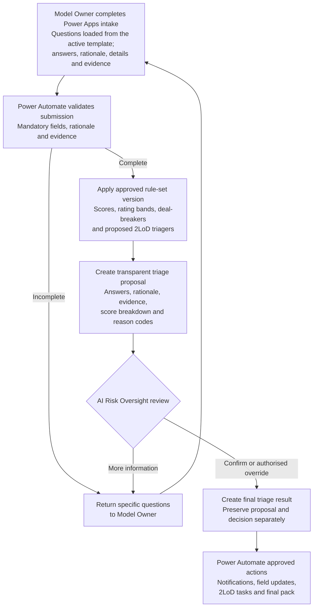
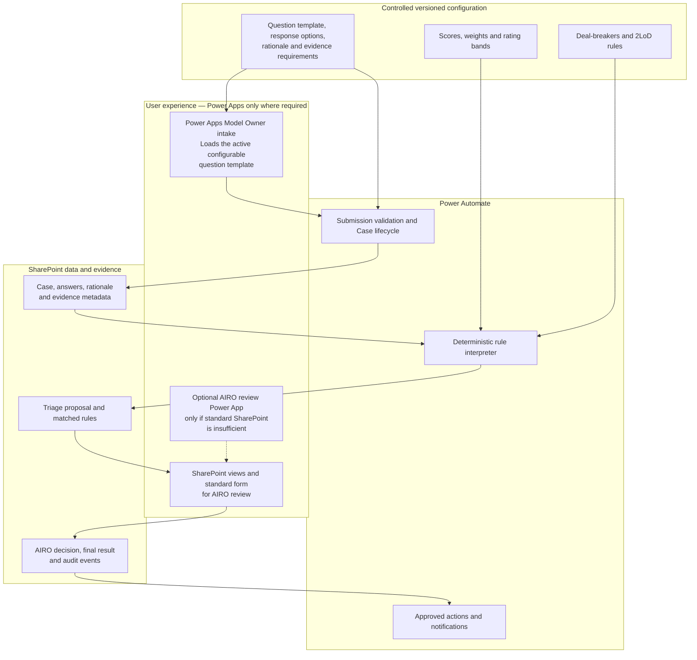

# AI Risk Triage Version 1 Blueprint

## Purpose

This blueprint describes the quickest operational version of the AI Risk Triage workflow. It uses Power Apps only for the Model Owner intake, where the screen needs to load a versioned, configurable question template. SharePoint Lists hold configuration and Case records, while Power Automate performs deterministic processing. Standard SharePoint views and forms support the initial AIRO review unless user testing demonstrates a need for a tailored review Power App. The version does not use LLMs or agents.

## Design principle

> The system validates, calculates and proposes. AI Risk Oversight reviews and confirms. Power Automate executes only approved follow-up actions.

## 1. User journey



## 2. Technical design



## 3. What is configurable in Version 1

| Configuration | Storage | Change approach |
|---|---|---|
| Questionnaire wording, choices and order | SharePoint question-template list | Power Apps loads the approved active questionnaire version |
| Mandatory answer and rationale requirements | SharePoint configuration list | Update a draft configuration and publish after testing |
| Scores and weights | SharePoint scoring-rule list | Configuration change using existing rule operators |
| Materiality rating bands | SharePoint rating-band list | Approved configuration change |
| Deal-breakers | SharePoint deal-breaker list | Approved configuration change and regression test |
| 2LoD triagers | SharePoint routing-rule list | Approved configuration change with relevant 2LoD agreement |
| Notification templates | SharePoint template list | Controlled template update |

Power Automate must read one approved, effective rule-set version and record that version against the Case. A change to an active configuration must create a new version rather than overwrite the version already used for earlier Cases.

## 4. Minimum SharePoint records

```text
AI_Use_Cases
Case_Answers
Evidence_Register
Triage_Proposals
Triage_Result_Details
AIRO_Decisions
Triage_Audit_Log
Questionnaire_Register
Triage_Rule_Sets
Materiality_Rules
Materiality_Bands
Deal_Breaker_Rules
Second_Line_Routing_Rules
Notification_Templates
```

## 5. Minimum control requirements

- Stable Case ID and input version.
- Questionnaire and rule-set versions frozen for each calculation.
- Score contribution and reason code for every matched rule.
- Original system proposal stored separately from the AIRO decision.
- AIRO override authority and mandatory override rationale.
- No confirmation of stale results after material input changes.
- Append-oriented audit records covering submission, calculation, review, decision and follow-up actions.
- Idempotency controls to prevent duplicate calculations, emails and tasks.
- Development, test/UAT and production release controls.
- Reconciliation and failure queues for incomplete or failed processing.

## 6. When Power Apps becomes justified

Version 1 uses one focused Power App for the Model Owner intake because it needs to render configurable questions. Avoid building additional Power Apps unless operational use demonstrates a material need for:

- more complex conditional question display than the initial intake app supports;
- a single AIRO screen combining answers, rationale, evidence and decision controls;
- better save-and-resume handling than the initial form provides;
- controlled administration and preview of questionnaire versions.

For the quick first version, authorised administrators can maintain draft configurations through controlled SharePoint Lists. Add a separate configuration Power App only after the configuration process and control requirements are stable.
