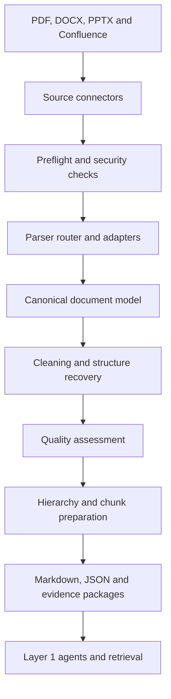

# Product Requirements Document

## Layer 1 Unstructured Evidence Ingestion and Preparation Service

**Platform:** MRO AI Risk Oversight Platform  
**Layer:** Layer 1 — Risk Intake, Evidence Review and Triage  
**Working name:** Unstructured Evidence Service  
**Primary developer:** Ali Abbs  
**Technical progress and quality reviewer:** Kai  
**Product and methodology owner:** AI Tech & Tooling / MRO  
**Document status:** Draft for team review  
**Version:** 1.0  
**Date:** 30 July 2026

---

## 1. Purpose of this document

This Product Requirements Document defines what Ali needs to design and build for the Layer 1 Unstructured Evidence Ingestion and Preparation Service, why each component is needed, how the components fit together, and how delivery should be phased.

It should be used for four purposes:

1. Give Ali a clear and bounded engineering scope.
2. Convert the current document-conversion exploration into a reusable Layer 1 platform service.
3. Give Kai objective checkpoints and acceptance criteria for reviewing progress.
4. Create a shared baseline for future integration with the Model Understanding, Policy Mapping, Evidence Gap, Risk Triage and Verification agents.

This document is the primary working specification. It should be maintained as the service develops. A short presentation may later be created from it for management or wider stakeholder communication, but slides should not replace this detailed specification.

---

## 2. Executive summary

The service will securely acquire unstructured documents from approved sources, convert them into reliable and structured content, preserve their original hierarchy and provenance, assess extraction quality, and produce agent-ready evidence for Layer 1.

The service is **not simply a file-to-Markdown converter**. Markdown is one useful output, but the authoritative internal output should be a structured canonical document representation that preserves:

- Document and revision identity
- Source and ownership metadata
- Sections and subsection hierarchy
- Paragraphs, lists, tables, figures and notes
- Page, slide or Confluence location
- Raw and cleaned content
- Parser and transformation history
- Stable citation identifiers
- Quality status and warnings

The intended outcome is:

> A modular, bank-compatible service that converts PDF, Word, PowerPoint and Confluence content into quality-controlled, hierarchical and citation-ready evidence packages for downstream Layer 1 LLMs and agents.

The service should provide evidence and document intelligence foundations. It must not make MRO methodology decisions such as model materiality, risk classification, policy compliance, evidence sufficiency or validation depth.

---

## 3. Problem statement

Layer 1 will receive information in multiple unstructured formats, including:

- Model development and methodology documents
- Architecture and design documents
- Risk assessments
- Policies, standards and practical guidance
- PowerPoint presentations
- Model-owner questionnaires
- Confluence pages and attachments
- Testing evidence and technical reports

These sources are difficult for downstream LLMs and agents to use consistently because:

- Formats and structures differ.
- Important context can be lost during flat text extraction.
- PDFs may contain multi-column layouts, scans, tables, diagrams, repeated headers and footers.
- Word documents contain heading styles, tables, comments and other structural elements.
- PowerPoint content has slide-specific reading order, speaker notes, diagrams and repeated template content.
- Confluence pages have page hierarchies, panels, tables, links, versions and attachments.
- Extracted text may contain errors that are not visible to downstream consumers.
- Without provenance, an agent conclusion cannot be reliably checked against its source.
- Without version control, the platform cannot distinguish current evidence from superseded evidence.

Layer 1 therefore needs a controlled service between source documents and downstream AI components.

---

## 4. Product goals

### 4.1 Primary goals

The service must:

1. Ingest supported documents through a common interface.
2. Preserve an unchanged copy or reference to the original source.
3. Route each document to an appropriate format-specific parser.
4. Produce clean, readable Markdown for human review and LLM use.
5. Produce a canonical structured JSON representation.
6. Preserve document hierarchy and source locations.
7. detect and report extraction-quality problems.
8. Create stable document, revision, section, block and citation identifiers.
9. Produce approved content blocks and chunks for downstream agents.
10. Support modular replacement of parsers, storage and downstream models.
11. Operate within the bank-approved environment and avoid unapproved external services.

### 4.2 Strategic goals

Over time, the service should also:

- Become the shared evidence foundation for Layer 1 agents.
- Support separate Policy and Model Evidence knowledge bases through a common schema.
- Enable comparison between document revisions.
- Produce quality, usage and provenance records for AI Risk Intelligence.
- Allow future ingestion sources, such as SharePoint, to be added without redesigning the processing pipeline.
- Support deterministic and controlled retrieval before more complex agentic retrieval is introduced.

### 4.3 Success statement

The service is successful when a downstream Layer 1 agent can request relevant evidence and receive:

- The source-authored content
- Its document and revision
- Its full section path
- Its page, slide or Confluence location
- Its stable citation ID
- Its extraction-quality status
- Its parser and processing provenance

without knowing which parser or source connector created it.

---

## 5. Non-goals and boundaries

The initial service will not:

- Decide model materiality.
- Assign final risk classifications.
- Determine whether a policy requirement is satisfied.
- Determine whether model-owner evidence is sufficient from an MRO methodology perspective.
- Select the final validation depth or testing plan.
- Generate independent validation conclusions.
- Replace human review for low-quality or ambiguous extraction.
- Assume that all source documents can be safely flattened into Markdown.
- Introduce an unrestricted autonomous agent.
- Depend on external commercial parsing APIs or public LLM endpoints.
- Require a graph database in the initial delivery.
- Require a production React interface in the initial delivery.

These boundaries protect MRO methodology ownership and keep Ali’s component focused on evidence acquisition, preparation, quality and traceability.

---

## 6. Users and downstream consumers

### 6.1 Direct users

| User | Need |
|---|---|
| Ali | Clear component scope, interfaces, priorities and acceptance criteria |
| Kai | Repeatable progress checks, demonstrations, quality tests and phase-gate evidence |
| AI Tech & Tooling team | Reusable service that can be integrated into Layer 1 |
| MRO validators and risk specialists | Trustworthy evidence that can be traced back to the original source |
| Platform developers | Stable APIs and data contracts independent of parser implementation |

### 6.2 Downstream Layer 1 consumers

| Consumer | Required output from this service |
|---|---|
| Model Understanding Agent | Hierarchical content, architecture sections, tables, metadata and citations |
| Policy Mapping Agent | Policy clauses, section paths, control references, versions and citations |
| Evidence Gap Agent | Document inventory, evidence types, missing or failed extraction indicators and quality warnings |
| Risk Triage Agent | Structured facts and cited source evidence concerning model design, use, data, controls and limitations |
| Recommendation Agent | Evidence packages supporting proposed follow-up actions |
| Verification Agent | Original source location, raw and cleaned content, parser details, quality status and revision history |

---

## 7. Design principles

Ali should use the following principles to guide design decisions:

1. **Structured representation before Markdown.** Convert sources into a typed canonical model, then render Markdown from that model.
2. **Evidence before reasoning.** The service retrieves and prepares evidence; MRO-owned agents interpret it.
3. **Provenance by default.** Every material block should be traceable to an original location.
4. **No silent transformation.** Meaning-changing cleaning or summarisation is prohibited.
5. **Raw and cleaned content coexist.** The original extracted content must remain available for comparison.
6. **Quality is machine-readable.** Quality problems must be structured, not only described in log messages.
7. **Modular adapters.** Sources, parsers, storage and outputs must be replaceable behind stable interfaces.
8. **Deterministic processing first.** LLM-assisted processing is optional, clearly labelled and introduced only where it adds value.
9. **Bank-compatible by design.** Approved models, packages, authentication and storage must be used.
10. **Human review at uncertainty points.** Low-confidence or structurally ambiguous documents must be routed for review.
11. **Progressive implementation.** First establish reliable ingestion and conversion; then hierarchy, citation and retrieval; then revision and intelligence capabilities.

---

## 8. Target architecture



The implementation should separate orchestration from component logic. A FastAPI endpoint, command-line job, notebook or later background worker should call the same underlying workflow.

Recommended logical layers:

| Layer | Responsibility |
|---|---|
| Source | Acquire uploaded files and Confluence content |
| Preflight | Validate file, source, security and processing feasibility |
| Parsing | Extract content using format-specific adapters |
| Canonicalisation | Convert parser-specific results into a shared document schema |
| Processing | Clean content, reconstruct structure and link assets |
| Quality | Measure extraction coverage, integrity and traceability |
| Preparation | Build hierarchy, chunks, metadata and citations |
| Output | Write Markdown, JSON, manifests, quality reports and evidence packages |
| Service | Expose stable methods or APIs to downstream Layer 1 components |

---

## 9. Functional requirements by component

### 9.1 Component A — Unified ingestion request

All sources should enter the pipeline through a consistent request contract.

Minimum fields:

```python
class IngestionRequest:
    source_type: str              # upload, filesystem, confluence
    source_reference: str | None
    file_name: str | None
    use_case_id: str
    corpus_type: str              # policy, model_evidence
    document_type: str
    confidentiality: str
    requested_by: str
```

Requirements:

- Validate mandatory fields.
- Generate an ingestion job ID.
- Associate the job with a use case or project.
- Create or resolve a logical document ID.
- Identify whether this is a new document or a new revision.
- Return machine-readable status and errors.

Acceptance criteria:

- The same orchestration workflow can process an upload and a Confluence page.
- Invalid requests fail before parsing begins.
- Every accepted request receives a unique ingestion job ID.

### 9.2 Component B — Local file connector

Initial supported formats:

- PDF
- DOCX
- PPTX
- Markdown
- Plain text

Requirements:

- Validate extension and detected MIME type.
- Calculate SHA-256 content hash.
- Detect exact duplicate content.
- Record filename, size, time and requesting identity.
- Store or reference the original file unchanged.
- Create a source manifest.
- Pass a standard `SourceDocument` object to the parser router.

Acceptance criteria:

- Each supported file type is ingested through the common request.
- Duplicate files are detected without creating unnecessary revisions.
- The original file can be associated with every processed output.

### 9.3 Component C — Confluence connector

Requirements:

- Accept page ID or supported page URL.
- Use an approved authentication approach.
- Never store credentials in source code or committed configuration.
- Retrieve title, page body, version, author, last-updated date and parent hierarchy.
- Preserve headings, lists, tables, links, panels and attachment references.
- Optionally retrieve permitted child pages and attachments.
- Store or reference the raw API response or source HTML.
- Support refresh by comparing Confluence page version or content hash.
- Return the same canonical `SourceDocument` contract as uploaded files.

Later extension:

- Connector abstraction should allow SharePoint or another source to be implemented without changing parsing and quality components.

Acceptance criteria:

- An authorised Confluence page can be retrieved and converted.
- Page version and source reference are preserved.
- A page with no change is not unnecessarily reprocessed.
- Authentication information does not appear in logs, source code or outputs.

### 9.4 Component D — Source manifest and document identity

Each ingestion must create a source manifest similar to:

```json
{
  "document_id": "DOC-001",
  "revision_id": "REV-003",
  "ingestion_job_id": "JOB-018",
  "source_type": "confluence",
  "source_reference": "page-12345",
  "source_version": "17",
  "content_hash": "sha256:...",
  "retrieved_at": "2026-07-30T09:00:00+01:00",
  "original_format": "html",
  "use_case_id": "UC-001",
  "corpus_type": "model_evidence"
}
```

Requirements:

- Distinguish logical document identity from ingested revision.
- Create stable identifiers.
- Record source, ownership, classification and technical metadata.
- Make manifest available with every output package.

### 9.5 Component E — Preflight and routing

Preflight checks must include:

- File can be opened.
- File is not corrupted.
- Password protection is detected.
- Declared extension matches actual content type.
- PDF is text-based, scanned or mixed.
- Page or slide count is within configured limits.
- Unsupported active content or embedded objects are flagged.
- Empty and duplicate content is detected.
- Source meets configured security and size constraints.

Routing examples:

```text
Text PDF       -> standard PDF parser
Scanned PDF    -> approved OCR route
Complex PDF    -> primary parser plus optional comparator
DOCX           -> Word adapter
PPTX           -> PowerPoint adapter
Confluence     -> Confluence content adapter
Unsupported    -> manual review or failed status
```

Acceptance criteria:

- Scanned and text-based PDFs are distinguishable.
- Password-protected or corrupted files do not enter normal parsing.
- Preflight produces a structured report with pass, warning or failure reasons.

### 9.6 Component F — Parser adapter framework

Common interface:

```python
class DocumentParser:
    def supports(self, source: SourceDocument) -> bool:
        ...

    def parse(self, source: SourceDocument) -> ParsedDocument:
        ...
```

Initial adapters:

- `PdfParser`
- `ScannedPdfParser` or a clearly defined OCR placeholder
- `DocxParser`
- `PptxParser`
- `ConfluenceParser`
- `MarkdownParser`

Each adapter must:

- Return the canonical schema.
- Record parser name and version.
- Produce structured errors and warnings.
- Preserve source locations where available.
- Support a controlled fallback mechanism.

Candidate parser strategy:

| Source | Primary | Potential fallback |
|---|---|---|
| PDF | Docling | PyMuPDF or PyMuPDF4LLM |
| Scanned PDF | Bank-approved OCR | Manual-review route |
| DOCX | Docling | python-docx |
| PPTX | Docling | python-pptx |
| Confluence | Storage HTML/API parser | Controlled HTML-to-Markdown conversion |

The chosen implementation must be validated in the bank environment. A package should not be adopted merely because it performs well on public examples.

### 9.7 Component G — Format-specific extraction

#### PDF

The PDF adapter should address:

- Page-level text
- Heading and section recognition
- Reading order and multi-column layouts
- Headers and footers
- Footnotes
- Tables
- Images and captions
- Page mapping
- Scanned-page detection
- OCR confidence where applicable
- Bounding boxes where available
- Cross-page tables

#### Word

The DOCX adapter should address:

- Heading hierarchy and styles
- Paragraphs
- Numbered and bulleted lists
- Tables and captions
- Footnotes and endnotes
- Hyperlinks and cross-references
- Headers and footers
- Embedded images
- Section and page breaks
- Document properties
- Presence of comments or tracked changes, even if they are not processed initially

#### PowerPoint

The PPTX adapter should address:

- Slide identity, title and number
- Text-box reading order
- Bullet hierarchy
- Tables and chart text
- Speaker notes
- Images and captions
- Diagram and SmartArt text where available
- Hidden-slide status
- Repeated template content

PPTX must preserve slide containers. It must not be treated as one continuous document.

#### Confluence

The Confluence adapter should address:

- Page and ancestor hierarchy
- Headings
- Lists and tasks
- Tables
- Links
- Panels or callouts
- Attachments
- Macros that can be safely resolved
- Page version and metadata

### 9.8 Component H — Canonical document model

Markdown must not be the authoritative internal data model.

Minimum object structure:

```text
Document
├── Source metadata
├── Parser metadata
├── Document properties
├── Sections
│   ├── Subsections
│   └── Content blocks
├── Tables
├── Images and assets
├── Notes
├── Citations
└── Quality records
```

Illustrative models:

```python
class ParsedDocument:
    document_id: str
    revision_id: str
    title: str
    source_metadata: SourceMetadata
    sections: list[Section]
    assets: list[Asset]
    parser_metadata: ParserMetadata
    quality_result: QualityResult | None

class Section:
    section_id: str
    heading: str | None
    level: int
    section_path: list[str]
    blocks: list[ContentBlock]
    children: list["Section"]
    source_location: SourceLocation

class ContentBlock:
    block_id: str
    block_type: str
    raw_content: str
    cleaned_content: str
    source_location: SourceLocation
    order: int
```

Requirements:

- Define schemas using Pydantic or equivalent typed validation.
- Maintain schema version.
- Validate output before it becomes available downstream.
- Preserve parser-specific information only in extension fields; downstream consumers should use common fields.

### 9.9 Component I — Source location and stable citations

Each material content block should preserve:

- Document ID
- Revision ID
- Original file or Confluence reference
- Page, slide or Confluence location
- Section path
- Paragraph or block order
- Table or figure identifier
- Bounding box where available
- Parser and parser version
- Stable citation ID

Example:

```text
DOC-001-REV-003-P027-B004
```

Acceptance criteria:

- A user can take a citation ID from an evidence package and locate the source block.
- Citations do not silently point to a different document revision.
- The section path and page or slide are returned with cited content.

### 9.10 Component J — Cleaning and normalisation

Deterministic cleaning rules should include:

- Unicode normalisation
- Whitespace normalisation
- Broken-line repair
- De-hyphenation across lines
- Repeated-header and footer treatment
- Page-number treatment
- Bullet and numbering normalisation
- Encoding issue detection
- Empty-block removal
- Duplicate-paragraph detection

Prohibited silent transformations:

- Rewriting meaning
- Summarising source text
- Removing qualifications such as “may”, “subject to” or “not yet implemented”
- Removing negative statements or limitations
- Merging table cells into ambiguous prose
- Replacing author terminology with inferred terms

Both `raw_content` and `cleaned_content` must be retained. Each cleaning operation should be attributable to a rule or transformation record.

### 9.11 Component K — Structure recovery and hierarchy

The hierarchy builder should identify:

- Heading levels
- Numbered sections
- Appendices
- Policy clauses
- Control and requirement identifiers
- Slide containers
- Confluence page hierarchy

It should create a navigable section tree and propagate full section paths to child blocks.

Example:

```text
Model Development Document
└── Methodology
    └── RAG Architecture
        ├── Document ingestion
        ├── Embedding model
        ├── Retrieval
        └── Re-ranking
```

Structure anomalies to flag:

- Unexpected heading-level jumps
- Orphaned paragraphs
- Empty sections
- Repeated or malformed headings
- Tables without context
- Figures without captions
- Unassigned content blocks

### 9.12 Component L — Table and asset handling

Tables should be retained in:

- Structured rows and columns
- Markdown representation
- Optional retrieval-oriented linearisation
- Original source location
- Associated caption or surrounding context
- Table-quality assessment

Assets should record:

- Asset identity and type
- Source page or slide
- Caption
- Surrounding or referencing text
- Extraction status
- Storage reference

The service should not claim that an image or chart has been interpreted unless an approved vision capability has actually been applied.

### 9.13 Component M — Markdown generation

Two outputs should be supported.

#### Human-readable Markdown

For review, debugging and comparison.

#### Agent-ready Markdown

Includes controlled front matter and citation markers:

```markdown
---
document_id: DOC-001
revision_id: REV-003
document_type: model_development_document
use_case_id: UC-001
source_version: "3.2"
parser: docling
quality_status: PASSED_WITH_WARNINGS
---

## 4.2 Retrieval Configuration

<!-- citation_id: DOC-001-REV-003-P027-B004 -->
The system retrieves the top five documents...
```

Requirements:

- Markdown must be generated from the canonical model.
- A Markdown rendering check must be included.
- Markdown must not be treated as a replacement for structured JSON.

### 9.14 Component N — Quality assessment service

Quality assessment is a core component.

Minimum technical checks:

- Expected pages or slides were processed.
- Extracted content is not unexpectedly empty.
- Character counts are plausible.
- Replacement or encoding error characters are within limits.
- Page and slide ordering is plausible.
- Tables have valid structures.
- Referenced assets are accounted for.
- Section hierarchy validates.
- Markdown renders.
- Canonical JSON validates.
- Citation coverage meets the configured threshold.

Minimum quality measures:

| Measure | Description |
|---|---|
| Text coverage | Proportion of source pages or slides with extracted content |
| OCR confidence | Reliability of scanned-page extraction |
| Structure coverage | Proportion of content assigned to a valid hierarchy |
| Table integrity | Coherence of rows and columns |
| Reading-order quality | Whether output follows the apparent source order |
| Duplicate ratio | Repeated output introduced by parsing |
| Unresolved asset ratio | Referenced but unprocessed assets |
| Citation coverage | Proportion of material blocks with source locations |

Quality statuses:

```text
PASSED
PASSED_WITH_WARNINGS
MANUAL_REVIEW_REQUIRED
FAILED
```

Example issue:

```json
{
  "code": "TABLE_STRUCTURE_UNCERTAIN",
  "severity": "medium",
  "locations": [{"page": 27}],
  "message": "Column boundaries are inconsistent across rows."
}
```

Downstream agents must not receive failed documents by default. Use of a document requiring manual review must require an explicit and recorded override.

### 9.15 Component O — Parser comparison and fallback

For selected difficult documents, the service should be able to compare two parsing results on:

- Page coverage
- Extracted text coverage
- Heading detection
- Table and image count
- Text similarity
- Structure differences
- Citation coverage

This capability should initially support evaluation and manual selection. Automatic parser selection can be introduced later after sufficient benchmark evidence exists.

### 9.16 Component P — Hierarchical chunk preparation

Chunking order:

1. Document
2. Section
3. Subsection
4. Paragraph, list, table, figure or note block
5. Token-aware split only when a meaningful block exceeds the configured limit

Required chunk metadata:

```json
{
  "chunk_id": "CHK-001",
  "document_id": "DOC-001",
  "revision_id": "REV-003",
  "section_path": [
    "Methodology",
    "RAG Architecture",
    "Retrieval Configuration"
  ],
  "chunk_type": "text",
  "content": "...",
  "page_number": 27,
  "citation_ids": ["DOC-001-REV-003-P027-B004"],
  "parent_id": "SEC-4.2",
  "previous_chunk_id": "CHK-000",
  "next_chunk_id": "CHK-002",
  "quality_status": "PASSED"
}
```

Special chunk types may include:

- Narrative
- Policy clause
- Requirement
- Table
- Figure and caption
- Limitation
- Assumption
- Control
- Test result
- Appendix
- Confluence callout

Classification of special types should begin with deterministic rules. Any LLM-inferred classification must be labelled as inferred and linked to source citations.

### 9.17 Component Q — Metadata enrichment

Deterministic metadata:

- Title
- Filename or page title
- Author or owner where available
- Created and modified dates
- Version
- Draft, final, approved or obsolete status where explicitly present
- Page or slide count
- Heading hierarchy
- Table and image count
- Confluence hierarchy
- Explicit policy, control and requirement identifiers

Optional LLM-assisted enrichment:

- Document classification
- Model or use-case name
- Model components
- Systems and entities
- Risks, controls, limitations and assumptions
- Evidence types
- Candidate policy references

Rules for LLM-derived metadata:

- Clearly label it as inferred.
- Identify the model and prompt version.
- Include supporting citation IDs.
- Do not overwrite source-authored metadata.
- Allow human correction or rejection.

### 9.18 Component R — Document revisioning and change detection

Logical document and revision should be distinct:

```text
Document DOC-001
├── Revision 1 — initial draft
├── Revision 2 — model-owner update
└── Revision 3 — approved version
```

Revision comparison should later identify:

- Added, removed and changed sections
- Modified paragraphs
- Changed tables and numerical values
- Added or removed controls
- Added or removed limitations
- Changes to document status or ownership

This supports re-triage, revalidation, Layer 3 monitoring and organisational memory.

### 9.19 Component S — Storage and artifact layout

Use three logical zones:

| Zone | Contents |
|---|---|
| Raw | Original files, Confluence responses, content hashes and source manifests |
| Processed | Canonical JSON, Markdown, section tree, tables, assets, raw and cleaned content |
| Curated | Quality-approved chunks, metadata, evidence packages and retrieval indexes |

The initial implementation may use a structured filesystem or GCS-compatible storage abstraction with SQLite for metadata. Interfaces should support later migration to GCS and PostgreSQL.

Storage requirements:

- No hard-coded absolute environment-specific paths.
- Artifact references should be represented through a storage abstraction.
- Raw source must not be overwritten by processed output.
- Revision and job relationships must be retained.
- Access controls and retention requirements must be identified with the platform architecture owner.

### 9.20 Component T — Service and API contract

Minimum internal methods:

```python
ingest(request)
get_job_status(job_id)
get_document(document_id)
get_document_revision(document_id, revision_id)
get_section_tree(document_id, revision_id)
get_section(section_id)
get_blocks(document_id, revision_id, section_path=None)
get_tables(document_id, revision_id)
get_quality_report(document_id, revision_id)
resolve_citation(citation_id)
```

Later methods:

```python
compare_revisions(old_revision_id, new_revision_id)
search_content(query, filters)
search_section_paths(query, filters)
search_exact_terms(query, filters)
retrieve_evidence(query, filters)
```

Every evidence response should return content and provenance together.

### 9.21 Component U — Review capability

The initial release does not require a full production interface, but it should provide a demonstrable review surface showing:

- Original page, slide or source reference
- Extracted Markdown
- Parsed hierarchy
- Tables and assets
- Raw versus cleaned content
- Quality warnings
- Citation IDs and locations
- Approve, reject or reprocess decision

A lightweight prototype interface is acceptable if business logic remains outside the UI and can later be integrated into React and FastAPI.

### 9.22 Component V — Logging, audit and observability

Each ingestion run should record:

- Job and document identifiers
- Start and completion timestamps
- Source type and revision
- Parser and version
- Processing steps applied
- Warnings and failures
- Quality status and metrics
- Output artifacts created
- Manual-review or override decisions
- Runtime and resource measures where feasible

Logs must not expose:

- Authentication credentials
- API keys
- Sensitive content beyond approved logging policy

The audit record should be designed to support later AI Risk Intelligence analysis of parser quality, document types, recurring evidence problems and downstream usage.

---

## 10. Non-functional requirements

### 10.1 Security and privacy

- Use only approved internal systems and model endpoints.
- Do not transmit documents to public or unapproved services.
- Keep secrets outside source code and version control.
- Identify classification and access metadata.
- Minimise sensitive content in operational logs.
- Record access and processing identity where platform controls permit.

### 10.2 Reliability

- A single failed document should not corrupt other jobs.
- Failed processing should leave an intelligible job record.
- Processing should be repeatable for the same source and configuration.
- Partial outputs should be marked incomplete and excluded downstream.

### 10.3 Maintainability

- Use typed contracts.
- Separate connector, parser, processing, quality, output and storage logic.
- Keep configuration outside component code.
- Pin and document important dependency versions.
- Provide unit and integration tests.
- Include developer setup and operating instructions.

### 10.4 Reproducibility

Every curated output should identify:

- Source hash and version
- Parser name and version
- Schema version
- Cleaning configuration version
- Chunking configuration version
- LLM and prompt version where an LLM was used

### 10.5 Performance

Initial performance targets should be measured rather than guessed. Phase 1 must capture:

- File size
- Page or slide count
- Processing duration by step
- Total runtime
- Output size
- Failure and warning rates

Formal service-level targets can be agreed after benchmark results are available.

### 10.6 Portability

Core functions must be callable directly in Python and must not depend entirely on:

- A notebook
- A Gradio or Streamlit session
- A specific filesystem location
- A public cloud service
- Docker being available in GCP Workbench

---

## 11. Suggested package structure

```text
layer1_unstructured_evidence/
├── api/
│   ├── ingestion_routes.py
│   ├── document_routes.py
│   └── quality_routes.py
├── connectors/
│   ├── base.py
│   ├── file_connector.py
│   └── confluence_connector.py
├── parsers/
│   ├── base.py
│   ├── router.py
│   ├── pdf_parser.py
│   ├── scanned_pdf_parser.py
│   ├── docx_parser.py
│   ├── pptx_parser.py
│   └── markdown_parser.py
├── models/
│   ├── ingestion.py
│   ├── source.py
│   ├── document.py
│   ├── section.py
│   ├── block.py
│   ├── chunk.py
│   ├── provenance.py
│   └── quality.py
├── processing/
│   ├── cleaner.py
│   ├── hierarchy_builder.py
│   ├── table_normaliser.py
│   ├── asset_linker.py
│   ├── chunker.py
│   └── metadata_extractor.py
├── quality/
│   ├── validators.py
│   ├── metrics.py
│   ├── parser_comparator.py
│   └── quality_report.py
├── outputs/
│   ├── markdown_writer.py
│   ├── json_writer.py
│   └── evidence_package.py
├── storage/
│   ├── artifact_store.py
│   ├── metadata_repository.py
│   └── revision_repository.py
├── retrieval/
│   ├── path_search.py
│   ├── exact_search.py
│   └── content_search.py
├── orchestration/
│   └── ingestion_workflow.py
├── config/
├── tests/
│   ├── fixtures/
│   ├── unit/
│   ├── integration/
│   └── golden_documents/
├── README.md
└── pyproject.toml
```

This is a logical recommendation, not a requirement to create every module immediately. Phase 1 should establish the boundaries without overengineering unused components.

---

## 12. Delivery phases

## Phase 0 — Scope confirmation and technical baseline

### Objective

Agree the service boundary, current implementation baseline and test corpus before extending the prototype.

### Ali deliverables

- Demonstrate current PDF, DOCX, PPTX and Confluence processing.
- Document current packages, code structure, outputs and known limitations.
- Identify which parsers work in the bank environment.
- Propose the first canonical document schema.
- Assemble an initial representative document set.
- Identify authentication, storage and package-access dependencies.

### Kai checks

- Confirm the demo covers actual code rather than only example outputs.
- Confirm each source type has at least one real test document.
- Confirm limitations and blockers are recorded.
- Review whether the proposed schema retains structure and source location.

### Exit criteria

- Current-state demonstration completed.
- Agreed Phase 1 backlog.
- Initial golden-document set identified.
- Key environment blockers and decisions logged.

---

## Phase 1 — Reliable ingestion and conversion foundation

### Objective

Create a modular service that reliably ingests supported sources and produces canonical JSON, Markdown, manifests and basic quality reports.

### Must-have scope

- Unified ingestion request
- Local file connector
- Confluence connector
- PDF, DOCX, PPTX and Markdown adapters
- Parser router
- Preflight checks
- Source manifest, content hash and duplicate detection
- Canonical document schema
- Deterministic cleaning
- Human-readable and agent-ready Markdown
- Basic provenance and source locations
- Basic quality report
- Structured artifact layout
- Unit and integration tests
- Golden-document regression tests

### Deliberately deferred

- Sophisticated hierarchical retrieval
- Full revision comparison
- Automated parser optimisation
- LLM-assisted metadata
- Knowledge graph
- Production user interface

### Exit criteria

- All supported sources pass agreed test scenarios.
- Every successful job creates valid JSON and Markdown.
- Every output is linked to a source manifest and parser version.
- Failed and warning documents receive correct status and reasons.
- Golden-document regression suite runs repeatably.
- Ali provides setup, execution and design documentation.
- Kai signs off Phase 1 acceptance checklist.

---

## Phase 2 — Agent-ready evidence memory

### Objective

Transform quality-controlled documents into hierarchical, citation-ready evidence usable by Layer 1 agents.

### Scope

- Section-tree reconstruction
- Full section-path propagation
- Stable citations
- Hierarchical chunking
- Table normalisation
- Text-to-asset relationships
- Expanded quality metrics
- Lightweight human-review workflow
- Document revision model
- Deterministic metadata enrichment
- Exact-term, section-path and content search
- Evidence package contract

### Exit criteria

- A downstream component can retrieve a block or chunk with its full provenance.
- Citations resolve to a specific revision and source location.
- Hierarchy is preserved for agreed benchmark documents.
- Tables are available in structured and Markdown forms.
- Quality warnings prevent uncontrolled downstream use.
- A demonstration connects the service to at least one Layer 1 agent prototype.

---

## Phase 3 — Intelligence-enabling capabilities

### Objective

Use accumulated processing and evidence records to improve the service and support the wider AI Risk Intelligence strategy.

### Scope

- Revision comparison and change summaries
- Parser performance analytics
- Parser comparison and controlled fallback selection
- Controlled LLM-assisted metadata extraction
- Retrieval and usage traces
- Policy and model-evidence indexes
- Quality trend analysis
- Reprocessing triggers when parsers or configurations change
- Downstream evidence-consumption analytics

### Exit criteria

- Changes between revisions are traceable.
- Parser performance can be compared by document type.
- LLM-derived metadata is labelled, cited and reproducible.
- Usage and quality records can feed the AI Risk Intelligence layer.

---

## 13. Prioritised backlog

| Priority | Capability | Phase | Owner | Review |
|---|---|---:|---|---|
| Must | Unified ingestion contract | 1 | Ali | Kai |
| Must | File and Confluence connectors | 1 | Ali | Kai |
| Must | PDF, DOCX and PPTX adapters | 1 | Ali | Kai |
| Must | Preflight and parser routing | 1 | Ali | Kai |
| Must | Canonical JSON schema | 1 | Ali | Kai + platform |
| Must | Markdown generation | 1 | Ali | Kai |
| Must | Raw and cleaned content | 1 | Ali | Kai |
| Must | Manifest, hash and provenance | 1 | Ali | Kai |
| Must | Basic quality checks and statuses | 1 | Ali | Kai |
| Must | Golden-document tests | 1 | Ali | Kai |
| Should | Section tree and paths | 2 | Ali | Kai |
| Should | Stable citation resolution | 2 | Ali | Kai |
| Should | Hierarchical chunking | 2 | Ali | Kai + agent team |
| Should | Tables and asset relationships | 2 | Ali | Kai |
| Should | Human-review surface | 2 | Ali | Kai + users |
| Should | Exact, path and content retrieval | 2 | Ali | Kai + agent team |
| Could | Revision comparison | 3 | Ali | Kai |
| Could | Parser performance analytics | 3 | Ali | Kai |
| Could | LLM-assisted metadata | 3 | Ali | Kai + methodology |
| Could | Automated fallback selection | 3 | Ali | Kai |
| Won't now | Knowledge graph database | Future | TBD | Architecture |
| Won't now | Materiality or policy decision logic | Outside scope | MRO agents | Methodology |

---

## 14. Golden-document test framework

Ali should create a controlled benchmark corpus containing at least:

- Text-based PDF
- Scanned PDF
- Multi-column PDF
- PDF with complex tables
- Structured Word report
- Word document containing tables and lists
- PowerPoint with diagrams and speaker notes
- Confluence parent page with headings, tables, links and attachments
- Policy-style content with control identifiers
- Model document containing architecture, limitations and test evidence

For each test document, define expected:

- Page, slide or page-tree count
- Heading hierarchy
- Critical paragraphs
- Tables and dimensions
- Image and caption relationships
- Page or slide locations
- Critical terms that must not be lost
- Expected warnings
- Expected quality status

### Required test levels

| Test level | Purpose |
|---|---|
| Unit | Validate contracts, cleaning rules, IDs and individual quality metrics |
| Component | Validate each connector, parser and output writer |
| Integration | Validate the complete source-to-output workflow |
| Golden-document regression | Detect extraction changes after dependency or rule updates |
| Downstream contract | Confirm a Layer 1 consumer can use evidence without parser-specific knowledge |

---

## 15. Acceptance scenarios

### Scenario 1 — Text-based PDF

Given a 30-page model document with headings, tables and page numbers:

- All pages are accounted for.
- The hierarchy is preserved.
- Repeated headers are treated consistently.
- Tables retain usable structure.
- Every material block has a page-level citation.
- JSON and Markdown validate.

### Scenario 2 — Scanned PDF

Given a scanned document:

- Preflight detects the absence of normal text.
- The document is routed to an approved OCR or manual-review path.
- OCR confidence or unavailability is captured.
- The service does not incorrectly report a clean pass when content is missing.

### Scenario 3 — Word document

Given a Word report with styled headings, tables and footnotes:

- Heading levels become a correct section tree.
- Lists and tables are preserved.
- Footnotes remain linked or traceable.
- Raw and cleaned text can be compared.

### Scenario 4 — PowerPoint

Given a deck with text boxes, diagrams and speaker notes:

- Slides remain distinct.
- Slide titles and numbers are preserved.
- Speaker notes are labelled separately.
- Repeated template content is detected.
- Reading-order uncertainties are reported.

### Scenario 5 — Confluence

Given an authorised Confluence page:

- Page ID, title, hierarchy and version are stored.
- Headings, tables, panels and links are represented.
- A repeat request with no version change avoids unnecessary processing.
- A new page version creates or updates the correct revision.

### Scenario 6 — Citation resolution

Given a citation ID returned to a downstream agent:

- The exact document revision can be identified.
- The content block, section path and source location can be returned.
- The parser and quality status can be inspected.

### Scenario 7 — Low-quality output

Given a document with missing pages or malformed tables:

- Quality status becomes `MANUAL_REVIEW_REQUIRED` or `FAILED`.
- Machine-readable issues are returned.
- The document is excluded from normal downstream consumption.

---

## 16. Ali’s engineering deliverables

For each phase, Ali should provide:

1. Working source code in the agreed repository.
2. Architecture and component notes.
3. Typed input and output schemas.
4. Dependency and configuration documentation.
5. Representative sample inputs and expected outputs.
6. Automated test results.
7. Quality reports for golden documents.
8. Demonstration of the end-to-end workflow.
9. Known limitations, assumptions and open issues.
10. Recommended next-phase backlog.

At the end of Phase 1, the deliverable should be callable through Python and one demonstrable interface such as CLI, FastAPI or lightweight review UI.

---

## 17. Kai’s progress-review framework

Kai should assess progress using evidence rather than percentage-complete estimates.

### 17.1 Weekly review questions

1. What component became demonstrably usable this week?
2. Which golden documents now pass?
3. What changed in extraction quality?
4. Which requirements remain unimplemented?
5. Which blockers require platform, access or architecture decisions?
6. Were any parser or dependency changes introduced?
7. Did regression tests identify lost content or structure?
8. Is the implementation still independent of the prototype UI?

### 17.2 Component status definitions

| Status | Definition |
|---|---|
| Not started | No design or implementation evidence |
| Exploring | Options are being tested; no accepted interface |
| Designed | Contract and approach reviewed |
| Implemented | Code works on developer examples |
| Tested | Automated and golden-document tests pass |
| Integrated | Works in the end-to-end workflow |
| Accepted | Phase acceptance criteria met and evidence reviewed |

### 17.3 Progress tracker

| Component | Current status | Evidence or demo | Test coverage | Blocker | Next action | Target phase |
|---|---|---|---|---|---|---|
| Unified ingestion request |  |  |  |  |  | 1 |
| File connector |  |  |  |  |  | 1 |
| Confluence connector |  |  |  |  |  | 1 |
| Preflight checks |  |  |  |  |  | 1 |
| Parser router |  |  |  |  |  | 1 |
| PDF adapter |  |  |  |  |  | 1 |
| DOCX adapter |  |  |  |  |  | 1 |
| PPTX adapter |  |  |  |  |  | 1 |
| Canonical schema |  |  |  |  |  | 1 |
| Cleaning rules |  |  |  |  |  | 1 |
| Markdown writer |  |  |  |  |  | 1 |
| Source manifest |  |  |  |  |  | 1 |
| Quality report |  |  |  |  |  | 1 |
| Golden-document tests |  |  |  |  |  | 1 |
| Section hierarchy |  |  |  |  |  | 2 |
| Citation resolution |  |  |  |  |  | 2 |
| Hierarchical chunks |  |  |  |  |  | 2 |
| Table and asset links |  |  |  |  |  | 2 |
| Human review |  |  |  |  |  | 2 |
| Retrieval methods |  |  |  |  |  | 2 |
| Revision comparison |  |  |  |  |  | 3 |
| Parser analytics |  |  |  |  |  | 3 |

### 17.4 Phase-gate review

Kai should recommend phase acceptance only when:

- The demo runs in the target bank environment.
- Required tests pass.
- Outputs comply with schemas.
- Quality warnings are visible and machine-readable.
- Known limitations are recorded.
- Required documentation is current.
- No critical security, credential or data-handling issue remains unresolved.

---

## 18. Roles and ownership

| Area | Ali | Kai | AI Tech & Tooling lead | Layer 1 agent developers |
|---|---|---|---|---|
| Connectors and parsers | Build | Review and test | Prioritise | Consume |
| Canonical schema | Propose and implement | Validate | Approve platform fit | Validate consumer needs |
| Cleaning and quality | Build | Benchmark and challenge | Set risk expectations | Consume quality status |
| Evidence and citations | Build | Verify traceability | Approve requirements | Integrate |
| MRO methodology logic | No ownership | No ownership | Coordinate with methodology owners | Implement under MRO ownership |
| Delivery phases | Estimate and deliver | Track evidence | Prioritise and resolve decisions | Provide integration feedback |
| Infrastructure decisions | Provide requirements | Identify blockers | Coordinate architecture/access | Follow agreed patterns |

Ali should own the technical implementation of the unstructured evidence service. Kai should provide independent technical challenge, progress verification and regression checking. MRO methodology owners retain control of risk rules, thresholds and conclusions.

---

## 19. Key technical decisions requiring confirmation

The team should record decisions for:

1. Which parser is primary for each format?
2. What bank-approved OCR capability is available?
3. How will Confluence authentication be managed?
4. Which document classifications and access rules apply?
5. Where will raw and processed artifacts be stored during prototype and production stages?
6. Is SQLite acceptable for the initial metadata repository, with PostgreSQL later?
7. Which metadata fields are mandatory for Layer 1 use cases?
8. What quality thresholds cause warning, manual review or failure?
9. What review UI is sufficient for Phase 2?
10. Which Layer 1 agent will be the first downstream integration?
11. Which parser and library licences require formal review?
12. What document retention and deletion rules apply?

These should be maintained in a decision log rather than resolved informally in code.

---

## 20. Risks and mitigations

| Risk | Impact | Mitigation |
|---|---|---|
| Treating Markdown as the only data model | Structure and provenance are lost | Make canonical JSON authoritative |
| Parser works on examples but fails on real model documents | Downstream evidence becomes unreliable | Golden-document corpus and regression testing |
| Public service or external telemetry is introduced | Bank data and compliance risk | Approved internal services only; dependency review |
| Cleaning changes meaning | Invalid evidence or misleading agent output | Preserve raw content and log deterministic transformations |
| Tables and diagrams are flattened incorrectly | Important technical evidence is lost | Structured table model, assets, quality warnings and review |
| Confluence credentials leak | Security incident | Approved secret handling and sanitised logging |
| Low-quality documents flow to agents | Unsupported conclusions | Quality gates and explicit override |
| Schema changes break downstream agents | Integration instability | Schema versioning and contract tests |
| Prototype UI becomes tightly coupled to logic | Difficult platform integration | Keep workflow and services independent of UI |
| Scope expands into risk decisions | Ownership conflict and unclear accountability | Enforce evidence-service boundary |
| Overengineering delays useful delivery | Slow progress | Phase-based scope and explicit deferrals |

---

## 21. Recommended working method

### Step 1 — PRD walkthrough

Hold a structured session with Ali and Kai to:

- Confirm the product boundary.
- Compare this PRD with Ali’s current implementation.
- Mark each component as existing, partial, missing or deferred.
- Agree the golden-document set.
- Resolve the highest-priority technical decisions.

### Step 2 — Convert Phase 1 into delivery tickets

Create an epic for the service, then split Phase 1 into component-level stories. Each story should include:

- Requirement
- Interface or schema
- Test documents
- Acceptance criteria
- Demo evidence
- Dependencies

Avoid creating one large ticket such as “build document ingestion pipeline.”

### Step 3 — Demonstrate vertically

Ali should deliver thin end-to-end slices:

```text
One source
-> preflight
-> parser
-> canonical JSON
-> Markdown
-> quality report
```

This provides earlier integration evidence than completing every parser in isolation.

### Step 4 — Establish quality baselines

Before introducing complex chunking or LLM enrichment:

- Run the golden documents.
- Record quality measures.
- Identify common failure patterns.
- Compare parser alternatives on difficult files.
- Agree acceptable thresholds.

### Step 5 — Integrate one Layer 1 consumer

After the Phase 1 foundation:

- Select the Model Understanding Agent or Evidence Gap Agent as the first consumer.
- Provide a cited evidence package.
- Validate that the agent does not need parser-specific knowledge.
- Feed integration requirements back into Phase 2.

### Step 6 — Review at phase gates

Use the progress tracker and exit criteria. Do not move a component to “accepted” based only on a notebook demonstration or a single successful file.

---

## 22. Suggested Jira structure

### Epic

**Layer 1 — Unstructured Evidence Ingestion and Preparation Service**

### Phase 1 stories

1. Define canonical ingestion and source contracts.
2. Implement file ingestion and source manifest.
3. Implement Confluence connector.
4. Implement preflight and parser routing.
5. Implement PDF adapter.
6. Implement DOCX adapter.
7. Implement PPTX adapter.
8. Define and implement canonical document schema.
9. Implement deterministic cleaning and raw/clean preservation.
10. Implement Markdown and JSON writers.
11. Implement basic quality metrics and statuses.
12. Build golden-document benchmark and regression tests.
13. Expose workflow through Python and demonstrable API or CLI.
14. Document setup, architecture, limitations and operations.

### Phase 2 stories

1. Implement hierarchy builder and section paths.
2. Implement stable citation generation and resolution.
3. Implement hierarchical chunking.
4. Implement table normalisation and asset relationships.
5. Implement review and approval workflow.
6. Implement document revision model.
7. Implement exact-term, path and content retrieval.
8. Implement evidence-package API.
9. Integrate first downstream Layer 1 agent.

Each story should reference the relevant PRD requirement and acceptance scenario.

---

## 23. Definition of done

A component is done only when:

- Its interface or schema is documented.
- Code is modular and committed in the agreed repository.
- Relevant unit and integration tests pass.
- It has been demonstrated on representative documents.
- Errors and warnings are machine-readable.
- Security and configuration requirements are met.
- Known limitations are documented.
- Kai has reviewed the evidence.
- The component works as part of the end-to-end workflow where applicable.

Phase 1 is done only when the service can take each agreed source type and produce a valid source manifest, canonical JSON, Markdown and quality report with reproducible tests.

---

## 24. Final product definition

Ali’s deliverable should be described consistently as:

> The Layer 1 Unstructured Evidence Ingestion and Preparation Service is a modular, bank-compatible platform component that securely acquires PDF, Word, PowerPoint and Confluence content; preserves source structure, version and provenance; produces quality-controlled canonical JSON and Markdown; and prepares hierarchical, citation-ready evidence for downstream Layer 1 LLMs and agents.

Its value is not the conversion of files alone. Its value is turning heterogeneous documents into **trustworthy evidence memory** that can be reviewed, cited, reused and progressively converted into organisational intelligence.

---

## Appendix A — Initial demonstration agenda

Ali should demonstrate:

1. Current repository and package structure.
2. One PDF, one DOCX, one PPTX and one Confluence ingestion.
3. Source manifest and content hash.
4. Parser selection and recorded parser version.
5. Canonical JSON structure.
6. Human-readable and agent-ready Markdown.
7. Raw versus cleaned content.
8. Quality report and at least one deliberately problematic document.
9. Trace from a citation ID to an original page or slide.
10. Automated tests and golden-document comparison.
11. Known gaps against Phase 1 requirements.

Kai should capture outcomes directly in the progress tracker.

---

## Appendix B — Decision log template

| ID | Decision | Options considered | Decision owner | Date | Rationale | Consequence |
|---|---|---|---|---|---|---|
| DEC-001 | Primary PDF parser |  |  |  |  |  |
| DEC-002 | Confluence authentication |  |  |  |  |  |
| DEC-003 | Prototype artifact storage |  |  |  |  |  |
| DEC-004 | OCR route |  |  |  |  |  |
| DEC-005 | Phase 1 quality thresholds |  |  |  |  |  |

---

## Appendix C — Weekly status template

**Reporting week:**  
**Overall phase status:** On track / At risk / Blocked  

### Completed and evidenced

- 

### Golden-document results

- Documents passing:
- Documents with warnings:
- Documents requiring review:
- Regressions:

### Decisions required

- 

### Blockers

- 

### Next-week deliverables

- 

### Demonstration links or evidence

- 
