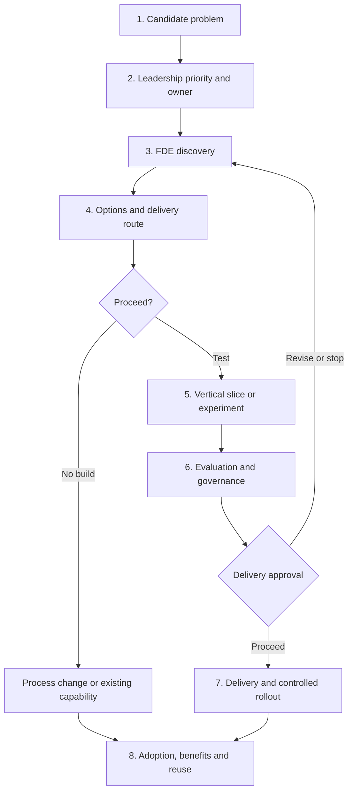

# Proposed MRO End-to-End FDE Process

## 1. Purpose

The MRO Forward-Deployed Engineering process converts leadership-prioritised process problems into:

- An evidenced understanding of the current workflow.
- An agreed improvement intervention.
- Clear process, solution and delivery ownership.
- A tested and governed solution where technology is required.
- Measurable improvement and reusable MRO capabilities.

FDE does not assume that every problem requires a new tool. The result could be:

- Process simplification or standardisation.
- Improved guidance, templates or training.
- Adoption or configuration of an existing MARM capability.
- General workflow automation.
- A locally built Copilot or low-code solution.
- A specialist MRO analytical tool.
- An AI assistant or agent.
- A combination of these interventions.

## 2. Core operating principle

> Leadership decides which MRO outcomes and workflows matter most. Process owners remain accountable for the business process. AI Tech & Tooling uses FDE to understand the problem, test the appropriate intervention and recommend the delivery and ownership route.

The process follows these principles:

- Outcome-led, not tool-led.
- Process-first, technology-second.
- Reuse before build.
- Simplest proportionate solution.
- Named ownership before delivery.
- Evidence before commitment.
- Human accountability for material judgements.
- MRO control of its methodology and control requirements.
- Reusable patterns where needs are genuinely common.
- Benefits measured after delivery.

# 3. End-to-end lifecycle

## Stage 1 — Capture the candidate problem

### Objective

Create a consistent initial record of the process problem without treating it as a build request.

### Who can raise it

- IVT Heads.
- MRO process owners.
- Validators and operational users.
- Leadership.
- Existing MRO workstreams.
- Audit, policy or regulatory programmes.
- AI Tech & Tooling, based on repeated needs or observed control issues.

### Minimum information

- Process or activity affected.
- Problem or pain point.
- Users and teams affected.
- Desired outcome.
- Risk or impact of doing nothing.
- Initial process-owner candidate.
- Existing tools or workarounds.
- Any known deadlines or dependencies.

### Output

A **candidate improvement record** in the existing Jira backlog.

### Important rule

At this point, it is:

> A candidate process problem, not an approved tool and not a development commitment.

---

## Stage 2 — Leadership prioritisation and ownership

### Objective

Determine which problems deserve FDE discovery and confirm accountable business ownership.

### Decision-makers

The monthly steering forum led by Andy, Mugad and you.

### Steering forum considers

- Strategic and regulatory importance.
- Control or operational risk.
- Potential improvement in quality, consistency or cycle time.
- Number of teams and users affected.
- Urgency and dependencies.
- Availability of a process owner and SMEs.
- Capacity for discovery.
- Relationship with current commitments.

### Required ownership

Before discovery begins, the forum should identify:

- Executive sponsor.
- Common MRO process owner, where cross-MRO.
- Relevant IVT process owner or local owner.
- SMEs and representative users.
- Initial FDE lead.

For cross-IVT processes, ownership should be federated:

- One common process owner for minimum MRO standards and outcomes.
- IVT Heads responsible for justified domain-specific variants.

### Output

A prioritised discovery case with named ownership and an agreed discovery timebox.

### Gate 1 — Priority gate

The steering forum decides:

- Prioritise for discovery.
- Retain in the candidate backlog.
- Combine with another case.
- Route directly to an existing programme or platform.
- Close because the need is already addressed.

Prioritisation authorises discovery; it does not authorise a build.

---

## Stage 3 — FDE process discovery

### Objective

Understand how the work actually happens and locate the material improvement opportunities.

### Core discovery group

- FDE lead.
- Process owner.
- Actual process users.
- Relevant SMEs.
- AI Tech & Tooling representative.
- Platform or architecture representative where relevant.

### Activities

#### Understand the outcome

- What is the process trying to achieve?
- Who receives or relies on its outputs?
- What constitutes a good outcome?
- Which professional judgements must remain with people?

#### Map the current workflow

- Trigger and inputs.
- Activities and decisions.
- Roles and hand-offs.
- Systems and data sources.
- Evidence created and retained.
- Review and approval points.
- Outputs and downstream users.
- Exceptions and escalation.

#### Identify problems

- Delays and bottlenecks.
- Repeated manual work.
- Duplicate evidence gathering.
- Inconsistent methods or outputs.
- Unclear ownership.
- Rework and avoidable hand-offs.
- Weak evidence or traceability.
- Data-quality and access issues.
- Control gaps.
- Unnecessary IVT variation.

#### Establish a baseline

Where possible, record:

- Current cycle time.
- Manual effort.
- Case volumes.
- Rework or error rate.
- Number of hand-offs.
- Evidence completeness.
- User experience.
- Quality and consistency measures.

#### Compare IVT variants

For a cross-MRO outcome, discovery should distinguish between:

- Common process and control requirements.
- Necessary domain-specific methodology.
- Historical variations that can be removed.
- Local operational choices that can remain flexible.

### Outputs

An **FDE Discovery Pack** containing:

- Problem and outcome statement.
- Named owner and users.
- As-is workflow.
- Pain points and causes.
- Baseline measures.
- Control and judgement boundaries.
- Common pattern and local variants.
- Constraints and dependencies.
- Initial improvement opportunities.

### Gate 2 — Discovery completeness

The process owner and FDE lead confirm that:

- The real problem has been evidenced.
- Users have participated.
- The workflow is understood.
- Ownership is clear.
- A meaningful baseline exists.
- Technology has not been predetermined.

---

## Stage 4 — Intervention and delivery-route assessment

### Objective

Select the simplest proportionate response and determine who should deliver and own it.

### Options considered in order

1. Stop unnecessary activity.
2. Simplify the process.
3. Standardise common elements.
4. Improve guidance, templates or training.
5. Use an existing enterprise or MARM capability.
6. Configure an existing platform.
7. Use a controlled Copilot prompt or user-managed assistant.
8. Introduce deterministic workflow automation.
9. Develop a specialist analytical component.
10. Develop an AI assistant or agent.
11. Build a new application only where necessary.

### Assessment criteria

- Expected benefit.
- Process and control risk.
- Data availability and quality.
- Need for professional judgement.
- Explainability and evidence requirements.
- Technical feasibility.
- Existing enterprise capabilities.
- Reusability across IVTs.
- Cost and delivery capacity.
- Maintenance and support requirements.
- AI or model governance requirements.
- Independence implications.

### Solution classification

| Solution type | Likely delivery route |
|---|---|
| Guidance, template or process change | Process owner and local team |
| General workflow automation | MARM/P&A or approved platform |
| Simple personal productivity assistance | User/local team with guidance |
| MRO low-code solution | Existing volunteer sprint workstream |
| Specialist validation analytics | AI Tech & Tooling or specialist squad |
| AI/agent supporting an MRO process | AI Tech & Tooling with Envoy/platform |
| Enterprise or cross-MRO product | Funded product/platform engineering route |

### Required ownership decision

The recommendation should specify:

- Business process owner.
- Methodology/control owner.
- AI use-case or model owner, if applicable.
- Solution/product owner.
- Development team.
- Hosting/runtime owner.
- Data owner.
- Operational support owner.
- Change-approval authority.
- Funding and capacity source.

### Output

A **Solution and Delivery Route Recommendation** with alternatives, risks, ownership and an indicative roadmap.

### Gate 3 — Route decision

The steering forum confirms:

- No technology required.
- Adopt or configure an existing capability.
- Proceed to a time-boxed experiment.
- Route to the existing MRO sprint workstream.
- Route to MARM, Envoy or another platform.
- Establish a funded delivery squad.
- Defer or stop.

---

## Stage 5 — Vertical slice or process experiment

### Objective

Test the most important assumptions before committing to full delivery.

The experiment depends on the selected intervention.

### Process change

Test the redesigned process with a small number of cases.

### Existing platform

Configure a limited workflow and test fit against MRO requirements.

### Low-code automation

Build the smallest working end-to-end flow.

### AI or agent solution

Build a controlled vertical slice that includes:

- Representative input and evidence.
- One meaningful task or decision-support activity.
- Approved model and tools.
- Human-in-the-loop checkpoint.
- Output, rationale and citations.
- Audit record.
- Evaluation and failure capture.

### Required controls

- Representative, appropriately protected data.
- Defined intended and prohibited use.
- Human review.
- Limited access.
- Version recording.
- Traceability.
- Manual fallback.
- No uncontrolled production dependency.

### Output

- Working experiment or vertical slice.
- Test evidence.
- Updated risks and assumptions.
- More reliable cost and effort estimate.
- Refined ownership and delivery recommendation.

A successful demonstration is not automatically approval for production.

---

## Stage 6 — Evaluation, governance and delivery decision

### Objective

Determine whether the intervention is effective, proportionate and sufficiently controlled.

### Evaluation dimensions

For all solutions:

- Does it improve the stated outcome?
- Does it preserve required controls?
- Is the user experience workable?
- Does it reduce effort or cycle time?
- Does it improve quality and consistency?
- Does it create new operational risks?
- Is there a viable support model?

For AI and agents, additionally assess:

- Accuracy and completeness.
- Evidence grounding and citation quality.
- False-negative and false-assurance risk.
- Repeatability and stability.
- Tool-call and routing accuracy.
- Escalation and refusal behaviour.
- Access-control and data leakage risk.
- Prompt-injection and manipulation risk.
- Human override effectiveness.
- Performance across relevant IVTs and cases.
- Regression following material changes.

### Governance requirements

Where AI is involved:

- AI use case registered and classified.
- Named MRO AI use-case owner.
- Model ownership determined under applicable policy.
- Intended use and human control documented.
- Testing and acceptance thresholds agreed.
- Monitoring and change-control requirements defined.
- Material changes subject to MRO approval.
- Envoy and other platform standards met.

### Possible decisions

- Proceed unchanged.
- Proceed with restricted scope.
- Continue as an assistive-only capability.
- Increase human review.
- Redesign and retest.
- Replace AI with deterministic automation.
- Use an existing platform instead.
- Stop.

### Output

An approved business, control, technical and operational case.

### Gate 4 — Delivery approval

The accountable process owner confirms business acceptance. The relevant governance and platform authorities confirm technical and control readiness. The steering forum confirms priority and capacity.

---

## Stage 7 — Delivery and controlled rollout

### Objective

Move from a validated concept to a supported operational capability.

### Delivery activities

- Complete production engineering or configuration.
- Integrate approved data and systems.
- Implement identity, access and audit controls.
- Establish testing and release pipelines.
- Produce documentation and operating procedures.
- Complete security and platform assurance.
- Train users.
- Define support and incident processes.
- Confirm manual fallback.
- Establish monitoring and reporting.

### Recommended rollout

1. Technical testing.
2. SME testing.
3. Shadow operation.
4. Limited IVT pilot.
5. Process-owner acceptance.
6. Controlled expansion.
7. Wider rollout where justified.

### Delivery responsibility

FDE remains connected to the case, but does not mean AI Tech & Tooling must perform all engineering.

Delivery may be undertaken by:

- The volunteer MRO sprint workstream.
- The process owner’s team.
- MARM/P&A.
- Envoy or another platform team.
- AI Tech & Tooling.
- A funded cross-functional delivery squad.

### Output

A supported, owned and controlled capability in use.

### Definition of done

A solution is not complete merely because the code or configuration works. Completion requires:

- Process-owner acceptance.
- Named technical and operational owner.
- User documentation and training.
- Governance approval.
- Monitoring and support.
- Change control.
- Benefits baseline and measurement plan.

---

## Stage 8 — Adoption, benefits and reusable capabilities

### Objective

Confirm that the intervention delivered the intended outcome and use the learning to improve future delivery.

### Review measures

- Adoption and active usage.
- Cycle-time improvement.
- Effort or capacity released.
- Quality and consistency.
- Control performance.
- User experience.
- Failure and exception rate.
- Operational incidents.
- AI performance and overrides, where applicable.
- Actual use of released capacity.

### Process-owner accountability

The process owner reports whether:

- The process outcome improved.
- Users adopted the new approach.
- Controls remain effective.
- Further process changes are required.
- The solution should continue, expand, change or stop.

### Reuse assessment

AI Tech & Tooling determines whether the case produced reusable:

- Workflow components.
- Data or API contracts.
- Agent skills.
- Prompt and knowledge patterns.
- Evaluation datasets.
- Human approval controls.
- Monitoring patterns.
- Governance templates.
- Process and FDE templates.

A component should generally be promoted into the common MRO pattern only after it proves useful across more than one relevant case or IVT.

### Output

- Benefits report.
- Lessons learned.
- Updated reusable catalogue.
- Updated MRO FDE standards.
- Closed case or follow-on improvement.

# 4. Governance and ownership model

| Role | Primary accountability |
|---|---|
| Leadership/steering forum | Prioritises outcomes, discovery and resources |
| Executive sponsor | Supports the outcome and resolves barriers |
| Common process owner | Owns cross-MRO outcome, minimum standards and controls |
| IVT Head/local process owner | Owns domain application and justified variants |
| Process SMEs and users | Provide workflow knowledge and test the intervention |
| AI Tech & Tooling | Leads FDE method, technical assessment, patterns and delivery-route recommendation |
| FDE lead | Coordinates discovery through decision and adoption |
| Delivery squad | Builds or configures the approved solution |
| MARM/platform owner | Owns relevant general platform capability |
| Envoy | Owns the approved agent runtime and platform services |
| MRO AI use-case owner | Owns intended use, fitness, human controls and performance |
| Solution/product owner | Owns roadmap, service and operational lifecycle |

# 5. Integration with the existing MRO workstream

The existing volunteers, sprint cadence, Jira project and demonstrations should remain. The backlog stages can become:

1. Candidate.
2. Prioritised for discovery.
3. FDE discovery.
4. Delivery route proposed.
5. Steering decision.
6. Ready for sprint or external routing.
7. In delivery.
8. Testing/pilot.
9. Adopted and measuring benefits.
10. Closed, stopped or deferred.

The current roles remain useful:

- Sprint owner.
- Builder.
- Tester.
- SME.
- Process owner.
- User representative.

The principal change is that an item enters a build sprint only after completing discovery and meeting the definition of ready.

# 6. Definition of ready for development

An item should not enter a delivery sprint without:

- A named process owner.
- A clear outcome and problem statement.
- An understood current workflow.
- Identified users and SMEs.
- Baseline and success measures.
- Agreed scope.
- Existing solutions assessed.
- Delivery route agreed.
- Builder and tester capacity.
- Tool, hosting and support ownership.
- Governance route where AI is used.
- Acceptance criteria and human-control points.

# 7. Proportionate FDE service levels

Not every case needs the same effort.

| Level | Suitable cases | FDE approach |
|---|---|---|
| Self-service | Simple, local, low-risk improvement | Guided template or FDE assistant |
| Review clinic | Clearly scoped workflow or Copilot case | Short expert review and routing |
| Embedded FDE | Cross-IVT, unclear or material process | Detailed discovery and vertical slice |
| Strategic FDE | High-risk, enterprise or specialist AI capability | Full multidisciplinary engagement |

The proposed FDE Assistant Workbench can support the first two levels and prepare structured evidence for complex cases.

# 8. Recommended leadership summary

> The MRO FDE process begins with a leadership-prioritised outcome and a named process owner. A cross-functional team then examines how the process operates today, establishes the baseline and identifies the simplest proportionate intervention. FDE may recommend process simplification, an existing platform, workflow automation, AI or a specialist analytical capability. Before delivery begins, the steering forum confirms the route, ownership and capacity. Solutions are tested through controlled experiments, evaluated against business and control outcomes, and progressively adopted. Learning from delivery is converted into reusable MRO process and technology patterns. This allows MRO to move quickly from priority problems to measurable improvements without assuming that every request requires AI Tech & Tooling to build a new tool.