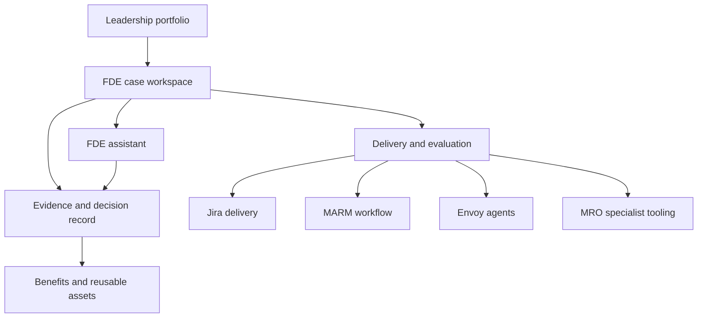
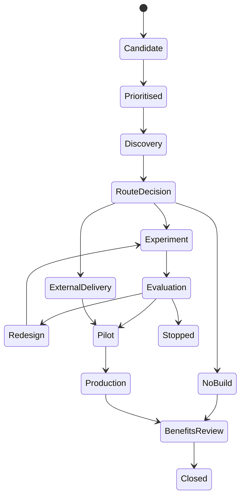

Yes. The additional materials make the workbench concept much clearer and are highly useful for MRO. In particular, they show how FDE can operate as a **controlled, evidence-based workflow**, rather than relying on informal conversations and individual engineers.

However, the demonstrated workbench is mainly designed for building and industrialising AI agents. The MRO version should be broader: it should manage the journey from a leadership-prioritised process problem through discovery, solution selection, delivery, acceptance and benefits—even when the answer is not AI or not a new tool.

# 1. Review of the additional materials

## FDE capability framework

The framework separates:

- **0-to-1 development**
  - Business judgement.
  - Agent development.
  - Enterprise integration.
- **1-to-N scaling**
  - Productisation.
  - Governance.
  - High-risk migration.
  - High-concurrency migration.

This is a useful distinction for MRO.

For MRO, I would adapt it to:

| Capability | MRO interpretation |
|---|---|
| Business judgement | Process discovery, problem framing, controls, outcome and ownership |
| Solution engineering | Process change, workflow, analytics, AI or agent design |
| Enterprise integration | MARM, Envoy, data, identity, security and operational integration |
| Reuse and scaling | Common MRO patterns, reusable components and cross-IVT adoption |

“Agent development” should become **solution engineering**, because many MRO cases will not require an agent.

Similarly, 1-to-N scaling should not mean automatically migrating every prototype into a central product. It should mean identifying which elements have proved reusable and should become common MRO capabilities.

## Project centre and project workbench

The material shows:

- A project portfolio or project centre.
- A separate workspace for each FDE case.
- Stage progress.
- Evidence and artefacts.
- Human conclusions.
- Agent conversations.
- Run traces.
- Architecture.
- usage analysis.
- Evaluation and optimisation.

This is an excellent pattern for MRO. It would give leadership visibility over the portfolio while giving process owners, SMEs and engineers a structured place to work.

The MRO workbench should not replace Jira or Confluence:

- **Workbench:** governs the FDE lifecycle, evidence, decisions and ownership.
- **Jira:** manages sprint tasks, defects and delivery work.
- **Confluence:** holds enduring guidance and detailed documentation.
- **MARM/P&A:** provides suitable workflow and case-management capabilities.
- **Envoy:** hosts approved MRO agents.
- **Validation Workbench:** performs specialist AI/model testing and evaluation.

## Evidence-to-human-decision structure

One screenshot shows a strong pattern:

1. What evidence was provided.
2. What outputs were produced.
3. What remains outstanding.
4. What the accountable person decided.

This is particularly suitable for a second-line function. Every FDE stage should distinguish between:

- Source evidence.
- AI-generated analysis.
- FDE recommendation.
- Human decision.
- Decision rationale.
- Outstanding conditions.
- Decision date and owner.

The agent can analyse and recommend, but cannot approve the stage on behalf of the process owner or steering forum.

## Historical stage records

The material shows previous stages as read-only historical records. This is valuable for MRO because it supports:

- Decision traceability.
- Audit evidence.
- Reconstructing why a solution route was selected.
- Understanding the evidence available at the time.
- Demonstrating appropriate governance.
- Comparing later outcomes against the original assumptions.

Each stage should therefore create a frozen decision snapshot while allowing controlled reopening where new evidence requires reconsideration.

## Mechanism first, ontology where needed

The materials suggest deciding how the process works before determining whether a formal ontology or knowledge graph is needed. This is sensible.

For MRO:

- Every case needs a lightweight object and relationship model.
- Only complex, reusable or cross-system cases need a formal ontology.
- Knowledge graphs should not become a mandatory architectural requirement.
- MRO’s common metadata backbone can mature from repeated cases.

For example, a simple workflow may only need:

- Validation.
- Model.
- Evidence item.
- Task.
- Finding.
- Owner.
- Approval.

A cross-MRO evidence and traceability capability may justify a richer semantic model linking policy requirements, evidence, testing, findings and decisions.

## Version-specific PoC and evaluation

The workbench links evaluation evidence to a specific solution version. This is an important design feature.

For each version, MRO should retain:

- Code/configuration version.
- Model and prompt version.
- Knowledge-source version.
- Test dataset.
- Evaluation measures.
- Results and failures.
- Human review.
- Approval decision.

Historical results should not be silently recalculated using the latest version. A new version should create a new evaluation run.

This is closely aligned with your AI validation tooling mandate.

## Pilot, operational readiness and recovery

The material covers:

- Scope and authorisation.
- System and data integration.
- Technical operation.
- Business outcomes.
- Monitoring.
- Recovery and fallback.
- Pilot review.

This is important because MRO prototypes should not move directly from a successful demonstration to general use.

For MRO, pilot readiness should confirm:

- Pilot users and IVTs.
- Permitted process and cases.
- Data access.
- Human review requirements.
- Incident and escalation routes.
- Manual fallback.
- Support arrangements.
- Success and stop criteria.
- Duration and exit decision.

## Production acceptance and progressive rollout

The 10%–50%–100% release pattern is useful conceptually. For MRO, the stages may be:

1. Shadow use.
2. Limited user pilot.
3. One-IVT controlled use.
4. Multi-IVT rollout.
5. MRO-wide adoption.

The workbench should measure both technical usage and process outcomes. An 85% adoption rate is not sufficient evidence of success unless quality, controls and benefits have also improved.

# 2. Proposed MRO design

The recommended product name is:

> **MRO Tech & Tooling FDE Workbench**

Its purpose should be:

> To convert leadership-prioritised MRO process problems into evidenced, owned and deliverable improvements, and to govern their journey from discovery through delivery, adoption and measurable benefit.

## Workbench architecture

The Workbench should be a system of engagement and decision evidence. It should integrate with delivery systems rather than trying to replace them.

# 3. Main areas of the Workbench

## A. Leadership portfolio

This gives leadership and the steering forum a view of:

- Candidate process problems.
- Prioritised outcomes.
- Named sponsors and process owners.
- FDE cases in discovery.
- Decisions required.
- Delivery routes.
- Current pilots.
- Benefits and adoption.
- Capacity and dependencies.
- Common themes across IVTs.

Leadership should see cases by **outcome and process**, not only by tool name.

Example:

| Priority outcome | Process | Owner | FDE stage | Next decision |
|---|---|---|---|---|
| Improve evidence readiness | Evidence request and assessment | Named MRO owner | Discovery | Confirm representative IVTs |
| Reduce validation planning time | Planning and scoping | IVT Head | Vertical slice | Approve pilot |
| Improve AI risk classification consistency | AI risk triage | AI Risk Oversight | Evaluation | Confirm ownership and route |

## B. FDE case workspace

Each priority receives a case workspace with eight stages:

1. Priority, outcome and ownership.
2. Process discovery and baseline.
3. Scope, controls and success.
4. Options and delivery route.
5. Vertical slice or process experiment.
6. Evaluation, governance and pilot.
7. Production acceptance and handover.
8. Benefits, feedback and reuse.

Each stage contains:

- Required work.
- Evidence provided.
- Agent-generated analysis.
- FDE recommendation.
- Outstanding information.
- Human decision.
- Conditions and rationale.
- Stage-gate approval.
- Frozen historical snapshot.

## C. FDE Assistant

The assistant should guide users and FDE leads through the process. It should not be a general chatbot.

Its functions could include:

- Conducting structured discovery interviews.
- Drafting the problem and outcome statement.
- Producing an initial as-is workflow.
- Identifying missing owners or evidence.
- Comparing IVT process variants.
- Searching the existing MRO backlog and capability catalogue.
- Identifying potential duplication.
- Generating non-AI and AI solution options.
- Suggesting delivery routes.
- Drafting governance and ownership questions.
- Creating a steering-forum decision pack.
- Summarising evaluation evidence.
- Drafting benefits and lessons-learned reports.

It must not:

- Prioritise cases on behalf of leadership.
- Appoint a process owner.
- Approve a stage.
- Commit development resources.
- Determine model or AI ownership without review.
- Approve an AI use case.
- Make a validation or risk decision.

## D. Evidence and decision record

Every case should maintain:

- Original request.
- Leadership decision.
- Process maps.
- Interviews and workshop records.
- Baseline data.
- User requirements.
- Control requirements.
- Alternatives considered.
- Architecture and data design.
- PoC versions.
- Evaluation datasets and results.
- Risks and conditions.
- Human approvals.
- Delivery decisions.
- Pilot evidence.
- Benefits and adoption.
- Change history.

This becomes the controlled history of how the MRO improvement was assessed and delivered.

## E. Delivery and technical views

Technical views should appear only when relevant.

Possible tabs include:

- Solution architecture.
- Data and interface contracts.
- Agent design.
- Prompts and knowledge sources.
- Tools and permissions.
- Run traces.
- Evaluation results.
- Deployment status.
- Incidents and monitoring.
- Release and change history.

A simple process-improvement case should not be forced to complete AI architecture or agent-evaluation sections.

## F. Reusable capability catalogue

The Workbench should retain reusable assets generated by completed cases:

- Process templates.
- Discovery questions.
- Common MRO data objects.
- Workflow components.
- Copilot patterns.
- Agent skills.
- Tool connectors.
- Evaluation datasets.
- Testing frameworks.
- Human-review components.
- Governance templates.
- Envoy deployment patterns.

Each reusable item should show:

- Purpose.
- Approved use.
- Owner.
- Applicable processes.
- Evidence of use.
- Limitations.
- Version.
- Support route.

# 4. Proposed stage design

## Stage 1 — Priority and ownership

### Required inputs

- Leadership-prioritised outcome.
- Problem statement.
- Executive sponsor.
- Process owner.
- Participating IVTs.
- Desired benefit.

### Assistant support

- Check whether the outcome is clear.
- Find similar backlog items.
- Identify missing stakeholders.
- Draft the initial case charter.

### Human gate

Leadership or steering forum confirms:

- Priority for discovery.
- Sponsor.
- Process owner.
- Discovery capacity.

## Stage 2 — Process discovery

### Required inputs

- User interviews.
- Current process map.
- Systems and data.
- Hand-offs and decisions.
- Evidence requirements.
- IVT differences.
- Current baseline.

### Assistant support

- Structure interview notes.
- Draft an as-is workflow.
- Identify gaps and inconsistencies.
- Compare IVT variants.
- Separate common core from local methodology.

### Human gate

The process owner confirms that the workflow and problem are accurately represented.

## Stage 3 — Scope, controls and success

### Required inputs

- In-scope and out-of-scope activities.
- Human judgement points.
- Control and independence requirements.
- Intended users.
- Success measures.
- Acceptance criteria.
- Baseline.

### Assistant support

- Draft the measurement tree.
- Identify missing controls.
- Suggest leading and lagging measures.
- Record intended and prohibited uses.

### Human gate

The process and control owners approve the problem boundary and success criteria.

## Stage 4 — Options and delivery route

### Required assessment

- Process simplification.
- Standardisation.
- Existing MARM or enterprise tools.
- Local enablement.
- Deterministic automation.
- Specialist analytics.
- AI assistant or agent.
- New application.

### Assistant support

- Compare options.
- Search the reusable capability catalogue.
- Draft buy/adopt/configure/build analysis.
- Identify governance implications.
- Propose ownership and delivery models.

### Human gate

The steering forum agrees:

- Intervention.
- Delivery route.
- Ownership.
- Capacity.
- Whether an experiment is required.

## Stage 5 — Vertical slice or experiment

The selected delivery team creates the smallest meaningful test.

The Workbench records:

- Hypothesis.
- Target workflow.
- Solution version.
- Data used.
- Users.
- Controls.
- Results.
- Failures.
- Feedback.
- Next decision.

For AI cases, this stage links to the Agentic Workflow Coordinator and AI evaluation capabilities.

## Stage 6 — Evaluation, governance and pilot

The Workbench supports:

- Evaluation measures and thresholds.
- Test datasets.
- Failure classification.
- User acceptance.
- Governance records.
- Pilot scope.
- Human-review design.
- Monitoring and fallback.
- Go/restrict/redesign/stop decision.

## Stage 7 — Production acceptance and handover

The Workbench records:

- Release evidence.
- Process-owner acceptance.
- Operational owner.
- Support and incident arrangements.
- Training.
- Change control.
- Rollback plan.
- Progressive rollout.
- Adoption.

Production acceptance must be a human decision.

## Stage 8 — Benefits, feedback and reuse

The Workbench compares actual performance with the original baseline:

- Cycle time.
- Quality.
- Consistency.
- Capacity.
- Control performance.
- Adoption.
- Incidents.
- User experience.

It then proposes assets that could be promoted into reusable MRO patterns, subject to human review.

# 5. Roles within the Workbench

| Role | Access and responsibility |
|---|---|
| Leadership/steering forum | Portfolio priorities, gates and resource decisions |
| Process owner | Process evidence, requirements, controls and acceptance |
| IVT Head | Domain-specific variants, SMEs, users and local adoption |
| FDE lead | Coordinates discovery, recommendations and case progression |
| AI Tech & Tooling | Technical assessment, patterns, architecture and delivery route |
| SME/user | Workflow evidence, testing and feedback |
| Builder | Prototype, configuration or engineering |
| Tester | Acceptance, controls and evaluation evidence |
| Platform representative | Platform fit, integration and support commitment |
| AI use-case owner | AI fitness, human controls, monitoring and change approval |
| Auditor/read-only reviewer | Historical evidence and decisions |

# 6. Workbench state model

Each case should have controlled states:

Each transition should require:

- Required evidence.
- A named decision-maker.
- Decision rationale.
- Date and version.
- Any conditions.
- An immutable historical snapshot.

# 7. How it would work in practice

Consider leadership prioritising **evidence readiness and traceability**.

### Step 1

Leadership creates or approves the priority. A common MRO process owner is named, and two representative IVTs join discovery.

### Step 2

The FDE Assistant interviews the process owner, validators and SMEs. It drafts:

- The current evidence-request workflow.
- Sources and hand-offs.
- Common requirements.
- IVT-specific evidence.
- Current delays and rework.
- Baseline measures.

### Step 3

The process owner corrects and approves the process representation.

### Step 4

The Workbench assesses alternatives:

- Standard evidence request template.
- Common metadata and naming convention.
- Existing MARM document workflow.
- Automated completeness checking.
- AI-supported evidence-gap assessment.

### Step 5

FDE recommends:

- MARM provides submission, tracking and official process record.
- MRO owns evidence requirements and traceability standards.
- AI Tech & Tooling tests a specialist evidence-gap component.
- Envoy hosts the agent if the AI component proceeds.

### Step 6

The steering forum accepts the route. Jira epics and sprint tasks are generated for the relevant delivery teams.

### Step 7

A vertical slice is tested against representative validation cases. Results, failures, human overrides and user feedback return to the Workbench.

### Step 8

The process owner approves a controlled pilot. Adoption and evidence quality are measured against the baseline.

### Step 9

Common components are added to the MRO reusable catalogue, while model-specific evidence rules remain owned by the respective IVTs.

# 8. Integration with the existing workstream

The Workbench should preserve your existing volunteer model.

Once a case reaches an agreed route:

- A sprint owner is assigned.
- Builders join according to the required technology.
- Process SMEs define business and control requirements.
- Testers come from the affected IVTs.
- AI Tech & Tooling supplies architecture and reusable patterns.
- Jira manages delivery tasks.
- Sprint demos show progress.
- The Workbench retains stage evidence and decisions.

This creates one connected process without requiring a major reorganisation.

# 9. Recommended MVP

Do not begin by building the complete platform shown in the materials. Start with an MVP containing:

1. Portfolio of FDE cases.
2. Eight-stage case workflow.
3. Role and ownership capture.
4. Guided discovery questionnaire.
5. Evidence upload or links to Confluence.
6. Human stage-gate decisions.
7. Automated decision-pack generation.
8. Jira backlog and sprint linking.
9. Reusable capability search.
10. Basic benefits tracking.

Pilot it with two or three real cases:

- Validation planning and scoping.
- Evidence readiness and traceability.
- AI risk triage.

## Later phases

### Phase 2

- Envoy-hosted FDE Assistant.
- Search across Confluence, Jira and approved MRO knowledge.
- Automated process-map drafting.
- Duplicate and reusable-pattern detection.
- Delivery-route recommendations.

### Phase 3

- Agent traces and evaluation integration.
- Architecture and data-contract management.
- Platform deployment links.
- Automated benefits dashboards.
- Reusable skills and components catalogue.
- Cross-IVT pattern analytics.

# 10. Governance of the Workbench itself

Because the Workbench uses AI to influence discovery and recommendations, it is itself an AI use case. It requires:

- Named MRO AI use-case owner.
- Defined intended and prohibited uses.
- Human approval of all stage gates.
- Source and evidence traceability.
- Controlled knowledge sources.
- Evaluation of recommendations.
- Access control.
- Version and change management.
- Monitoring and incident management.
- Clear statement that the agent cannot commit resources or approve delivery.

# Recommendation

The workbench concept is a very good fit for MRO and makes the FDE operating model tangible. I would position it as:

> The MRO Tech & Tooling FDE Workbench is the controlled mechanism through which leadership priorities are converted into evidenced process improvements, agreed delivery routes and measurable outcomes. It supports process owners, FDE leads, SMEs, builders and platform teams while retaining human accountability for priority, ownership, governance and acceptance.

It should initially be a lightweight layer over the existing Jira, Confluence and sprint model. Once the method has been proven through real cases, it can evolve into an Envoy-enabled, agent-assisted workbench with deeper evaluation, delivery and reuse capabilities.