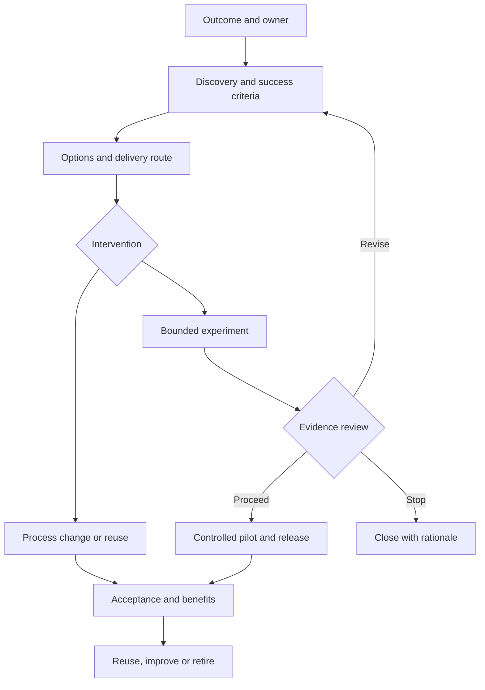
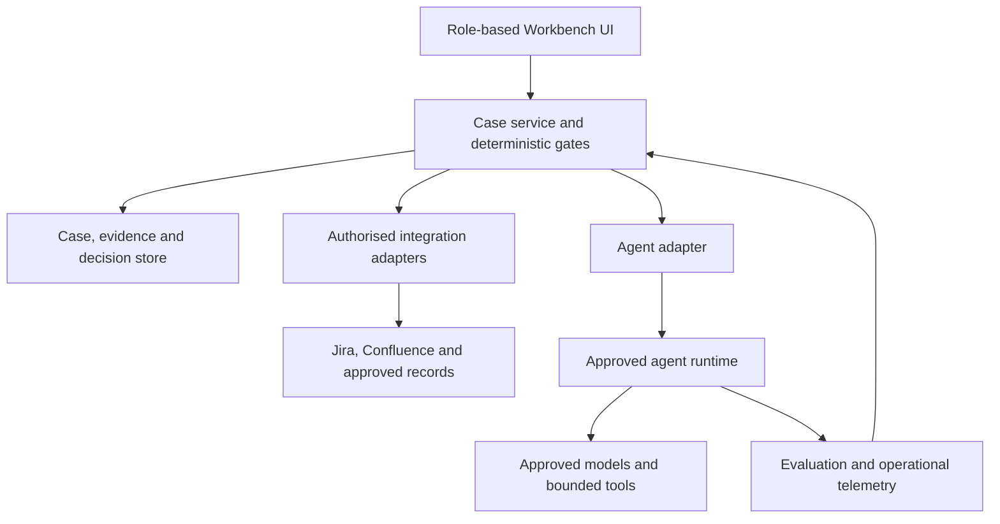

# MRO Tech & Tooling: End-to-End FDE Playbook

**An outcome-led, process-first operating model for discovery, delivery and measurable improvement**

| Document control | Detail |
|---|---|
| Version | 1.0 |
| Date | 29 September 2026 |
| Status | Proposed operating model and implementation blueprint; subject to MRO agreement and applicable bank policies |
| Intended audience | MRO leadership, IVT Heads, process owners, AI Tech & Tooling, FDE leads, SMEs, volunteer contributors and platform partners |
| Proposed document owner | MRO AI Tech & Tooling lead |
| Review trigger | Pilot findings, operating-model changes, platform changes or material governance changes |
| Scope | Both AI and non-AI process improvements; specialist AI validation tooling remains a protected core responsibility |

> Leadership identifies the outcomes that matter. Process owners explain and own the work. FDE establishes the evidence and tests the right intervention. An agreed delivery team implements it. Process owners measure the result. Repeated needs inform reusable MRO capabilities.

## Contents

1. [Executive summary and 2030 end state](#1-executive-summary-and-2030-end-state)
2. [Scope, principles and terminology](#2-scope-principles-and-terminology)
3. [Operating model and decision rights](#3-operating-model-and-decision-rights)
4. [Proportionate service and delivery routes](#4-proportionate-service-and-delivery-routes)
5. [End-to-end lifecycle](#5-end-to-end-lifecycle)
6. [Running the existing workstream](#6-running-the-existing-workstream)
7. [FDE Workbench product design](#7-fde-workbench-product-design)
8. [Workbench architecture and agent design](#8-workbench-architecture-and-agent-design)
9. [Building and operating the Workbench](#9-building-and-operating-the-workbench)
10. [Discovery cards](#10-discovery-cards)
11. [Facilitator completeness checklist](#11-facilitator-completeness-checklist)
12. [Reusable case templates](#12-reusable-case-templates)
13. [Readiness, acceptance and release checklists](#13-readiness-acceptance-and-release-checklists)
14. [Worked MRO example](#14-worked-mro-example)
15. [Adoption plan and decisions to confirm](#15-adoption-plan-and-decisions-to-confirm)
16. [Source basis and glossary](#16-source-basis-and-glossary)

---

## 1. Executive summary and 2030 end state

### 1.1 Purpose

Forward-Deployed Engineering (FDE), as used in this playbook, is a hands-on engagement method: technical colleagues work alongside process owners and users to understand real work, investigate constraints, test interventions and support adoption. It is more than an intake form or triage meeting. It is also not a promise that the FDE team will build and operate every resulting solution.

MRO needs to connect strategic priorities to practical improvements without predetermining an inventory of tools or agents. This playbook provides that connection through:

- Clear process and outcome ownership.
- Structured, evidence-based discovery.
- Technology-neutral options assessment.
- Proportionate experiments and decision gates.
- Agreed delivery, hosting and support responsibilities.
- Controlled implementation and user adoption.
- Benefits measurement and reusable patterns.

The method applies whether the outcome requires a process change, guidance, an existing MARM capability, low-code workflow, specialist analytics or an AI agent.

### 1.2 Proposed 2030 end state

By 2030, MRO should have standardised, technology-enabled workflows with clear process ownership, justified domain-specific variants, reusable capabilities and distributed delivery under common standards. Routine work should use the simplest proportionate solution. MRO should retain accountability for its methodology, controls and professional judgement.

This is an operating-model vision, not a fixed commitment to particular applications. Indicators of progress should include:

- Priority workflows have named owners, documented controls and measurable outcomes.
- IVTs share common patterns while retaining necessary model-specific methodology.
- Existing enterprise services are reused where they meet requirements.
- Every operational solution has an accepted support and change-control model.
- Specialist MRO capabilities are reusable, tested and maintainable.
- New priorities can move efficiently from problem definition to an agreed delivery decision.
- Improvements demonstrate quality and control benefits as well as time savings.

Targets and dates should be set after baselines are established. Neither the number of agents nor the percentage of work automated is a sufficient measure of success.

### 1.3 AI Tech & Tooling mandate

The team has two complementary responsibilities:

1. Develop and support specialist tools and agents for AI validation and oversight, including the Independent Validation Workbench.
2. Enable wider MRO improvement through FDE, technical guidance, reusable patterns, training, platform engagement and identification of appropriate delivery teams.

The team is not the default developer or service owner for all MRO tools. Existing AI validation commitments remain protected. Any broader product, including the FDE Workbench itself, requires an explicit capacity and ownership decision.

### 1.4 What changes now

Keep existing volunteers, Jira, Confluence, sprint roles and demonstrations. Add a lightweight discovery and delivery-route decision before new build commitments. Start using the cards and templates immediately; a custom Workbench is an optional scaling investment, not a prerequisite to operating FDE.

## 2. Scope, principles and terminology

### 2.1 Scope

Included: MRO process improvements, cross-IVT opportunities, local workflow changes, low-code productivity aids, specialist analytical services, AI validation tools and agents where appropriate.

Excluded: automatically taking over platform delivery, independently setting bank-wide policy, replacing formal approval authorities, or treating an FDE recommendation as model approval, production approval or a funding commitment.

### 2.2 Design principles

1. **Outcome-led:** name the result and affected workflow before selecting a solution.
2. **Evidence-led:** observe real cases; distinguish confirmed facts from views and assumptions.
3. **Technology-neutral:** simplification, reuse and no-build decisions are valid outcomes.
4. **Proportionate:** the depth of discovery and assurance follows impact, uncertainty and complexity.
5. **Named accountability:** process ownership, development and platform operation are distinct.
6. **Reuse with fit assessment:** investigate existing capabilities, but do not force a poor fit.
7. **Common core, justified variants:** standardise shared controls and interfaces without erasing necessary methodology differences.
8. **Human decision authority:** AI may draft and recommend, but cannot approve, assign accountability or commit resources.
9. **Lifecycle ownership:** plan support, change control, adoption and retirement before live use.
10. **Independent assurance where required:** developers' tests and users' acceptance do not replace required independent assessment.
11. **Capacity discipline:** discovery permission, experiment permission and production commitments are separate decisions.
12. **Learn and iterate:** stages may be revisited; material changes reopen affected decisions.

### 2.3 Distinctions that prevent confusion

| Term | Meaning in this playbook |
|---|---|
| Outcome | Measurable change, such as less evidence-related rework while preserving validation quality |
| Process | End-to-end activities, roles, decisions and controls producing an outcome |
| Use case | A bounded intended application, with users, inputs, outputs and responsibilities |
| Capability | A reusable ability supported by people, methods, data and/or technology |
| Tool or agent | An implementation that may support one or more use cases |
| FDE case | The improvement record, including evidence, options, decisions and results |
| Delivery route | Who implements, owns, hosts, supports and funds the selected intervention |
| Experiment | A bounded test of an assumption; it need not involve software |
| Pilot | Authorised, limited use in a defined operational setting, with controls and exit criteria |
| FDE versus SDLC | FDE maintains connection to the problem and users; the selected delivery team follows the applicable software-development and release lifecycle |

A tool that supports validation of AI is not necessarily itself an AI system. Conversely, AI embedded in an ordinary administrative workflow still needs assessment under applicable AI governance. Deterministic scoring or analytical rules may need model assessment even without machine learning. Classification must follow the bank's definitions, not product labels.

## 3. Operating model and decision rights

### 3.1 Roles

| Role | Primary responsibility | Does not automatically own |
|---|---|---|
| MRO leadership / steering forum | Outcome priorities, cross-team trade-offs, sponsorship and allocated capacity | Detailed technical implementation or formal specialist approvals |
| Executive sponsor | Supports the outcome and resolves organisational barriers | Day-to-day process execution |
| Common process owner, where appointed | Shared process design, minimum controls, common measures and cross-IVT changes | Every local methodological choice |
| IVT Head / local process owner | Domain workflow, requirements, exceptions, users, acceptance and realised benefits | Platform engineering or all code |
| Methodology / control owner | Relevant methodological and control requirements, approved changes | Hosting and infrastructure |
| AI Tech & Tooling lead | FDE method, technical assessment, reusable patterns and recommended delivery routes | Every MRO process or build request |
| FDE case lead | Coordinates discovery, evidence, recommendations and follow-through | Approval authority belonging to others |
| SMEs and users | Demonstrate actual work, explain judgement and test proposed changes | Portfolio prioritisation |
| Sprint / delivery lead | Coordinates agreed tasks, dependencies and delivery reporting | Process acceptance or permanent service ownership |
| Builder and tester | Implement and test within agreed scope and authority | Unapproved production changes |
| Product / service owner | Roadmap, lifecycle, support arrangements and service fitness | MRO professional judgements merely because they own the application |
| Platform owner | Accepted hosting, integration, security, reliability and technical services | Automatic ownership of the business use case or methodology |
| AI use-case owner / model owner | Responsibilities required under the relevant internal policy | A role inferred solely from who hosts or writes code |
| Assurance functions | Required independent reviews and approvals | Development testing or business ownership |

One person may hold several compatible roles. Record where roles overlap and where separation is required. A volunteer builder must not silently become the permanent support owner.

### 3.2 Process ownership across IVTs

Use local ownership first where the process genuinely belongs to one IVT. Each IVT Head is accountable for their process, with a named delegate for day-to-day work if appropriate.

For a cross-IVT initiative, leadership should appoint a sponsor and an accountable owner for the common process or standard where such authority is needed. Do not invent a central owner for every local improvement. If common ownership is unresolved, local discovery may proceed, but it cannot authorise MRO-wide standards or rollout.

The common owner and IVT owners should distinguish:

- **Common core:** shared required outcomes, evidence metadata, control points and interfaces.
- **Domain variants:** model-specific hypotheses, tests, evidence requirements and methods.
- **Local working choices:** task sequencing and allocation, where compatible with controls.

Start cross-IVT discovery with a small representative set. Add coverage where model type, data, controls or workflow differ materially. A successful example is evidence for reuse, not automatic proof of suitability for every IVT.

### 3.3 Decision rights and delegation

| Decision | Decision authority | Supporting input |
|---|---|---|
| Prioritise a cross-MRO outcome | Leadership / steering forum | Process owners, portfolio or resource workstream |
| Confirm a local workflow description | Local process owner | Users and FDE lead |
| Change a shared process standard | Designated common owner and relevant authority | Affected IVT owners |
| Recommend an intervention and delivery route | AI Tech & Tooling with process owner | Platforms, architecture, SMEs |
| Accept platform work and support | Relevant platform/service owner | Requirements and capacity assessment |
| Commit material cross-team capacity | Steering forum or delegated budget/capacity authority | Delivery owners |
| Approve a bounded low-risk experiment | Delegated authority within agreed limits | Process owner, FDE lead and relevant controls |
| Accept business fitness | Process owner | Users, testing and control owners |
| Approve production release | Applicable release, service and governance authorities | Business acceptance and assurance evidence |
| Record and realise benefits | Process owner | Delivery/usage data and FDE support |

The monthly forum should resolve priorities and material trade-offs, not approve every task. Agree a written delegation envelope for routine changes, including spend, effort, data access, operational impact and conditions requiring escalation.

Phil's or another portfolio/resource workstream can provide demand visibility and resource options. AI Tech & Tooling leads technical discovery and route recommendations. These activities are complementary when decision rights are explicit.

### 3.4 Independence and technical ownership

MRO must retain effective control over its methodology, acceptance criteria, professional judgement and material changes affecting those responsibilities. This does not, by itself, require MRO to write every line of code or own every hosting component.

For platform-delivered solutions, agree how MRO can inspect and test behaviour, approve material methodology changes, obtain evidence, challenge limitations and suspend use. Configuration-only control is sufficient only if it actually supports the required methodology and its evolution. Decide this from the solution design, not a blanket rule for or against platform ownership.

For MRO-developed AI, confirm the appropriate AI use-case/model ownership and independent review arrangement under internal policy. A development team cannot approve its own solution merely because it works within a second-line function.

## 4. Proportionate service and delivery routes

### 4.1 FDE engagement levels

| Level | Typical case | Minimum approach |
|---|---|---|
| Self-service enablement | Small personal/local task using an already permitted capability | Brief outcome, named owner, data/control check and user testing |
| FDE clinic | Bounded workflow, reuse enquiry or low-code candidate | Short discovery, options check and recorded route |
| Embedded FDE | Unclear problem, cross-IVT variation, integration or meaningful risk | User observation, evidence pack, experiment and explicit gates |
| Strategic engagement | Material specialist analytics, significant AI autonomy or business-critical service | Multidisciplinary discovery, formal engineering/assurance and supported operations |

These are proposed service levels, not substitutes for the bank's risk classifications. Escalate for sensitive data, consequential outputs, external actions, unclear ownership or high uncertainty even if expected usage is low.

### 4.2 Delivery route catalogue

| Route | Appropriate when | Delivery and ownership expectation |
|---|---|---|
| R0: Process / guidance change | Root cause is unnecessary work, ambiguity or inconsistent practice | Process owner delivers; FDE supports diagnosis and measurement |
| R1: Adopt / configure existing service | An approved capability already meets the need | Platform/service team accepts technical ownership; MRO owns process requirements and acceptance |
| R2: Local productivity enablement | Bounded user-led assistance is sufficient | Local owner/users implement within approved guidance; no implied central support |
| R3: Volunteer low-code delivery | Scope, risk and support needs fit the community's capacity | Existing sprint team builds/configures; named process and service owners accept responsibilities |
| R4: Specialist MRO AI / analytical delivery | Specialist methodology and engineering are justified | AI Tech & Tooling or a specifically agreed squad delivers within mandate and capacity |
| R5: Integrated / funded delivery | Multiple platforms or enterprise support are required | Named cross-functional delivery team with explicit component responsibilities |

Routes may combine. For example, MARM may provide task tracking while a specialist service supplies analytical results and an approved agent runtime executes AI tasks. Actual MARM, P&A and Envoy capabilities and support boundaries must be confirmed with their owners.

### 4.3 Selection rule

Consider simplification, standardisation, guidance, existing services and deterministic options before selecting AI. This is an options comparison, not a rigid obligation to prototype every alternative. Document why discarded options cannot meet the outcome, controls or cost constraints.

Selection of an agent does not automatically allocate the build to AI Tech & Tooling. Wider MRO low-code agents may remain with enabled local contributors; specialist AI validation and oversight development remains the team's principal build remit.

## 5. End-to-end lifecycle

### 5.1 Lifecycle overview

| Stage | Core question | Required result |
|---|---|---|
| 1. Outcome and ownership | Why this problem, and who is accountable? | Case charter and discovery authority |
| 2. Current-state discovery | How does the work actually happen? | Confirmed workflow and baseline |
| 3. Scope, controls and success | What must improve and what must be protected? | Scope and acceptance criteria |
| 4. Options and delivery route | What intervention fits, and who will deliver it? | Options record and accepted next-step responsibilities |
| 5. Bounded experiment | Does the proposed intervention work in representative cases? | Version-linked results and limitations |
| 6. Evaluation and controlled pilot | Is it fit for defined operational use? | Pilot evidence and proceed/restrict/rework/stop decision |
| 7. Release and handover | Can it be safely adopted and supported? | Business acceptance and operational readiness |
| 8. Benefits, reuse and lifecycle | Did the outcome improve, and what should happen next? | Benefits review, reusable assets and lifecycle decision |

Stages 2 and 3 are iterative. Early constraints or risks may be identified at any point. Governance, security and platform engagement start during discovery, not after the prototype is complete.

No-build and existing-platform cases still require proportionate acceptance and measurement. They may combine stages or reference equivalent evidence rather than undertake a software PoC.

### 5.2 Stage 1: Outcome and ownership

**Lead:** sponsor/process owner with FDE coordination.

**Steps:**

1. Register a candidate using the existing Jira intake. Ideas may originate from any MRO colleague, audit/policy work, leadership or existing backlog.
2. Convert requested features into a problem and outcome statement.
3. Check for duplicate cases and relevant current commitments.
4. Identify an accountable process owner, affected users and an initial sponsor if needed.
5. Establish urgency, impact, initial scope and evidence available.
6. Route routine cases under delegated authority; refer material competing priorities to steering.
7. Agree discovery capacity and a timebox, not an unqualified delivery date.

**Evidence:** case charter (T1), leadership outcome card (C1), priority rationale and links to existing work.

**Gate G1:** authorise discovery, request evidence, combine, route directly, defer or close. A request is not approved merely because it appears in a backlog. A proposed owner must accept the role.

### 5.3 Stage 2: Current-state discovery

**Lead:** FDE lead; process owner verifies accuracy.

**Steps:**

1. Review practical validation guidelines, prior cases, work instructions and available records. Treat guidance as an intended process, not proof of actual execution.
2. Interview the owner, users and upstream/downstream participants using relevant cards.
3. Walk through a recent representative case and at least one important exception where feasible.
4. Record inputs, tasks, systems, decisions, evidence, handoffs and outputs.
5. Separate active work, waiting, rework and control-related effort.
6. Check sources, access constraints and current tools with their owners.
7. Compare representative IVT variants where applicable.
8. Identify likely causes, including non-technical causes. Log conflicting accounts and missing evidence.
9. Establish measured baselines or clearly labelled estimates and a plan to improve them.

**Evidence:** cards C2-C6, process map (T2), evidence ledger (T3), baseline (T4).

**Checkpoint:** process owner confirms a sufficiently accurate description. Unresolved facts remain visible; discovery does not require artificial consensus or perfect data.

### 5.4 Stage 3: Scope, controls and success

**Lead:** process/control owner with users and FDE support.

**Steps:**

1. Define target users, process boundaries, included IVTs and excluded decisions.
2. Set measurable outcome and control-quality criteria before comparing solutions.
3. Identify judgement, approval, review and escalation points, including reviewer competence and access to evidence.
4. Document unacceptable outcomes, confidentiality constraints and failure consequences.
5. Identify dependencies and early AI/model/security/privacy assessments where relevant.
6. Agree an initial adoption and benefits owner.

**Evidence:** scope and control profile (T5), acceptance measures (T4) and unresolved conditions.

**Gate G2:** process owner agrees the discovery basis and success criteria. Missing critical controls or authority block affected activities, but need not block safe evidence gathering.

### 5.5 Stage 4: Options and delivery route

**Lead:** AI Tech & Tooling technical assessment with process owner and relevant delivery/platform representatives.

**Steps:**

1. Compare a manageable number of credible options, including a non-build or reuse option where plausible.
2. Assess expected benefits, limitations, whole-life cost, control fit, dependencies and capacity.
3. Distinguish general workflow, specialist analytics and AI components.
4. Confirm platform capabilities instead of assuming them from a product name or planned roadmap.
5. Identify business, methodology, service, developer, hosting, support and change responsibilities.
6. Decide whether a prototype, configuration trial, historical-case exercise or process experiment is needed.
7. Obtain commitment for the next step from the teams expected to perform it.
8. Record a provisional longer-term route where uncertainty remains; revisit after evaluation.

**Evidence:** C7, options and architecture decision (T6), ownership agreement (T7), initial experiment plan (T8).

**Gate G3:** approve only the defined next step and associated capacity. Steering handles material commitments; routine routes use delegated authority. A platform is not committed until its authorised owner agrees.

### 5.6 Stage 5: Bounded experiment

**Lead:** selected delivery/experiment lead; FDE maintains contact with owner and users.

**Steps:**

1. Define the hypothesis, samples, environment, human controls and success/stop criteria.
2. Use authorised representative data; record limitations of synthetic or masked data.
3. Implement the smallest meaningful end-to-end intervention, including handoff and review.
4. Capture code/configuration/model/prompt/knowledge versions where relevant.
5. Run functional and control tests, including important exceptions and failure behaviour.
6. Compare against the current process, including user correction effort and total elapsed time.
7. Record failures and uncertainty, not only successful demonstrations.
8. Refine cost, delivery and support estimates.

**Evidence:** C8, experiment plan (T8), results record (T9), linked sprint work and versioned artefacts.

**Gate G4:** proceed to a defined pilot, restrict scope, redesign, select an alternative, pause or stop. A polished demo does not establish operational fitness.

### 5.7 Stage 6: Evaluation and controlled pilot

**Lead:** process owner and delivery/service owner, with required assurance involvement.

**Steps:**

1. Complete applicable governance actions for the intended pilot use; do not assume a PoC exemption permits live use.
2. Confirm pilot users, environment, data, timebox, allowed actions and excluded cases.
3. Evaluate representative cases, important edge cases, control failures and manual fallback.
4. For AI, assess groundedness, omissions, false assurance, stability, tool-use boundaries, sensitive-data handling and resistance to malicious content.
5. Use shadow mode when appropriate: compare outputs without changing official decisions or downstream records.
6. Monitor adoption, exceptions, reviewer effort, incidents and outcome measures.
7. Obtain independent assessment where policy requires it; avoid developer self-approval.
8. Review evidence with the process owner and confirm the full delivery/support route.

**Evidence:** evaluation/UAT records, governance references, pilot runbook and report, updated T7-T10.

**Gate G5:** authorise specified release preparation or operational use through the applicable authorities; restrict, extend, rework or stop. Business acceptance and technical release approval are separate.

### 5.8 Stage 7: Release, adoption and handover

**Lead:** delivery/service owner; process owner owns operational adoption.

**Steps:**

1. Complete production engineering, access control, integration, testing and approved release procedures.
2. Establish monitoring, incident handling, support coverage, fallback and recovery evidence.
3. Finalise guidance and training; verify users understand limitations and review responsibilities.
4. Confirm business acceptance and the operator's acceptance of support duties.
5. Release progressively according to use-case risk, not a fixed percentage schedule.
6. Record known limitations, open conditions and escalation contacts.
7. Agree a defined post-release observation period and handover completion criteria.

**Evidence:** T10 release/handover, required approval references, published guidance, service records and measurement plan.

**Gate G6:** release only within the approved scope. FDE remains involved for agreed adoption support, but does not acquire indefinite operational responsibility by default.

### 5.9 Stage 8: Benefits, reuse and ongoing lifecycle

**Lead:** process owner for benefits; service owner for operation; AI Tech & Tooling for reusable patterns.

**Steps:**

1. Compare outcomes against the baseline, accounting for case mix and changes in demand.
2. Distinguish estimated savings, observed savings and capacity actually redeployed.
3. Review control performance, user feedback, incidents, exceptions and maintenance cost.
4. Decide whether to continue, expand, improve, restrict or retire the solution.
5. Identify reusable assets, their owners, support arrangements and applicability limits.
6. Assess fit before adopting assets in another IVT; update testing and governance as needed.
7. Close the FDE engagement once benefits review and service handover are complete. Operational monitoring continues with the service owner.
8. Reopen relevant stages for material changes to intended use, methodology, autonomy, data, platforms or model behaviour.

**Evidence:** T11 benefits/reuse, service review and new backlog items if required.

**Checkpoint G7:** record the lifecycle decision and any next owner. Stopping an ineffective solution is a legitimate result.

## 6. Running the existing workstream

### 6.1 Preserve the current delivery community

Keep existing MRO contributors, sprint owners, builders, testers and SMEs. Add discovery tasks to the same workstream. Do not create a separate bureaucracy or assume every participant must become a full-stack FDE engineer.

An FDE case can use a small temporary group: case lead, process owner, one or two representative users, and a technical/platform colleague when needed. Contributors' line managers should agree the time available. Match technical tasks to skills rather than volunteer enthusiasm alone.

Discovery roles and build roles can differ. Joining discovery does not commit a colleague to a production build or permanent support.

### 6.2 Backlog organisation

Use one leadership outcome record linked to one or more bounded improvement cases. Link each case to existing Jira epics/tasks and Confluence evidence; preserve current issue types unless there is a demonstrated need to change them.

Example hierarchy:

- Outcome: improve evidence readiness and traceability.
- Case: evidence request and receipt across selected IVTs.
- Discovery tasks: user walkthroughs, platform fit, baseline and control mapping.
- Delivery tasks: assigned only after a route decision; may be in another team's project.
- IVT variants: separate work packages only where requirements differ.

Minimum case fields: ID, outcome, process, owner, sponsor if required, stage, next action/decision, case lead, route, evidence link, capacity status and blockers. AI/model classification and service ownership fields become required where applicable.

### 6.3 States and gates

Use the eight lifecycle stages as the case stage. Track task status separately as not started, in progress, blocked or complete. Maintain case disposition separately as active, deferred, stopped or closed. This avoids confusing a completed task with an approved stage.

Do not automatically translate existing Jira labels such as DoR or DoD into governance approval. Confirm local definitions and preserve historical records.

### 6.4 Cadence

| Forum | Purpose | Required output |
|---|---|---|
| Monthly steering | Prioritise outcomes, resolve material capacity/dependency decisions, review benefits | Decision, rationale, owner and next review |
| Existing workstream meeting / FDE clinic | Triage and review evidence, resolve gaps, route small cases | Next actions and escalation items |
| Existing sprint planning | Select ready discovery/build/test tasks within capacity | Agreed scope, contributors and completion criteria |
| Sprint demo | Demonstrate user outcomes, experiments, controls and route decisions | Feedback and decision requests, not assumed approval |
| Case workshop | Resolve a specific workflow or design question | Confirmed evidence or documented disagreement |
| Service/benefits review | Confirm ongoing fitness and realised results | Continue, improve, restrict, scale or retire |

Use asynchronous approvals for delegated decisions where permitted. Do not hold a routine case for a month merely because the next steering meeting has not occurred.

### 6.5 Capacity management

- Protect agreed AI validation/oversight commitments before allocating wider discovery and delivery capacity.
- Agree a finite number of active discoveries and builds based on actual available people; do not prescribe a permanent percentage without evidence.
- Maintain separate estimates for discovery, experiment, production delivery and ongoing support.
- Record the impact of any new urgent priority on existing work.
- Escalate capacity conflicts explicitly; no silent overtime or assumed volunteer availability.

### 6.6 Transition existing work without restarting it

For each active item, perform a short gap review: outcome, owner, intended use, current evidence, route, controls, support and next decision. Reuse completed work. Continue safe, authorised tasks while resolving gaps. Pause activities that lack required access, governance or ownership; do not impose a blanket restart.

For unstarted ideas, relabel them as candidates until they are assessed. An existing sprint date is not proof of an approved production commitment.

## 7. FDE Workbench product design

### 7.1 Purpose and boundaries

Proposed name: **MRO Tech & Tooling FDE Workbench**.

Purpose: help process owners and delivery participants turn priorities into evidenced decisions and track the resulting improvements. It should support structured records, assisted discovery, decision preparation and links to delivery evidence.

It is not a replacement for Jira, Confluence, MARM, the AI Independent Validation Workbench, formal governance registers or bank release controls. It should not create a parallel master record for information already governed elsewhere.

### 7.2 User views

| View | Contents | Main user |
|---|---|---|
| Portfolio | Outcomes, cases, owners, stage, blockers, next decisions, capacity and benefits | Leadership and workstream leads |
| My cases | Requested inputs, interviews, review tasks and upcoming decisions | Process owners and contributors |
| Case workspace | Charter, stage checklist, cards, evidence, options and decisions | FDE lead and case group |
| Discovery assistant | Guided questions, draft summaries, gaps and source links | Owners, SMEs and FDE lead |
| Technical evidence | Design decisions, versions, tests, traces and deployment references | Engineers and reviewers |
| Reuse catalogue | Approved/restricted patterns, owners, applicability and evidence | Builders and technical leads |
| Benefits and service | Baseline, results, adoption, incidents and lifecycle decisions | Process/service owners |

The case workspace should show: current outcome and owner at the top; stages on the left; evidence and outputs in the centre; unresolved questions and decisions on the right. Technical tabs should appear only for applicable routes.

### 7.3 Core functions

1. Register and link cases to priorities and Jira records.
2. Capture structured cards with source references and participant confirmation.
3. Maintain workflow descriptions and IVT variants.
4. Record options, architecture decisions and accepted ownership.
5. Manage human review tasks and version-specific stage decisions.
6. Link experiments, test runs, releases and service records.
7. Produce a concise steering decision pack.
8. Track benefits and reusable assets.

The initial service can be delivered through Confluence templates and Jira fields. Build a dedicated interface only where user evidence supports it.

### 7.4 Systems of record

| Information | Proposed authoritative location | Workbench behaviour |
|---|---|---|
| Sprint tasks and defects | Existing Jira projects | Link or synchronise authorised fields; show source and last refresh |
| Enduring guidance and methodology | Controlled Confluence/document repositories | Retrieve permitted content and reference versions |
| FDE case and decision record | Select one: existing controlled repository initially, or approved Workbench store later | Do not maintain two independent authoritative copies |
| Model/use-case governance record | Bank-designated register | Store reference and status; do not invent approval |
| Code/configuration | Approved source repository | Link commit/release identifiers |
| Detailed evaluation evidence | Approved test/evaluation store; validation tools where appropriate | Link result, scope and tested version |
| Official MRO operational records | Relevant authorised system, potentially MARM | Avoid copying unless justified and authorised |
| Platform runtime records | Hosting platform | Link logs, deployments and service status within permissions |

Where integration is unavailable, use manual references and explicit checks. Do not imply live synchronisation.

### 7.5 Data model

| Object | Essential fields |
|---|---|
| Outcome | ID, description, sponsor, measures, priority rationale |
| Case | ID, outcome link, process, scope, IVTs, owners, stage, disposition, route |
| Process variant | Parent process, domain, steps, controls, differences and justification |
| Evidence | ID, source link/version, author, date, access classification, validity and relevance |
| Discovery statement | Text, evidence/view/assumption/question label, source, confirmer and unresolved action |
| Option | Intervention, rationale, evidence, benefits, risks, dependencies and cost estimate basis |
| Ownership acceptance | Responsibility, person/role, scope, acceptance date and conditions |
| Decision | Type, authority, outcome, rationale, conditions, timestamp and exact evidence/version references |
| Experiment / evaluation | Hypothesis, samples, environment, criteria, tested version, run/result references and limitations |
| Release / handover | Scope, approvals, operator, support, fallback and release reference |
| Benefit | Baseline, target, observed result, method, sample, owner and review period |
| Reusable asset | Type, owner, version, applicability, limitations, support and evidence of fit |

Interview statements should remain distinct from formal decisions. AI-generated text starts as a draft, never as verified evidence.

### 7.6 Decision records and historical integrity

Retain both current working state and version-linked decision records. A read-only historical screen is not enough to establish an immutable or auditable record.

For each gate, preserve a manifest of the artefact versions considered, the decision-maker, decision, rationale, conditions and timestamp. Use approved versioning, access controls and tamper-evident logging appropriate to record requirements. Record corrections as superseding decisions, not silent overwrites. Retention and deletion must follow bank policy.

Do not present today's source files or latest test results as the evidence available at an earlier gate. If a historical source cannot be preserved, document that limitation explicitly.

### 7.7 Dashboard measures

Measure the service, not just the software:

- Time from prioritised case to reviewed route recommendation.
- Process-owner/FDE effort to complete discovery.
- Number and age of unresolved material questions.
- Proportion of cases with accepted ownership and support.
- Reuse/no-build decisions and their measured outcomes.
- Experiment success, redesign and stop rates with reasons.
- Delivery lead time and post-release outcome change.
- User satisfaction and correction burden.

Do not rank employees from interview records or reward the number of agents created. Separate portfolio statistics from sensitive case details.

## 8. Workbench architecture and agent design

### 8.1 Logical architecture

The following is a proposed design, not a claim about current platform capabilities.

Envoy is a candidate runtime based on its described bank role; confirm actual onboarding, interfaces, state persistence, permissions, evaluation and support arrangements. The UI, case store and other services may need separate approved hosting. Do not assume that an agent runtime hosts the complete Workbench application.

### 8.2 Coordinator pattern

Reuse an Envoy-aligned coordinator pattern only after checking existing platform facilities. Prefer a deterministic case state machine with bounded AI assistance:

1. User requests help in a permitted case/stage.
2. Service checks role, case access and permitted action.
3. Coordinator selects an approved task/template.
4. Assistant retrieves only authorised sources.
5. Assistant returns structured drafts, citations, gaps and recommendations.
6. Validation checks schema, source references and policy constraints.
7. Human reviews/corrects the draft.
8. An authorised human decision triggers any gate transition or external write.

Persist case state and decisions outside transient chat context. The LLM must not determine its own permissions, mark a gate approved or silently change case ownership.

### 8.3 Assistant functions

Start with one assistant and modular task prompts/tools. Separate functions do not require a separate agent for each function.

| Function | Permitted output | Boundary |
|---|---|---|
| Discovery interview | Follow-up questions, draft workflow and gaps | Cannot certify the workflow as fact |
| Evidence organisation | Source-linked statements and contradictions | Cannot fabricate missing evidence |
| Reuse search | Candidate existing services/assets | Cannot promise availability, platform fit or access |
| Options analysis | Compare non-AI and AI alternatives | Cannot select a binding route or commit capacity |
| Ownership/governance support | Identify missing roles and questions | Cannot appoint owners or grant approvals |
| Decision-pack drafting | Summarise evidence, options and requested decision | Cannot record itself as decision-maker |
| Benefits review | Compare supplied baseline/results and flag limitations | Cannot claim unmeasured savings |

Use multiple agents only if evaluations show a clear benefit that justifies extra complexity, latency and failure modes.

### 8.4 Tool boundaries

Begin read-only. Allow write integrations only after testing and explicit permission design. For any approved write:

- Display target record and proposed change to an authorised user.
- Require confirmation for commitments, task creation or material edits.
- Use the user's or a narrowly scoped service identity as approved.
- Log request, approver, action, result and external record ID.
- Handle retries without duplicating tasks or decisions.
- Detect conflicts rather than overwriting newer records.

Documents and retrieved text are untrusted content, not instructions to the assistant. Apply source-access checks, injection testing, tool allowlists and data minimisation. Avoid broad file-system, code-execution or production-action permissions for the discovery assistant.

### 8.5 Practical implementation options

**Initial version:** existing Jira/Confluence, structured templates, approved access groups and human gate records. Optional permitted Copilot assistance can draft summaries without creating an automated integration.

**Agent-assisted version:** approved runtime and model endpoints with bounded retrieval, structured outputs and persistent cases. Use platform-provided logging, identity and deployment services where available.

**Dedicated application, if justified:** a web UI, authenticated case API, approved metadata database and evidence-reference store, plus background jobs for approved processing. React/TypeScript and Python/FastAPI are possible choices consistent with team experience, not mandated standards. Confirm supported hosting and database services before detailed build commitments.

Workbench prototypes in a development environment do not establish that production hosting, containers, networking or access integration are available. Resolve those constraints early with platform owners.

## 9. Building and operating the Workbench

### 9.1 Treat the Workbench as its own FDE case

Its problem statement is the effort and inconsistency of moving MRO priorities through discovery and delivery decisions. Its success is not having an attractive AI interface.

Baseline the current method: time spent preparing interviews and decision packs, missing owners/evidence, repeated questions, handover gaps and maintenance burden. Compare a structured non-AI template approach against AI assistance before committing to an extensive platform.

### 9.2 Phased product backlog

| Phase | Deliverable | Exit evidence |
|---|---|---|
| A: Manual method pilot | Cards, checklist, charter, route record and stage decisions in existing tools | Real users complete cases; unnecessary fields removed; ownership works |
| B: Minimum digital workflow | Case list, stage status, evidence links, review tasks and decision pack | Permissions, traceability and user flow tested; no duplicate master records |
| C: AI-assisted discovery | Guided interviews, source-linked summaries, gap checks and reuse suggestions | Measured quality/effort improvement against non-AI baseline; required governance complete |
| D: Targeted integration | Authorised connectors, evaluation links, portfolio/benefits view | Reliable integrations, conflict handling, support and security evidence |
| E: Reuse and scale | Approved pattern catalogue and domain modules | Demonstrated applicability across relevant cases; maintenance capacity agreed |

For the MVP, exclude autonomous prioritisation, autonomous deployment, a new enterprise-wide ontology, rebuilding Jira/Confluence and a general-purpose coding agent. Keep the first integration and data scope small.

### 9.3 Workbench evaluation

Create a representative evaluation set from authorised or suitably synthetic discovery cases. Include AI and non-AI routes, single- and cross-IVT workflows, ambiguous ownership, contradictory interviews, missing evidence, restricted documents and malicious instructions embedded in source material.

Assess:

- Fidelity to source statements and exact references.
- Unsupported assertions and invented consensus.
- Correct identification of uncertainty and material gaps.
- Quality of follow-up questions and workflow reconstruction.
- Fair comparison of non-build, platform and AI options.
- Incorrectly assumed platform capabilities or delivery commitments.
- Access isolation between cases and users.
- Attempts to bypass approvals or invoke unauthorised tools.
- Robustness to timeouts, stale sources and interrupted sessions.
- Human review effort, usability, latency and cost.

Agree thresholds before release using the intended use and impact. Avoid an aggregate score that conceals critical failures. Test the whole user-plus-assistant workflow, not only isolated text outputs. An LLM judge can assist evaluation but must not be the sole evidence of correctness for material requirements.

### 9.4 Workbench governance and assurance

If AI is used, identify the appropriate use-case owner, register/classify the use under internal policy, document intended/prohibited uses and arrange required assurance. The broader business processes captured in the Workbench do not automatically become AI use cases merely because an AI assistant helps document them; assess their eventual solutions separately.

The Workbench product owner may sit in AI Tech & Tooling if agreed, but it does not thereby own every case's business outcome. Confirm an operational service owner, technical maintainer and independent reviewers before live use.

### 9.5 Running the service

- **At onboarding:** grant least-privilege access, explain human confirmation, publish limitations and support contacts.
- **During use:** monitor errors, integration failures, cost, access events and unreviewed outputs. Service owners investigate anomalies.
- **During weekly workstream review:** review blocked cases, user feedback and poor assistant responses; create prioritised fixes.
- **At agreed service review intervals:** review quality samples, adoption, source freshness, unresolved incidents and support load.
- **For each change:** assess impact; version prompts, models, tools and templates; run regression tests and obtain required approvals.
- **For an incident:** restrict the affected capability, preserve relevant logs, notify the service/use-case owner, use the manual route and follow bank incident procedures.
- **For retirement:** export/retain required decisions and evidence, remove access and integrations, and confirm the replacement/manual process.

Define service targets, recovery needs, retention and support hours with the relevant bank/platform owners. This playbook does not set unverified bank policy or promise support coverage.

## 10. Discovery cards

### 10.1 Common card header and record rules

Copy the following header for any card:

| Field | Entry |
|---|---|
| Case ID / outcome | [Complete] |
| Card ID / version | [Complete] |
| Process / IVT / model domain | [Complete] |
| Interviewee and role | [Complete] |
| Facilitator / date | [Complete] |
| Source or example references | [Complete] |
| Status | Draft / participant-checked / owner-confirmed |

Label each material statement: **E** = evidence-backed fact; **V** = stakeholder view; **A** = assumption; **Q** = open question. Record the source, date, confirmer and owner of follow-up. Do not upgrade an AI summary or repeated opinion to fact without supporting evidence.

Each card ends with: key findings; controls/non-negotiables; unresolved differences; evidence still needed; actions/owners/dates; participant confirmation. Discovery confirmation is not release approval.

### C1. Leadership outcome and sponsorship

**Participants:** sponsor, relevant leadership/process owner and FDE lead. **Suggested time:** 10-15 minutes.

1. Why does this outcome need attention now? Ask for a recent example, impact and urgency.
2. If one result improved, which would matter most? Record beneficiary and how improvement would be observed.
3. Which workflow/IVTs should be investigated first, and what is excluded? Avoid naming a required technology.
4. Who owns the process and can provide users, evidence and time? Distinguish a suggested owner from an accepted role.

**Output:** initial priority, sponsor, outcome, scope and discovery capacity. **Used in:** Stage 1.

### C2. Process outcome, methodology and controls

**Participants:** process/control owner and SMEs. **Suggested time:** 15-20 minutes.

1. What must the process deliver, for whom, and with what evidence?
2. What are the key steps from trigger to completion? Identify roles, inputs, outputs and approval points.
3. What makes the result acceptable, and which judgements or controls must remain with authorised people?
4. Where do repeated work, inconsistency or rejected outputs arise? What already works well and should be retained?

**Output:** process boundary, required output, quality/control criteria and areas for investigation. **Used in:** Stages 2-3.

### C3. Ownership, handoffs and dependencies

**Participants:** process coordinator, delivery leads and upstream/downstream SMEs. **Suggested time:** 15-20 minutes.

1. In one recent case, who handed what to whom, through which system, and how was it accepted?
2. Where was time spent doing work versus waiting? Record causes and evidence; do not force invented estimates.
3. How was a recent change raised, assessed, approved, implemented and communicated? Identify rework or version mismatch.
4. When information conflicts or a handoff fails, who decides, escalates and records closure?

**Output:** coordination bottlenecks, responsibilities, change problems and missing participants. **Used in:** Stage 2.

### C4. Practitioner task observation

**Participants:** actual validators/analysts/reviewers, interviewed directly. **Suggested time:** 15-20 minutes plus a demonstration where useful.

1. Walk through a recent task: input, actions, tools, judgements, output and review.
2. Which specific step is burdensome or error-prone? Capture frequency, effort, correction and impact.
3. What tools, prompts, scripts or AI are used today, if any? What works, needs correction or was abandoned?
4. What would help you adopt a changed process? What controls, explanation and fallback must remain?

**Output:** actual task evidence, representative samples and user acceptance needs. Use separate records for meaningful role/domain differences. **Used in:** Stages 2-3 and pilot feedback.

This is not an employee performance questionnaire. Do not use the IVT Head as a substitute for hearing from practitioners.

### C5. Systems, data, access and support

**Participants:** data/system owners, SMEs, relevant platform teams and AI Tech & Tooling. **Suggested time:** 15-20 minutes initially.

1. Which services already support this work? What is available today versus planned, and who supports it?
2. Where are authoritative documents, model records and evidence? How are versions, quality and permissions controlled?
3. What data is authorised for discovery, experiments and operational use? What cannot be processed, transferred or retained?
4. What interfaces, deployment environment, support, monitoring and recovery would be needed for a bounded pilot?

**Output:** confirmed reusable services, constraints, access conditions and platform questions. **Used in:** Stages 2-4; revisit before pilot/release.

Never capture passwords or keys on the card. Prefer controlled references and authorised samples to copying sensitive material.

### C6. Agreed current-state workflow

**Participants:** process owner, representative users, IVT/domain owners and FDE lead. **Suggested time:** 15-20 minutes to reconcile prepared records.

1. What process/sub-process is covered, and where does it start/end?
2. Who performs each stage and what output/evidence is produced?
3. Which systems support each step, and what judgement or manual handling remains?
4. Which statements are verified, disputed or still unknown? Which variations are common, necessary or potentially avoidable?

Use T2 to record the workflow. List a small number of principal pain points and attach supporting evidence.

**Output:** confirmed discovery basis with explicit gaps; no forced consensus. **Used in:** Stage 2/G2.

### C7. Intervention and delivery route

**Participants:** process owner, AI Tech & Tooling, relevant platform/delivery representatives. **Suggested time:** 20-30 minutes after preparation.

1. What outcome must improve, without naming a tool?
2. Which two or three credible interventions could achieve it, including simplification or reuse where plausible?
3. What evidence, limitations, cost, controls and dependencies distinguish the options?
4. Which option should be tested or adopted next, who accepts each responsibility, and what is explicitly not committed?

Use T6 and T7. Record disagreements and the decision authority.

**Output:** reviewed recommendation and proposed delivery route; not automatic funding or production permission. **Used in:** Stage 4/G3.

### C8. Experiment and next actions

**Participants:** process owner, FDE lead, builder/tester, data/service representatives as needed. **Suggested time:** 10-15 minutes once scope is prepared.

1. What specific question will the next step answer: more discovery, baseline review, reuse trial, technical test or pilot preparation?
2. What cases, users, data, outputs and controls are included/excluded?
3. How will benefit, quality, correction effort, cost and failures be measured against the existing approach?
4. Who provides each input/action, by when, and what evidence supports the next decision?

Use T8 and an action list. Record unresolved permissions and stop conditions.

**Output:** a bounded, authorised experiment or further-discovery plan. **Used in:** Stages 4-6.

### 10.2 Proportionate use

For a simple local case, combine C1-C2 into a short charter, use relevant C4-C5 questions, and record the route/next action using C7-C8. Do not omit the outcome, owner, control or acceptance checks simply because fewer cards are used.

For cross-IVT discovery, complete representative C2-C5 interviews and reconcile them using C6. Reuse shared evidence instead of asking every IVT to fill every card. These cards are interview aids, not eight compulsory meetings.

## 11. Facilitator completeness checklist

Use this 26-question checklist as quality assurance behind the cards. For each item record **covered / conditional / unresolved / not applicable**, evidence reference, gap owner and due date. It is not a questionnaire to send to everyone or a demand for unsupported numeric estimates.

### A. Worthwhile problem and outcome

- [ ] **1.** Can a competent person currently complete the process, even slowly? If not, what methodological/process gap must be solved before technology can help?
- [ ] **2.** What is the actual problem behind the requested feature, tool or agent?
- [ ] **3.** What outcome would change, and is that benefit worth discovery, implementation, review and running cost?
- [ ] **4.** What are volume, frequency and materiality? Could low-frequency but high-impact work still justify action?
- [ ] **5.** What baseline and acceptance evidence will establish value and preserved control quality?

### B. Real end-to-end work

- [ ] **6.** What triggers the process, and what constitutes genuine completion?
- [ ] **7.** Have upstream inputs and downstream dependencies been examined?
- [ ] **8.** Which steps are performed by people, deterministic systems, analytical methods or AI, and on what basis?
- [ ] **9.** Where are active work, waiting, rework and handoff delays, with evidence or labelled estimates?
- [ ] **10.** What important exceptions, missing information, conflicts and failures must be handled?
- [ ] **11.** Are judgement criteria explicit or tacit, and can experts explain them through examples without pretending all judgement can become a rule?
- [ ] **12.** Has a recent real case been walked through, including evidence and exceptions?

### C. Data, expertise and systems

- [ ] **13.** What data/evidence is needed at each decision, where is it authoritative and can access be sustained?
- [ ] **14.** Is it complete, accurate, current, traceable and sufficiently structured for the proposed intervention?
- [ ] **15.** Are interfaces, permissions and data flows viable in production as well as in a PoC?
- [ ] **16.** Are SMEs and representative historical or authorised test cases available to test fitness?
- [ ] **17.** What access, transfer, confidentiality, use and retention restrictions apply?

### D. Boundaries, accountability and adoption

- [ ] **18.** Which outputs tolerate error, and which activities require qualified review, approval or escalation?
- [ ] **19.** Who takes over when data, systems or outputs fail, and how is the result reconciled into the process?
- [ ] **20.** Who owns outcome, process, methodology, use case/model where applicable, service, delivery and operational change? Have proposed owners accepted?
- [ ] **21.** Will users adopt the change, and what additional effort, skills, incentives or concerns must be addressed?
- [ ] **22.** Will the process owner and SMEs remain involved through decisions, testing, adoption and benefits?

### E. Delivery beyond the demonstration

- [ ] **23.** What did the experiment actually prove, and which production assumptions remain untested?
- [ ] **24.** Who maintains, monitors and supports the solution when the original contributors are unavailable?
- [ ] **25.** Which requirements are case-specific, domain-specific or reusable; should they become configuration, a shared pattern or a separately supported service?
- [ ] **26.** Is there an accepted commitment of time, evidence, test environment and decision support to continue, particularly where expertise or history is limited?

**Additional MRO checks:** leadership/outcome linkage; common-core versus IVT variation; existing-platform fit; protected AI validation capacity; conditional AI/model governance; independent assurance where required; accepted delivery route; no implied build commitment.

## 12. Reusable case templates

All templates are copy-ready. Square-bracket entries are fields to complete, not assumed facts. Small cases can combine templates in one page. Reference controlled records rather than duplicate sensitive content.

### T1. Case charter

| Field | Entry |
|---|---|
| Case ID / title | [Outcome-oriented title] |
| Priority outcome and rationale | [Leadership or delegated priority reference] |
| Process and boundary | [Trigger to completion] |
| Problem and supporting example | [Evidence reference] |
| Sponsor / process owner | [Names/roles and acceptance] |
| IVTs, users and SMEs | [Participants; gaps] |
| FDE lead | [Coordinator] |
| Initial scope / exclusions | [Included and excluded work] |
| Current measures | [Baseline or plan to establish it] |
| Constraints / dependencies | [Data, policy, technology, capacity] |
| Discovery authority and timebox | [Decision reference; effort allowance] |
| Next decision and date | [Decision-maker and required evidence] |

### T2. Workflow and variants

Process: [Name]. Start: [Trigger]. End: [Accepted output]. Verified by: [Role/date].

| Step | Actor | Input/source | Action and judgement | Output/evidence | System/control | Active/wait/rework | Gap/reference |
|---|---|---|---|---|---|---|---|
| [1] | [Role] | [Input] | [Activity] | [Output] | [Control] | [Measured/estimated] | [Reference] |

| Variant / IVT | Difference | Methodological/control reason | Common or configurable element | Owner and decision |
|---|---|---|---|---|
| [Domain] | [Difference] | [Evidence] | [Assessment] | [Role/date] |

Unresolved accounts: [List and evidence owner]. Excluded roles/cases: [List and impact].

### T3. Evidence and uncertainty ledger

| ID | Statement | E/V/A/Q | Source/version/date | Confirmed by | Access restriction | Gap/action owner |
|---|---|---|---|---|---|---|
| [E-01] | [Statement] | [Type] | [Controlled reference] | [Role/date] | [Restriction] | [Action/date] |

Keep AI draft summaries separate from source material. Record contradictory evidence rather than deleting it.

### T4. Outcome, baseline and acceptance

| Measure | Definition and denominator | Baseline/source/sample | Target or acceptance threshold | Control safeguard | Owner / review |
|---|---|---|---|---|---|
| [Cycle time] | [Start/end events] | [Measured or estimated] | [To agree] | [Quality threshold] | [Role/date] |
| [Quality] | [What qualifies as a defect] | [Sample and source] | [To agree] | [Critical failure rule] | [Role/date] |
| [Net effort] | [Preparation + review + correction + support] | [Source] | [To agree] | [No hidden transfer of work] | [Role/date] |

Cost/benefit assumptions: [Volumes, uncertainty, recurring cost]. Capacity use: [Proposed redeployment and accountable owner].

### T5. Scope and control profile

| Area | Requirement / answer | Owner / evidence |
|---|---|---|
| Intended users and purpose | [Complete] | [Reference] |
| Included / excluded cases | [Complete] | [Reference] |
| Professional judgement | [Who decides what] | [Role] |
| Human review and escalation | [Triggers, competence, evidence and authority] | [Role] |
| Unacceptable outcomes | [Complete] | [Reference] |
| Data and access boundaries | [Complete] | [Data owner] |
| AI/model assessment | [Applicable / pending / not applicable with rationale] | [Policy/authority reference] |
| Change and independence controls | [Complete] | [Control owner] |
| Failure / fallback | [Complete] | [Service/process owner] |

### T6. Options and route decision

| Option | How it improves the outcome | Existing service/reuse | Evidence and limitations | Cost/capacity and dependencies | Proposed route |
|---|---|---|---|---|---|
| [A] | [Mechanism] | [Confirmed/planned] | [Reference] | [Estimate basis] | [R0-R5] |
| [B] | [Mechanism] | [Confirmed/planned] | [Reference] | [Estimate basis] | [R0-R5] |

Recommended next step: [Intervention/experiment]. Alternatives not selected and why: [Rationale].

Decision scope: [Discovery/experiment/delivery commitment]. Authority: [Role]. Conditions: [List]. Not committed: [List]. Review after: [Evidence/date].

### T7. Ownership and delivery acceptance

| Responsibility | Proposed owner | Scope / interface | Accepted by and date | Open condition |
|---|---|---|---|---|
| Process and benefits | [Role] | [Boundary] | [Acceptance] | [Condition] |
| Common standard / IVT variant | [Role] | [Boundary] | [Acceptance] | [Condition] |
| Methodology and control | [Role] | [Boundary] | [Acceptance] | [Condition] |
| AI use-case / model, if applicable | [Role under policy] | [Intended use] | [Acceptance] | [Condition] |
| Product/service lifecycle | [Role] | [Service] | [Acceptance] | [Condition] |
| Build and test | [Team] | [Components] | [Capacity accepted] | [Condition] |
| Runtime / hosting | [Platform] | [Components] | [Acceptance] | [Condition] |
| Data / integration | [Role] | [Sources/interfaces] | [Acceptance] | [Condition] |
| Operations / incidents | [Role] | [Support scope] | [Acceptance] | [Condition] |
| Material change approval | [Authority] | [Change categories] | [Acceptance] | [Condition] |

Funding/capacity source: [Complete]. Required assurance and separation: [Complete].

### T8. Experiment or pilot charter

- Hypothesis and decision to inform: [Complete].
- Current approach/comparator: [Complete].
- Scope, users, IVTs and representative samples: [Complete].
- Environment, authorised data and permissions: [Complete].
- Intervention and exact version/configuration: [Complete].
- Human review and prohibited actions: [Complete].
- Measures, thresholds and critical failure criteria: [Complete].
- Test cases, exceptions and evaluation owner: [Complete].
- Stop/fallback conditions and responsible person: [Complete].
- Timebox, effort limit and running-cost allowance: [Complete].
- Builder, tester, process owner and required approvals: [Complete].
- Evidence to deliver and next decision date: [Complete].

| Action/input | Owner | Due date | Dependency / evidence link |
|---|---|---|---|
| [Action] | [Role/person] | [Date] | [Reference] |

### T9. Evaluation and gate record

| Field | Entry |
|---|---|
| Case / gate / decision ID | [Complete] |
| Tested release/configuration | [Code, model, prompt, knowledge and tool versions as applicable] |
| Evidence manifest | [Exact record/version references] |
| Results against each criterion | [Pass/fail/unknown plus evidence] |
| Critical failures and limitations | [Complete] |
| Independent/user review | [Reviewer, scope and reference] |
| Decision | Proceed / restrict / redesign / more evidence / defer / stop |
| Decision-maker and authority | [Complete] |
| Rationale and conditions | [Complete] |
| Next action / owner / deadline | [Complete] |
| Timestamp / superseded decision | [Complete] |

### T10. Release and handover

- Release ID, intended use and included users: [Complete].
- Business acceptance: [Process owner/date/reference].
- Technical release approval: [Authority/date/reference].
- AI/model/security or other required approvals: [References or justified N/A].
- Operator and service/support acceptance: [Role/scope/date].
- Monitoring, incident and escalation: [Runbook references].
- Recovery and manual fallback: [Test evidence/reference].
- Training and guidance: [Published controlled references].
- Open conditions and known limitations: [Owners and due dates].
- Rollout and post-release observation plan: [Scope/dates/review criteria].
- Change-control and material-change triggers: [Complete].
- Benefits review and FDE engagement closure: [Owner/date].

### T11. Benefits and reusable asset review

| Outcome measure | Baseline | Observed result / sample | Interpretation and uncertainty | Owner/action |
|---|---|---|---|---|
| [Measure] | [Source] | [Source] | [Case-mix/cost limitations] | [Complete] |

Actual capacity use: [Observed versus planned]. Control/incident findings: [Complete]. User adoption and correction effort: [Complete].

Lifecycle decision: continue / improve / scale / restrict / retire. Decision-maker/date: [Complete].

| Reusable asset | Owner/version | Suitable uses and limitations | Evidence of fit | Support / next review |
|---|---|---|---|---|
| [Asset] | [Complete] | [Complete] | [Cases/tests] | [Complete] |

### T12. One-page steering decision pack

1. **Decision requested:** [Specific scope; distinguish discovery from build].
2. **Outcome and owner:** [Priority, process, accountable owner].
3. **Evidence:** [Baseline, actual cases, principal causes and confidence].
4. **Recommendation:** [Intervention, delivery route and alternatives].
5. **Ownership:** [Accepted responsibilities and unresolved gaps].
6. **Capacity and cost:** [Next-step effort, funding and impact on existing commitments].
7. **Controls and dependencies:** [Governance, data, platform, operational conditions].
8. **Next milestone:** [Evidence to return, owner and review date].

The pack links to detail; it does not reproduce all interviews. Record the forum's actual decision separately in T9.

## 13. Readiness, acceptance and release checklists

### 13.1 Ready for discovery

- [ ] Bounded problem and desired outcome identified.
- [ ] Named process owner accepts participation.
- [ ] Representative users and evidence can be accessed lawfully and appropriately.
- [ ] Discovery capacity and next decision are agreed.
- [ ] Duplicate/current work checked.

### 13.2 Ready for a build or configuration sprint

- [ ] Current workflow understood sufficiently for the scope.
- [ ] Outcome, control boundaries and acceptance criteria agreed.
- [ ] Existing solutions and non-build options considered.
- [ ] Delivery team and immediate capacity accepted.
- [ ] Data/environment permissions and relevant governance route confirmed.
- [ ] Bounded scope, builder, tester and process reviewer named.
- [ ] Production/service ownership identified provisionally, with gaps explicit.
- [ ] Sprint output is labelled prototype, experiment or production increment correctly.

### 13.3 Ready for pilot

- [ ] Tested version and evaluation evidence identified.
- [ ] Authorised scope, users, cases and data agreed.
- [ ] Critical failures resolved or scope restricted through the appropriate authority.
- [ ] Required approvals for the pilot's actual use obtained.
- [ ] Human review, monitoring, stop criteria and fallback operational.
- [ ] Incident/support responsibilities accepted.
- [ ] Pilot measures and review date agreed.

### 13.4 Ready for operational release

- [ ] Business acceptance and applicable independent assurance complete.
- [ ] Platform/release authorities approve the intended deployment.
- [ ] Service owner accepts operation, maintenance and changes.
- [ ] Access, security, records, monitoring and recovery requirements satisfied.
- [ ] Training, limitations and escalation guidance available to users.
- [ ] Benefits and post-release review agreed.
- [ ] Exact release and decision records preserved.

### 13.5 FDE engagement complete

- [ ] Outcome/benefits reviewed, including quality and control performance.
- [ ] Handover accepted; no dependence on an unavailable volunteer.
- [ ] Outstanding items have owners and appropriate tracking.
- [ ] Reusable assets and limitations recorded.
- [ ] Case disposition and ongoing service review responsibility documented.

### 13.6 Conditional AI/agent supplement

- [ ] Intended/prohibited use, applicable classification and named ownership documented.
- [ ] Knowledge/data sources, model, prompts and tools versioned.
- [ ] Role-specific permissions and allowed actions enforced outside the LLM.
- [ ] Human review is feasible, informed and resourced, not merely a checkbox.
- [ ] Evaluation covers omissions, false assurance, malicious content and unauthorised actions.
- [ ] Governance and independent review requirements satisfied.
- [ ] Monitoring, change triggers and regression tests defined.
- [ ] No shared template approval is treated as automatic approval of each new use case.

## 14. Worked MRO example

### 14.1 Priority: evidence readiness and traceability

This is an illustrative example, not a commitment to build or a statement of current platform capability.

**Stage 1:** leadership prioritises reducing evidence-related delays while preserving completeness. A sponsor is named. Participating IVT Heads retain local process accountability; leadership identifies who can agree common evidence metadata and shared process requirements.

**Stage 2:** the FDE lead observes evidence requests and receipt in two representative IVTs. Practical validation guidance provides a starting map, but users demonstrate actual cases. The team distinguishes missing submissions, poor version identification, substantive evidence gaps and time spent waiting for responses.

**Stage 3:** success measures distinguish administrative completeness from substantive sufficiency. A recorded document is not necessarily adequate validation evidence. Validators retain responsibility for assessing sufficiency and implications.

**Stage 4:** compare:

| Option | Potential contribution | Ownership / route |
|---|---|---|
| Standard request template and naming/version rules | Reduce ambiguity and avoidable rework | Process owners; R0 |
| Existing workflow capability | Track requests, receipt, deadlines and authorised records | MARM/platform fit to be confirmed; R1 |
| Specialist evidence-gap assistance | Suggest missing substantive evidence with source-linked rationale | Separate AI feasibility and governance assessment; R4/R5 only if justified |

The first two interventions may solve most of the problem. Discovery must not assume the third is required.

**Stage 5:** trial revised templates and confirmed workflow features on authorised representative cases. If an AI component is justified, test a separate bounded slice against expert-reviewed evidence-gap examples. Record errors and review effort.

**Stage 6:** a controlled pilot measures completeness, elapsed time, rework and missed issues. A serious false-assurance problem may restrict or stop the AI part while the non-AI improvement proceeds.

**Stage 7:** the process owner accepts the workflow change; the platform accepts its technical service. Any specialist component has separately accepted operational and use-case responsibilities. Volunteers are not the default on-call service.

**Stage 8:** compare results with baseline. Reuse the metadata and request pattern where it fits; preserve model-specific evidence requirements with each IVT. A future IVT performs a fit check rather than copying prompts or thresholds blindly.

### 14.2 Other routes in brief

- **Reminder and task-allocation workflow:** process owner and MARM use the delegated existing-platform route if fit, controls and capacity are clear. No requirement for a new AI Tech & Tooling application.
- **AI validation evaluation service:** specialist development remains with the agreed AI validation tooling workstream; FDE clarifies user need and adoption while normal engineering/assurance applies.
- **Report drafting from already-approved evidence:** compare a controlled user-operated prompt/template with a dedicated workflow. Build a service only if scale, reproducibility, integration or controls justify it.

## 15. Adoption plan and decisions to confirm

### 15.1 Illustrative first 90 days

This is a planning sequence, not a delivery promise. Set dates after capacity and access are confirmed.

| Period | Focus | Evidence of progress |
|---|---|---|
| First month | Agree minimum roles/delegation; apply templates to a small mix of live cases; gap-review current backlog | Owners accepted, workflow examples captured, no unnecessary restarts |
| Second month | Complete initial route decisions and bounded experiments; refine cards and stage checks | Decisions backed by evidence; delivery teams accept their routes |
| Third month | Review outcomes/effort; decide whether a Workbench MVP is warranted; pilot narrowly scoped assistance if approved | Measured benefit and supportable product proposal, or decision to continue with existing tools |

Select cases that test different routes: one no-build/existing-platform case, one volunteer low-code case and one specialist case if capacity permits. The FDE Workbench should not displace protected AI validation delivery by default.

### 15.2 Decisions needed before wider adoption

1. Confirm the process-led operating model and AI Tech & Tooling mandate boundaries.
2. Confirm steering membership, delegated authority and escalation conditions.
3. Confirm local versus common process ownership for initial priorities.
4. Agree available discovery and volunteer contribution capacity.
5. Confirm authoritative records and minimum Jira/Confluence changes.
6. Agree platform engagement, delivery acceptance and support boundaries.
7. Confirm applicable AI/model governance and independent assessment arrangements.
8. Agree initial cases and success measures for the FDE method itself.
9. Decide whether and when to invest in the Workbench, based on pilot evidence.
10. Assign document/service ownership and review arrangements.

### 15.3 Risks to manage

| Risk | Practical mitigation |
|---|---|
| FDE becomes bureaucracy | Combine artefacts for small cases; use existing evidence and delegated routes |
| FDE becomes a build-all commitment | Record delivery acceptance and scope at each gate; protect core capacity |
| Platform ownership debate delays progress | Separate process/methodology authority from technical operation; test actual control needs |
| AI is selected too early | Require non-AI/reuse comparison and evidence of added value |
| Attractive demo masks poor controls | Version-specific tests, exception coverage and independent review where required |
| Workbench duplicates existing systems | Agree one authoritative home for each record type and link out |
| Volunteer dependency | Accepted service owner and support before operational reliance |
| Central pattern suppresses valid IVT variation | Domain fit assessment and controlled variants |
| Claimed benefits are not realised | Owner-led measurement including review, correction and running costs |
| Agent fabricates evidence or approval | Source-linked drafts, deterministic permissions and human gate enforcement |

## 16. Source basis and glossary

### 16.1 Basis and limitations

This playbook consolidates the supplied MRO operating-model context and adapts the user-provided FDE training screenshots, Workbench illustrations, eight discovery cards and the 26-question customer checklist in **FDE 客户清单.pdf**.

The adaptation changes the framing from customer AI delivery to MRO outcome-led improvement. The source materials inform the discovery and lifecycle patterns; they are not bank policy, evidence of platform functionality, or proof that a demonstrated product is production-ready. No recommendation here implies that the external training vendor or its software has been assessed for procurement or use with bank data.

MRO organisational assignments, platform contracts, governance classifications and policy obligations must be confirmed through the appropriate internal authorities. This document deliberately avoids asserting unverified Envoy/MARM specifications or legal/regulatory requirements.

### 16.2 Glossary

| Term | Definition |
|---|---|
| FDE | Forward-Deployed Engineering: working closely with users to discover, test and support practical improvements |
| IVT | Independent Validation Team |
| SME | Subject matter expert |
| Federated delivery | Delivery by appropriate local/specialist/platform teams under agreed common standards and ownership |
| Vertical slice | A small but meaningful end-to-end implementation, including evidence and human handoff |
| PoC | Proof of concept: test of a specific assumption, not production approval |
| UAT | User acceptance testing against agreed business requirements |
| Stage gate | Authorised decision supported by defined evidence; may be proportionate or combined |
| DoR / DoD | Definition of Ready / Definition of Done; local meanings must be agreed and must not imply missing governance approval |
| SDLC | Applicable software development lifecycle for the selected delivery team |
| Human-in-the-loop | A designed human review/action point with the competence, information and authority to intervene |
| System of record | The agreed authoritative location for a category of information |
| Decision manifest | References to the exact evidence and artefact versions considered for a decision |
| Envoy / MARM / P&A | Bank platform names used in the supplied context; actual capabilities and responsibilities require confirmation |

---

**Closing principle:** MRO owns the purpose, process and professional accountability. AI Tech & Tooling enables evidence-based technical decisions and specialist capability. Delivery and operation sit with the teams that explicitly accept those responsibilities. The FDE process connects these roles from priority to measurable outcome.
