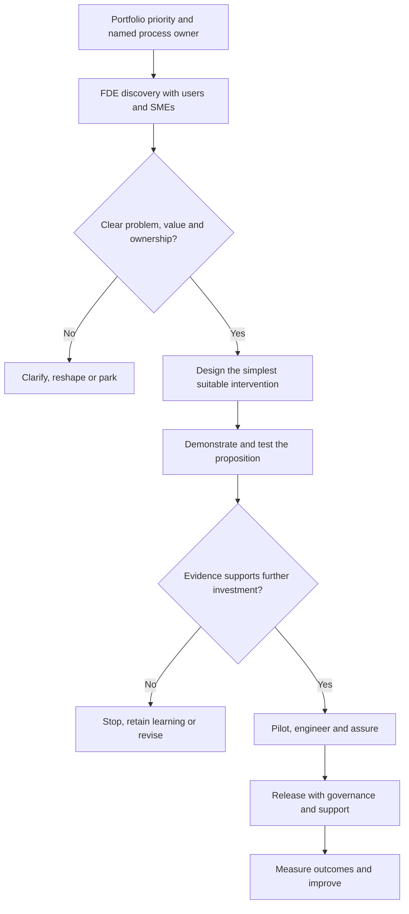
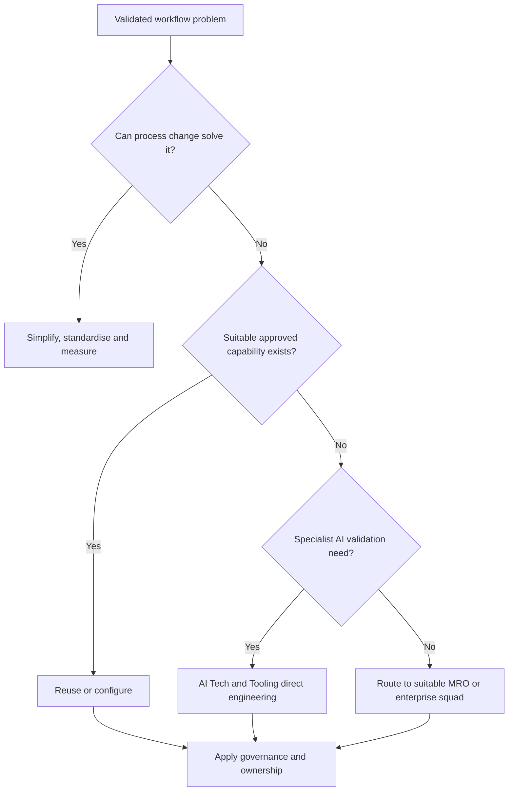

# MRO Forward Deployed Engineering Operating Model

## A workflow-first approach to automation, technology and tooling

**Purpose:** Define a reusable operating model for MRO automation, technology and tooling  
**Scope:**  Model Risk Office automation and tooling, including AI-enabled solutions  
**Accountable function:** MRO Technology & Tooling workstream  
**Status:** Proposed operating model

---

## 1. Executive summary

This operating model adapts **Forward Deployed Engineering (FDE)** to the MRO environment. Technical team works closely with the accountable process owner, subject-matter experts and users inside the real workflow. Together they establish how the process currently operates, what problem needs solving, which decisions and controls must remain with people, and how success will be measured. They then test the simplest suitable intervention before MRO commits to a production build.

The answer may be process simplification, standardisation, reuse of an existing enterprise platform, low-code workflow, deterministic software, analytics, an AI assistant or a governed agent. FDE therefore provides a disciplined route from a business priority to an evidence-based delivery decision.

This model supports two distinct responsibilities for AI Tech & Tooling:

1. **Direct engineering responsibility:** develop and support specialist AI-validationtools, reusable technical components and agents.
2. **MRO enablement responsibility:** lead discovery, provide technical direction, build bounded demonstrations, supply reusable patterns and guidance, develop MRO colleagues, and identify the squad best placed to deliver and operate the solution.

A scalable MRO model therefore depends on accountable business ownership, disciplined prioritisation, reusable components and delivery through the right combination of MRO colleagues, and specialist engineering teams.

The operating model converts prioritised MRO workflows into evidence-based delivery decisions. Portfolio governance selects and sequences discovery work. The MRO Technology & Tooling workstream then develops the roadmap, delivery routes and resource implications from the evidence produced through discovery and demonstration.

---

## 2. Purpose and intended outcomes

This operating model establishes a consistent route from an MRO workflow problem to a controlled technology or process outcome. It separates portfolio prioritisation from solution design and distinguishes discovery from a commitment to production delivery.

The intended outcomes are:

1. A workflow and use-case-first basis for automation and tooling decisions.
2. Clear ownership of processes, use cases, controls, benefits and technology services.
3. Proportionate stage gates between discovery, demonstration, pilot and production delivery.
4. Consistent assessment of process change, reuse, configuration and new development options.
5. Delivery routing based on the nature of the solution, required expertise and long-term support model.
6. Protected capacity for BAU AI-validation and AI-risk-oversight tooling.
7. A capability roadmap derived from validated and recurring needs.

The primary portfolio output is a **prioritised discovery backlog**. It is distinct from an approved production-development roadmap.

---

## 3. Start with workflows and use cases

### 3.1 Turn capability into a roadmap

Capabilities will need to be used to establish:

- which MRO outcome needs to improve;
- who experiences the problem;
- who owns the process and its controls;
- how the current workflow operates;
- whether the problem is material enough to justify investment;
- whether an existing enterprise capability already addresses it;
- whether AI is necessary or proportionate;
- who should build, host, support and maintain the solution.

### 3.2 Workflow discovery reveals the real requirement

The stated request is often only one interpretation of the underlying problem. For example, a request for an “evidence agent” may actually arise from inconsistent document storage, unclear ownership, duplicate requests or missing metadata. FDE examines the complete workflow before selecting the intervention.

### 3.3 Use cases create natural ownership

A workflow or use-case request normally originates from colleagues who perform or manage the activity. This makes it easier to identify the process owner, users, subject-matter experts and benefit owner. Where a strategic priority enters through portfolio governance, an accountable process owner must still be identified before discovery begins.

### 3.4 Reusable capabilities should emerge from repeated needs

FDE reverses the sequence:

1. Understand several real workflows and use cases.
2. Identify common problems and technical patterns.
3. Build reusable services, templates or components where repeated demand is evidenced.
4. Maintain a capability roadmap grounded in validated demand.

For example, if evidence traceability repeatedly appears across model intake, validation execution and reporting, it may justify a reusable evidence service. The common capability is therefore derived from several validated needs rather than assumed at the outset.

---

## 4. What Forward Deployed Engineering means in MRO

In MRO, Forward Deployed Engineering means placing technical capability close to the process owner and users for a focused period so the team can understand the real operating context and shape a practical solution.

It combines elements of business analysis, product discovery, engineering, controls and enablement. It is more than a front-door triage service because the team remains engaged through workflow discovery, solution design and demonstration. It is also different from a permanent central development model because the long-term delivery and support route is selected according to the nature of the solution.

An MRO FDE engagement should:

- observe and map the end-to-end workflow;
- identify pain points, hand-offs, delays, failure modes and local variations;
- understand the policy, methodology and control requirements;
- establish the accountable owner, users and decision rights;
- define the outcome, baseline and success measures;
- simplify or standardise the process where possible;
- assess existing tools and reusable components;
- test a bounded solution through a demonstration or prototype;
- recommend whether to stop, revise, reuse, configure, build or scale;
- identify the delivery squad, hosting arrangement and support model;
- capture learning as reusable guidance, templates and components.

### 4.1 The FDE objective

The objective is to turn a priority MRO problem into a controlled, evidence-based delivery decision. The objective is not to maximise the number of automations or demonstrations produced.

### 4.2 The FDE engagement boundary

Each engagement must have a defined problem, owner, scope and decision point. Broad programmes without a bounded workflow should be broken into smaller discovery questions before work begins.

---

## 5. Guiding principles

### Principle 1: Begin with the MRO outcome

Define the risk, control, quality, capacity or colleague outcome that needs to improve. Avoid beginning with a preferred technology.

### Principle 2: Assign ownership before discovery

Every workflow must have an accountable MRO process owner. Every AI-enabled solution must also have a named AI use-case owner under the applicable governance framework.

### Principle 3: Understand the current workflow

Map actual practice, including variations and workarounds, rather than relying only on the documented process or an initial feature request.

### Principle 4: Simplify and standardise before automating

Remove unnecessary steps and clarify decision rights before encoding the process. Automation should not preserve avoidable complexity or multiply local variations.

### Principle 5: Use the simplest suitable intervention

Consider policy clarification, training, process change, existing enterprise tools and deterministic automation before introducing AI. Use AI only where it adds measurable value and can operate within proportionate controls.

### Principle 6: Protect professional judgement

Risk judgements, validation conclusions, findings, ratings, approvals and escalation decisions remain accountable human activities unless MRO explicitly approves a different control model. Tools may assemble evidence, perform checks and support analysis without becoming the accountable decision-maker.

### Principle 7: Reuse before building

Assess MARM, Power Platform, approved data and reporting services, Envoy or other enterprise capabilities before creating a new application. Reuse may include a platform, component, API, pattern or template.

### Principle 8: Match delivery ownership to the solution

The team that discovers a problem does not automatically become the permanent developer or operator. Select the delivery route according to domain expertise, technology, risk, scale and support needs.

### Principle 9: Design governance into the solution

Ownership, access, auditability, testing, human oversight, change control, monitoring, escalation and rollback should form part of the design rather than being added before release.

### Principle 10: Scale learning, not one-off dependency

Each engagement should leave reusable assets and stronger capability within MRO. The operating model should reduce dependency on a small central team over time.

---

## 6. Scope and mandate of AI Tech & Tooling

### 6.1 Lane A: direct specialist engineering

AI Tech & Tooling directly develops and supports capabilities that sit within its core mandate, including:

- the AI Independent Validation Platform or Workbench as BAU validation tooling;
- AI and GenAI evaluation frameworks and reusable testing components;
- specialist tools and agents supporting independent AI validation;
- technical capabilities supporting AI risk triage and oversight;
- reusable AI engineering patterns, evaluation assets and controlled agent components;
- integration, quality controls and release readiness for these capabilities.

The relevant AI Independent Validation or AI Risk Oversight team retains ownership of methodology, validation scope, test selection and configuration, interpretation, conclusions and protected decisions.

### 6.2 Lane B: MRO enablement and routing

For wider MRO automation and tooling, AI Tech & Tooling provides:

- a technical front door and structured intake;
- FDE discovery with process owners and users;
- workflow mapping and problem definition;
- technical feasibility and architecture guidance;
- short, bounded demonstrations or prototypes;
- approved design and engineering patterns;
- reusable templates and components;
- support and training for MRO colleagues;
- identification and mobilisation of an appropriate delivery squad;
- advice on AI classification, governance and controls;
- independent challenge of proposed technology choices where required.

---

## 7. End-to-end FDE process

The proposed lifecycle is:

> **Discover → Design → Demonstrate → Pilot → Engineer → Assure → Release → Operate**

Portfolio prioritisation and ownership assignment occur before discovery. Formal gates determine whether a use case progresses.

### Stage 0: Prioritise and assign ownership

**Purpose:** Select problems worthy of discovery without prescribing a solution.

**Activities:**

- portfolio governance identifies and sequences priority MRO outcomes and workflows;
- the portfolio owner checks alignment with strategy, regulation and existing commitments;
- an accountable MRO process owner and senior sponsor are named;
- initial users and subject-matter experts are identified;
- AI Tech & Tooling checks whether the request falls within direct delivery or wider enablement.

**Minimum output:** Prioritised discovery item with a named owner, initial problem statement and nominated users.

**Decision:** Accept into discovery, request clarification or park.

### Stage 1: Discover

**Purpose:** Understand the real workflow, problem and operating constraints.

**Activities:**

- observe or walk through the process with users;
- map steps, decisions, hand-offs, systems and evidence flows;
- identify pain points, delays, rework, manual effort and control weaknesses;
- document local variations and the reasons for them;
- identify authoritative data and systems of record;
- establish volumes, cycle times and other available baseline measures;
- identify decisions requiring expertise, challenge or approval;
- review related tools, projects and potential duplication.

**Outputs:**

- current-state workflow map;
- agreed problem statement;
- owner and user map;
- baseline and expected outcome;
- control and data constraints;
- list of existing capabilities and dependencies;
- initial classification of the solution need.

**Gate 1: Problem and ownership**

Progress only where the problem is sufficiently clear, the owner accepts accountability, users will participate and there is a plausible route to measurable value.

### Stage 2: Design

**Purpose:** Define the simplest proportionate intervention.

The team should assess solution options in the following order:

1. Remove unnecessary activity.
2. Simplify or standardise the workflow.
3. Clarify policy, roles or guidance.
4. Reuse or configure an existing enterprise capability.
5. Use low-code or deterministic workflow automation.
6. Use analytics or specialist deterministic software.
7. Add an LLM-assisted capability where language understanding or generation is genuinely needed.
8. Use bounded agentic coordination where the process requires controlled selection of actions, state management or replanning.

**Outputs:**

- target workflow;
- solution options and recommendation;
- initial architecture and integration boundaries;
- human decision and control points;
- ownership and delivery-route hypothesis;
- success measures and evaluation plan;
- initial AI and technology-governance classification.

### Stage 3: Demonstrate

**Purpose:** Test the proposition quickly before committing to production engineering.

**Activities:**

- build a bounded prototype, demonstration or process mock-up;
- use representative, appropriately controlled data;
- test the proposed workflow with real users;
- compare performance against the current baseline where possible;
- identify failure modes, usability issues and control gaps;
- estimate production effort, dependencies and support needs;
- capture components or patterns that may be reusable.

**Outputs:**

- demonstration and evidence pack;
- user and owner feedback;
- early value and feasibility assessment;
- risk and control findings;
- recommended decision: stop, revise, pilot or proceed.

**Gate 2: Value and feasibility**

The process owner, FDE lead and portfolio owner determine whether the evidence justifies a pilot or production investment. A successful demonstration does not automatically create a production commitment.

### Stage 4: Pilot

**Purpose:** Test the proposed operating model with limited users, scope and risk exposure.

**Activities:**

- confirm pilot scope and success thresholds;
- assign business, technical and operational owners;
- complete required governance actions for the pilot;
- run in a controlled environment with defined human oversight;
- collect outcome, quality, control and adoption evidence;
- test exception handling, escalation and fallback arrangements;
- confirm the expected production delivery and support model.

**Outputs:** Pilot results, updated business case, validated control design and production recommendation.

### Stage 5: Engineer

**Purpose:** Convert the validated proposition into a reliable and supportable product or service.

**Activities:**

- mobilise the agreed delivery squad;
- implement approved architecture, security and integration patterns;
- separate reusable platform components from MRO-specific methodology and configuration;
- implement access control, audit records, observability and error handling;
- define configuration, versioning and change-management processes;
- produce technical and user documentation;
- prepare operational support and service arrangements.

**Outputs:** Production-quality solution, documentation, deployment package and support model.

### Stage 6: Assure

**Purpose:** Establish that the solution is fit for controlled use.

**Activities:**

- execute functional, integration, security and user-acceptance testing;
- verify data quality and system-of-record boundaries;
- test auditability, access, escalation, rollback and recovery;
- complete AI evaluation and governance where applicable;
- confirm human oversight and decision accountability;
- verify operational readiness, documentation and training.

**Gate 3: Production readiness**

Release requires named owners, completed controls, accepted test evidence, an approved support model and a clear method for monitoring outcomes.

### Stage 7: Release

**Purpose:** Introduce the solution into controlled use.

**Activities:**

- deploy through the approved platform and release process;
- train users and communicate operating boundaries;
- activate monitoring, support and incident routes;
- record the production version, configuration and approvals;
- confirm the accountable owner and benefit-reporting arrangements.

### Stage 8: Operate and improve

**Purpose:** Ensure that the solution remains controlled, useful and proportionate.

**Activities:**

- monitor adoption, performance, errors, overrides and incidents;
- measure benefits against the baseline;
- review user feedback and workflow changes;
- manage model, prompt, rule, data and configuration changes;
- recalibrate or revalidate where required;
- retire functionality that no longer delivers sufficient value;
- feed reusable learning into the MRO capability roadmap.

**Gate 4: Scale, improve or retire**

Scale only when outcome, control and support evidence justify broader use.

---

## 8. Intake and portfolio prioritisation

### 8.1 Sources of demand

Requests may enter the FDE portfolio through two routes:

1. **Strategic priorities:** an agreed MRO outcome or workflow enters through portfolio governance with an accountable process owner.
2. **User-led opportunities:** colleagues identify a pain point within a workflow they understand and nominate or involve the relevant process owner.

Both routes enter the same discovery and decision process. A top-down priority does not remove the need for user discovery, ownership or delivery gates. A bottom-up request does not automatically receive development capacity.

### 8.2 Minimum information for intake

The front door should capture:

- workflow or activity affected;
- problem and evidence of impact;
- process owner and users;
- desired outcome;
- known policy or control considerations;
- current systems and data sources;
- known deadlines or dependencies;
- whether AI has already been proposed;
- any related initiatives or existing tools.

The front door may be supported by an assistant or structured form, but accountable colleagues should make prioritisation and ownership decisions.

### 8.3 Prioritisation criteria

Portfolio decisions should consider:

| Criterion | Portfolio assessment question |
|---|---|
| Strategic or regulatory relevance | Does this workflow directly support an agreed MRO outcome or obligation? |
| Risk and control improvement | Will the work materially improve control, evidence, consistency or oversight? |
| User and operational value | Is there credible evidence of delay, rework, poor experience or constrained capacity? |
| Measurability | Can MRO establish a baseline and determine whether the change worked? |
| Ownership and readiness | Is there an accountable owner, available SMEs and sufficient access to the workflow and data? |
| Reuse potential | Could the learning or component support several MRO workflows? |
| Feasibility and dependency | Are data, platforms, permissions and delivery resources realistically available? |
| Cost and ongoing support | Is the expected benefit proportionate to build, governance and maintenance costs? |
| Portfolio capacity | What existing commitment would be delayed or displaced? |

Prioritisation selects work for discovery. It does not predetermine the solution or developer.

---

## 9. Use-case classification and delivery routing

### 9.1 Classify the intervention after discovery

| Classification | Typical response | Likely delivery route |
|---|---|---|
| Policy or role ambiguity | Clarify policy, responsibility or guidance | MRO process owner with Policy or Governance colleagues |
| Process complexity or variation | Simplify and standardise | MRO process owner supported by FDE |
| General workflow and case management | Configure an approved workflow platform | MARM, Power Platform  |
| Reporting and management information | Use governed data and reporting services | Relevant data, MI or reporting team |
| Deterministic analytical tool | Develop controlled rules, calculations or tests | Appropriate analytical or development squad |
| Specialist AI-validation capability | Develop within the AI validation architecture | AI Tech & Tooling with AI IVT or AIRO ownership |
| AI assistant | Use an approved model for bounded extraction, retrieval, classification or drafting | AI Tech & Tooling or approved AI delivery team, subject to governance |
| Agentic workflow | Use controlled orchestration, approved tools and human gates | AI Tech & Tooling or approved agent team, with platform hosting where appropriate |

### 9.2 Reuse, adapt or build decision

### 9.3 Hosting does not determine business ownership

An enterprise platform may own the hosted runtime, user interface, identity and access management, infrastructure and operational service. MRO should retain ownership of its methodology, knowledge, configurations, evaluation assets, control logic and risk judgements.

For example, Envoy may host an approved agent while the MRO use-case owner remains accountable for purpose, scope, knowledge, controls, human oversight and performance. MARM may provide workflow and system-of-record services without owning MRO validation conclusions.

---

## 10. Roles, accountability and decision rights

### 10.1 Role model

| Role | Primary accountability |
|---|---|
| MRO senior leadership | Set strategic outcomes, prioritise workflows, sponsor change and resolve portfolio trade-offs |
| MRO Technology & Tooling workstream leadership | Own the operating model, portfolio roadmap, technical direction and recommendations to MRO governance |
| AI Tech & Tooling portfolio owner | Own portfolio sequencing, delivery commitments and capacity trade-offs across workstreams |
| FDE Lead | Manage wider-MRO intake, discovery backlog and sprint delivery; coordinate workflow discovery, demonstrations and routing |
| MRO process owner | Own the workflow, requirements, methodology, controls, decisions, adoption and benefits |
| AI use-case owner | Own the AI purpose, permitted use, impact, human oversight, ongoing performance and governance obligations |
| Users and subject-matter experts | Explain the workflow, test the proposition and validate whether it supports real practice |
| AI Engineering Lead | Engineer reusable AI components, agent patterns and shared technical services |
| Validation Platform Product Lead | Productise and integrate specialist validation capabilities into the AI-validation platform |
| Quality and Controls Lead | Define quality gates, test evidence, release readiness and control requirements |
| Wider MRO development pool | Support low-code or bounded delivery where skills, ownership and capacity are appropriate |
| Enterprise delivery team | Build or configure general workflow, data, reporting or other enterprise capabilities |
| Platform or hosting team | Operate infrastructure, runtime, access and platform services under an agreed service model |

### 10.2 Functional allocation within AI Tech & Tooling

The functional allocation can be summarised as:

- **Portfolio, prioritisation and orchestration:** AI Tech & Tooling portfolio owner.
- **Discover, shape and prove:** FDE Lead, supported by a development pool that varies by initiative.
- **Engineer and reuse:** AI Engineering Lead and engineering squad.
- **Productise and integrate:** Validation Platform Product Lead and platform squad.
- **Assure and prepare for release:** Quality and Controls Lead.

This allocation supports continuity across discovery, engineering, integration and control without making one squad responsible for every tool.

### 10.3 Decision-rights summary

| Decision | Accountable decision-maker |
|---|---|
| Which MRO outcomes and workflows matter most | MRO senior leadership |
| Whether a workflow enters FDE discovery | MRO Technology & Tooling portfolio governance |
| Business process and control design | MRO process owner |
| AI use-case ownership and acceptable use | Named MRO AI use-case owner |
| Recommended technology and delivery route | AI Tech & Tooling through FDE and architecture assessment |
| Commitment of AI Tech & Tooling capacity | AI Tech & Tooling portfolio owner within agreed governance |
| Production investment and material resource mobilisation | Appropriate portfolio and funding authority |
| Release approval | Accountable business and technical owners under the applicable governance process |

---

## 11. Governance and control requirements

### 11.1 Governance applies to all solutions

Every production solution should address, in proportion to its risk:

- named business, technical and operational owners;
- data ownership, quality and permitted use;
- access control and segregation of duties;
- system-of-record and record-retention boundaries;
- security, privacy and information classification;
- functional and user-acceptance testing;
- traceability, logging and audit evidence;
- change, version and configuration control;
- operational monitoring and incident management;
- resilience, fallback and rollback;
- user guidance, training and support;
- benefit measurement and periodic review.

### 11.2 AI-specific governance trigger

A solution should be treated as an AI use case when it uses an AI or machine-learning model, an LLM, generative AI or an agentic component. AI governance then applies in addition to normal technology controls.

The use case should have:

- a named MRO AI use-case owner;
- the required inventory registration and risk or materiality assessment;
- a clearly defined purpose and operating boundary;
- documented data sources, model dependencies and system prompts or configurations;
- evaluation against relevant quality, robustness and risk criteria;
- defined human review, approval, override and escalation points;
- provenance for evidence and generated content;
- monitoring for performance, errors, harmful behaviour and material change;
- controlled model, prompt, tool and knowledge-base changes;
- incident and withdrawal arrangements.

Model tiering may inform the control approach, but it should not be the sole basis for deciding how much of a workflow to automate. The nature of the decision, consequences of error, data sensitivity and degree of human oversight also matter.

### 11.3 Protected MRO decisions

Unless MRO explicitly approves an alternative control design, automation should support rather than independently make:

- risk judgements;
- validation scope decisions;
- findings and severity assessments;
- ratings;
- approvals;
- escalation decisions;
- final validation conclusions.

An agent may coordinate approved steps and tools, but it should not own authority or change live policies, rules or decision thresholds without an approved change process.

---

## 12. Stage-gate entry and exit criteria

| Gate | Minimum evidence required | Possible decisions |
|---|---|---|
| Entry to discovery | Named owner, identifiable workflow, initial problem and available users | Accept, clarify or park |
| Entry to demonstration | Current-state map, agreed problem, baseline, target outcome and viable options | Demonstrate, solve through process change or stop |
| Entry to pilot | Demonstrated feasibility, owner acceptance, defined scope, governance classification and evaluation plan | Pilot, revise or stop |
| Entry to engineering | Pilot evidence, delivery route, funded capacity, architecture, ownership and control design | Engineer, defer or stop |
| Production release | Accepted testing, approvals, support model, monitoring, training and rollback | Release or remediate |
| Scale decision | Adoption, performance, control and benefit evidence | Scale, improve, constrain or retire |

These gates prevent an initial request, senior priority or successful demonstration from becoming an automatic production commitment.

---

## 13. Standard FDE artifacts

Each engagement should create a proportionate set of reusable records:

1. **Intake brief:** workflow, owner, users, problem, outcome and dependencies.
2. **Workflow map:** current steps, decisions, hand-offs, systems, evidence and controls.
3. **Use-case canvas:** users, jobs, pain points, value, risks and success measures.
4. **Ownership record:** sponsor, process owner, AI use-case owner where relevant, SMEs and benefit owner.
5. **Solution-options assessment:** simplify, standardise, reuse, configure, build, AI or agent.
6. **Demonstration plan and evidence:** scope, assumptions, test scenarios, feedback and findings.
7. **Delivery-route decision:** delivery squad, architecture, hosting, integration and support.
8. **Governance record:** classification, controls, approvals, human oversight and audit requirements.
9. **Operational-readiness pack:** testing, release, monitoring, incident, fallback and training.
10. **Benefits record:** baseline, target, realised outcomes and lessons.

The artifacts should be lightweight during early discovery and become more detailed only as the use case progresses.

---

## 14. Measures of success

The FDE model should be measured by the quality and impact of decisions, not only by the number of tools produced.

### 14.1 Portfolio measures

- proportion of discovery items with a named process owner;
- time from intake to a clear proceed, revise, route or stop decision;
- number of duplicative requests avoided or consolidated;
- proportion of needs met through process change, reuse or configuration;
- number of validated use cases that progress through each gate;
- visibility of capacity trade-offs and displaced commitments.

### 14.2 Outcome measures

Each use case should define measures relevant to its workflow, such as:

- reduced cycle time or waiting time;
- reduced rework and duplicate evidence requests;
- improved completeness, consistency or traceability;
- improved control effectiveness and audit evidence;
- reduced manual administrative effort;
- increased capacity applied to higher-value analysis and challenge;
- user adoption and satisfaction;
- quality and error rates.

### 14.3 Enablement measures

- MRO colleagues trained to use approved patterns and tools;
- number and adoption of reusable components or templates;
- successful hand-offs to process owners or delivery squads;
- reduction in one-off solutions requiring central support;
- growth in the wider MRO delivery pool without weakening control quality.

### 14.4 AI-specific measures

Where AI is used, measures may include task-specific evaluation results, evidence-grounding quality, exception rates, human overrides, failure patterns, control compliance and performance after material changes.

---

## 15. Illustrative FDE example: validation evidence gathering

This example shows why the workflow should be examined before MRO defines an “evidence automation capability.”

### Portfolio priority

Evidence gathering is identified as a source of delay and administrative effort in validation and enters the prioritised discovery backlog.

### Ownership

The relevant validation team nominates a process owner. Validators, model owners and governance colleagues participate as users or SMEs.

### Discovery findings

The FDE team maps how evidence is requested, received, stored, reviewed, referenced and retained. It may find several causes:

- unclear evidence requirements;
- inconsistent SharePoint locations or metadata;
- duplicate requests across teams;
- missing ownership or deadlines;
- manual comparison of versions;
- time spent summarising long documents.

### Intervention design

The resulting solution may combine:

- a standard evidence-request template;
- agreed storage and metadata conventions;
- deterministic workflow for ownership, deadlines and status;
- links to existing enterprise document services;
- an AI assistant for bounded extraction or summarisation;
- human review before evidence is accepted or used in a conclusion.

### Delivery route

- The process owner owns requirements, evidence standards, controls and benefits.
- MARM or Power Platform may deliver the general workflow.
- A platform team may provide document, search or hosting services.
- AI Tech & Tooling may provide a governed AI extraction or validation component where justified.
- The AI use-case owner accepts accountability and completes AI governance if an LLM is used.

### Result

MRO receives an integrated workflow improvement rather than a standalone AI tool that leaves the underlying process problems unresolved.

---

## 16. Operating-model adoption

### Step 1: Establish the FDE front door and governance

- confirm the accountable MRO Technology & Tooling workstream leadership and portfolio owner;
- agree the two-lane mandate and capacity boundaries;
- implement the intake brief, ownership requirements and prioritisation criteria;
- create a single visible FDE backlog in Jira;
- define discovery, demonstration and production gates;
- confirm routes into MARM, Power Platform, Envoy, data services and other delivery teams.

### Step 2: Baseline existing work and capture learning

- maintain agreed AI-validation and AI-risk-oversight tooling as BAU;
- review active demonstrations and discovery items against the FDE stage gates;
- document the workflows, owners, value evidence and proposed delivery routes;
- convert reusable learning into templates, components and guidance.

### Step 3: Establish the initial discovery portfolio

- portfolio governance selects a manageable set of MRO workflows for discovery;
- name the process owner and SMEs for each;
- sequence the work within available FDE capacity;
- define the governance checkpoint for discovery outcomes.

### Step 4: Run discovery and update the roadmap

Each discovery outcome should record:

- the validated problem and baseline;
- target workflow and expected benefit;
- recommended intervention;
- reuse, adapt or build decision;
- delivery squad and hosting route;
- ownership and governance model;
- resource, dependency and timing implications;
- recommendation to stop, revise, pilot or engineer.

### Step 5: Build reusable MRO capability from validated demand

Once several engagements identify recurring needs, AI Tech & Tooling should maintain a capability map showing:

- reusable enterprise platforms;
- MRO-owned methodology and intelligence assets;
- approved workflow and agent patterns;
- shared evaluation, evidence, audit and publishing components;
- known delivery squads and specialist skills;
- gaps requiring further investment.

This capability map becomes an output of discovery and delivery experience rather than the starting assumption.

---

## 17. Key risks and mitigations

| Risk | Consequence | Mitigation |
|---|---|---|
| Technology-first prioritisation | Tools with weak adoption or unclear value | Require workflow, owner, baseline and outcome before development |
| AI Tech & Tooling becomes the default build team | Loss of AI-validation capacity and a growing support bottleneck | Apply two-lane mandate, capacity gates and delivery routing |
| Process owner is unclear | Weak requirements, decisions and benefit accountability | Name the owner before discovery and confirm responsibilities at each gate |
| Demonstrations become unsupported production tools | Operational, control and resilience exposure | Separate demonstration, pilot and production environments and approvals |
| Local process variations are automated | Fragmented solutions and high maintenance cost | Simplify and standardise during discovery |
| AI is used where deterministic methods would suffice | Unnecessary risk, cost and governance overhead | Apply the solution hierarchy and justify AI-specific value |
| Platform host becomes assumed business owner | Accountability gap | Document business, technical, operational and hosting ownership separately |
| Automated outputs influence protected decisions | Loss of effective human challenge | Define human gates, provenance, override and escalation controls |
| Capability duplication | Wasted investment and inconsistent records | Review enterprise roadmaps and existing services during discovery |
| Benefits are not realised | Capacity is saved but not redirected or measured | Name a benefit owner and agree use of released capacity before scale |

---

## 18. Operating-model governance and maintenance

### 18.1 Adoption requirements

The operating model requires:

- an accountable MRO Technology & Tooling workstream owner;
- an agreed two-lane mandate for AI Tech & Tooling;
- a single prioritised FDE backlog;
- named process and use-case owners;
- consistent application of the stage gates;
- defined interfaces with enterprise delivery and hosting teams;
- protected capacity for AI-validation and AI-risk-oversight tooling;
- periodic portfolio and operating-model review.

### 18.2 Ongoing review

The workstream owner should review the operating model periodically and after material delivery experience. The review should consider:

- whether prioritisation criteria remain effective;
- whether discovery is producing timely and evidence-based decisions;
- whether ownership and delivery routes remain clear;
- whether reusable assets are reducing duplication;
- whether the balance between direct engineering and wider enablement remains sustainable;
- whether governance requirements or enterprise platform capabilities have changed;
- whether outcome and benefit measures demonstrate sufficient value.

Material changes should follow the applicable MRO governance and document-control process.

---

## Appendix A: One-page FDE intake template

### Workflow and problem

- Name of MRO workflow or activity:
- Current problem or pain point:
- Evidence of the problem:
- Users affected:
- Desired outcome:

### Ownership

- Senior sponsor:
- MRO process owner:
- AI use-case owner, if applicable:
- Subject-matter experts:
- Benefit owner:

### Current environment

- Current process and systems:
- Authoritative data and records:
- Key controls and protected decisions:
- Known dependencies:
- Related tools or initiatives:

### Discovery request

- Why this should be prioritised now:
- Deadline or regulatory driver:
- Baseline measures available:
- Proposed users for discovery and testing:
- Has AI already been proposed? If so, why?

---

## Appendix B: FDE discovery outcome template

1. **Validated problem:** What evidence confirms the issue?
2. **Current workflow:** Where do delay, rework, risk or control weaknesses occur?
3. **Target outcome:** What should improve and how will it be measured?
4. **Ownership:** Who owns the workflow, use case, controls and benefits?
5. **Simplification:** What can be removed or standardised?
6. **Existing capability:** What can MRO reuse or configure?
7. **Solution recommendation:** Process change, workflow, analytics, AI or agent?
8. **Human control:** Which decisions require review, approval, override or escalation?
9. **Delivery route:** Who should build, host, operate and support it?
10. **Governance:** Which technology and AI requirements apply?
11. **Evidence:** What did the demonstration or pilot establish?
12. **Recommendation:** Stop, revise, reuse, pilot, engineer or scale?

---

## Appendix C: Terminology

| Term | Meaning in this operating model |
|---|---|
| Forward Deployed Engineering | Time-boxed technical work embedded with process owners and users to understand a workflow, test a solution and determine the appropriate delivery route |
| Workflow | The end-to-end activities, decisions, evidence, systems, people and controls used to produce an MRO outcome |
| Use case | A bounded application of a process or technology for defined users, purpose and outcome |
| Capability | A reusable combination of people, process, technology, data and controls that supports one or more use cases |
| Demonstration | A bounded test of an idea that does not constitute approval for production use |
| Pilot | Controlled use with limited scope and users to gather operational evidence |
| Process owner | MRO colleague accountable for the workflow, methodology, controls, adoption and benefits |
| AI use-case owner | Accountable owner for the purpose, impact, human oversight, performance and governance of an AI-enabled use case |
| Delivery owner | Team accountable for developing or configuring the production solution |
| Platform owner | Team accountable for the hosted runtime, infrastructure and platform service |
| Protected decision | A judgement, conclusion, finding, rating, approval or escalation that requires accountable MRO authority |
