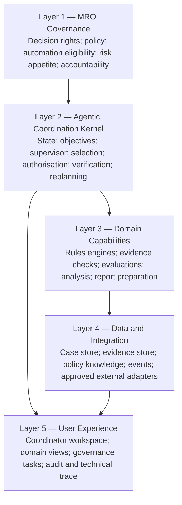
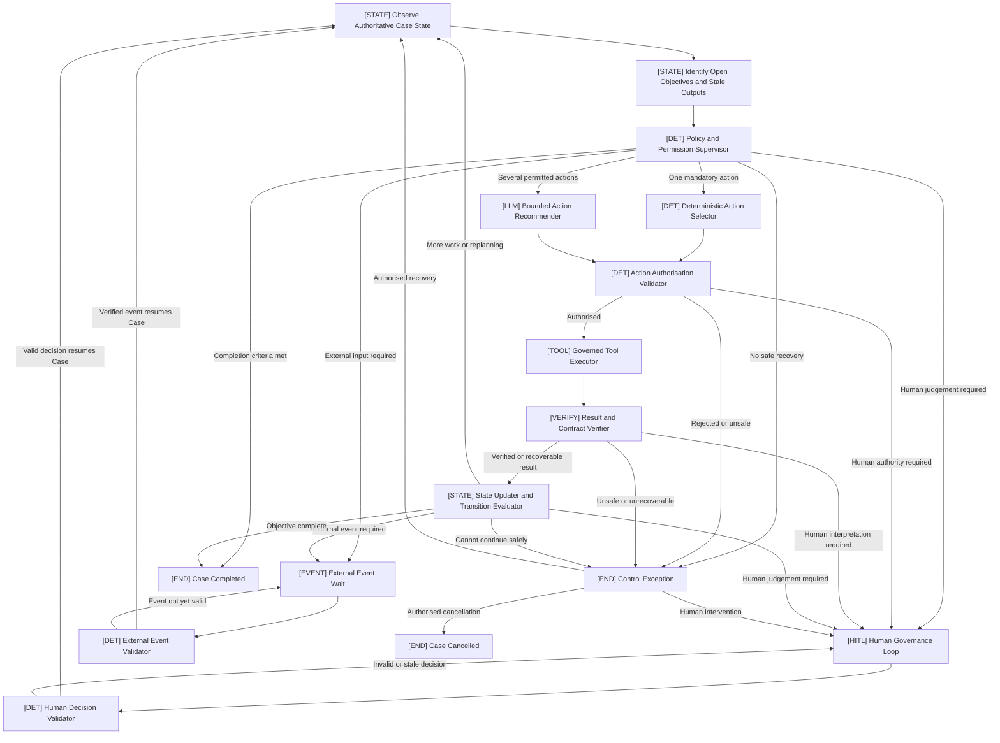
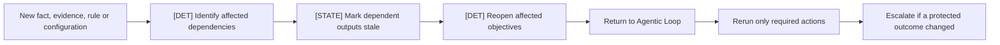
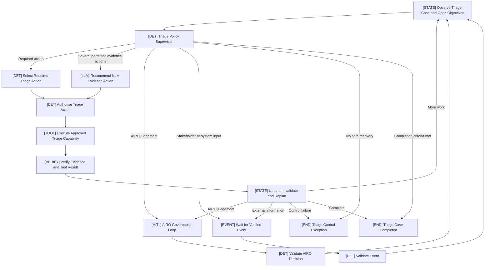
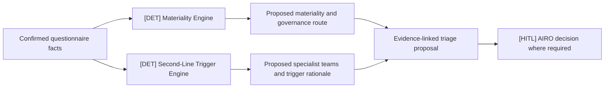
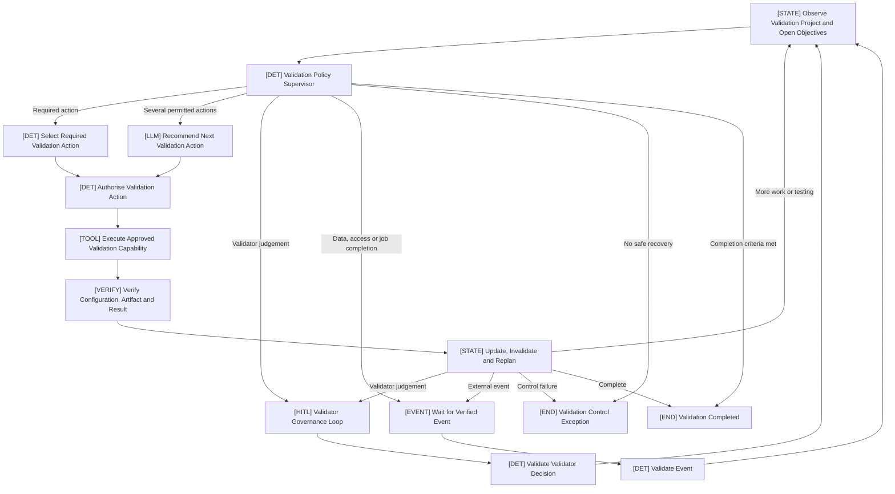

# MRO Policy-Supervised, Exception-Driven Agentic Case Coordinator Framework

**Document type:** Reusable MRO architecture pattern and implementation guide  
**Audience:** MRO product owners, risk specialists, validators, architects, engineers and control partners  
**Status:** Reference design  
**Version:** 1.1  

## Document purpose

This document defines a reusable agentic workflow framework for Model Risk Office applications that coordinate evidence, analysis, tools, human judgement and controlled actions over the lifecycle of a Case or Project.

It contains three related designs and one reuse guide:

1. **The generic MRO framework:** Policy-Supervised, Exception-Driven Agentic Case Coordinator;
2. **Implementation example:** AI Risk Triage Case Coordinator; and
3. **Implementation example:** Independent AI Validation Project Coordinator.
4. **Reuse guidance:** how to apply the common Coordinator Kernel across other MRO applications.

The examples are specialisations of the same framework. They do not create different orchestration patterns.

### How to use this document

- Read **Part 1** as the reusable architecture and control standard.
- Use **Parts 2 and 3** to understand how the same pattern is configured for different MRO domains.
- Use **Part 4** to separate reusable platform capabilities from application-specific policy, methodology, tools and human decisions.
- Complete the configuration template in Section 19 before starting a new implementation.

---

# Part 1 — Generic MRO Agentic Workflow Framework

## 1. Framework name and definition

The recommended reusable pattern is:

> **MRO Policy-Supervised, Exception-Driven Agentic Case Coordinator**

It is a human-governed, stateful agentic workflow in which one Coordinator:

- observes the authoritative Case state;
- identifies unresolved objectives;
- operates within deterministic policy and permission boundaries;
- dynamically selects the next permitted action;
- invokes approved tools and capabilities;
- verifies results before accepting them;
- updates state and selectively replans;
- waits for human or external events when required;
- escalates exceptions to the appropriate MRO decision-maker; and
- continues until verified completion criteria are met.

The complete Agentic Loop is:

> **Observe State → Identify Open Objectives → Constrain → Select → Authorise → Execute → Verify → Update → Replan → Continue, Wait, Escalate or Complete**

## 2. What the framework solves

Many MRO applications begin as fixed workflows. Users move through tabs, manually determine the next step, revisit earlier pages when information changes and assemble evidence across multiple tools.

The framework adds a governed coordination layer that can:

- determine what work is still required from the current state;
- avoid unnecessary processing and repeated manual navigation;
- select among approved actions when Case conditions differ;
- preserve dependencies between evidence, calculations and conclusions;
- identify stale outputs after a change;
- pause only when meaningful judgement or authority is required;
- manage asynchronous stakeholder and system events;
- maintain a complete evidence and decision trail; and
- progressively automate proven activities without transferring protected MRO judgement to an LLM.

It does not replace domain policy, methodology or accountable human decisions.

## 3. When it is genuinely agentic

The implementation is agentic when the Coordinator uses the current state and unresolved objectives to choose and coordinate different permitted actions over repeated cycles.

The following characteristics distinguish it from a fixed workflow:

| Fixed workflow | Agentic Case Coordinator |
|---|---|
| Predetermined step sequence | Next action depends on current state and open objectives |
| User manually navigates to the required step | Coordinator proposes or performs the next permitted action |
| Changes often restart a broad section | Dependency-aware selective replanning |
| Human confirms routine transitions | Human intervention is triggered by policy, judgement or exception |
| Tool calls are attached to fixed pages | Tools are selected from an approved registry according to need |
| Limited event handling | Durable wait and verified resume for human or system events |
| Completion means reaching the final page | Completion requires verified domain and governance criteria |

An LLM is not required in every cycle. A Coordinator can act agentically while using deterministic selection for unambiguous actions and an LLM only when contextual recommendation is useful.

If all actions and transitions remain predetermined, the system is a stateful governed workflow rather than a materially adaptive agentic workflow.

The framework should therefore be described as **agentic-capable**. A concrete implementation is genuinely agentic only when it demonstrates state-dependent action selection, governed tool use, result verification and replanning. Adding an LLM to a fixed sequence is not sufficient.

## 4. Core design principles

1. **One authoritative Coordinator.** Use one Case Coordinator with multiple governed tools, not multiple competing agents.
2. **Policy controls autonomy.** Deterministic policy determines permissions, mandatory actions, human decisions and execution limits.
3. **Objectives drive work.** The Coordinator works from unresolved objectives rather than blindly following UI tabs.
4. **Deterministic first.** When one action is mandatory or unambiguous, select it deterministically.
5. **Bounded LLM recommendation.** Use an LLM only to recommend among actions already permitted by policy.
6. **Authorise before execution.** Deterministic and LLM-recommended actions pass through the same authorisation check.
7. **Govern all tools.** Execute capabilities only through explicit, versioned tool contracts.
8. **Verify before trust.** Only verified results may update authoritative facts or protected proposals.
9. **Exceptions drive human attention.** Escalate material uncertainty, conflict, exception or consequential action—not every routine transition.
10. **Selective replanning.** Invalidate and rerun only work affected by changed evidence, rules or configuration.
11. **System-assigned automation.** The Case user and LLM cannot select or increase the effective automation profile.
12. **Fail safely.** Unknown state, exhausted limits, failed controls or uncertain authority produce a controlled pause or exception.
13. **Preserve human ownership.** Each application must identify decisions that remain protected MRO judgements.
14. **Keep tabs as views.** UI tabs may organise information, but they must not become separate workflow controllers.

## 5. Five-layer reference architecture



### 5.1 Governance layer

Defines:

- objective and scope;
- decision ownership;
- protected human judgements;
- automation eligibility;
- mandatory controls;
- policy and methodology versions;
- escalation and fail-safe rules;
- external-action authority; and
- monitoring and change governance.

### 5.2 Agentic coordination kernel

Provides reusable orchestration:

- persistent state;
- open-objective management;
- deterministic policy supervision;
- action selection and recommendation;
- authorisation;
- tool execution;
- verification;
- transition evaluation;
- human and external-event waits;
- selective replanning;
- completion evaluation; and
- audit history.

### 5.3 Domain capability layer

Contains application-specific tools. Examples include risk engines, evidence checks, validation evaluations, report generators and publication adapters.

Materiality calculation, validation metrics and rule mappings are domain capabilities—not responsibilities of the generic Coordinator.

The accountable MRO function must own or approve the protected methodology, scoring logic, thresholds, interpretation rules and conclusions. The reusable framework may host and execute these capabilities, but it must not redefine them.

### 5.4 Data and integration layer

Provides governed access to:

- Case and Project state;
- submitted evidence and artifacts;
- approved policy and methodology knowledge;
- model, test and result repositories;
- stakeholder events;
- Confluence, SharePoint, email, MARM or other systems; and
- monitoring and audit records.

### 5.5 User-experience layer

Makes state and control decisions understandable. It should show what the Coordinator is doing, why it is permitted, what remains unresolved and what requires human judgement.

## 6. Generic Agentic State Loop



## 7. Generic components and responsibilities

| Component | Type | Main responsibility | Must not do |
|---|---|---|---|
| Case State Observer | Deterministic state | Build a trusted view of current state | Infer new authoritative facts |
| Objective Manager | Deterministic state | Identify open, blocked, completed and stale objectives | Invent business objectives |
| Policy and Permission Supervisor | Deterministic control | Define allowed actions, tools, Gates, limits and profile | Delegate permissions to the LLM |
| Deterministic Action Selector | Deterministic planning | Select an unambiguous required action | Use an LLM unnecessarily |
| Bounded Action Recommender | LLM recommendation | Recommend among permitted contextual actions | Authorise, execute or expand authority |
| Action Authorisation Validator | Deterministic control | Validate action, tool, data, budget and authority | Rubber-stamp an LLM proposal |
| Governed Tool Executor | Tool execution | Execute one authorised tool contract | Select its own next tool |
| Result and Contract Verifier | Verification | Check integrity, evidence, schema, relevance and permissions | Treat every tool response as trusted |
| State Updater | Deterministic state | Apply verified changes and maintain history | Promote unverified observations to facts |
| Transition and Completion Evaluator | Deterministic control | Decide continue, wait, escalate, complete or fail safely | Complete with unresolved mandatory work |
| Human Governance Loop | Human decision | Obtain protected judgement or approval | Ask humans to confirm routine mechanics by default |
| External Event Wait and Validator | Event control | Pause durably and resume only on verified events | Trust an uncorrelated callback or email |
| Control Exception Handler | Fail-safe control | Stop unsafe progression and support controlled recovery | Convert a control failure into automatic approval |

## 8. Plans, memory, actions and tools

These terms should be used consistently across MRO applications.

### 8.1 Plan

The plan is not an unrestricted LLM-generated sequence. It is the current set of permitted actions needed to resolve open objectives.

It contains:

- open objectives;
- mandatory actions;
- permitted optional actions;
- dependencies;
- completed and failed actions;
- prohibited actions;
- action budgets; and
- the next transition condition.

The Policy Supervisor defines the plan boundary. The deterministic selector or bounded LLM recommender selects the next action within that boundary.

### 8.2 Memory

Memory is the persistent, authoritative Case state and audit history—not an ungoverned chat history.

It includes:

- confirmed facts;
- candidate facts;
- evidence and provenance;
- decisions and rationale;
- open issues and objectives;
- prior actions and tool results;
- stale and superseded outputs;
- policy, rule, model, prompt and tool versions;
- pending human and external events; and
- automation eligibility and effective profile.

Long-term historical data may support calibration and evaluation, but should not silently alter current Case policy.

### 8.3 Action

An action is a typed request to perform one bounded operation, for example:

```json
{
  "action_id": "ACT-204",
  "action_type": "CHECK_EVIDENCE_CONSISTENCY",
  "selected_tool": "evidence_consistency_checker",
  "reason": "A confirmed answer may conflict with submitted architecture evidence.",
  "required_inputs": ["confirmed_answers", "architecture_evidence"],
  "selection_method": "LLM_RECOMMENDED",
  "state_version": 18
}
```

Every action must be authorised before execution.

### 8.4 Tool

A tool is an approved capability with a contract. It may be deterministic, LLM-based, retrieval-based, computational or an external adapter.

The tool does not own the Case, select the automation profile or make protected final decisions.

## 9. Minimum Case state model

```yaml
identity:
  case_id: string
  case_type: string
  owner: string
  state_version: integer

objective:
  bounded_goal: string
  completion_criteria: list

lifecycle:
  status: NEW | OPEN | WORKING | AWAITING_HUMAN | AWAITING_EXTERNAL_EVENT | CONTROL_EXCEPTION | COMPLETED | CANCELLED
  domain_phase: domain-defined

facts:
  confirmed_facts: list
  candidate_facts: list
  fact_versions: list

evidence:
  artifacts: list
  claims_and_citations: list
  provenance: list
  mandatory_gaps: list
  conflicts: list
  advisory_observations: list

objectives_and_plan:
  open_objectives: list
  blocked_objectives: list
  completed_objectives: list
  pending_actions: list
  completed_actions: list
  failed_actions: list
  prohibited_actions: list

results:
  verified_results: list
  advisory_results: list
  stale_results: list
  superseded_results: list
  dependency_map: object

governance:
  active_human_loop: object | null
  human_decisions: list
  decision_authorities: list

autonomy:
  assigned_profile: string
  assignment_reason: string
  policy_version: string
  eligibility_result: object
  downgrade_reasons: list

execution:
  action_budget: integer
  loop_budget: integer
  retry_budget: integer
  time_budget: string
  pending_external_events: list

audit:
  action_history: list
  state_transitions: list
  control_exceptions: list
```

Mandatory gaps, conflicts, LLM advisory observations and confirmed exceptions must be separate fields because they have different governance significance.

## 10. Deterministic Policy Supervisor

The Policy Supervisor is the primary autonomy control. It evaluates the current state and returns a structured decision such as:

```json
{
  "policy_version": "MRO-COORDINATOR-POLICY-1.0",
  "state_version": 18,
  "mandatory_action": null,
  "allowed_actions": [
    "CHECK_EVIDENCE_CONSISTENCY",
    "CHECK_REQUIRED_SUPPLIER_EVIDENCE"
  ],
  "allowed_tools": [
    "evidence_consistency_checker",
    "supplier_evidence_checker"
  ],
  "prohibited_actions": ["PUBLISH_FINAL_RECORD"],
  "llm_recommender_permitted": true,
  "human_decision_required": false,
  "external_event_required": false,
  "effective_automation_profile": "CONDITIONAL_REVIEW",
  "remaining_action_budget": 4,
  "decision_reason": "Two approved read-only evidence checks can resolve current objectives."
}
```

It must be deterministic, version-controlled, testable and explainable.

## 11. Bounded LLM Action Recommender

The LLM is used only when several permitted contextual actions remain and deterministic priority does not provide a clear choice.

It receives:

- current relevant state;
- open objectives;
- permitted actions and tools;
- verified prior results;
- constraints and budgets; and
- a structured output schema.

Example output:

```json
{
  "selected_action": "CHECK_EVIDENCE_CONSISTENCY",
  "selected_tool": "evidence_consistency_checker",
  "reason": "The questionnaire states that no personal data is used, but an evidence artifact refers to employee email addresses.",
  "inputs_required": ["confirmed_answers", "evidence_claims"],
  "confidence": 0.93,
  "human_review_recommended": false
}
```

The recommender cannot:

- invent actions or tools;
- alter policies, prompts or rules;
- assign or increase the automation profile;
- bypass a human decision;
- approve an exception;
- determine a protected rating or conclusion; or
- publish a consequential record.

## 12. Governed Tool Registry

Every capability must have a tool contract.

Minimum contract fields:

| Field | Purpose |
|---|---|
| `tool_id` and `version` | Unique approved implementation |
| Input/output schemas | Typed execution boundary |
| Authority class | Consequence and approval requirements |
| Data permissions | Allowed data types and access scope |
| Read/write classification | Read-only, reversible or consequential |
| Preconditions | Required state, evidence and approval |
| Timeout/retry policy | Bounded failure handling |
| Idempotency policy | Prevent duplicate actions |
| Verification policy | Required checks before acceptance |
| Owner and approval status | Accountability and lifecycle governance |

Recommended authority classes:

1. `READ_ONLY_RETRIEVAL`
2. `ADVISORY_PROCESSING`
3. `REVERSIBLE_PREPARATION`
4. `PROTECTED_DECISION_SUPPORT`
5. `EXTERNAL_DRAFT`
6. `CONSEQUENTIAL_EXTERNAL_ACTION`

## 13. Result verification

The verifier should check:

- schema and contract conformance;
- tool and version identity;
- source existence and citation support;
- confidence and relevance;
- data and permission compliance;
- prompt-injection or untrusted-instruction indicators;
- unresolved conflicts;
- stale state or mismatched rule version;
- attempted modification of deterministic decisions;
- human-Gate bypass; and
- integrity of calculation or evaluation artifacts.

Recommended statuses:

```text
VERIFIED
VERIFIED_WITH_LIMITATIONS
ADVISORY_ONLY
REJECTED
EXECUTION_FAILED
```

Only verified results can update confirmed facts or protected proposals. Unverified LLM findings should be displayed as:

> **Advisory observation — human confirmation required.**

## 14. Exception-driven human governance

Human governance remains mandatory where policy requires protected judgement. “Exception-driven” means routine preparation does not require unnecessary confirmation; it does not mean removing accountable human decisions.

Generic escalation triggers include:

- material evidence gap or conflict;
- unconfirmed material fact;
- low-confidence or failed verification;
- policy or methodology interpretation;
- exception outside an approved pattern;
- proposed override;
- unexpected or elevated risk;
- consequential external communication or write;
- exhausted execution limits; and
- no safe permitted action.

A Human Governance payload should include:

```json
{
  "decision_required": "Confirm the correct classification of the disputed fact.",
  "trigger_reason": "Questionnaire and supporting evidence conflict.",
  "supporting_evidence": ["DOC-18:L24-L28"],
  "applicable_rule": "EVIDENCE-CONSISTENCY-01",
  "coordinator_recommendation": "Return the Case for clarification.",
  "uncertainty": "It is unclear whether personal data reaches the external service.",
  "allowed_decisions": [
    "REQUEST_INFORMATION",
    "AMEND_CONFIRMED_FACT",
    "PROCEED_WITH_RECORDED_EXCEPTION",
    "CANCEL_CASE"
  ],
  "effect_of_each_decision": {
    "REQUEST_INFORMATION": "Wait for stakeholder evidence.",
    "AMEND_CONFIRMED_FACT": "Invalidate and rerun dependent work.",
    "PROCEED_WITH_RECORDED_EXCEPTION": "Continue with an authorised exception.",
    "CANCEL_CASE": "Close without an approved outcome."
  }
}
```

Human responses must be validated for reviewer identity, authority, Case and Gate identity, current state version, allowed action, rationale, replay and segregation-of-duties requirements.

## 15. Progressive Automation

Progressive Automation changes the Coordinator's actual permissions, not merely the UI sequence.

| Profile | Coordinator authority |
|---|---|
| `HUMAN_GOVERNED` | Coordinator prepares and recommends; all applicable protected human decisions remain mandatory |
| `CONDITIONAL_REVIEW` | Approved low-consequence preparation may run automatically; defined final decisions remain human-owned |
| `EXCEPTION_BASED` | Proven approved patterns continue unless an exception, elevated risk, sampling rule or policy condition triggers review |
| `STRAIGHT_THROUGH` | Only explicitly approved low-risk patterns may complete specifically authorised decisions or actions automatically within strict limits |

### 15.1 Assignment rule

The effective profile must be system-assigned by deterministic policy. The user and LLM cannot select or increase it.

Assignment may consider:

- approved pattern match;
- inherent risk and materiality indicators;
- customer or colleague impact;
- personal or sensitive data;
- autonomy and consequential actions;
- model, supplier or architecture novelty;
- evidence completeness and consistency;
- historical performance and override rates;
- sampling requirements; and
- approved policy version.

The system may automatically downgrade autonomy when new risk, uncertainty or exception appears. It must not silently upgrade autonomy beyond approved eligibility.

For demonstrations, a simulated profile may be preconfigured by the scenario. Any manual selector must be labelled **“Demo override — not production policy.”**

## 16. Selective replanning and invalidation



The audit record should retain the previous result, invalidation reason, affected dependencies, replacement result, materiality of change and continuing validity of prior human decisions.

## 17. External-event handling

The Coordinator may wait without consuming execution resources for evidence, stakeholder responses, external calculations, evaluation jobs or system callbacks.

An event contract should define:

- expected event type;
- Case and correlation identifiers;
- expected source;
- event schema version;
- due date or timeout action;
- artifact integrity checks; and
- duplicate/replay handling.

Only a verified event resumes the same Case.

## 18. Generic UI pattern

Recommended views:

1. **Coordinator Workspace** — objective, status, open work, current action and next decision;
2. **Domain Workspace Views** — application-specific facts, evidence, tests or results;
3. **Human Governance** — active decisions, evidence, rules, options and rationale;
4. **Case History** — actions, state changes, invalidations and human decisions; and
5. **Technical Trace** — structured policy, tool and verification records without exposing hidden chain-of-thought.

The Coordinator Workspace should show:

- lifecycle status and domain phase;
- system-assigned automation profile and reason;
- open and completed objectives;
- current action and selection method;
- permitted and prohibited actions;
- mandatory gaps, conflicts, advisory observations and confirmed exceptions separately;
- pending human or external event;
- stale and superseded outputs;
- completion progress; and
- action and loop budgets.

## 19. Framework configuration template for a new MRO application

Each new application should complete the following design record before implementation.

### A. Purpose and authority

```yaml
application_name:
case_type:
bounded_goal:
direct_users:
stakeholders:
accountable_owner:
completion_definition:
out_of_scope:
```

### B. Protected human decisions

```yaml
protected_decisions:
  - decision_name:
    decision_owner:
    trigger:
    allowed_outcomes:
    rationale_required:
    can_ever_be_automated: false
```

### C. State and objectives

```yaml
domain_phases: []
confirmed_facts: []
candidate_facts: []
open_objective_types: []
evidence_types: []
blocking_issue_types: []
completion_criteria: []
dependency_rules: []
```

### D. Policy and Progressive Automation

```yaml
policy_owner:
policy_version:
mandatory_actions: []
prohibited_actions: []
human_escalation_rules: []
external_write_rules: []
profile_assignment_rules: []
autonomy_downgrade_rules: []
sampling_rules: []
```

### E. Actions and tools

```yaml
actions:
  - action_id:
    objective_served:
    selection_method: deterministic | llm_recommendable
    tool_id:
    prerequisites: []
    authority_class:
    verification_policy:
    invalidates: []
```

### F. Human and external events

```yaml
human_loops: []
external_event_types: []
timeout_actions: []
resume_validation_rules: []
```

### G. Limits, exceptions and recovery

```yaml
maximum_cycles:
maximum_tool_calls:
retry_limits:
time_or_cost_budget:
control_exception_conditions: []
recovery_actions: []
```

## 20. MRO design and delivery process

1. Define the bounded Case objective and explicit out-of-scope decisions.
2. Identify protected MRO judgements and decision owners.
3. Model authoritative state, evidence, objectives and completion criteria.
4. Catalogue deterministic rules, LLM capabilities and external actions separately.
5. Define policy permissions, mandatory actions and escalation conditions.
6. Build the Tool Registry and verification contracts.
7. Implement the state loop initially with conservative human governance.
8. Add bounded LLM recommendation only where several contextual actions genuinely exist.
9. Add dependency-aware invalidation and event-driven pause/resume.
10. Create demonstration Cases for normal, exception, stale-output and control-failure paths.
11. Backtest with historical Cases and perform sensitivity and failure-path testing.
12. Deploy with Human-Governed or Conditional Review permissions.
13. Measure overrides, exceptions, verification failures, cycle time and user behaviour.
14. Approve more automated profiles only for proven patterns through formal governance.

## 21. Minimum acceptance criteria

An implementation conforms to this framework only if it demonstrates that:

1. the next action can vary according to Case state and unresolved objectives;
2. an unapproved action or tool cannot execute;
3. deterministic and LLM-recommended actions both require authorisation;
4. the LLM cannot invent permissions, tools or protected decisions;
5. unverified results cannot update authoritative facts;
6. human decisions are validated for authority and current state;
7. external events require correct source and correlation;
8. duplicate actions and events are handled idempotently;
9. changed facts selectively invalidate dependent outputs;
10. mandatory work and blocking issues prevent completion;
11. the automation profile is system-assigned and cannot be increased by the Coordinator;
12. control failures stop safely;
13. consequential external actions require configured authority; and
14. policy, rule, tool, model, prompt, data and decision versions are auditable.

## 22. When not to use the complete framework

Use a simpler deterministic workflow when:

- the process is short and genuinely linear;
- the same action sequence always applies;
- there is little evidence or Case variability;
- no external-event or replanning requirement exists;
- a standard rules engine fully determines the outcome; or
- the cost of stateful orchestration exceeds the operational benefit.

Use the framework selectively. Not every MRO application needs an LLM recommender, Progressive Automation or external actions. The control kernel can remain common while optional capabilities are enabled only where justified.

---


# Part 2 — Application to the AI Risk Triage Tool

## 23. Bounded objective and scope

The **AI Risk Triage Case Coordinator** applies the generic framework to all submitted AI use cases within the agreed MRO triage scope.

Its objective is:

> Prepare a complete, transparent and evidence-linked risk-triage proposal for AIRO review, without independently determining or changing the final AIRO-owned risk decision.

The Coordinator is a direct tool for the AI Risk Oversight team. Use-case owners and specialist second-line teams can continue to use approved channels such as questionnaires, Confluence, SharePoint, email and governance meetings.

Use one Coordinator. Evidence extraction, evidence checks, materiality, second-line routing, challenge and publication are tools or capabilities—not separate agents.

## 24. AI Risk Triage StateGraph



## 25. Triage objectives

The Coordinator manages these objectives dynamically:

1. normalise questionnaire and intake information;
2. establish evidence completeness and provenance;
3. identify inconsistencies, gaps and required follow-up;
4. confirm material facts where policy requires it;
5. run the approved deterministic materiality engine;
6. run the independent deterministic second-line trigger engine;
7. challenge the proposal and identify judgement points;
8. generate an evidence-linked AIRO review pack;
9. obtain applicable AIRO decisions; and
10. prepare or execute an authorised record or publication action.

These are open objectives in Case state, not a permanently fixed sequence. For example, new supplier evidence may reopen only the supplier check, affected second-line routing and review pack.

## 26. Triage capability registry

| Capability | Type | Authority |
|---|---|---|
| Questionnaire normalisation | Deterministic | Produces structured input |
| Document parsing | Read-only tool | Produces document structure |
| Evidence extraction | Bounded LLM | Produces candidate evidence and citations |
| Completeness check | Deterministic/advisory | Produces gaps |
| Questionnaire-to-evidence consistency check | Governed advisory | Produces conflicts for review |
| Policy retrieval | Read-only retrieval | Produces evidence-linked context |
| RAG, supplier, data or autonomy checks | Governed domain tools | Produce advisory findings |
| Materiality engine | Deterministic protected decision support | Produces proposed band and calculation trace |
| Second-line trigger engine | Deterministic protected decision support | Produces proposed teams and trigger rationale |
| Challenge and follow-up generation | Bounded LLM | Produces advisory observations and questions |
| Review-pack generator | Reversible preparation | Produces draft AIRO pack |
| Confluence or system draft adapter | External draft | Produces a draft record |
| Formal publication adapter | Consequential action | Requires configured authority |

The LLM cannot select the final materiality, risk tier, validation requirement, final second-line engagement, automation profile, Gate bypass, override or publication approval.

## 27. Separate deterministic decision engines

Materiality and second-line engagement are parallel outputs:



The materiality engine applies approved scores, weights, thresholds, dealbreakers and minimum-route rules. The second-line engine applies separate answer-trigger mappings. Second-line engagement is not derived solely from materiality.

## 28. AIRO governance loops

| Governance loop | Trigger | AIRO responsibility |
|---|---|---|
| Evidence Resolution | Material missing, conflicting or unverified evidence | Request information, amend facts, accept a recorded gap or stop |
| Material Fact Confirmation | Material inputs need confirmation | Confirm, amend or return for evidence |
| Exception and Challenge | Dealbreaker, exception or interpretation | Resolve, escalate or request further work |
| Final Triage Decision | Current proposals are complete | Confirm or override materiality and second-line engagement |
| Publication Approval | Formal record is ready | Approve, retain as draft, return or cancel |
| Control Exception Review | Coordinator cannot safely continue | Recover, redirect, cancel or fail safely |

Not every loop is activated for every Case. Policy activates the correct loop based on current facts, risk, profile and exceptions. This reduces routine clicks without weakening final AIRO authority.

## 29. Progressive Automation for triage

Triage applies to all AI use cases, so the recommended initial production profile is `HUMAN_GOVERNED` or `CONDITIONAL_REVIEW`.

The profile must be system-assigned. Examples:

| Case condition | Likely policy outcome |
|---|---|
| New, unclear or higher-risk pattern | Human-Governed |
| Routine preparation with mandatory final AIRO decision | Conditional Review |
| Proven low-risk approved pattern with exception triggers and sampling | Exception-Based |
| Explicitly approved low-risk pattern within strict limits | Straight-Through only for specifically authorised decisions |

Any conflict, novel supplier, personal-data issue, customer impact, autonomous action, failed verification or policy exception may downgrade the profile and activate AIRO review.

### 29.1 Triage rule calibration and change governance

The production Coordinator must consume approved, versioned questionnaire and rule configurations. It must not modify its own questions, answer-to-score mappings, weights, thresholds, dealbreakers, minimum-route rules, second-line triggers or automation policy.

Calibration and rule change should operate as a separate governed workflow with distinct authority. It should include:

- historical backtesting against previously reviewed Cases;
- analysis of false-low and false-high outcomes;
- sensitivity testing of scores, weights and thresholds;
- testing of dealbreakers and minimum-route rules;
- comparison of proposed and confirmed second-line engagement;
- analysis of overrides, exceptions and recurring evidence gaps;
- shadow or parallel runs before activation;
- approval by the relevant AIRO, methodology and governance owners;
- effective dates, version control and rollback arrangements; and
- ongoing monitoring after release.

Approved changes may create a new rule version for new or reopened Cases. They must not silently rewrite historical closed Cases. The production Coordinator records which configuration version produced each proposal and decision.

## 30. Example triage Agentic Loop

**Case:** An internal policy RAG assistant states that no personal data is used, but an architecture document refers to employee email addresses.

1. Observer identifies unresolved evidence consistency and supplier objectives.
2. Supervisor permits two read-only checks and prohibits assessment completion.
3. Bounded recommender selects the consistency check because it is most relevant.
4. Authoriser confirms the action, tool, inputs and budget.
5. Tool extracts and compares the relevant evidence.
6. Verifier confirms the citation and labels the conflict as verified.
7. State Updater records the conflict, marks existing materiality and review-pack outputs stale and reopens affected objectives.
8. Policy activates the AIRO Evidence Resolution Loop.
9. AIRO requests clarification from the use-case owner.
10. Coordinator waits for a correlated evidence event.
11. New evidence is validated and the affected checks and deterministic engines rerun.
12. AIRO receives the current proposal and owns the final decision.

This is agentic because the next actions arise from state, evidence and unresolved objectives rather than a fixed tab sequence.

## 31. Triage completion criteria

A Triage Case completes only when:

- required inputs are confirmed or gaps are formally accepted;
- required evidence checks are current;
- current deterministic materiality and second-line results exist;
- blocking conflicts and exceptions are resolved or authorised;
- applicable AIRO decisions are recorded;
- the review pack reflects the current state and versions;
- required publication is authorised and reconciled; and
- a complete audit trail exists.

---

# Part 3 — Application to Independent AI Validation

## 32. Bounded objective and scope

The **Independent AI Validation Project Coordinator** applies the same framework to validation Projects.

Its objective is:

> Coordinate a complete, reproducible and evidence-linked independent validation against an approved methodology, while preserving validator ownership of protected validation judgements and conclusions.

Use one Coordinator. Model preparation, risk and test planning, scenario and data preparation, evaluation execution, analysis and report preparation are capability groups—not separate autonomous agents.

Because validations generally apply to more material or higher-risk use cases and methodologies may still be developing, autonomy should begin conservatively.

## 33. Independent Validation StateGraph



## 34. Validation capability groups and workspace views

The platform may retain five familiar tabs. They are views over one authoritative Project state.

| Workspace view | Open objectives | Example governed capabilities |
|---|---|---|
| Model Preparation | Establish a reproducible test target | Registry lookup, endpoint test, prompt/config capture, tracing check, dependency check |
| Risk Assessment and Test Plan | Define scope, risks, tools, metrics and thresholds | Risk mapping, mandatory-test lookup, coverage analysis, plan generation |
| Scenario and Data | Establish representative, governed test evidence | Data import, synthetic generation, adversarial generation, quality, privacy and leakage checks |
| Evaluation Engine | Execute the approved plan reproducibly | End-to-end, multi-turn, component, RAG, agent, safety and other evaluations |
| Results and Report | Establish findings and formal output | Aggregation, statistical analysis, failure clustering, report drafting, citation verification and publication |

The Coordinator determines what is current, stale, permitted, mandatory or blocked. The tabs do not independently control workflow status.

## 35. Validation Policy Supervisor

The deterministic Validation Policy Supervisor controls:

- applicable methodology and version;
- mandatory and optional tests;
- permitted models, data and tools;
- risk-tier and materiality requirements;
- thresholds and coverage requirements;
- test execution and retry budgets;
- human governance triggers;
- external-event requirements;
- report publication authority;
- automation profile; and
- fail-safe conditions.

The LLM may recommend additional scenarios, tests or analysis within the allowed set. It cannot remove a mandatory test or change a protected threshold without authorised governance.

## 36. Validator governance loops

| Governance loop | Trigger | Validator responsibility |
|---|---|---|
| Model Setup | Target, access, configuration or tracing needs confirmation | Confirm the correct validation target |
| Risk and Test Plan | Scope, tools, thresholds or exclusions require judgement | Approve the validation approach |
| Scenario and Data | Data source, suitability, coverage or privacy requires judgement | Approve validation evidence |
| Evaluation Exception | Tool failure, changed setup or unexpected result | Decide to rerun, extend, accept limitation or stop |
| Results and Findings | Result selection, threshold interpretation or severity | Own findings and validation conclusion |
| Report Publication | Formal report is ready | Approve wording and publication |
| Control Exception Review | Coordinator cannot continue safely | Recover, redirect, suspend or cancel |

Not every evaluation run requires a human Gate. Approved execution may run automatically, while material changes, exceptions, findings and conclusions return to the validator.

## 37. Protected validation decisions

Unless approved policy explicitly states otherwise, the Coordinator and LLM must not independently:

- approve the validation methodology or material deviation;
- remove mandatory tests;
- approve unsuitable data;
- determine the final finding severity;
- determine the final validation rating;
- approve the model;
- close a material finding;
- decide the final risk tier; or
- publish the formal validation report.

## 38. Validation-specific replanning

| Change | Preserve | Invalidate and reopen |
|---|---|---|
| Model version, prompt or architecture | Historical artifacts | Affected setup checks, tests, results, findings and report sections |
| Scenario dataset | Unaffected datasets and source records | Affected runs, aggregates, findings and report sections |
| Threshold | Raw outputs and metric values | Pass/fail classifications, severities, conclusions and report sections |
| Evaluation-tool or judge version | Historical runs | Results from that evaluator and dependent conclusions |
| Methodology version | Historical approved state | Affected plan, coverage, tests, findings and report |

This dependency handling is particularly important for validation because broad automatic reruns may be costly, while stale conclusions are unacceptable.

## 39. Recommended initial automation

Start with `HUMAN_GOVERNED` or `CONDITIONAL_REVIEW`:

- validator confirms material model setup;
- validator approves the risk and test plan;
- validator governs scenarios and data;
- approved evaluation execution can be automated;
- failures and unexpected outcomes trigger review;
- final findings, conclusion, rating and publication remain human-owned.

Exception-Based automation may later be appropriate for proven preparation and execution patterns. It should be supported by historical backtesting, low exception and override rates, stable tools and methodology, explicit limits and ongoing sampling.

## 40. Example validation Agentic Loop

**Project:** Validation of a RAG assistant with approved model access and an incomplete adversarial scenario set.

1. Observer finds model preparation complete but identifies a scenario-coverage objective.
2. Supervisor requires sensitive-data checks and permits several scenario actions.
3. Deterministic selector runs the mandatory data check first.
4. After verification, the bounded recommender selects adversarial RAG scenario generation because prompt injection and conflicting-document coverage are missing.
5. Generated scenarios are labelled synthetic and verified against schema and coverage requirements.
6. State Updater adds verified scenarios and re-evaluates the plan.
7. Policy permits the approved evaluation suite to run without approval for each test.
8. A multi-turn evaluation fails repeatedly and exhausts its retry budget.
9. Coordinator opens the Evaluation Exception Loop with traces, affected tests, uncertainty and allowed decisions.
10. Validator adds supplementary component testing.
11. The Coordinator invalidates only affected coverage and result conclusions, executes authorised tests and updates the report evidence.
12. Validator retains ownership of findings, conclusion and formal publication.

## 41. Validation completion criteria

A Validation Project completes only when:

- the target model and configuration are confirmed;
- the approved methodology and test plan are satisfied;
- required data, scenarios and coverage are current;
- evaluation results and artifacts are verified;
- material failures and limitations are resolved or recorded;
- required validator decisions are captured;
- findings and conclusions are evidence-supported;
- the report reflects current results and versions;
- publication is authorised and reconciled; and
- the complete audit trail is retained.

---

# Part 4 — Reuse Across MRO Applications

## 42. Common kernel and domain specialisation

The framework is not one universal agent that performs every MRO activity. It provides a reusable control kernel, while each application supplies its own governed domain configuration.

The reusable kernel can provide:

- state persistence and lifecycle management;
- objective and dependency management;
- policy-supervision interfaces;
- deterministic and bounded-LLM action selection;
- action authorisation and Tool Registry interfaces;
- verification, invalidation and replanning;
- human pause, decision validation and resume;
- external-event handling;
- control-exception and completion handling; and
- common audit and observability records.

Each domain implementation must define:

- its bounded objective and completion criteria;
- authoritative facts, evidence and artifacts;
- protected human decisions and accountable owners;
- deterministic rules or methodology;
- approved actions, tools and data permissions;
- verification and confidence requirements;
- exception, escalation and sampling rules;
- Progressive Automation eligibility;
- external-event and publication requirements; and
- domain-specific reporting and retention obligations.

| Reusable framework capability | Risk Triage specialisation | Independent Validation specialisation |
|---|---|---|
| Authoritative state | Triage Case | Validation Project |
| Objective manager | Evidence, assessment and decision objectives | Setup, plan, scenario, evaluation and report objectives |
| Policy Supervisor | Triage rules, AIRO Gates and profile | Validation methodology, mandatory tests and validator Gates |
| Deterministic decision support | Materiality and second-line engines | Metrics, thresholds and mandatory-test rules |
| Bounded LLM recommendation | Evidence and follow-up action selection | Scenario, supplementary test and analysis recommendation |
| Tool Registry | Evidence, rules, pack and publication tools | Model, data, evaluation, analysis and report tools |
| Verification | Citation, consistency, rule and permission checks | Reproducibility, artifact, coverage and result checks |
| Human Governance | AIRO decisions | Validator decisions |
| External events | Stakeholder evidence and specialist response | Model access, data, evaluation jobs and remediation evidence |
| Completion | Current confirmed triage record | Current independently approved validation record |

## 43. Recommended technical implementation

The framework is technology-neutral. A practical implementation can use:

- LangGraph `StateGraph` for the bounded state loop;
- durable checkpointing for Case persistence;
- `interrupt()` and `Command(resume=...)` for human governance;
- FastAPI application services for UI, events and access control;
- Pydantic models for state, action, tool, event and decision contracts;
- a relational database for authoritative state and audit records;
- artifact or object storage for evidence and evaluation outputs;
- approved LLM access for bounded recommendation and processing; and
- authenticated adapters for Confluence, SharePoint, email, MARM or other systems.

LangGraph is an implementation framework, not the governance model. The same pattern can be implemented with another durable state-machine or workflow runtime if policy control, pause/resume, verification, state integrity and auditability are preserved.

## 44. Team design rule

Before calling an MRO application an agentic workflow, the team should be able to demonstrate:

> The Coordinator can read current state, identify unresolved objectives, select different permitted actions according to context, execute governed tools, verify results, update dependencies, replan and continue until it must wait, escalate or complete—while deterministic policy and accountable humans retain authority over protected decisions.

If the implementation only moves through a fixed series of pages or nodes, it should be described as a governed workflow with AI capabilities, not as a fully state-adaptive Agentic Case Coordinator.

## 45. Final reference description

> The MRO Policy-Supervised, Exception-Driven Agentic Case Coordinator is a reusable human-governed architecture pattern. A single Coordinator maintains authoritative Case state and unresolved objectives, operates within deterministic permissions, dynamically selects and executes approved capabilities, verifies results, selectively replans and manages human or external events. Progressive Automation is system-assigned and changes actual action authority. Routine preparation can be automated, while protected MRO judgements, exceptions and consequential actions remain subject to explicit governance.
