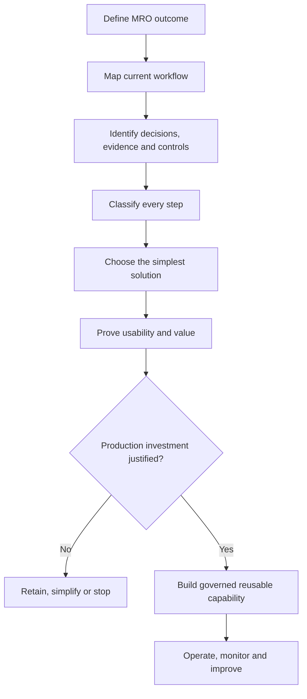
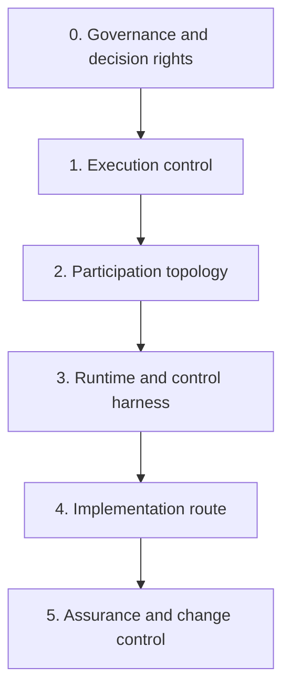
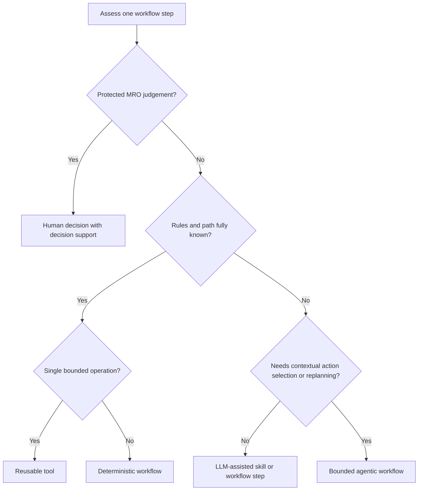
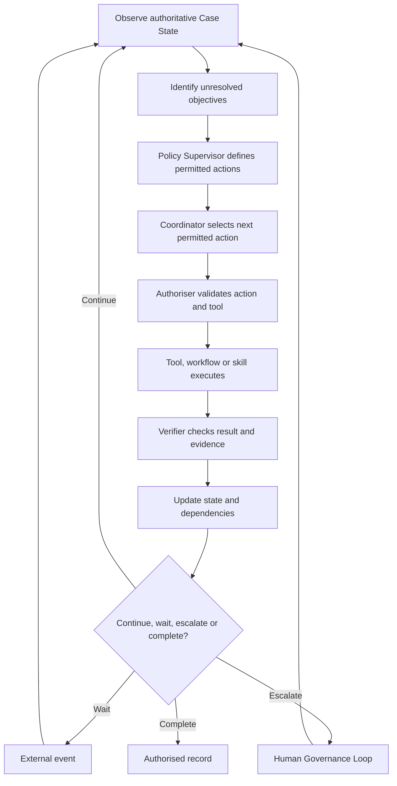
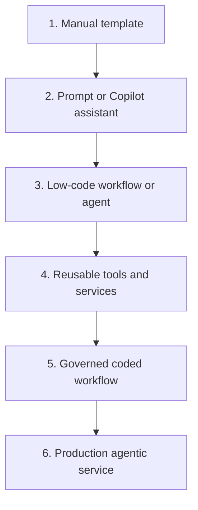
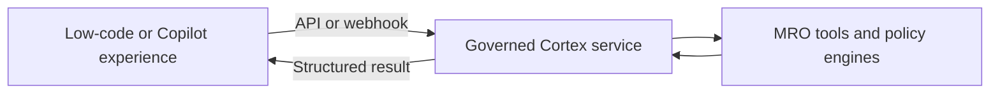
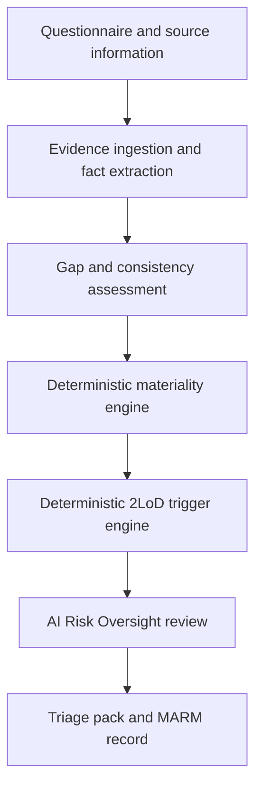

# MRO Tools and Automation Design Guidelines

## A practical guide for planning, designing, prioritising, developing and productionising MRO tools

**Primary audience:** MRO Tech & Tooling leads, Forward Deployed Engineers, product owners, developers, AI Risk Oversight, Independent Validation teams and MRO subject-matter experts.

**Purpose:** Help MRO teams understand an end-to-end activity, decide what should remain human-owned, identify the right form of automation for every step, build reusable capabilities, prove value quickly and move only justified solutions into governed production services.

---

## 1. Executive principle

> **Start with the MRO outcome and workflow, not with an AI technology. Use deterministic automation for known rules and repeatable paths. Introduce bounded agentic behaviour only where the next action cannot be fully predetermined. Keep protected MRO judgement human-owned, and increase engineering investment only after value has been demonstrated.**

The preferred architecture for complex MRO case work is:

> **One policy-supervised Coordinator, supported by deterministic workflows, reusable tools, optional Agent Skills and explicit Human Governance Loops.**

This does not mean every MRO tool should become an agent. A calculator, fixed report, data reconciliation or system integration should normally remain a deterministic tool or workflow.

---

## 2. Design from the MRO activity, not from the technology

Every initiative should begin by describing the MRO activity end to end.



Before proposing a solution, answer:

1. What MRO outcome must be achieved?
2. Who owns the methodology and final decision?
3. What starts and ends the process?
4. What information and evidence are required?
5. What systems are authoritative?
6. What are the normal path, exceptions and rework loops?
7. Which steps require judgement?
8. Which steps are repeatable and rules-based?
9. Where do delays, duplication and errors occur today?
10. What measurable improvement would make a solution valuable?

### Workflow step inventory

Capture each current step using a common template.

| Field | Question |
|---|---|
| Step and owner | Who performs the activity today? |
| Trigger | What starts the step? |
| Inputs | What data, evidence and prior decisions are needed? |
| Activity | What is actually done? |
| Rules | Are the rules explicit, stable and approved? |
| Judgement | What interpretation or accountable judgement is required? |
| Outputs | What record, result or event is produced? |
| Systems | Which systems are read or updated? |
| Exceptions | What can go wrong or require escalation? |
| Volume and effort | How often, how long and how variable is it? |
| Risk and reversibility | What is the impact of error, and can it be undone? |
| Evidence and audit | What must be retained to explain the result? |

---

## 3. The MRO six-layer design model

The general four-layer Agent architecture model is useful, but MRO requires governance before technical selection and assurance after implementation.



| Layer | Design question | Typical choices |
|---|---|---|
| 0. Governance | What is MRO-owned and what must remain human-owned? | Decision rights, policy, protected judgements, system of record |
| 1. Execution control | Who decides the next step? | Deterministic workflow, Agent Loop, hybrid |
| 2. Participation topology | Who participates? | Human, single Coordinator, specialist tools, exceptional multi-agent design |
| 3. Runtime and harness | How is execution controlled? | State, permissions, checkpoints, budgets, verification, audit |
| 4. Implementation route | Where should it run? | Manual aid, Copilot, low-code, reusable service, Cortex/LangGraph |
| 5. Assurance | How is it tested, approved and changed? | Evaluation, validation, release gates, monitoring, rollback |

Technology selection should not begin until Layers 0 to 2 are understood.

---

## 4. Classify every workflow step

Use the following decision logic for each step, not once for the whole initiative.



### Classification guide

| Pattern | Use when | MRO examples |
|---|---|---|
| Human activity | Accountability or judgement must remain with an authorised colleague | Final materiality confirmation, validation conclusion, exception approval |
| Deterministic tool | One bounded operation has explicit input and output | Metric calculation, document parsing, policy retrieval, materiality engine |
| Deterministic workflow | Steps and branches can be written in advance | Evidence ingestion, approvals, notifications, MARM synchronisation |
| LLM-assisted step | The path is known, but one step needs semantic interpretation | Summarising documentation, extracting candidate facts, drafting text |
| Agent Skill | A reusable task method needs instructions, references and one or more tools | Evidence-gap assessment, policy mapping, finding drafting |
| Agentic workflow | The next permitted action depends on changing case state and intermediate results | Evidence investigation, validation coordination, exception-driven case preparation |

### Important distinction

Using an LLM does not make a process agentic. A fixed workflow containing an LLM summarisation step remains a deterministic workflow. It becomes agentic only when a Coordinator repeatedly selects the next permitted action from current state, executes it, verifies the result and replans.

---

## 5. Reusable capability model

Build reusable capabilities only where multiple workflows genuinely need the same bounded behaviour.

| Capability | What it contains | What it must not contain |
|---|---|---|
| Reusable tool | Executable function or service with typed inputs and outputs | Unbounded planning or hidden decision rights |
| Agent Skill | Reusable instructions, methods, references, schemas and approved tool usage | Authority, policy thresholds or unreviewed business rules |
| Deterministic workflow | Enforced sequence, branches, controls and recovery | Prompt-only enforcement of mandatory controls |
| Agent | Goal-directed component selecting the next permitted action | Self-granted permissions or protected MRO decisions |
| MCP adapter | Standard interface exposing approved remote capabilities | A replacement for access control, validation or service ownership |
| Shared data service | Authoritative or governed access to evidence and metadata | Uncontrolled copies of source-system records |

### Reusable tool candidates across MRO

- Unstructured Evidence Service: parsing, OCR, chunking, metadata and provenance.
- Knowledge and Retrieval Service: controlled retrieval from policy and evidence collections.
- Citation and Evidence Verification Service.
- Document Comparison and Consistency Checker.
- Structured Fact Extraction Service.
- Evaluation Execution Service and common metric registry.
- Scenario and Test Data Service.
- Report and Confluence Publishing Adapter.
- MARM Read/Write Adapter.
- Notification, task and event adapter.
- Audit, lineage and observability service.

### When not to create a reusable component

Do not generalise a component when it has only one consumer, unstable requirements or strongly domain-specific decision logic. Prove the use case locally first. Extract a shared capability after the interface has become clear through real use.

---

## 6. The recommended MRO agentic pattern

For complex and variable case work, use one Coordinator rather than many autonomous agents.



### What is agentic

- Identifying which objectives remain unresolved.
- Selecting among several policy-permitted actions.
- Choosing the most relevant approved tool or skill.
- Reacting to new evidence or failed actions.
- Selectively replanning when facts change.
- Waiting for events and resuming from persisted state.

### What remains deterministic or human-owned

- Permissions and prohibited actions.
- Materiality scoring logic and thresholds.
- Second-line trigger logic.
- System-assigned Progressive Automation profile.
- Mandatory gates and completion criteria.
- Result schema and integrity checks.
- Final MRO conclusions, overrides and exceptions.
- Authority to publish a formal record.

The LLM should recommend only within an action set produced by deterministic policy. Its structured proposal must be validated again before any tool executes.

### Common execution patterns

These patterns can appear inside a deterministic workflow or a bounded Agent Loop. The pattern name alone does not determine whether a solution is agentic.

| Pattern | Description | Recommended MRO use |
|---|---|---|
| Prompt chaining | One known step passes its result to the next | Fixed document-processing or drafting pipeline |
| Routing | Select one known path based on classification | Deterministic rules first; bounded LLM router for semantic ambiguity |
| Parallelisation | Run independent tasks at the same time | Independent document checks or evaluation metrics |
| Orchestrator-worker | A Coordinator distributes bounded sub-tasks and aggregates results | Use only where parallel benefit exceeds coordination cost |
| Evaluator-optimizer | Generate, evaluate and revise within a limit | Draft quality improvement, never approval of protected outcomes |
| ReAct-style loop | Model reasons over results and selects another tool | Restricted evidence investigation with step and tool limits |

### Runtime and control-harness responsibilities

The model API is only the reasoning interface. The application Runtime must provide:

- structured context construction and LLM Tool Calling;
- persistent State and Checkpoints;
- pause, resume, cancellation and recovery;
- identity, permission and least-privilege tool access;
- maximum steps, tokens, cost and elapsed time;
- timeout, retry, idempotency and concurrency controls;
- human approval and exception handling;
- result verification and failure-state retention;
- model, prompt, tool, skill and policy versioning;
- complete audit events, tracing, replay and evaluation.

An LLM client, ChatModel or prompt library alone is not an Agent Runtime.

---

## 7. Start simple and increase investment progressively

Use a solution ladder. Start at the lowest level capable of testing the value proposition.



| Level | Purpose | Suitable evidence before progressing |
|---|---|---|
| Manual template | Clarify the process and desired output | SME agreement on workflow and decision rights |
| Prompt/Copilot assistant | Test whether LLM assistance improves a bounded task | Quality examples, user feedback and time saved |
| Low-code workflow/agent | Test end-to-end usability and integration | Repeatable pilot, acceptable errors and clear controls |
| Reusable tools/services | Stabilise capabilities needed by several solutions | Multiple confirmed consumers and typed contracts |
| Governed coded workflow | Control state, permissions, recovery and testing | Approved requirements and sustained business value |
| Production agentic service | Add bounded dynamic coordination | Proven need for state-aware action selection and replanning |

Progression is not mandatory. A useful Copilot assistant or deterministic workflow may be the correct final solution.

---

## 8. Low-code, Cortex coded development or hybrid

### Choose Copilot or low-code when

- The objective is to test demand and user behaviour quickly.
- The workflow is short and easy to describe.
- Most actions are read-only, advisory or reversible.
- Human review remains present throughout.
- The solution does not own authoritative Case State.
- Standard connectors, approvals and notifications provide most of the value.
- Usage volume, concurrency and recovery requirements are modest.
- The approved platform meets data, model and access-control requirements.

Typical uses include prompt assistants, document summaries, draft review notes, simple knowledge assistants, approval flows and proof-of-value demonstrations.

### Choose Cortex and coded development when

- The solution processes sensitive or core MRO case information.
- It must own or reliably update authoritative state.
- Long-running tasks must survive service restarts.
- The path changes dynamically based on intermediate results.
- Detailed tool permissions and policy controls are required.
- Results must be evidence-linked, versioned and reproducible.
- Selective replanning and stale-output management are required.
- There are strict performance, testing, monitoring or release requirements.
- The capability needs controlled integration with MARM or other systems of record.

Typical implementation: React UI, FastAPI, Pydantic contracts, Cortex LLM, LangGraph, SQLAlchemy/PostgreSQL, approved object storage and enterprise authentication.

### Choose a hybrid when

The platform handles standard workflow and communication while a coded service handles specialist MRO reasoning and controls.



Examples:

- Copilot provides the user experience; Cortex service performs controlled evidence analysis.
- A low-code platform manages notifications and approvals; LangGraph manages Case State and replanning.
- MARM owns the governance record; an MRO service performs specialist triage or validation analysis and writes back approved results.

### Platform-specific positioning

All options remain subject to bank approval, target-environment testing and data controls.

| Option | Recommended role | Avoid using it for |
|---|---|---|
| Copilot prompt/assistant | Fast human-in-the-loop productivity aid and demand validation | Authoritative state, protected decisions or hidden policy execution |
| Copilot Agent | Rapid knowledge/action assistant using approved enterprise connectors | Complex long-running coordination unless recovery and audit are proven |
| n8n or similar low-code automation | System connection, events, approvals, notifications and visible fixed workflows | Core MRO methodology or unrestricted agentic decisions |
| Dify/Langflow-style platform | Rapid AI workflow and component prototyping where approved | Assuming prototype controls are production controls |
| Cortex service | Bank-controlled LLM access for governed semantic capabilities | Treating the LLM endpoint as the entire Runtime |
| LangGraph plus application services | Stateful, policy-supervised workflows requiring loops, persistence and HITL | Simple tasks that a function or fixed workflow can solve |

Given a clean Copilot-for-rapid-validation and Cortex-for-coded-development model, an additional low-code platform should be adopted only if it fills a demonstrated integration or workflow gap. It should not be introduced merely because it also offers an Agent feature.

---

## 9. Solution route decision matrix

Score each factor as Low, Medium or High. A high score in the right-hand factors generally points toward coded development.

| Factor | Prompt/Copilot | Low-code workflow | Cortex coded service |
|---|---|---|---|
| Speed to demonstrate | Excellent | Very good | Moderate |
| Fixed and visible path | Suitable | Excellent | Suitable |
| Dynamic replanning | Limited | Platform-dependent | Strong |
| Authoritative state | Weak | Platform-dependent | Strong |
| Fine-grained permissions | Limited | Must be proven | Strong when designed |
| Long-running recovery | Weak | Must be proven | Strong when designed |
| Evidence lineage | Limited | Must be proven | Strong when designed |
| Automated testing | Limited | Platform-dependent | Strong |
| Complex MRO rules | Unsuitable | Use external rule service | Strong |
| Production integration | Limited | Strong for standard connectors | Strong for custom contracts |
| Portability | Low to medium | Low to medium | Higher with open interfaces |
| Engineering cost | Low | Low to medium | High |

Do not select heavy code merely because a use case contains AI. Do not select low-code merely because it has an Agent feature.

---

## 10. Prioritisation model

Prioritise initiatives using four dimensions:

| Dimension | Questions |
|---|---|
| MRO value | Does it reduce risk, improve coverage, improve consistency or release expert capacity? |
| Feasibility | Are the workflow, data, users and integration routes understood? |
| Reuse | Will the capability support multiple MRO activities or platform layers? |
| Control readiness | Can it be implemented without weakening independence, access control or auditability? |

Suggested portfolio categories:

- **Quick wins:** High value, simple workflow, low integration risk. Use prompt, Copilot or low-code first.
- **Foundational enablers:** Evidence, retrieval, evaluation, audit and publishing services used by many solutions.
- **Strategic workflows:** Risk triage, validation coordination and post-go-live oversight. Build incrementally on foundations.
- **Defer:** Unclear owner, unstable process, unavailable data or unproven demand.
- **Do not automate:** Low-value tasks or activities where automation would obscure accountable judgement.

Prioritise bottlenecks in a real workflow, not isolated technology demonstrations.

---

## 11. Delivery and productionisation lifecycle

| Phase | Main activities | Exit evidence |
|---|---|---|
| Discover | Observe users, map workflow, quantify pain points | Agreed problem, owner, baseline and success measures |
| Design | Classify steps, define controls, choose initial route | Workflow map, decision rights and solution hypothesis |
| Demonstrate | Build the smallest usable solution | Realistic demonstration cases and SME feedback |
| Pilot | Use with a limited group under human supervision | Quality, time saving, adoption and failure evidence |
| Engineer | Stabilise contracts, state, tools, tests and integrations | Approved architecture and non-functional requirements |
| Assure | Security, model risk, data, operational and control testing | Signed production-readiness evidence |
| Release | Controlled deployment, training and support | Named owner, monitoring, rollback and support model |
| Operate | Monitor outcomes, incidents, drift and benefits | Periodic control and value review |

### Production gates

A prototype should not move to production until it has:

- an accountable MRO product and methodology owner;
- confirmed system-of-record boundaries;
- approved data classification and access model;
- tested structured input and output contracts;
- deterministic enforcement of permissions and mandatory controls;
- evidence provenance and complete audit events;
- failure, timeout, retry, idempotency and recovery design;
- evaluation datasets covering normal, boundary and adversarial cases;
- human escalation and exception handling;
- versioned prompts, models, rules, tools and skills;
- deployment, rollback, monitoring and support arrangements;
- measurable benefit compared with the baseline process.

---

## 12. Live operation and calibration must be separated

For scoring, trigger or methodology-based tools, separate the live control plane from the calibration environment.

| Live operation | Calibration and back-testing |
|---|---|
| Uses the currently approved rule version | Tests proposed rule changes |
| Processes an individual current case | Uses historical or synthetic cases |
| Cannot change weights or thresholds | Supports sensitivity and distribution analysis |
| Produces an auditable case result | Produces evidence for methodology governance |
| Changes require formal release | Cannot automatically promote rules to live use |

An Agent or LLM must never modify its own live questionnaire, scores, thresholds, policy or automation profile.

---

## 13. Example: AI risk triage



| Step | Recommended design |
|---|---|
| Intake and file processing | Deterministic workflow plus Unstructured Evidence Service |
| Candidate fact extraction | LLM-assisted reusable tool with citations |
| Evidence gaps and conflicts | Agent Skill or bounded Agent Loop |
| Materiality calculation | MRO-owned deterministic engine |
| 2LoD engagement triggers | MRO-owned deterministic engine |
| Next evidence action | Policy-supervised Coordinator |
| Final result and override | AI Risk Oversight Governance Loop |
| Sharing and record update | Controlled Confluence/MARM adapter |
| Calibration and back-testing | Separate authorised analytical workspace |

The tabbed workbench and agent assistant should use the same Case State, policy, tools, permissions and audit trail. They are two user experiences over one governed process.

---

## 14. Example: Independent Validation Workbench

| Activity | Recommended design |
|---|---|
| Project creation and model registration | Deterministic workflow |
| Documentation and evidence processing | Shared evidence and retrieval services |
| Mandatory test selection | Validation methodology rules plus human confirmation |
| Candidate scenario generation | Agent Skill with validator review |
| Evaluation execution | Reusable deterministic evaluation tools |
| Failure analysis | LLM-assisted skill with evidence-linked output |
| Finding drafting | Agent Skill and validator review |
| Validation conclusion | Protected validator judgement |
| Report assembly | Deterministic workflow plus controlled drafting tools |

The validation workflow should stabilise before introducing a broad Coordinator. Begin with reusable evaluation and evidence tools, then automate fixed workflows, and finally add agentic coordination only where dynamic planning has demonstrated value.

---

## 15. Team operating model

| Role | Responsibility |
|---|---|
| MRO process/methodology owner | Defines policy, decision rights, acceptance criteria and protected judgements |
| Tooling/FDE lead | Discovers needs, maps workflows, prioritises opportunities and proves value with users |
| Product/platform lead | Owns roadmap, shared architecture, integration and production service lifecycle |
| Agent and reusable capability team | Builds governed agents, tools, skills and shared service contracts |
| MRO users and SMEs | Test realistic cases, review quality and confirm operational usefulness |
| Technology and control partners | Support hosting, security, data, resilience and production approvals |

Recommended handoff model:

```text
MRO problem and workflow discovery
→ simplest demonstrator
→ evidence of value
→ architecture and control review
→ reusable/coded implementation where justified
→ pilot with accountable MRO users
→ production service ownership
```

The developer who proves a valuable capability should remain involved during productionisation so that user knowledge and design intent are not lost.

---

## 16. Common anti-patterns

- Starting with “we need an Agent” before mapping the workflow.
- Replacing explicit rules with prompts.
- Building a separate Agent for every task or role.
- Wrapping every tool in a Skill without added task knowledge.
- Using MCP when a local function or ordinary API is sufficient.
- Treating a low-code Agent feature as proof of production readiness.
- Allowing LLM output to update authoritative state without verification.
- Storing the same authoritative decision in multiple uncontrolled systems.
- Combining live scoring with rule calibration.
- Automating a broken or unstable process before simplifying it.
- Measuring only output quality while ignoring adoption, effort and operational failures.
- Productionising a demonstration without ownership, monitoring and rollback.

---

## 17. Initiative design canvas

Joe and the team can use this for each proposed MRO tool.

```markdown
### Initiative
- Name:
- MRO owner:
- Target users:
- MRO outcome:
- Current pain point and baseline:
- In scope / out of scope:

### Workflow
- Trigger:
- Main steps:
- Exceptions and rework loops:
- Inputs and evidence:
- Outputs and system of record:
- Protected human decisions:

### Step classification
- Human-owned steps:
- Deterministic workflows:
- Reusable tools:
- Candidate Agent Skills:
- Candidate agentic decisions:

### Initial solution
- Simplest route:
- Copilot / low-code / Cortex / hybrid:
- Demonstration cases:
- Success measures:
- Time-box and stop criteria:

### Production route
- Reusable capabilities required:
- Integration dependencies:
- Data and access controls:
- Evaluation and testing:
- Operational owner:
- Production gates:
```

---

## 18. Final design checklist

Before approving a design, confirm:

- The end-to-end MRO workflow has been observed and documented.
- Every step has been classified separately.
- Human decision rights and system-of-record responsibilities are explicit.
- The simplest viable solution has been considered first.
- Reusable tools have clear consumers and typed contracts.
- Skills contain methods and knowledge, not hidden authority.
- Agentic behaviour is limited to genuinely dynamic action selection.
- Policy restricts the Agent before and after LLM recommendation.
- State, evidence, permissions, verification and audit are first-class components.
- Low-code and coded routes have been compared using risk and lifecycle needs.
- The prototype has measurable value and realistic failure evidence.
- Productionisation includes assurance, release, monitoring, support and rollback.

---

## 19. Recommended team positioning

> **MRO Tech & Tooling should operate as an enablement and engineering capability that begins with real MRO workflows, proves value using the simplest appropriate method, and progressively builds governed reusable services and agentic capabilities only where justified. Deterministic controls protect methodology and decisions; reusable tools perform bounded work; Agent Skills package repeatable task knowledge; and policy-supervised Coordinators manage genuinely variable case work.**

This approach supports rapid experimentation without creating a collection of disconnected demonstrations, while ensuring that successful ideas can mature into consistent, reusable and production-ready MRO capabilities.

---

## Reference basis

This guideline adapts the general architecture concepts in [*Agent System Design 04: Agent Architecture Design*](https://my.feishu.cn/wiki/K3dAwR5qTiDNYikpQl9c2o01n5y), including execution control, participation topology, Runtime/Harness boundaries and implementation-route selection. It extends those concepts with MRO governance, decision rights, evidence controls, Progressive Automation, assurance and production lifecycle requirements.
