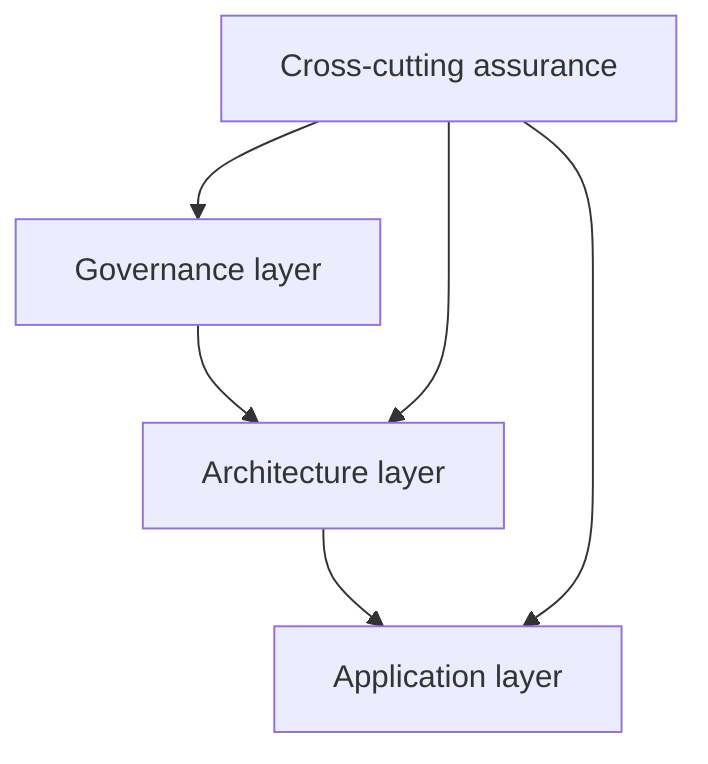
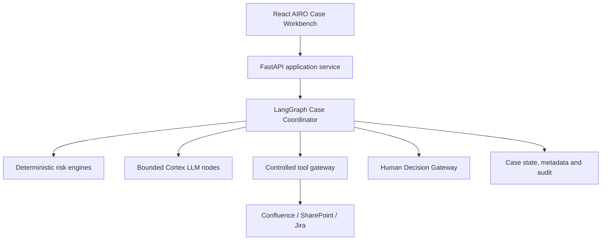
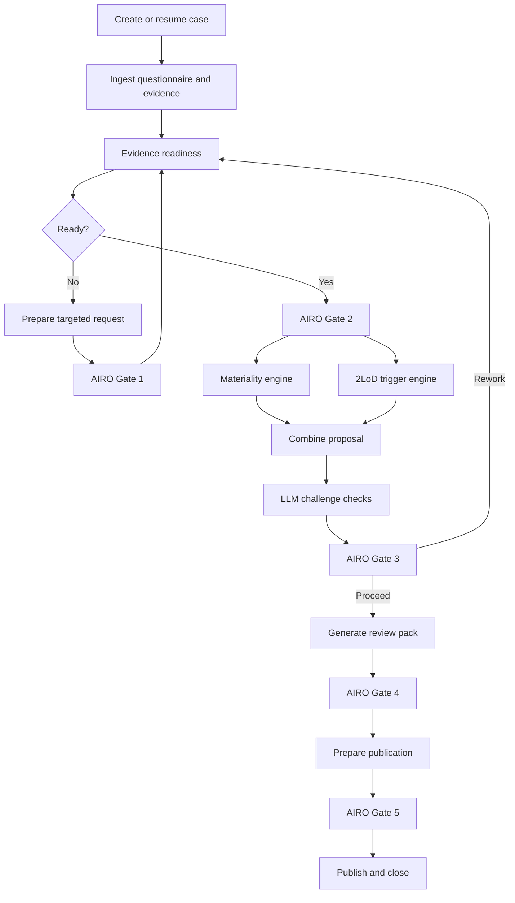
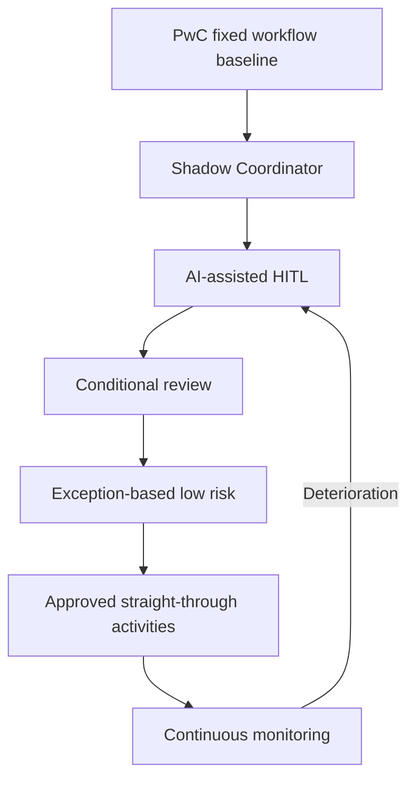

# AIRO Human-Governed Agentic Case Coordinator

## Reference Design for Team Development

**Status:** Retained historical/target reference for discussion; not the current implementation specification  
**Primary user:** AI Risk Oversight Team (AIRO)  
**Governance framework:** MRO Risk-Based Progressive Automation and Oversight Framework  
**Proposed orchestration approach:** One stateful, human-governed Case Coordinator implemented using LangGraph StateGraph  
**Important:** This document describes a target design. PwC scoring, risk-tier mapping, 2LoD triggers and decision authorities remain subject to formal agreement and calibration.

> **Delivery boundary:** use [README.md](README.md),
> [docs/ARCHITECTURE.md](docs/ARCHITECTURE.md) and
> [docs/AGENT_DESIGN.md](docs/AGENT_DESIGN.md) as the authoritative description of the
> repository. This reference contains future concepts—including React/TypeScript, Cortex,
> enterprise identity/storage/monitoring, production rule services and external
> Confluence/SharePoint/Jira-style integrations—that are **not implemented**. The delivered
> UI is packaged HTML/CSS/JavaScript; persistence is local SQLite; publication is a local
> `local-demo://` record; mock, Ollama and OpenAI-style adapters are the implemented LLM
> modes. All current rule values and autonomy patterns remain illustrative demo policy.

---

## 1. Executive Summary

The source design assumed a fixed-workflow PwC MVP in which AIRO users moved through
predefined steps. The repository has since implemented the bounded Case Coordinator
described by the current documentation; this paragraph remains historical problem context.

The proposed next version is an **AIRO Human-Governed Agentic Case Coordinator**. It does not replace AIRO judgement. It coordinates each risk-triage case by maintaining state, planning permitted tasks, invoking approved tools and deterministic engines, managing evidence loops and exceptions, and pausing at mandatory AIRO decision gates.

The solution combines four types of activity:

| Type | Meaning | AIRO example |
|---|---|---|
| D — Deterministic | Repeatable approved logic | Materiality scoring and 2LoD triggers |
| L — LLM-assisted | Bounded language or document processing | Evidence extraction and source comparison |
| A — Agentic coordination | State-based planning, routing, tool use and loops | Evidence readiness and case progression |
| H — Human judgement | Reserved professional decision | Final materiality, exceptions and override |

The target is therefore not an autonomous risk-decision agent. It is a controlled case-orchestration application in which:

- the **Coordinator manages the work**;
- deterministic engines **calculate proposed outcomes**;
- bounded LLM capabilities **process and challenge evidence**;
- AIRO **owns judgement and the final decision**.

---

## 2. Business Problem

### 2.1 Current workflow

1. The use-case owner submits a tiering template and supporting information through documents, email, Confluence or other channels.
2. AIRO reads the information and identifies relevant facts and evidence.
3. AIRO assesses materiality and determines relevant specialist 2LoD engagement from scratch.
4. AIRO identifies information gaps and obtains further evidence.
5. AIRO prepares an information pack for wider risk discussion.
6. AIRO records the final decision and rationale.

### 2.2 Current problems

- Information is distributed across multiple sources.
- AIRO spends significant time reading, structuring and reconciling information.
- Evidence gaps and conflicts are identified manually.
- Users must remember which workflow step to revisit.
- New evidence may require several steps to be repeated.
- Similar cases do not consistently reuse previous patterns.
- Case status, waiting time and outstanding decisions are difficult to manage at scale.
- Review packs are prepared manually and may differ between reviewers.
- Audit evidence is distributed across systems and communications.

### 2.3 Target business outcome

The Coordinator should enable AIRO to focus on:

- exceptions;
- unsupported or conflicting evidence;
- boundary cases;
- policy interpretation;
- specialist engagement;
- override and final judgement.

It should reduce time spent on:

- navigating workflow tabs;
- repeatedly reading the same documents;
- checking mandatory fields;
- manually tracing evidence;
- rerunning unaffected calculations;
- assembling standard sections of the review pack.

---

## 3. Scope and Users

### 3.1 Direct user

The direct user of the risk-triage application is **AIRO**.

### 3.2 Other participants

| Participant | Interaction with the solution |
|---|---|
| Use-case owner | Provides questionnaire responses, rationale and evidence through agreed channels |
| AIRO | Operates the tool, reviews results and owns the final triage decision |
| Specialist 2LoD teams | Review the AIRO pack and provide specialist input through existing channels |
| MRO Policy | Approves materiality, risk-tier and governance methodology |
| AI IVT | Provides input where validation requirements or ratings are relevant |
| AI Tech & Tooling | Builds and operates the solution; does not own risk judgements or policy rules |

### 3.3 In scope

- Case creation and lifecycle management.
- Questionnaire and supporting-evidence ingestion.
- Information extraction and evidence referencing.
- Completeness, consistency and exception checks.
- Deterministic materiality calculation.
- Deterministic 2LoD trigger calculation.
- Bounded LLM challenge checks.
- Targeted evidence-request preparation.
- AIRO confirm, edit, return and override controls.
- Review-pack generation.
- Confluence or equivalent draft publication.
- Full state, decision and version audit trail.
- Historical backtesting, calibration and performance monitoring.

### 3.4 Out of scope for the initial version

- Autonomous final materiality decisions.
- Autonomous final risk-tier decisions.
- Autonomous policy interpretation.
- Autonomous approval on behalf of specialist 2LoD teams.
- Unrestricted LLM selection of tools or workflow paths.
- Automatic rule, threshold or prompt changes.
- Direct use of the application by all 2LoD teams.
- Fully autonomous publication of formal decisions.
- Multi-agent negotiation or autonomous specialist agents.

---

## 4. Three-Layer Design



| Layer | Core question | Main design outputs |
|---|---|---|
| Governance | What may the system do, and who remains accountable? | Accountability, autonomy policy, gates, escalation, prohibited actions |
| Architecture | How are the controls implemented? | StateGraph, state, engines, LLM nodes, tools, persistence, security and audit |
| Application | How does AIRO perform the work? | User journey, workbench, decisions, evidence views and outputs |
| Assurance | How do we know it works and remains safe? | Testing, backtesting, sensitivity, calibration, monitoring and rollback |

The layers must be traceable. For example:

```text
Governance requirement:
Final materiality must be owned by AIRO
        ↓
Architecture control:
Mandatory final-decision interrupt
        ↓
Application control:
Confirm / amend / override panel with rationale
        ↓
Audit evidence:
Reviewer, decision, time, evidence and versions
```

---

## 5. Governance Layer

### 5.1 Accountability model

| Decision or activity | Accountable party |
|---|---|
| Accuracy of submitted business information | Use-case owner |
| Triage-process ownership | AIRO |
| Final materiality and route | AIRO, subject to approved policy |
| Specialist risk opinion | Relevant specialist 2LoD team |
| Materiality methodology | MRO-approved governance owner |
| Independent-validation methodology and opinion | AI IVT / relevant authority |
| Technical implementation | AI Tech & Tooling |
| Rule implementation accuracy | AI Tech & Tooling, verified against approved configuration |
| Rule-content approval | AIRO / MRO Policy / relevant governance authority |

### 5.2 Human Gate Register

| Gate | Purpose | AIRO actions |
|---|---|---|
| Gate 1 — Evidence request | Approve targeted questions or evidence requests | Approve, edit, cancel, add question |
| Gate 2 — Material inputs | Confirm facts used by the decision engines | Confirm, edit, reject extraction, return for evidence |
| Gate 3 — Exceptions | Resolve conflicts, dealbreakers and boundary cases | Resolve, escalate, amend input, request evidence |
| Gate 4 — Final triage | Confirm materiality, validation route and 2LoD engagement | Confirm, amend, override, record rationale |
| Gate 5 — Publication | Approve formal output or external action | Publish, edit, cancel |

### 5.3 Prohibited autonomous actions

The Coordinator and LLM must not autonomously:

- modify question-to-score mappings;
- change weights, thresholds, dealbreakers or minimum-route rules;
- add or remove approved 2LoD trigger rules;
- change policy interpretation;
- suppress conflicting evidence;
- bypass a mandatory Human Gate;
- issue a final high-risk conclusion;
- perform an override;
- publish a formal conclusion without the required approval;
- expand its own tool permissions;
- use historical similarity as a substitute for current-case evidence.

### 5.4 Autonomy modes

Each activity is assigned one of the following modes:

| Mode | Meaning |
|---|---|
| PROHIBITED | The system may not perform the action |
| MANUAL | A user performs the activity |
| ASSISTED | The system proposes; the user performs |
| MANDATORY_REVIEW | The system performs; a human must confirm |
| CONDITIONAL_REVIEW | A human is required when configured conditions are met |
| EXCEPTION_REVIEW | The system continues unless an exception is detected |
| SAMPLE_REVIEW | The system completes the activity and selected cases are reviewed |
| STRAIGHT_THROUGH | The system completes the activity within an approved boundary |

The LLM does not choose the autonomy mode. A deterministic, version-controlled Autonomy Policy Engine makes that decision.

---

## 6. Target Architecture



### 6.1 Recommended technical components

| Component | POC / interim | Target direction |
|---|---|---|
| Frontend | React + TypeScript | React + TypeScript |
| Backend | FastAPI | FastAPI |
| Orchestrator | LangGraph StateGraph | LangGraph StateGraph or approved equivalent |
| Data contracts | Pydantic | Pydantic |
| Metadata database | SQLite + SQLAlchemy + Alembic | PostgreSQL |
| Graph checkpointing | SQLite checkpointer | PostgreSQL checkpointer |
| LLM access | Cortex adapter | Governed Cortex adapter |
| Document parsing | Approved offline-capable parser | Governed document-ingestion service |
| Evidence store | Local/approved POC store | Approved object and metadata stores |
| Rule services | Python services | Versioned deployable services |
| External integrations | Mock or draft-only adapters | Controlled enterprise adapters |
| Observability | Structured logs and test traces | Central monitoring, audit and alerting |

LangGraph is used as the orchestration runtime, not as the risk-decision methodology. Its interrupt and persistence capabilities allow a case to pause for human input and resume against the same thread.

### 6.2 One Coordinator, not a multi-agent system

The initial solution should use one logical **AIRO Case Coordinator**. Evidence processing, materiality, 2LoD routing and pack generation are nodes, services or subgraphs—not independent autonomous agents.

This provides:

- clearer ownership;
- simpler permissions;
- predictable execution paths;
- easier testing;
- less conflict between generated conclusions;
- stronger auditability.

---

## 7. StateGraph Design

### 7.1 Main graph



### 7.2 Agentic behaviour

The solution is agentic where the Coordinator:

- interprets the current case objective and state;
- constructs a bounded plan of permitted tasks;
- selects from an allowlist of approved tools;
- observes tool results;
- identifies incomplete work;
- loops back for further evidence;
- decides which affected nodes need to be rerun;
- pauses for human input;
- resumes a long-running case.

It is not agentic merely because an LLM is used to summarise a document.

### 7.3 Node catalogue

| Node | Type | Purpose |
|---|---|---|
| create_case | D | Create identifiers and initial state |
| ingest_questionnaire | D | Validate structure, fields and version |
| parse_documents | D/L | Parse documents and create sections |
| extract_evidence | L | Extract facts with source references |
| compare_sources | L | Identify potential contradictions |
| verify_evidence | D/L | Verify that references support extracted claims |
| check_completeness | D | Apply approved evidence requirements |
| plan_evidence_tasks | A | Plan permitted next tasks |
| draft_follow_up | L | Produce targeted questions |
| confirm_material_inputs | H | Confirm facts entering engines |
| calculate_materiality | D | Apply approved materiality logic |
| calculate_2lod | D | Apply approved specialist triggers |
| challenge_assessment | L | Identify exceptions and unsupported low-risk answers |
| resolve_exceptions | H | Resolve judgement points |
| generate_review_pack | D/L | Assemble structured output and narrative |
| confirm_final_outcome | H | Confirm or override final triage |
| prepare_publication | D/L | Create publication preview or draft |
| approve_publication | H | Authorise formal write action |
| close_case | D | Lock result and complete audit record |

---

## 8. Case State and Data Model

### 8.1 Core state groups

| State group | Example contents |
|---|---|
| Identity | case ID, thread ID, owner, reviewer, status, priority |
| Inputs | questionnaire, questionnaire version, supporting documents |
| Evidence | extracted facts, citations, source versions, verification status |
| Quality | missing information, conflicts, confidence, exceptions |
| Plan | planned tasks, completed tasks, pending tasks, next action |
| Materiality | scores, weights, total, threshold, dealbreakers, minimum route |
| 2LoD | triggered teams, trigger rules, rationale and evidence |
| Validation | proposed requirement, rating or risk-tier fields where applicable |
| Decisions | human decisions, amendments, overrides and rationale |
| Outputs | review pack, Confluence draft, publication status |
| Versions | rule, questionnaire, prompt, model, tool and workflow versions |

### 8.2 Suggested statuses

```text
DRAFT
INGESTING
EVIDENCE_REVIEW
AWAITING_INFORMATION
AWAITING_INPUT_CONFIRMATION
CALCULATING_TRIAGE
AWAITING_EXCEPTION_DECISION
AWAITING_2LOD_INPUT
AWAITING_FINAL_DECISION
READY_TO_PUBLISH
CLOSED
SUSPENDED
CANCELLED
```

### 8.3 Critical data-design principles

- State belongs in the backend, not only in UI tabs.
- Every case uses a persistent case/thread identifier.
- Every decision references the evidence and configuration used.
- Old cases remain pinned to the versions under which they were assessed.
- New evidence does not overwrite history; it creates a new version or event.
- LLM outputs are stored as proposals, not authoritative facts.
- Confirmed facts are explicitly distinguishable from extracted facts.

---

## 9. Decision Engines

### 9.1 Materiality engine

```text
Questionnaire answer
→ approved score mapping
→ approved weight
→ weighted total
→ score threshold
→ dealbreaker checks
→ minimum-route checks
→ proposed materiality band
→ proposed validation requirement
```

The final band is not merely the sum of questionnaire scores because dealbreakers and minimum-route rules may alter the outcome.

### 9.2 2LoD trigger engine

```text
Questionnaire answer or confirmed evidence
→ approved trigger condition
→ proposed specialist team
→ trigger rationale
→ supporting evidence
→ AIRO confirm, add or remove
```

Materiality and 2LoD engagement are independent logic paths. A low materiality score does not automatically mean that no specialist team is required.

### 9.3 Risk-tier approach to remain configurable

PwC has proposed that:

- where independent validation is required, a validation risk rating may be combined with materiality in line with MRO policy to determine final risk tier;
- where independent validation is not required, materiality may map to an equivalent risk tier.

This remains subject to agreement. The implementation should therefore:

- use a configurable mapping service;
- display proposed rather than final results until approved;
- retain an AIRO/appropriate-authority decision gate;
- record the applicable policy and mapping version;
- avoid hard-coding an unapproved methodology.

---

## 10. Bounded LLM Design

### 10.1 Permitted capabilities

- Extract facts from approved sources.
- Summarise the use case.
- Map extracted content to questionnaire fields as a proposal.
- Compare questionnaire answers and documents.
- Identify potential conflicts or unsupported statements.
- Draft follow-up questions.
- Draft review-pack narrative.
- Challenge whether all material evidence has been considered.

### 10.2 Required controls

- Structured Pydantic outputs.
- Source citation for material extracted claims.
- Prompt and model versioning.
- Approved Cortex model only.
- Data-classification controls.
- Explicit distinction between source text and instructions within documents.
- Prompt-injection testing.
- No unrestricted web, shell, email or database tools.
- Failure and low-confidence results routed to human review.
- LLM outputs cannot directly mutate risk rules or final decisions.

### 10.3 LLM performance metrics

- Field extraction accuracy.
- Citation correctness.
- Evidence conflict recall and precision.
- Missing-evidence identification.
- Structured-output validity.
- AIRO correction rate.
- Hallucination and unsupported-claim rate.
- Performance by document type and business domain.

---

## 11. Tool Gateway

The Coordinator should not directly access enterprise systems. All tools should pass through a controlled gateway.

```text
Coordinator request
→ identity and permission check
→ tool allowlist check
→ input schema validation
→ approval requirement check
→ execution
→ output validation
→ audit event
```

### 11.1 Initial tool categories

| Tool | Access | Initial control |
|---|---|---|
| Questionnaire parser | Read | Automatic |
| Document parser | Read | Automatic |
| Evidence search | Read | Automatic within approved sources |
| Citation verifier | Read | Automatic |
| Materiality engine | Calculation | Automatic; result subject to review |
| 2LoD engine | Calculation | Automatic; result subject to review |
| Policy retriever | Read | Automatic within approved corpus |
| Historical-case retriever | Read | Restricted and purpose-controlled |
| Confluence draft creator | Draft write | Approval or draft-only permission |
| Confluence publisher | Formal write | Mandatory approval |
| Email draft generator | Draft | Automatic |
| Email sender | External action | Mandatory approval initially |
| Audit logger | Append-only write | Automatic and non-disableable |

### 11.2 Tool contract

Every tool must define:

- name and purpose;
- owner;
- permitted nodes;
- input/output schema;
- data classification;
- read/write scope;
- approval requirement;
- timeout and retry;
- idempotency key;
- version;
- test and approval status.

---

## 12. User Journey

### 12.1 End-to-end journey

1. **Create or import case** — AIRO imports the questionnaire and identifies the use-case owner.
2. **Coordinator plans intake** — validates input and creates an initial permitted task plan.
3. **Ingest evidence** — parses submitted sources and extracts cited facts.
4. **Assess readiness** — identifies missing information and source conflicts.
5. **Obtain evidence** — drafts targeted questions; AIRO approves; the case waits and later resumes.
6. **Confirm material inputs** — AIRO confirms the facts that may enter deterministic engines.
7. **Run parallel engines** — materiality and 2LoD trigger logic run independently.
8. **Challenge results** — bounded LLM checks for unsupported low-risk answers and inconsistencies.
9. **Resolve exceptions** — AIRO resolves, returns or escalates judgement points.
10. **Generate review pack** — the Coordinator creates a transparent assessment pack.
11. **Engage specialist 2LoD** — AIRO uses normal channels and records relevant responses.
12. **Confirm final triage** — AIRO confirms or overrides the proposed outcome.
13. **Publish and close** — the Coordinator prepares the draft; AIRO approves publication; the case is locked and audited.

### 12.2 Missing-evidence behaviour

The user should not need to determine manually which tab to revisit. The Coordinator should:

1. identify the missing or conflicting fact;
2. identify which decisions depend on it;
3. prepare a targeted request;
4. pause for approval;
5. wait without losing state;
6. ingest the response;
7. rerun only affected nodes;
8. present the changed outcome and reason to AIRO.

---

## 13. UI Design

### 13.1 Main navigation

- My Cases
- Work Queue
- New Case
- Analytics
- Configuration
- Administration

### 13.2 Case Workbench

The main page should be action-oriented. It should show:

- case identity and owner;
- current state;
- evidence-readiness status;
- proposed materiality;
- proposed 2LoD teams;
- outstanding exceptions;
- what the Coordinator has completed;
- why the case is paused;
- the recommended next action;
- the specific AIRO decision required.

### 13.3 Detail tabs

| Tab | Purpose |
|---|---|
| Overview | Status, progress, exceptions and next action |
| Inputs & Evidence | Questionnaire, documents, citations, missing information and conflicts |
| Assessment | Scores, weights, thresholds, dealbreakers and materiality |
| 2LoD Engagement | Triggering answers, teams, rationale, evidence and responses |
| Decisions | Human Gates, amendments, overrides and rationale |
| Review Pack | Structured output and publication preview |
| History | Case events, state changes and all versions |

The main page drives action; tabs provide detail and editing. The workflow order remains visible, but the user does not manually orchestrate every transition.

### 13.4 Decision panel

At a Human Gate, the UI should support:

- Confirm;
- Edit;
- Reject;
- Request evidence;
- Return to an earlier activity;
- Escalate;
- Override;
- Add rationale.

The UI should show the consequence before submission—for example, which engines will rerun or whether a formal publication will occur.

---

## 14. Review Pack

The generated pack should include:

### A. Use-case overview

- use-case name and purpose;
- owner and users;
- AI system type;
- data and autonomy;
- third-party dependencies;
- business impact.

### B. Proposed materiality

- score and band;
- validation requirement;
- key score drivers;
- dealbreakers;
- minimum-route rules;
- evidence references.

### C. Exceptions and evidence quality

- missing evidence;
- unsupported answers;
- conflicting information;
- low-confidence extraction;
- follow-up questions;
- AIRO resolution.

### D. 2LoD engagement

- proposed team;
- triggering answer or evidence;
- rule and rationale;
- AIRO decision;
- specialist response where received.

### E. Final decision

- confirmed materiality;
- confirmed validation route;
- risk tier where applicable;
- conditions and actions;
- override and rationale;
- reviewer and date;
- questionnaire, rule, model, prompt and tool versions.

---

## 15. Progressive Automation

### 15.1 Delivery and autonomy stages



### 15.2 Initial and potential target modes

| Activity | Initial mode | Potential mature mode |
|---|---|---|
| File parsing | STRAIGHT_THROUGH | STRAIGHT_THROUGH |
| Evidence extraction | MANDATORY_REVIEW | EXCEPTION_REVIEW |
| Completeness check | MANDATORY_REVIEW | EXCEPTION_REVIEW |
| Follow-up question | MANDATORY_REVIEW | CONDITIONAL_REVIEW |
| Materiality calculation | Automatic calculation + mandatory review | Exception review for approved low-risk patterns |
| 2LoD calculation | Automatic calculation + mandatory review | Exception review for approved low-risk patterns |
| High-risk final decision | MANDATORY_REVIEW | MANDATORY_REVIEW |
| Override | MANUAL | MANUAL |
| Publication draft | MANDATORY_REVIEW | CONDITIONAL_REVIEW |
| Formal publication | MANDATORY_REVIEW | Policy-dependent |

### 15.3 Promotion criteria

Autonomy may increase only where:

- process and inputs are stable;
- rules are approved and versioned;
- sufficient historical cases exist;
- false-low performance is within approved risk appetite;
- override and correction rates are stable;
- mandatory exclusions are implemented;
- sampling and monitoring are active;
- a kill switch and rollback route exist;
- AIRO and the relevant governance owner approve the change.

---

## 16. Calibration, Backtesting and Sensitivity

### 16.1 Historical dataset

The dataset should include:

- original questionnaire and evidence;
- original AIRO materiality;
- original 2LoD engagement;
- validation route and risk tier where available;
- AIRO amendments and override rationale;
- subsequent reclassification or challenge;
- different AI types, business domains and risk bands;
- boundary cases and known difficult cases.

### 16.2 Decision metrics

| Area | Metrics |
|---|---|
| Materiality | Exact agreement, adjacent-band agreement, false-low, false-high, dealbreaker recall |
| 2LoD | Trigger recall, trigger precision, missed-team rate, unnecessary escalation |
| Evidence | Extraction accuracy, citation accuracy, gap detection, conflict detection |
| Human interaction | Correction rate, override rate, return rate, unresolved-exception rate |
| Operations | Cycle time, waiting time, loops, reopened cases and tool failures |

### 16.3 Sensitivity tests

- Change one answer at a time and inspect band movement.
- Test weights and thresholds around boundary cases.
- Remove or weaken evidence and test whether the case is prevented from appearing lower risk.
- Test dealbreakers and minimum-route rules independently.
- Test business-domain and AI-type differences.
- Test prompt and model changes against a fixed evaluation dataset.
- Test new rule versions against historical cases before release.

The safety priority is to avoid under-classification of material risks while controlling unnecessary escalation of genuinely low-risk cases.

---

## 17. Security and Operational Controls

### 17.1 Identity and access

- Enterprise SSO.
- Role-based access.
- Case-level permissions where required.
- Separation of review and publication permissions.
- Minimum-privilege service accounts.

### 17.2 Data controls

- Data classification and approved storage.
- Encryption in transit and at rest.
- Retention and deletion policy.
- Data minimisation for LLM requests.
- Restricted historical-case access.
- Clear separation of confirmed facts and model-generated proposals.

### 17.3 Reliability controls

- Durable checkpointing.
- Idempotent external actions.
- Timeouts and bounded retries.
- Manual fallback route.
- Suspend/resume.
- Kill switch.
- Workflow, rule and model rollback.
- Incident recording.

### 17.4 Audit event minimum

Every material event should capture:

- case and event ID;
- actor—human, service or LLM node;
- action;
- before and after state reference;
- evidence used;
- model, prompt, rule and tool versions;
- decision and rationale;
- date and time;
- external action result.

---

## 18. Monitoring Dashboard

### 18.1 Operational

- open cases by status;
- cases awaiting evidence or AIRO;
- average and percentile handling time;
- SLA breaches;
- loop and reopen rates;
- tool failures.

### 18.2 Quality and risk

- materiality disagreement;
- false-low and false-high;
- missed 2LoD triggers;
- evidence correction rate;
- citation failures;
- override rate;
- downstream reclassification and challenge.

### 18.3 Automation

- cases by autonomy mode;
- auto-processed activities;
- exception rate;
- sampling results;
- rollback or kill-switch events;
- performance by workflow, rule, prompt and model version.

---

## 19. Delivery Plan

### Phase 0 — Stabilise and instrument PwC MVP

**Objective:** Validate business rules and collect reliable workflow evidence.

Deliverables:

- agreed questionnaire schema;
- versioned rule interfaces;
- structured case data;
- audit events for AIRO changes and returns;
- baseline handling-time and override data;
- separation of UI, workflow state and rule services.

Definition of done:

- the same case can be reproduced from stored input and versions;
- materiality and 2LoD engines have testable interfaces;
- AIRO changes and reasons are captured;
- known policy and methodology gaps are explicitly marked as TBD.

### Phase 1 — Shadow Agentic Coordinator

**Objective:** Test the Coordinator without affecting formal decisions.

Deliverables:

- initial StateGraph;
- persistent Case State;
- evidence-readiness loop;
- LLM extraction and challenge nodes;
- deterministic-engine calls;
- comparison dashboard against AIRO decisions.

Definition of done:

- historical and selected live cases can run in shadow mode;
- differences are measurable and explainable;
- no external formal actions occur;
- all node outputs and versions are auditable.

### Phase 2 — Human-Governed MVP

**Objective:** Operationalise the Coordinator with mandatory AIRO Gates.

Deliverables:

- AIRO Case Workbench;
- evidence request and material-input Gates;
- exception and final-decision Gates;
- review-pack generation;
- Confluence draft preview;
- operational monitoring and manual fallback.

Definition of done:

- AIRO can complete an end-to-end case;
- missing evidence produces a targeted loop rather than manual navigation;
- no formal conclusion is produced without the required Gate;
- affected nodes rerun correctly after evidence changes;
- the audit trail reconstructs the complete case.

### Phase 3 — Conditional and exception-based processing

**Objective:** Reduce intervention for approved low-risk patterns.

Deliverables:

- versioned Autonomy Policy Engine;
- eligibility and exclusion rules;
- sampling;
- kill switch and rollback;
- autonomy-performance dashboard.

Definition of done:

- only eligible low-risk cases enter exception-based processing;
- mandatory escalation conditions are tested;
- sampling results remain within approved thresholds;
- AIRO can immediately lower autonomy.

### Phase 4 — Limited straight-through processing

**Objective:** Automate only mature, low-risk and reversible activities.

This phase is optional. It is not the default endpoint for final MRO judgement.

---

## 20. Initial Product Backlog

### Epic 1 — Case and state foundation

- Define case and thread identifiers.
- Implement case lifecycle and statuses.
- Implement persistent checkpoints.
- Implement event and audit schema.
- Implement role and permission model.

### Epic 2 — Intake and evidence

- Questionnaire schema and versioning.
- Document upload/reference service.
- Document parsing.
- Evidence extraction with citations.
- Completeness and conflict checks.
- Confirmed-versus-proposed fact model.

### Epic 3 — Decision engines

- Materiality service interface.
- Score, weight and threshold configuration.
- Dealbreaker and minimum-route tests.
- 2LoD trigger service.
- Rule versioning and effective dates.
- Explainable output with evidence references.

### Epic 4 — Coordinator graph

- Main StateGraph.
- Evidence-readiness subgraph.
- Bounded task planner.
- Conditional routing.
- Affected-node rerun logic.
- Retry, timeout and suspend/resume.

### Epic 5 — Human decision controls

- Interrupt and resume APIs.
- Gate schemas.
- Confirm/edit/reject/return/escalate/override.
- Decision rationale.
- Authorisation checks.

### Epic 6 — AIRO Workbench

- Case list and work queue.
- Main case overview.
- Progress and next action.
- Evidence and assessment tabs.
- Decision panel.
- Review pack and history.

### Epic 7 — Outputs and integrations

- Review-pack generator.
- Confluence draft adapter.
- Publication approval.
- Notification draft.
- External-action audit.

### Epic 8 — Assurance

- Historical-case dataset.
- Rules unit tests.
- LLM evaluation suite.
- End-to-end workflow tests.
- Security and prompt-injection tests.
- Backtesting and sensitivity dashboard.

### Epic 9 — Progressive autonomy

- Autonomy Policy Engine.
- Eligibility and exclusion configuration.
- Sampling service.
- Performance thresholds.
- Rollback and kill switch.

---

## 21. Team Responsibilities During Development

| Team/role | Development responsibility |
|---|---|
| AIRO subject-matter experts | Define workflow, evidence requirements, exceptions, decisions and acceptance criteria |
| MRO Policy / relevant governance | Approve methodology, mappings, thresholds and authorities |
| AI Tech & Tooling product lead | Translate operating model into product requirements and architecture |
| Backend engineers | StateGraph, APIs, persistence, rules and tool gateway |
| Frontend engineers | Case Workbench and Human Gate UX |
| Data/ML engineers | Ingestion, evidence pipeline, LLM adapter and evaluation datasets |
| QA / validators | Rules testing, workflow testing, backtesting and control testing |
| Security and platform | Identity, secrets, network, data controls and operational support |

The technical team must not invent risk rules. SMEs must not specify only UI screens without defining states, decision rights and evidence requirements.

---

## 22. Key Design Decisions to Agree

Before operational release, the team needs explicit decisions on:

1. Final questionnaire and version owner.
2. Answer-to-score mappings and weights.
3. Score thresholds and band definitions.
4. Dealbreakers and minimum-route rules.
5. 2LoD trigger rules and team taxonomy.
6. Required evidence by question or risk factor.
7. Materiality-to-validation mapping.
8. Risk-tier methodology where validation is or is not required.
9. AIRO, IVT and policy decision authorities.
10. Fast-path eligibility and exclusions.
11. Mandatory Human Gates for the initial release.
12. Confluence publication and record ownership.
13. Data classification, retention and historical-case access.
14. LLM model, prompt and evaluation approval.
15. Acceptance thresholds for backtesting and LLM performance.
16. Sampling, autonomy promotion and rollback authorities.

Unresolved decisions should be visible in a Design Decision Register rather than silently embedded in code.

---

## 23. Example Case

An internal RAG assistant is submitted. The questionnaire states that no personal data is used. The architecture document states that employee name, email and department are used for access filtering.

The Coordinator:

1. extracts both statements with citations;
2. identifies the inconsistency;
3. determines that data-related answers and triggers are affected;
4. pauses materiality and 2LoD finalisation;
5. drafts a targeted clarification request;
6. asks AIRO to approve the request;
7. waits while preserving the case state;
8. ingests the response when received;
9. reruns only the affected completeness, materiality and data-trigger nodes;
10. presents the changed result and reason;
11. records AIRO's decision;
12. generates the review pack and publication draft.

The Coordinator demonstrates agentic value because it manages state, planning, tools, a waiting period, conditional rerouting and selective rerun. It does not decide whether the data use is acceptable or what final materiality AIRO must select.

---

## 24. Development Principles

1. **Governance before autonomy:** Agree decision rights before automating decisions.
2. **Rules before prompts:** Encode approved repeatable logic in deterministic services.
3. **Evidence before conclusions:** Every material proposal should link to evidence or an explicit rule.
4. **State before chat:** The formal case record is structured state, not conversation history.
5. **One Coordinator before multiple agents:** Add complexity only where measurable value exists.
6. **Human Gates as technical controls:** Do not rely on prompt instructions to preserve accountability.
7. **External actions are controlled:** Drafting and publishing are separate permissions.
8. **Version everything:** Questionnaire, rules, prompts, models, tools, workflow and outputs.
9. **Shadow before operational use:** Compare with real AIRO decisions before reliance.
10. **Autonomy is reversible:** Every increase needs monitoring, sampling, kill switch and rollback.

---

## 25. Final Target Statement

> The AIRO Case Coordinator is a human-governed, stateful agentic workflow that coordinates evidence readiness, invokes approved deterministic materiality and 2LoD engines, uses bounded LLM capabilities for evidence processing and challenge, manages case progression and exceptions, and prepares transparent decisions for AIRO. It operates under the MRO Risk-Based Progressive Automation and Oversight Framework, with autonomy increased only where supported by testing, performance evidence, governance approval, monitoring and rollback arrangements.

The simplest way for the development team to understand the design is:

```text
The Coordinator manages the case.
Rules calculate the proposal.
LLMs process and challenge evidence.
AIRO makes the judgement.
The governance framework controls autonomy.
Assurance determines whether autonomy may increase.
```

---

## 26. Recommended Starting Point for the Team

The first technical workshop should produce five concrete artefacts:

1. A current-state and target-state workflow.
2. A D/L/A/H classification of every activity.
3. A first `TriageState` schema.
4. A Human Gate and decision-authority register.
5. A versioned list of confirmed versus unresolved PwC business rules.

The first engineering increment should then demonstrate one complete vertical slice:

```text
Create case
→ ingest questionnaire and one document
→ identify one evidence gap
→ interrupt for AIRO
→ resume with corrected evidence
→ run materiality and 2LoD engines
→ interrupt for final AIRO decision
→ generate an auditable review-pack draft
```

If this vertical slice works reliably, the team can expand document types, exception rules, integrations and autonomy in controlled increments.
