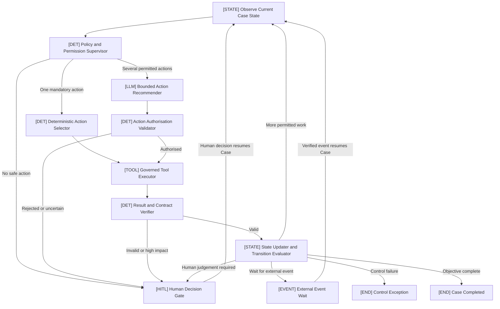
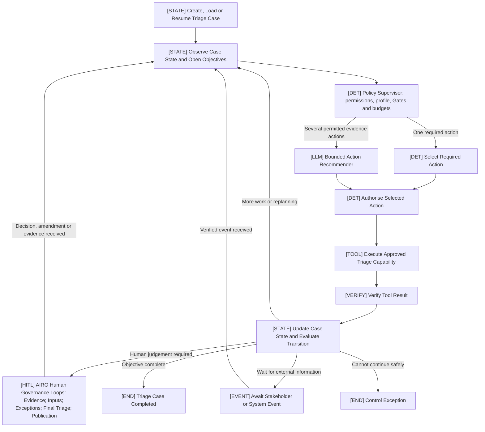
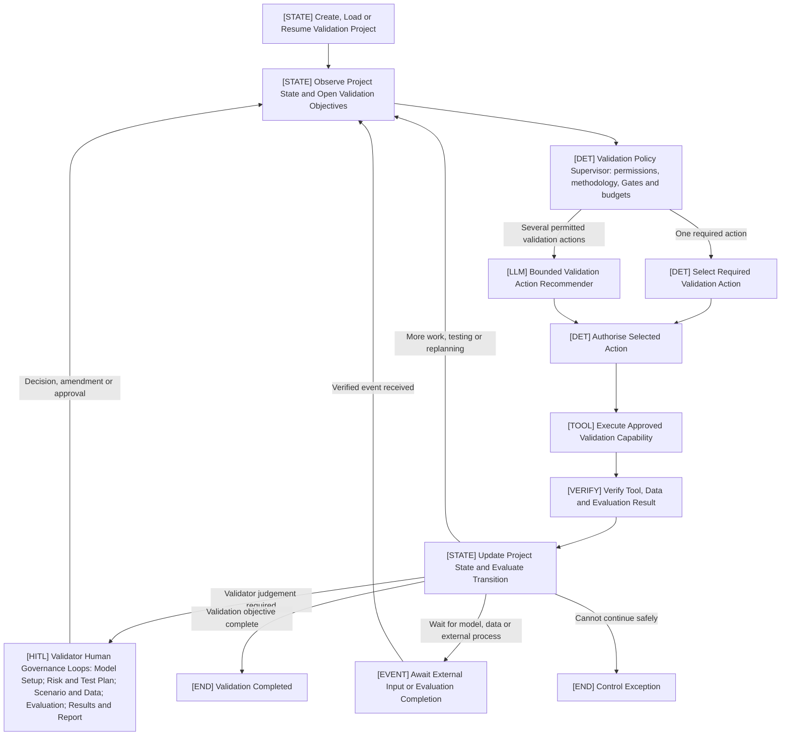

# Human-Governed, Policy-Supervised Agentic State Loop

The design can be generalised as:

> **Human-Governed, Policy-Supervised Agentic State Loop**


It can be reused for:

* AI risk triage;
* model documentation review;
* validation coordination;
* validation report drafting;
* rule calibration;
* policy compliance review;
* evidence collection;
* issue remediation;
* monitoring and escalation.

The design is strong because it separates:

* deterministic governance;
* LLM-based recommendations;
* governed tool execution;
* result verification;
* state management;
* human decision authority.

## Review of the Original Design

The original flow has the correct core pattern:

1. Read the current state.
2. Determine permitted actions.
3. Select the next action.
4. Execute a tool.
5. Verify the result.
6. Update the state.
7. Continue, interrupt or complete.

I recommend four improvements:

* Rename every node to show whether it is deterministic, LLM-based, a tool operation or human decision.
* Separate result verification from state updating.
* Add an external-event waiting path.
* Add an explicit fail-safe/control-exception outcome.

## Generalised StateGraph Template



# Recommended Generic Component Names

| Original name                         | Recommended generic name                                      | Component type                  |
| ------------------------------------- | ------------------------------------------------------------- | ------------------------------- |
| Read Current State                    | `Case State Observer`                                         | State/orchestration             |
| Supervisor Determines Allowed Actions | `Deterministic Policy and Permission Supervisor`              | Deterministic                   |
| Deterministic Selection               | `Deterministic Action Selector`                               | Deterministic                   |
| LLM Router Recommendation             | `Bounded LLM Action Recommender`                              | LLM                             |
| Supervisor Validation                 | `Deterministic Action Authorisation Validator`                | Deterministic                   |
| Execute Tool                          | `Governed Tool Executor`                                      | Tool execution                  |
| Verifier Checks and Updates State     | Split into `Result Verifier` and `State Transition Evaluator` | Deterministic/state             |
| AIRO Interrupt                        | `Human Decision Gate`                                         | Human-in-the-loop               |
| AIRO Resumes Case                     | `Human Decision Resume Handler`                               | Human-in-the-loop/orchestration |
| Closed                                | `Case Completed`                                              | Terminal state                  |
| New recommended component             | `External Event Wait`                                         | Event-driven                    |
| New recommended component             | `Control Exception`                                           | Fail-safe terminal state        |

# 1. `[STATE] Case State Observer`

## Purpose

Creates a trusted representation of the current Case.

It reads:

* current objective;
* lifecycle status;
* confirmed facts;
* submitted evidence;
* open issues;
* completed actions;
* previous tool results;
* human decisions;
* effective autonomy profile;
* remaining action budget;
* pending external tasks;
* current rule and workflow versions.

## Output

```json
{
  "case_id": "CASE-1024",
  "objective": "Prepare an evidence-linked assessment for human review.",
  "current_status": "EVIDENCE_REVIEW",
  "open_objectives": [
    "Resolve the data-use inconsistency",
    "Obtain missing supplier evidence"
  ],
  "open_issues": [
    "Questionnaire and architecture evidence conflict"
  ],
  "remaining_tool_calls": 4,
  "remaining_loops": 2
}
```

This is not an LLM activity. It should be deterministic state preparation.

# 2. `[DET] Deterministic Policy and Permission Supervisor`

## Purpose

Defines the safe operating boundary.

It determines:

* permitted actions;
* prohibited actions;
* permitted tools;
* mandatory action, if one exists;
* whether the LLM recommender may be called;
* human Gate requirements;
* action and loop budgets;
* external-write permissions;
* fail-safe conditions;
* effective autonomy profile.

## Output

```json
{
  "policy_version": "coordinator-policy-1.0",
  "allowed_actions": [
    "check_evidence_consistency",
    "check_supplier_evidence",
    "request_human_review"
  ],
  "allowed_tools": [
    "evidence_consistency_checker",
    "supplier_evidence_checker"
  ],
  "mandatory_action": null,
  "llm_recommender_permitted": true,
  "human_gate_required": false,
  "external_write_permitted": false,
  "remaining_tool_calls": 4,
  "decision_rationale": "Several approved read-only evidence actions are available."
}
```

This component must not use an LLM to determine permissions.

# 3. `[DET] Deterministic Action Selector`

## Purpose

Selects the next action when policy and state make the choice unambiguous.

Examples:

* no evidence supplied → request evidence;
* one mandatory validation remains → run that validation;
* confirmed inputs are ready → run deterministic engines;
* external response is required → enter waiting state.

## Output

```json
{
  "selected_action": "request_supporting_evidence",
  "selection_method": "DETERMINISTIC",
  "reason": "No supporting evidence was submitted."
}
```

The LLM should not be called when only one safe action exists.

# 4. `[LLM] Bounded LLM Action Recommender`

## Purpose

Recommends the most useful next action when several approved actions are available.

It receives only:

* current Case context;
* unresolved objectives;
* allowlisted actions;
* allowlisted tools;
* previous verified results;
* execution limits.

It cannot invent tools or expand its own permissions.

## Output

```json
{
  "selected_action": "check_evidence_consistency",
  "selected_tool": "evidence_consistency_checker",
  "reason": "The submitted evidence appears inconsistent with the declared data usage.",
  "inputs_required": [
    "questionnaire",
    "architecture_evidence"
  ],
  "confidence": 0.94,
  "human_review_recommended": false
}
```

A better generic name than “LLM Router” is:

> **Bounded LLM Action Recommender**

This makes it clear that it recommends but does not authorise or execute.

# 5. `[DET] Deterministic Action Authorisation Validator`

## Purpose

Validates the LLM recommendation before execution.

It checks:

* action is permitted;
* tool is allowlisted;
* required inputs exist;
* action is within budget;
* data permissions are satisfied;
* human approval is not required first;
* the action does not modify protected rules;
* the action does not bypass a mandatory Gate;
* the action does not exceed the effective autonomy profile.

## Output

```json
{
  "proposal_valid": true,
  "action_authorised": true,
  "tool_authorised": true,
  "execution_decision": "EXECUTE",
  "reason": "The proposed action is read-only, allowlisted and relevant to an open objective."
}
```

If the proposal is rejected:

```json
{
  "proposal_valid": false,
  "execution_decision": "ESCALATE_TO_HUMAN",
  "violations": [
    "The proposed tool is not allowlisted."
  ]
}
```

# 6. `[TOOL] Governed Tool Executor`

## Purpose

Executes an approved capability through the Tool Registry.

The executor itself should not decide which tool to use.

It should:

* retrieve the registered tool contract;
* validate tool inputs;
* apply timeout and retry limits;
* generate an idempotency key where required;
* execute the tool;
* capture runtime metadata;
* return a typed result;
* record any external reference.

## Possible tool types

| Tool category             | Example                   |
| ------------------------- | ------------------------- |
| Deterministic calculation | Risk scoring engine       |
| Read-only retrieval       | Policy search             |
| LLM capability            | Evidence extraction       |
| Verification              | Citation checker          |
| Preparation               | Report generator          |
| External draft            | Email or Confluence draft |
| External action           | Approved system update    |

## Output

```json
{
  "tool_id": "evidence_consistency_checker",
  "tool_version": "1.2",
  "execution_status": "SUCCESS",
  "result": {
    "conflicts_found": 1,
    "source_references": ["DOC-18:L24-L28"]
  },
  "execution_reference": "TOOL-RUN-8831"
}
```

# 7. `[DET] Result and Contract Verifier`

## Purpose

Checks that a tool result is safe and usable.

It verifies:

* output schema;
* tool and version;
* source references;
* citations;
* confidence thresholds;
* result relevance;
* permission compliance;
* prompt-injection indicators;
* unresolved inconsistencies;
* absence of unauthorised decisions or actions.

## Output

```json
{
  "verification_status": "VERIFIED",
  "result_usable": true,
  "verified_claims": [
    "Architecture evidence refers to employee email addresses."
  ],
  "advisory_observations": [],
  "requires_human_review": false
}
```

If full verification is not possible:

```json
{
  "verification_status": "ADVISORY_ONLY",
  "result_usable": false,
  "requires_human_review": true,
  "reason": "The cited source could not be independently confirmed."
}
```

# 8. `[STATE] State Updater and Transition Evaluator`

## Purpose

Updates the authoritative Case state after a verified result.

It determines:

* which facts are confirmed;
* which issues are opened or resolved;
* which outputs are invalidated;
* which previous results become superseded;
* which objective is complete;
* whether more work remains;
* whether human judgement is required;
* whether an external event is required;
* whether the overall objective is complete.

## Output

```json
{
  "new_status": "AWAITING_INFORMATION",
  "completed_objectives": [
    "Check questionnaire-to-evidence consistency"
  ],
  "open_objectives": [
    "Obtain clarification on personal-data use"
  ],
  "invalidated_outputs": [
    "previous_assessment_proposal"
  ],
  "next_transition": "HUMAN_DECISION_REQUIRED"
}
```

Separating verification and state updating avoids allowing an unverified result to modify the authoritative Case state.

# 9. `[HITL] Human Decision Gate`

## Purpose

Pauses the Coordinator when human judgement or approval is required.

Generic Gate reasons include:

* evidence conflict;
* missing material information;
* interpretation of a rule;
* approval of an exception;
* consequential decision;
* override;
* external communication;
* formal system write;
* low-confidence result;
* failed or prohibited action.

## Interrupt payload

```json
{
  "gate_id": "EVIDENCE_CONFLICT_REVIEW",
  "decision_required": "Confirm the correct data-use classification.",
  "trigger_reason": "Submitted evidence conflicts with the recorded answer.",
  "supporting_evidence": [
    "DOC-18:L24-L28"
  ],
  "applicable_rule": "DATA-EVIDENCE-01",
  "coordinator_recommendation": "Return the Case for clarification.",
  "uncertainty": "The evidence does not confirm whether email addresses reach the external model.",
  "allowed_decisions": [
    "request_more_information",
    "amend_confirmed_fact",
    "proceed_with_recorded_gap",
    "cancel_case"
  ],
  "effect_of_each_decision": {
    "request_more_information": "Pause until additional evidence is received.",
    "amend_confirmed_fact": "Invalidate and rerun dependent assessments.",
    "proceed_with_recorded_gap": "Record an exception and continue.",
    "cancel_case": "End the Case without approval."
  }
}
```

In LangGraph, this can use:

```python
interrupt(gate_payload)
```

The Case resumes with:

```python
Command(resume=human_decision)
```

# 10. `[EVENT] External Event Wait`

## Purpose

Pauses without consuming execution resources while waiting for:

* stakeholder evidence;
* external workflow completion;
* email response;
* system callback;
* human task completion;
* scheduled effective date;
* another system’s result.

## Example State

```json
{
  "status": "AWAITING_EXTERNAL_EVENT",
  "event_type": "STAKEHOLDER_EVIDENCE_RECEIVED",
  "correlation_id": "CASE-1024-EVIDENCE-2",
  "due_date": "2026-09-01"
}
```

A verified external event resumes the same Case thread.

# 11. `[END] Control Exception`

## Purpose

Provides an explicit fail-safe outcome.

Trigger conditions include:

* no permitted action;
* unknown state;
* tool-call budget exhausted;
* maximum loop count exceeded;
* repeated verification failure;
* unauthorised action proposal;
* failed external reconciliation;
* invalid human decision;
* corrupted or incompatible state.

It should not automatically be treated as Case rejection. It means:

> The Coordinator cannot continue safely and requires controlled intervention.

# 12. `[END] Case Completed`

The Case reaches completion only when:

* defined objective is satisfied;
* mandatory actions are complete;
* no blocking issue remains;
* all required human decisions are recorded;
* consequential actions are reconciled;
* the final record is complete;
* completion criteria are verified.

# Generic Lifecycle States

The template should use a small set of generic lifecycle states:

| Generic state             | Meaning                                             |
| ------------------------- | --------------------------------------------------- |
| `NEW`                     | Case created but not started                        |
| `READY`                   | Inputs are sufficient to begin                      |
| `WORKING`                 | Coordinator is executing permitted actions          |
| `AWAITING_HUMAN`          | Human judgement or approval is required             |
| `AWAITING_EXTERNAL_EVENT` | Waiting for another person or system                |
| `CONTROL_EXCEPTION`       | Coordinator cannot continue safely                  |
| `COMPLETED`               | Objective and governance requirements are satisfied |
| `CANCELLED`               | Case ended by an authorised decision                |

Domain-specific states can sit underneath `WORKING`, for example:

* `EVIDENCE_REVIEW`;
* `TESTING`;
* `REPORT_PREPARATION`;
* `ASSESSMENT`;
* `REMEDIATION`;
* `RELEASE_PREPARATION`.

This avoids redesigning the generic Coordinator for every use case.

# Generic Component Type Labels

Use consistent prefixes throughout diagrams, code comments and documentation:

| Prefix     | Meaning                                |
| ---------- | -------------------------------------- |
| `[STATE]`  | Case state and orchestration           |
| `[DET]`    | Deterministic logic                    |
| `[LLM]`    | LLM-based recommendation or processing |
| `[TOOL]`   | Governed capability execution          |
| `[VERIFY]` | Result assurance                       |
| `[HITL]`   | Human-in-the-loop decision             |
| `[EVENT]`  | External asynchronous input            |
| `[END]`    | Terminal or fail-safe state            |

For example:

```text
[STATE] Observe Case
[DET] Determine Permissions
[LLM] Recommend Evidence Action
[DET] Authorise Action
[TOOL] Execute Capability
[VERIFY] Verify Result
[STATE] Update and Replan
[HITL] Human Decision
```

# Suggested Generic Class Names

```python
CaseCoordinator
CaseState
CaseObjective
CaseStateObserver

PolicySupervisor
SupervisorDecision

DeterministicActionSelector
BoundedLLMActionRecommender
ActionProposal
ActionAuthorisationValidator

ToolRegistry
ToolContract
GovernedToolExecutor
ToolResult

ResultVerifier
VerificationResult

StateUpdater
TransitionEvaluator
TransitionDecision

HumanDecisionGate
HumanDecision
HumanDecisionResumeHandler

ExternalEventWait
ExternalEventValidator

ControlException
CompletionEvaluator
```

# Generic Control Loop

The reusable design can be summarised as:

```text
Observe
→ Constrain
→ Select
→ Authorise
→ Execute
→ Verify
→ Update
→ Continue / Wait / Escalate / Complete
```

Or more explicitly:

```text
[STATE] Observe
→ [DET] Determine permitted actions
→ [DET or LLM] Select next action
→ [DET] Authorise
→ [TOOL] Execute
→ [VERIFY] Verify
→ [STATE] Update and re-evaluate
→ [HITL / EVENT / LOOP / END]
```

# Key Design Rule

The most important reusable principle is:

> The LLM may recommend an action, but deterministic policy determines whether the action is permitted; only verified results may update authoritative Case state; consequential decisions and actions remain subject to explicit human governance.

This makes the pattern reusable across MRO applications without confusing deterministic control, LLM reasoning and human authority.


===

# AI Risk Triage StateGraph

This version keeps the same structure as the generic **Human-Governed, Policy-Supervised Agentic State Loop**, while grouping all five AIRO Gates into one Human Governance component.



# Approved Triage Capabilities

The single `[TOOL] Execute Approved Triage Capability` box represents different tools used at different Case stages:

```text
Evidence preparation
• Document and evidence extraction
• Evidence completeness checks
• Questionnaire-to-evidence consistency checks
• Policy, RAG, supplier or autonomy checks
• Follow-up question generation

Risk assessment
• Deterministic materiality engine
• Deterministic 2LoD routing engine

Review and output
• Bounded LLM challenge
• Review-pack generation
• Publication-draft preparation
• Approved local or external publication adapter
```

The Policy Supervisor determines which capability is permitted for the current Case state.

# Human Governance Loops

All five Gates are represented by one `[HITL] AIRO Human Governance Loops` component.

| Loop                             | Trigger                                        | AIRO decision                                                   |
| -------------------------------- | ---------------------------------------------- | --------------------------------------------------------------- |
| Evidence Resolution Loop         | Missing, conflicting or unverified evidence    | Add evidence, request evidence, accept a recorded gap or cancel |
| Material Input Confirmation Loop | Material facts require confirmation            | Confirm, amend or return for evidence                           |
| Exception and Challenge Loop     | Exception, dealbreaker or judgement point      | Resolve, amend, request evidence or stop                        |
| Final Triage Decision Loop       | Proposed materiality and 2LoD outcome is ready | Confirm, override or return for review                          |
| Publication Approval Loop        | Final record is ready for publication          | Approve, save draft or cancel                                   |

The State records which loop is active:

```json
{
  "case_status": "AWAITING_HUMAN",
  "active_governance_loop": "FINAL_TRIAGE_DECISION",
  "gate_id": "GATE_4",
  "decision_required": "Confirm or override the proposed triage outcome."
}
```

After the human response, the Case returns to:

```text
[STATE] Observe Case State and Open Objectives
```

This allows the Coordinator to reconsider the Case using the new evidence or decision.

# How It Aligns With the Generic Design

| Generic component             | AI Risk Triage implementation                                                       |
| ----------------------------- | ----------------------------------------------------------------------------------- |
| Observe State                 | Read questionnaire, evidence, issues, decisions and current assessment              |
| Policy Supervisor             | Determine permitted actions, automation profile, budgets and AIRO Gate requirements |
| Deterministic Action Selector | Select an unambiguous next step                                                     |
| Bounded LLM Recommender       | Recommend among several approved evidence actions                                   |
| Action Authorisation          | Confirm tool, permission, data and autonomy constraints                             |
| Governed Tool Executor        | Run evidence, materiality, 2LoD, review-pack or publication capabilities            |
| Result Verifier               | Check schemas, citations, confidence, rules and permissions                         |
| State Updater                 | Record results, invalidate stale outputs and determine the next transition          |
| Human Governance Loop         | Apply the appropriate AIRO Gate                                                     |
| External Event Wait           | Wait for stakeholder evidence, 2LoD response or system completion                   |
| Completed                     | Close the Case with a confirmed and auditable outcome                               |
| Control Exception             | Stop safely when the Coordinator cannot continue                                    |

# Core Control Loop

The complete design can be explained in one line:

> **Observe → Constrain → Select → Authorise → Execute → Verify → Update → Continue, Wait, Escalate or Complete**

This diagram is simpler because:

* all AIRO Gates are grouped as governance loops;
* all approved capabilities are grouped behind the Tool Executor;
* the detailed business sequence is stored in Case State and Policy rather than drawn as separate nodes;
* deterministic and LLM responsibilities remain visibly separate;
* every human decision or external event returns to the same state-driven control loop.


===

# AI Validation  StateGraph

The validation platform can use the same generic pattern:

> **Human-Governed, Policy-Supervised Agentic State Loop**

The validation-specific implementation should remain one **Validation Project Coordinator**. Model preparation, risk assessment, scenario generation, evaluation execution and report generation are capabilities or tools used by the Coordinator—not separate autonomous agents.

The five platform tabs remain useful as workspace views, but the authoritative workflow is controlled by Validation Project State.

# Simplified Validation StateGraph



# How the Validation Process Fits the Loop

The five validation-platform tabs represent different groups of capabilities.

| Platform tab        | Coordinator objective                                                 |
| ------------------- | --------------------------------------------------------------------- |
| Model Preparation   | Establish a valid, reproducible and testable model configuration      |
| Risk Assessment     | Define the validation scope, risks, tools, metrics and thresholds     |
| Scenario Generation | Produce or select representative, governed and traceable test data    |
| Evaluation Engine   | Execute approved tests and capture complete results and traces        |
| Results and Report  | Review evidence, establish findings and produce the validation report |

The Coordinator observes which objectives remain open and determines the next permitted action.

# 1. Model Preparation

## Objective

Create an approved, reproducible configuration of the model under validation.

## Information captured

* model identifier and version;
* model owner;
* use-case identifier;
* model type;
* foundation LLM, RAG or agentic-AI architecture;
* API endpoint or callable interface;
* black-box or white-box access;
* system and application prompts;
* model parameters;
* authentication configuration;
* tool and agent configuration;
* tracing configuration;
* timeout and retry limits;
* environment;
* dependency versions;
* expected input/output schema;
* data classification;
* known limitations.

## Approved capabilities

```text
Model registry lookup
Endpoint connectivity test
Input/output schema inspection
Model response smoke test
Prompt/configuration capture
Tracing readiness check
Tool and agent inventory
Environment and dependency check
Reproducibility check
```

## Model Preparation Governance Loop

The validator confirms:

* the correct model/version has been selected;
* the target configuration matches the use case;
* access is sufficient for validation;
* black-box or white-box mode is appropriate;
* tracing is available where required;
* test execution will not affect production;
* missing information has been addressed;
* the model is ready for validation.

Possible decisions:

```text
Confirm setup
Amend configuration
Request information from model owner
Return for technical preparation
Cancel or suspend validation
```

# 2. Risk Assessment and Test Planning

## Objective

Translate the use-case and model risk profile into an approved validation plan.

## Information captured

* model type;
* materiality and risk tier;
* applicable risk taxonomy;
* validation requirements;
* model components;
* risks to test;
* mandatory and optional evaluation tools;
* metrics;
* thresholds;
* coverage requirements;
* component versus end-to-end coverage;
* test limitations;
* expected evidence;
* escalation conditions.

## Approved capabilities

```text
Risk-taxonomy mapping
Model-type-to-risk mapping
Risk-to-evaluation-tool coverage matrix
Mandatory test identification
Test recommendation generation
Metric and threshold lookup
Validation-depth determination
Coverage-gap analysis
Test-plan generation
```

The deterministic policy should establish mandatory requirements based on:

* risk tier;
* model type;
* use-case features;
* approved validation methodology;
* regulatory and policy requirements.

The LLM may recommend additional tests, but it must not remove mandatory tests.

## Risk and Test Plan Governance Loop

The validator confirms:

* applicable risks;
* validation scope;
* tests to be performed;
* evaluation tools;
* metrics and thresholds;
* end-to-end, multi-turn and component coverage;
* any exclusions;
* limitations and rationale.

Possible decisions:

```text
Approve test plan
Add or remove an optional test
Amend thresholds with rationale
Request more model information
Return to model preparation
Escalate methodology question
```

# 3. Scenario and Data Generation

## Objective

Create or select representative, controlled and versioned test scenarios and datasets.

## Sources

* model-owner-provided data;
* historical production-like data;
* approved benchmark datasets;
* manually designed scenarios;
* synthetic data;
* adversarial scenarios;
* data extensions;
* policy-derived scenarios;
* edge and boundary cases.

## Approved capabilities

```text
Test-data import
Schema validation
Data-quality assessment
Sensitive-data checks
Benchmark retrieval
Synthetic-data generation
Scenario extension
Adversarial scenario generation
Coverage analysis
Duplicate and leakage checks
Bias and representativeness analysis
Dataset versioning
```

## Bounded LLM role

The LLM may:

* generate candidate test scenarios;
* extend existing examples;
* create paraphrases;
* generate edge cases;
* suggest multi-turn conversations;
* generate adversarial prompts;
* identify scenario coverage gaps.

Generated data must remain labelled as synthetic and be reviewed or verified before use in consequential validation conclusions.

## Scenario and Data Governance Loop

The validator confirms:

* source and permitted use;
* representativeness;
* data quality;
* sensitive-data handling;
* benchmark suitability;
* synthetic-data methodology;
* scenario coverage;
* expected outcomes or labels;
* train/test leakage risk;
* final dataset version.

Possible decisions:

```text
Approve dataset
Generate more scenarios
Extend an existing dataset
Exclude unsuitable scenarios
Request data from model owner
Return to risk and test planning
```

# 4. Evaluation Engine

## Objective

Execute the approved validation plan reproducibly and capture complete evaluation evidence.

## Evaluation modes

```text
End-to-end tests
Single-turn tests
Multi-turn tests
Component-level tests
RAG retrieval tests
RAG generation tests
Agent planning tests
Tool-selection tests
Action and autonomy tests
Guardrail and safety tests
Robustness tests
Bias and fairness tests
Security tests
Hallucination and factuality tests
LLM-as-a-Judge evaluations
Deterministic metric evaluations
Human evaluation
```

## Approved capabilities

```text
Evaluation-run creation
Model invocation
Scenario execution
Trace capture
Metric calculation
LLM-as-a-Judge
Component-level testing
Multi-turn orchestration
Retry and timeout handling
Result storage
Run comparison
Failure classification
```

## Evaluation Governance Loop

The validator intervenes when:

* a run configuration changes;
* a material tool fails;
* an evaluation is unreliable;
* thresholds require interpretation;
* additional testing is required;
* unexpected model behaviour appears;
* the original plan is no longer sufficient;
* a model configuration changes during validation.

Possible decisions:

```text
Accept run
Rerun failed scenarios
Change an approved run configuration
Add supplementary testing
Return to scenario generation
Return to model preparation
Record a testing limitation
Stop unsafe execution
```

Not every individual run requires human approval. The Policy Supervisor determines which changes or exceptions require validator judgement.

# 5. Results and Report

## Objective

Transform verified evaluation evidence into an independently reviewed validation conclusion and report.

## Approved capabilities

```text
Result aggregation
Metric and threshold comparison
Statistical analysis
Trace analysis
Failure clustering
Finding generation
Coverage assessment
Run comparison
Evidence selection
Table and chart generation
Report drafting
Citation verification
Report rendering
Controlled publication
```

## Bounded LLM role

The LLM may:

* summarise evaluation results;
* group similar failures;
* draft potential findings;
* draft report sections;
* identify inconsistent conclusions;
* suggest additional tests;
* check report-to-evidence consistency.

The LLM must not independently:

* determine the final validation rating;
* approve a model;
* close a finding;
* decide the final risk tier;
* publish the formal report;
* override validator judgement.

## Results and Report Governance Loop

The validator confirms:

* which runs are valid;
* which results are relied upon;
* threshold interpretation;
* finding severity;
* limitations;
* residual risks;
* validation conclusion;
* validation rating where applicable;
* required remediation;
* report wording;
* final report publication.

Possible decisions:

```text
Accept results
Exclude an invalid run
Request additional testing
Amend findings
Confirm validation conclusion
Return to evaluation
Approve report
Save draft
Publish report
```

# Grouped Human Governance Component

All validation Gates can be represented by one Human Governance component:

```text
[HITL] Validator Human Governance Loops
```

| Governance loop         | Typical trigger                                              | Validator responsibility                              |
| ----------------------- | ------------------------------------------------------------ | ----------------------------------------------------- |
| Model Setup Loop        | Model access, configuration or tracing requires confirmation | Confirm the correct validation target                 |
| Risk and Test Plan Loop | Scope, risks, tools or thresholds require judgement          | Approve the validation approach                       |
| Scenario and Data Loop  | Dataset quality, coverage or use requires approval           | Confirm suitable validation evidence                  |
| Evaluation Loop         | Run failure, changed configuration or unexpected result      | Decide whether to rerun, extend or accept limitations |
| Results and Report Loop | Findings, conclusions or publication require judgement       | Own the final validation conclusion and report        |

The current active loop is stored in Project State:

```json
{
  "project_status": "AWAITING_HUMAN",
  "active_governance_loop": "EVALUATION_REVIEW",
  "decision_required": "Determine whether the failed multi-turn runs should be rerun.",
  "affected_run_ids": [
    "RUN-204",
    "RUN-205"
  ]
}
```

# Validation Policy Supervisor

The deterministic Validation Policy Supervisor controls:

* permitted next actions;
* approved tools;
* mandatory tests;
* optional tests;
* data permissions;
* model execution permissions;
* risk-tier requirements;
* Gate requirements;
* action and evaluation budgets;
* retry limits;
* required coverage;
* external-write permissions;
* report-publication authority;
* fail-safe conditions.

Example output:

```json
{
  "project_phase": "SCENARIO_PREPARATION",
  "allowed_actions": [
    "import_model_owner_data",
    "generate_adversarial_scenarios",
    "extend_existing_dataset"
  ],
  "allowed_tools": [
    "dataset_importer",
    "scenario_generator",
    "coverage_analyser"
  ],
  "mandatory_actions": [
    "validate_dataset_schema",
    "check_sensitive_data"
  ],
  "llm_recommender_permitted": true,
  "human_gate_required": false,
  "remaining_scenario_budget": 500,
  "policy_version": "validation-policy-1.0"
}
```

# Bounded Validation Action Recommender

When several valid actions are possible, the LLM may recommend the next one.

Example:

```json
{
  "selected_action": "generate_adversarial_scenarios",
  "selected_tool": "scenario_generator",
  "reason": "Current scenarios cover normal RAG queries but do not test conflicting documents or prompt injection.",
  "inputs_required": [
    "approved_test_plan",
    "current_scenario_inventory"
  ],
  "confidence": 0.91,
  "human_review_recommended": false
}
```

The deterministic Supervisor must authorise the recommendation before execution.

# External Event Waits

The Coordinator may pause for:

* model endpoint access;
* model-owner documentation;
* test data;
* long-running evaluation jobs;
* human evaluation completion;
* external security-test results;
* remediation evidence;
* validation-report approval;
* scheduled publication.

Example:

```json
{
  "project_status": "AWAITING_EXTERNAL_EVENT",
  "expected_event": "EVALUATION_RUN_COMPLETED",
  "run_id": "RUN-204",
  "correlation_id": "VAL-1024-RUN-204"
}
```

A verified completion event resumes the same Validation Project.

# Selective Replanning and Invalidation

This is particularly important for validation.

## Model configuration changes

If the model version, prompt or architecture changes:

```text
Invalidate:
• compatibility checks;
• affected scenarios;
• affected evaluation runs;
• results;
• findings;
• report conclusions.
```

## Dataset changes

If the scenario dataset changes:

```text
Invalidate:
• affected evaluation runs;
• aggregated metrics;
• findings relying on those runs;
• report sections.
```

## Threshold changes

If an evaluation threshold changes:

```text
Preserve:
• raw model outputs;
• raw metric values.

Invalidate:
• pass/fail classifications;
• finding severity;
• conclusions;
• report sections.
```

## Evaluation-tool version changes

If an evaluator or LLM-as-a-Judge version changes:

```text
Invalidate:
• results produced by that evaluator;
• dependent aggregation;
• dependent findings;
• report conclusions.
```

The Coordinator should rerun only affected work rather than restarting the entire validation automatically.

# Recommended Generic Validation States

| State                     | Meaning                                     |
| ------------------------- | ------------------------------------------- |
| `DRAFT`                   | Validation Project created                  |
| `MODEL_PREPARATION`       | Model and tracing configuration             |
| `RISK_AND_TEST_PLANNING`  | Risks, tools, metrics and thresholds        |
| `SCENARIO_PREPARATION`    | Test scenarios and datasets                 |
| `EVALUATION_EXECUTION`    | Approved tests are running                  |
| `RESULTS_REVIEW`          | Evaluation evidence is being assessed       |
| `REPORT_PREPARATION`      | Validation report is being drafted          |
| `AWAITING_HUMAN`          | Validator judgement is required             |
| `AWAITING_EXTERNAL_EVENT` | Waiting for data, access or run completion  |
| `CONTROL_EXCEPTION`       | Coordinator cannot continue safely          |
| `COMPLETED`               | Validation and approved output are complete |
| `CANCELLED`               | Validation ended by authorised decision     |

# Tabs Versus Workflow

The existing tabs should remain, but they should be treated as views over the same Validation Project State.

```text
Model Preparation
Risk Assessment
Scenario Generation
Evaluation Engine
Results and Report
```

The user can inspect any tab, but the Coordinator determines:

* what is complete;
* what is stale;
* what can be edited;
* which action is permitted;
* which tests must run;
* what requires human approval;
* what must be invalidated after a change.

The tabs should not independently control workflow state.

# Recommended Initial Autonomy

Because independent validation applies to more material or higher-risk use cases and the methodology is still developing, the recommended starting profile is:

> **Human-Governed or Conditional Review**

Initially:

* model setup is validator-confirmed;
* risk/test plan is validator-approved;
* scenario/data selection is validator-approved;
* evaluation execution may be automated;
* unexpected results return to the validator;
* validation conclusion and report publication remain mandatory human decisions.

Later, proven low-risk validation patterns may use exception-based processing for preparation and execution, but final independent validation conclusions should remain human-owned unless policy explicitly changes.

# Final Description

> The Validation Project Coordinator is a concrete implementation of the Human-Governed, Policy-Supervised Agentic State Loop. It observes the current validation state, applies deterministic methodology and permission controls, selects or recommends approved validation actions, executes governed tools, verifies results, replans when configurations or evidence change, and pauses within grouped Validator Governance Loops whenever independent judgement is required.

The core control loop remains:

> **Observe → Constrain → Select → Authorise → Execute → Verify → Update → Continue, Wait, Escalate or Complete**.
