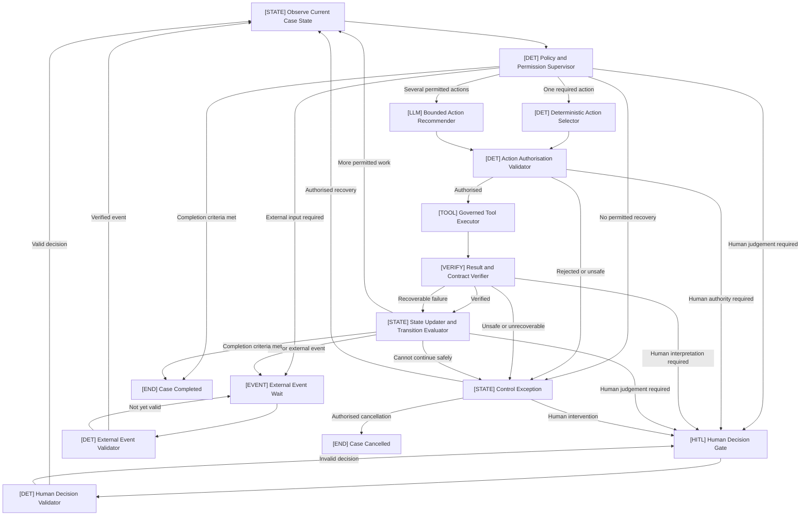
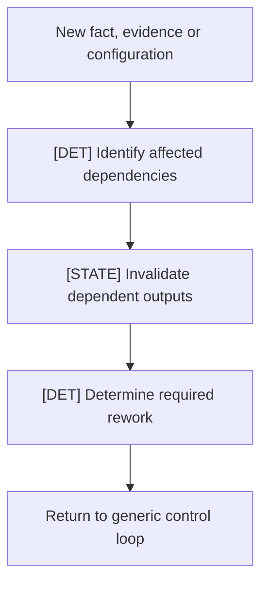
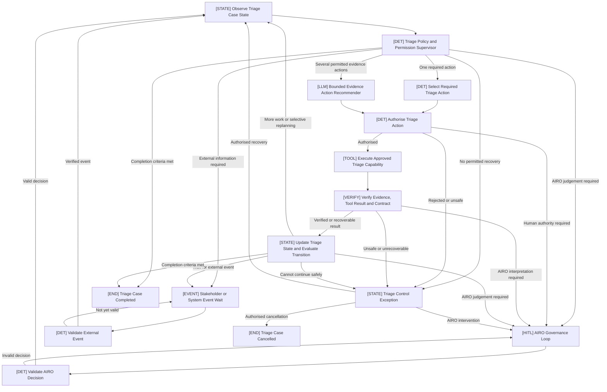
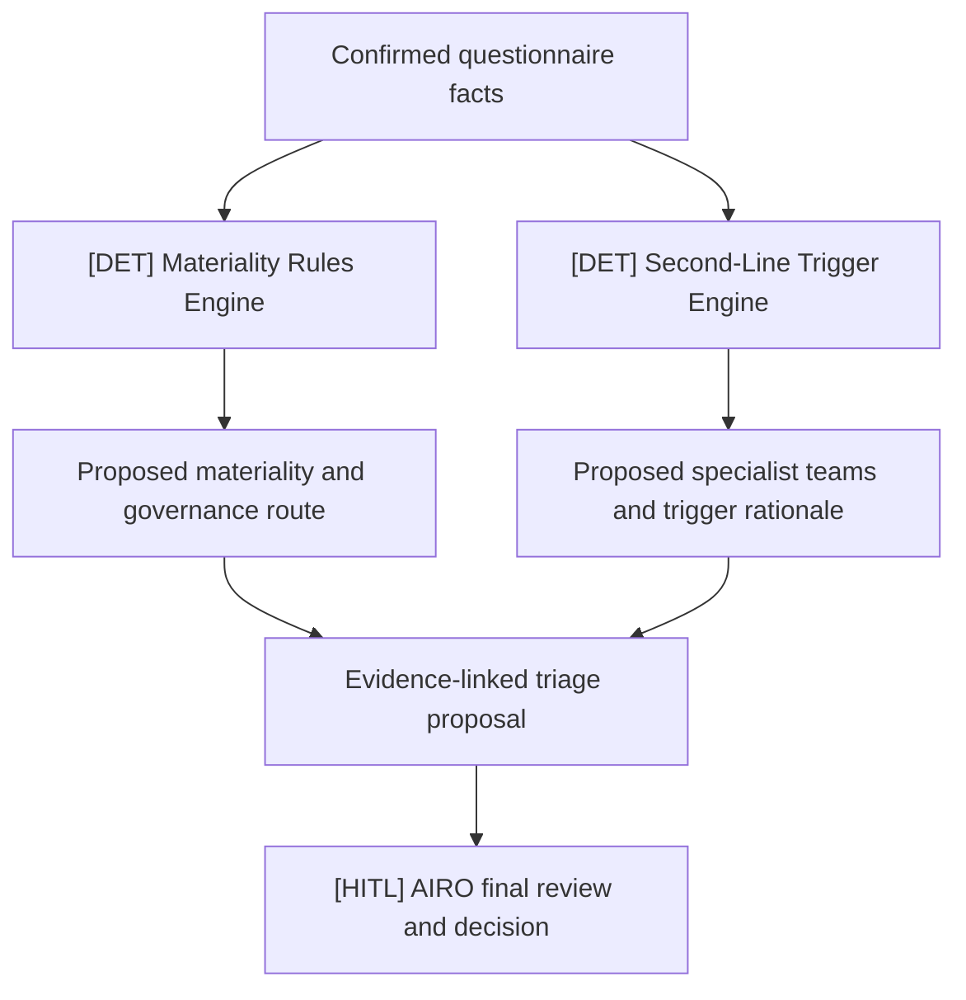
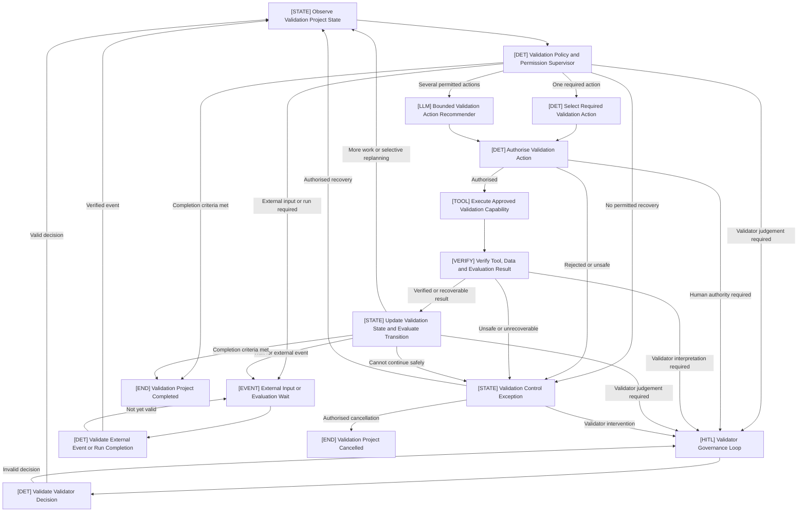

# Human-Governed, Policy-Supervised Agentic State Loop

**Document type:** Reusable architecture pattern and reference implementations  
**Status:** Reference design  
**Version:** 1.1  

This document contains three related designs:

1. **General design:** Human-Governed, Policy-Supervised Agentic State Loop;
2. **Implementation example:** AI Risk Triage StateGraph; and
3. **Implementation example:** AI Validation StateGraph.

The two implementation examples specialise the same generic control pattern. They do not introduce separate orchestration models.

## 1. Purpose

The **Human-Governed, Policy-Supervised Agentic State Loop** is a reusable design pattern for stateful applications that:

- coordinate work across multiple steps or capabilities;
- need to adapt to the current Case state;
- may use an LLM to recommend context-dependent actions;
- must operate within deterministic policy and permission boundaries;
- require verified results and a complete audit trail;
- pause for human judgement or external events; and
- may support different approved levels of automation.

The pattern is domain-neutral. It can be specialised for risk assessment, validation, evidence review, document review, report preparation, issue remediation, monitoring, calibration and other governed Case-management processes.

The generic pattern defines **how work is controlled and coordinated**. Each implementation supplies its own:

- Case objective and completion criteria;
- domain state and facts;
- deterministic policies and permissions;
- approved actions and tools;
- human decision rights;
- external events;
- verification requirements; and
- automation policy.

## 2. Pattern Summary

The control loop is:

> **Observe → Constrain → Select → Authorise → Execute → Verify → Update → Continue, Wait, Escalate or Complete**

The central control principle is:

> An LLM may recommend a permitted action, but it cannot grant authority. Deterministic policy controls what may happen, governed tools perform approved actions, only verified results may update authoritative Case facts, and defined human decisions remain under human control.

## 3. When the Pattern Is Agentic

The pattern supports an agentic implementation when the Coordinator:

- maintains persistent Case state;
- evaluates unresolved objectives;
- selects context-dependent actions;
- invokes approved tools;
- verifies results;
- updates state and selectively replans; and
- continues until it must wait, escalate, stop or complete.

The LLM recommender is optional. If it is disabled and every action and transition is predetermined, the same architecture operates as a **policy-governed stateful workflow** rather than a materially adaptive agent.

Agentic behaviour does not require unrestricted autonomy. In this pattern, autonomy is explicitly constrained by policy, permissions, budgets, tool contracts and human decision rights.

## 4. Design Principles

1. **One authoritative Coordinator** maintains the Case state and control loop.
2. **Policy controls autonomy.** The LLM does not choose its own permissions or automation profile.
3. **Use deterministic selection when the next action is unambiguous.**
4. **Use the LLM only where several permitted actions require contextual judgement.**
5. **Apply the same authorisation control to deterministic and LLM-recommended actions.**
6. **Execute capabilities only through an approved Tool Registry.**
7. **Verify results before they update authoritative Case facts or decisions.**
8. **Separate authoritative state from execution and audit history.**
9. **Pause durably for human decisions and external events.**
10. **Replan selectively when facts, evidence, rules or configurations change.**
11. **Fail safely when state, authority or result integrity is uncertain.**
12. **Keep domain logic outside the generic orchestration framework.**

## 5. Component Type Labels

Use consistent prefixes in diagrams, code comments, logs and documentation.

| Prefix | Meaning |
|---|---|
| `[STATE]` | Case state, orchestration and transition management |
| `[DET]` | Deterministic policy, validation or selection logic |
| `[LLM]` | Bounded LLM recommendation or processing |
| `[TOOL]` | Governed capability execution |
| `[VERIFY]` | Result, contract and assurance verification |
| `[HITL]` | Human-in-the-loop judgement or approval |
| `[EVENT]` | External asynchronous input or completion event |
| `[END]` | Authorised terminal state |

## 6. Generic StateGraph



### 6.1 How to Read the Graph

- The Coordinator first builds a trusted view of the Case.
- Deterministic policy defines the actions and tools currently permitted.
- If one action is required, deterministic logic selects it.
- If several actions are permitted, a bounded LLM may recommend one.
- Both routes pass through deterministic authorisation.
- An approved tool executes the action.
- The result is verified before it affects authoritative Case facts.
- State is updated and the next transition is evaluated.
- The loop continues, pauses, escalates, enters a control exception or completes.

## 7. Generic Components

### 7.1 `[STATE] Case State Observer`

#### Purpose

Creates a trusted, normalised representation of the current Case for the next control-loop cycle.

It reads:

- Case objective and completion criteria;
- lifecycle status and domain phase;
- confirmed facts;
- evidence and provenance;
- open issues and unresolved objectives;
- pending, completed, failed and prohibited actions;
- verified and superseded results;
- human decisions;
- pending human or external tasks;
- effective automation profile;
- policy, rule, model and workflow versions;
- remaining action, cost, time and loop budgets; and
- control exceptions.

It must not infer new authoritative facts. It prepares existing state deterministically.

#### Example output

```json
{
  "case_id": "CASE-1024",
  "objective": "Prepare a complete and evidence-linked proposal for authorised review.",
  "lifecycle_status": "OPEN",
  "domain_phase": "EVIDENCE_REVIEW",
  "open_objectives": [
    "Resolve the data-use inconsistency",
    "Obtain missing supplier evidence"
  ],
  "open_issues": [
    "Submitted information conflicts with supporting evidence"
  ],
  "remaining_tool_calls": 4,
  "remaining_loops": 2
}
```

### 7.2 `[DET] Policy and Permission Supervisor`

#### Purpose

Defines the safe operating boundary for the current cycle.

It determines:

- permitted and prohibited actions;
- permitted tools and data access;
- mandatory actions;
- whether the LLM recommender may be called;
- human decision requirements;
- external-event requirements;
- action, retry, cost, time and loop budgets;
- external-write permissions;
- effective automation profile;
- fail-safe conditions; and
- whether completion criteria can be evaluated.

This component must be deterministic and version-controlled. It must not use an LLM to grant permissions or change authority.

#### Example output

```json
{
  "policy_version": "coordinator-policy-1.0",
  "allowed_actions": [
    "check_evidence_consistency",
    "check_required_evidence",
    "request_human_review"
  ],
  "allowed_tools": [
    "evidence_consistency_checker",
    "required_evidence_checker"
  ],
  "mandatory_action": null,
  "llm_recommender_permitted": true,
  "human_decision_required": false,
  "external_event_required": false,
  "external_write_permitted": false,
  "remaining_tool_calls": 4,
  "decision_rationale": "Several approved read-only evidence actions are available."
}
```

### 7.3 `[DET] Deterministic Action Selector`

#### Purpose

Selects the next action when state and policy make the choice unambiguous.

Examples include:

- a mandatory input check remains;
- only one required test is incomplete;
- a deterministic calculation is ready to run;
- a required external response has not arrived; or
- completion checks are mandatory.

The LLM should not be called when one required action is already known.

#### Example output

```json
{
  "selected_action": "request_supporting_evidence",
  "selected_tool": "human_task_creator",
  "selection_method": "DETERMINISTIC",
  "reason": "Required supporting evidence has not been provided."
}
```

### 7.4 `[LLM] Bounded Action Recommender`

#### Purpose

Recommends the most useful next action when several policy-permitted actions are available and contextual reasoning adds value.

It receives only:

- current Case context;
- unresolved objectives;
- allowlisted actions and tools;
- previous verified results;
- relevant evidence references; and
- execution limits.

It must not:

- invent tools or actions;
- expand its permissions;
- change the Case objective;
- modify policy, rules or automation profiles;
- bypass a human decision;
- make a protected final decision; or
- execute a tool directly.

#### Example output

```json
{
  "selected_action": "check_evidence_consistency",
  "selected_tool": "evidence_consistency_checker",
  "reason": "The submitted evidence appears inconsistent with the recorded data-use classification.",
  "inputs_required": [
    "submitted_answers",
    "supporting_evidence"
  ],
  "confidence": 0.94,
  "human_review_recommended": false
}
```

### 7.5 `[DET] Action Authorisation Validator`

#### Purpose

Validates every selected action immediately before execution, regardless of whether it was selected deterministically or recommended by an LLM.

It checks:

- action is permitted in the current state;
- tool is registered and allowlisted;
- required inputs and permissions exist;
- action remains within budget;
- state and policy versions are current;
- human authority is not required first;
- the action does not modify protected rules;
- no mandatory governance step is bypassed; and
- the action is within the effective automation profile.

#### Example output

```json
{
  "proposal_valid": true,
  "action_authorised": true,
  "tool_authorised": true,
  "execution_decision": "EXECUTE",
  "authorisation_id": "AUTH-8831",
  "reason": "The action is read-only, allowlisted and relevant to an unresolved objective."
}
```

Possible execution decisions are:

```text
EXECUTE
REQUIRE_HUMAN_AUTHORITY
WAIT_FOR_EXTERNAL_INPUT
REJECT
CONTROL_EXCEPTION
```

### 7.6 `[TOOL] Governed Tool Executor`

#### Purpose

Executes an authorised capability through the Tool Registry. It must not decide which tool to use.

It should:

- retrieve the registered tool contract;
- validate inputs against the contract;
- enforce data and environment restrictions;
- apply timeout, retry and concurrency limits;
- create an idempotency key where required;
- execute the capability;
- capture runtime metadata;
- return a typed result; and
- record any external execution reference.

#### Generic tool categories

| Tool category | Example | Typical authority |
|---|---|---|
| Deterministic calculation | Scoring or rules engine | Policy-controlled execution |
| Read-only retrieval | Approved knowledge search | May run automatically |
| LLM processing | Evidence extraction or summarisation | Advisory output |
| Verification | Citation or schema checker | May run automatically |
| Reversible preparation | Draft or report generator | May run automatically |
| External draft | Message or page draft | Policy-controlled |
| Consequential external action | Formal system update or communication | Explicit authority normally required |

#### Example output

```json
{
  "tool_id": "evidence_consistency_checker",
  "tool_version": "1.2",
  "execution_status": "SUCCESS",
  "result": {
    "conflicts_found": 1,
    "source_references": [
      "SOURCE-18:L24-L28"
    ]
  },
  "execution_reference": "TOOL-RUN-8831"
}
```

### 7.7 `[VERIFY] Result and Contract Verifier`

#### Purpose

Determines whether a tool result is safe and suitable for its intended use.

It verifies, where applicable:

- output schema and contract;
- tool identity and version;
- source references and citation existence;
- confidence and quality thresholds;
- relevance to an unresolved objective;
- policy and permission compliance;
- prompt-injection or untrusted-instruction indicators;
- unresolved conflicts;
- absence of unauthorised decisions or actions; and
- consistency with current Case and rule versions.

Verification must be independent of the component that produced the result where the consequence or risk warrants separation.

#### Example verified output

```json
{
  "verification_status": "VERIFIED",
  "result_usable": true,
  "verified_claims": [
    "The supporting evidence contains a reference that conflicts with the recorded answer."
  ],
  "advisory_observations": [],
  "requires_human_review": false
}
```

#### Example advisory output

```json
{
  "verification_status": "ADVISORY_ONLY",
  "result_usable": false,
  "requires_human_review": true,
  "reason": "The cited source could not be independently confirmed."
}
```

Suggested verification statuses are:

```text
VERIFIED
VERIFIED_WITH_LIMITATIONS
ADVISORY_ONLY
REJECTED
EXECUTION_FAILED
```

### 7.8 `[STATE] State Updater and Transition Evaluator`

#### Purpose

Updates authoritative Case state and evaluates the next transition.

It determines:

- which verified facts can be recorded;
- which issues are opened, changed or resolved;
- which objectives are complete;
- which outputs are invalidated or superseded;
- which actions remain permitted;
- whether selective replanning is required;
- whether human judgement is required;
- whether an external event is required;
- whether a control exception exists; and
- whether completion criteria are satisfied.

Unverified results must not update confirmed facts. However, unsuccessful attempts must still update execution history, retry counters and relevant operational issues.

#### Example output

```json
{
  "lifecycle_status": "AWAITING_HUMAN",
  "domain_phase": "EVIDENCE_REVIEW",
  "completed_objectives": [
    "Check submitted information against supporting evidence"
  ],
  "open_objectives": [
    "Resolve the identified conflict"
  ],
  "invalidated_outputs": [
    "previous_assessment_proposal"
  ],
  "next_transition": "HUMAN_DECISION_REQUIRED"
}
```

### 7.9 `[HITL] Human Decision Gate`

#### Purpose

Creates a durable pause when human judgement, approval or authority is required.

Generic reasons include:

- a material evidence conflict or gap;
- confirmation of a material fact;
- interpretation of a policy or rule;
- approval of an exception;
- a consequential decision;
- an override;
- an external communication or formal write;
- a low-confidence result; or
- a recoverable control exception.

#### Generic Gate payload

```json
{
  "gate_id": "EVIDENCE_CONFLICT_REVIEW",
  "decision_required": "Confirm the correct classification.",
  "trigger_reason": "Supporting evidence conflicts with the recorded answer.",
  "supporting_evidence": [
    "SOURCE-18:L24-L28"
  ],
  "applicable_rule": "EVIDENCE-CONSISTENCY-01",
  "coordinator_recommendation": "Request clarification before continuing.",
  "uncertainty": "The available evidence does not establish the correct classification.",
  "allowed_decisions": [
    "request_information",
    "amend_confirmed_fact",
    "proceed_with_recorded_gap",
    "cancel_case"
  ],
  "decision_effects": {
    "request_information": "Pause until additional information is received.",
    "amend_confirmed_fact": "Invalidate and rerun dependent work.",
    "proceed_with_recorded_gap": "Record the authorised exception and continue.",
    "cancel_case": "End the Case through an authorised decision."
  }
}
```

### 7.10 `[DET] Human Decision Validator`

#### Purpose

Validates a human response before it resumes or modifies the Case.

It checks:

- reviewer identity and role;
- required decision authority;
- matching Case and Gate identifiers;
- decision is currently permitted;
- required rationale and evidence are present;
- decision applies to the current state and version;
- segregation-of-duties requirements; and
- response has not already been processed.

A valid decision becomes a versioned governance record. An invalid decision returns to the Gate or enters a control exception.

### 7.11 `[EVENT] External Event Wait`

#### Purpose

Pauses the Case without consuming active execution resources while waiting for another person, process, scheduled time or system.

Examples include:

- requested information;
- external workflow completion;
- a system callback;
- a long-running job;
- a human task completed outside the Coordinator;
- a scheduled effective date; or
- another system's result.

#### Example wait state

```json
{
  "lifecycle_status": "AWAITING_EXTERNAL_EVENT",
  "expected_event_type": "REQUESTED_INFORMATION_RECEIVED",
  "correlation_id": "CASE-1024-REQUEST-2",
  "due_at": "2026-09-01T17:00:00Z",
  "timeout_action": "ESCALATE_TO_HUMAN"
}
```

### 7.12 `[DET] External Event Validator`

#### Purpose

Validates an external event before it resumes the Case.

It checks:

- event type;
- Case and correlation identifiers;
- source identity;
- schema and required contents;
- event timing and version;
- duplicate or replay protection;
- attachment or artifact integrity; and
- whether the event is still expected.

An invalid or premature event must not alter authoritative Case state.

### 7.13 `[STATE] Control Exception`

#### Purpose

Represents a safe paused condition in which the Coordinator cannot continue within its current authority or integrity requirements.

Triggers include:

- no permitted action or recovery path;
- unknown or incompatible state;
- exhausted action or loop budget;
- repeated verification failure;
- an unauthorised action proposal;
- failed external reconciliation;
- an invalid governance response;
- corrupted state; or
- an unavailable mandatory control.

`CONTROL_EXCEPTION` is not automatically a rejection or final failure. An authorised control owner may:

- resolve the issue and resume;
- change an approved configuration;
- return the Case for remediation;
- cancel the Case; or
- close it as `FAILED_SAFE`.

### 7.14 `[END] Case Completed`

The Case may complete only when:

- objective and completion criteria are satisfied;
- mandatory actions are complete;
- no blocking issue remains;
- required human decisions are recorded;
- external consequential actions are reconciled;
- final records and evidence links are complete; and
- completion is evaluated against current policy and versions.

Completion must be an explicit, auditable transition rather than an assumption based on the absence of another action.

## 8. Generic State Model

Do not represent lifecycle, domain phase and governance position with one status field. They are separate dimensions.

### 8.1 Recommended state categories

| State category | Required information |
|---|---|
| Identity | Case ID, Case type, owner and timestamps |
| Objective | Current objective, unresolved objectives and completion criteria |
| Lifecycle | Open, working, waiting, exception or terminal status |
| Domain phase | Application-specific stage or work area |
| Confirmed facts | Verified or human-confirmed material facts |
| Evidence | Claims, sources, citations, versions, confidence and provenance |
| Open issues | Gaps, conflicts, exceptions, failures and owners |
| Action plan | Pending, completed, failed, superseded and prohibited actions |
| Proposals | Advisory or deterministic proposals and their dependencies |
| Governance | Active Gate, decision authority, decisions and rationale |
| Automation | Assigned profile, eligibility and policy version |
| Execution limits | Tool, loop, cost, time, retry and concurrency budgets |
| External waits | Expected event, correlation ID, due time and timeout action |
| Versions | Policy, rules, tools, models, prompts, data and workflow versions |
| History | Append-only actions, results, decisions, invalidations and transitions |

### 8.2 Example top-level state

```json
{
  "case_id": "CASE-1024",
  "case_type": "DOMAIN_CASE",
  "lifecycle_status": "AWAITING_HUMAN",
  "domain_phase": "ASSESSMENT",
  "current_objective": "Resolve a material evidence conflict",
  "active_governance_loop": "MATERIAL_FACT_CONFIRMATION",
  "active_gate_id": "GATE-2",
  "wait_reason": null,
  "automation_profile": "HUMAN_GOVERNED",
  "policy_version": "policy-1.3",
  "workflow_version": "workflow-2.0"
}
```

## 9. Generic Lifecycle States

| Lifecycle state | Meaning |
|---|---|
| `NEW` | Case exists but coordination has not started |
| `OPEN` | Case is active and available for coordination |
| `WORKING` | An authorised action is executing |
| `AWAITING_HUMAN` | Human judgement or authority is required |
| `AWAITING_EXTERNAL_EVENT` | Waiting for another person, process, time or system |
| `CONTROL_EXCEPTION` | Safe continuation is not currently possible |
| `COMPLETED` | Objective and governance requirements are satisfied |
| `CANCELLED` | Case ended through an authorised decision |
| `FAILED_SAFE` | Controlled recovery failed and the Case was closed safely |

Domain-specific phases sit alongside lifecycle state. Examples include:

```text
INTAKE
EVIDENCE_REVIEW
ASSESSMENT
TESTING
RESULTS_REVIEW
REPORT_PREPARATION
REMEDIATION
RELEASE_PREPARATION
```

This prevents every domain implementation from redesigning the generic lifecycle.

## 10. Tool Registry and Contracts

Every executable capability must be registered with an explicit contract.

### 10.1 Minimum tool contract

```json
{
  "tool_id": "example_tool",
  "tool_version": "1.0",
  "description": "Performs one bounded capability.",
  "input_schema": "ExampleInputV1",
  "output_schema": "ExampleOutputV1",
  "authority_class": "READ_ONLY",
  "data_permissions": [
    "INTERNAL"
  ],
  "human_approval_required": false,
  "idempotent": true,
  "timeout_seconds": 30,
  "maximum_retries": 2,
  "result_verifier": "example_result_verifier",
  "owner": "DOMAIN_CONTROL_OWNER"
}
```

### 10.2 Recommended authority classes

```text
READ_ONLY
ADVISORY_PROCESSING
REVERSIBLE_PREPARATION
EXTERNAL_DRAFT
CONSEQUENTIAL_EXTERNAL_ACTION
PROTECTED_DECISION_SUPPORT
```

The Policy Supervisor maps authority classes to permitted automation and human-approval requirements.

## 11. Selective Replanning and Invalidation

When new information or configuration is received, the Coordinator should not automatically rerun all work. It should identify affected dependencies and rerun only what is stale.



The Case history should record:

- previous result;
- reason for invalidation;
- affected dependencies;
- replacement result;
- whether the change was material;
- whether a previous human decision remains valid; and
- rule, tool, data and workflow versions before and after the change.

## 12. Progressive Automation

Automation profiles should change the Coordinator's permitted actions, not merely hide or skip user-interface steps.

| Generic profile | Coordinator authority |
|---|---|
| `HUMAN_GOVERNED` | Prepares and recommends; all applicable protected human decisions remain mandatory |
| `CONDITIONAL_REVIEW` | Approved low-consequence preparation actions may run automatically; defined final decisions remain human-owned |
| `EXCEPTION_BASED` | Approved, proven patterns may continue automatically unless an exception, elevated risk, sampling rule or policy condition requires review |
| `STRAIGHT_THROUGH` | Only explicitly approved patterns may complete specified decisions or actions automatically within strict limits |

The Coordinator must not select or increase its own automation profile. The effective profile must be assigned by deterministic policy using approved criteria and versioned configuration.

The policy may automatically reduce autonomy when risk, uncertainty, exceptions or control failures increase. It must not increase autonomy beyond the approved maximum without authorised governance.

## 13. Framework Responsibilities Versus Domain Responsibilities

| Generic framework owns | Domain implementation owns |
|---|---|
| Control-loop lifecycle | Case objective and completion criteria |
| Durable pause and resume | Domain phases and facts |
| Generic state and history contracts | Domain evidence and proposal schemas |
| Policy decision interface | Actual policy and permission rules |
| Action proposal and authorisation interfaces | Approved domain actions |
| Tool Registry and execution interface | Domain tool implementations |
| Verification interface | Domain verification rules and thresholds |
| Human Gate and event contracts | Human decision rights and event types |
| Control-exception handling | Domain recovery and escalation procedures |
| Audit and observability interfaces | Domain reporting and retention requirements |

This separation keeps the framework reusable without turning it into a single universal business workflow.

## 14. Suggested Generic Class Names

```python
CaseCoordinator
CaseState
CaseObjective
CaseStateObserver

PolicySupervisor
SupervisorDecision

DeterministicActionSelector
BoundedLLMActionRecommender
ActionProposal
ActionAuthorisationValidator
ActionAuthorisation

ToolRegistry
ToolContract
GovernedToolExecutor
ToolExecutionResult

ResultVerifier
VerificationResult

StateUpdater
TransitionEvaluator
TransitionDecision
CompletionEvaluator

HumanDecisionGate
HumanDecision
HumanDecisionValidator

ExternalEventWait
ExternalEvent
ExternalEventValidator

ControlException
ControlRecoveryDecision
```

## 15. Generic Transition Decisions

Use a small, explicit transition vocabulary:

```text
CONTINUE
REPLAN
REQUIRE_HUMAN_DECISION
WAIT_FOR_EXTERNAL_EVENT
ENTER_CONTROL_EXCEPTION
COMPLETE
CANCEL
FAIL_SAFE
```

Domain implementations may add reason codes, but should avoid inventing new control semantics unnecessarily.

## 16. Audit and Observability Requirements

Each loop cycle should record:

- Case and cycle ID;
- observed state version;
- policy and rule versions;
- permitted and prohibited actions;
- selected action and selection method;
- LLM recommendation, where used;
- authorisation decision and rationale;
- tool, model, prompt and data versions;
- tool inputs and typed outputs, subject to data controls;
- verification result;
- state changes and invalidations;
- transition decision;
- human or external events;
- execution time, cost, retries and errors; and
- correlation and idempotency identifiers.

Logs should distinguish:

- confirmed facts;
- deterministic proposals;
- LLM advisory observations;
- human decisions;
- failed or rejected outputs; and
- superseded results.

## 17. Minimum Guardrails

The reusable framework should enforce:

- allowlisted actions and tools only;
- structured action proposals and tool outputs;
- read-only permissions by default;
- least-privilege data access;
- maximum action, loop, retry, cost and time budgets;
- deterministic escalation rules;
- prompt-injection isolation for untrusted content;
- no direct execution of instructions found in submitted evidence;
- no modification of policy, prompts, rules or automation profiles by the LLM;
- no bypass of mandatory human decisions;
- idempotency and reconciliation for consequential actions;
- durable state and pause/resume behaviour;
- fail-safe handling when state or authority is uncertain; and
- complete action and decision traceability.

## 18. Minimum Acceptance Tests

A compliant implementation should demonstrate that:

1. An action not permitted by the Policy Supervisor cannot execute.
2. Deterministic and LLM-selected actions both require valid authorisation.
3. The LLM cannot invent an action, tool or permission.
4. Unverified results cannot modify confirmed facts or protected decisions.
5. Failed attempts are recorded without being treated as verified facts.
6. Human responses are validated for identity, authority, state and allowed decision.
7. External events require the expected event type and correlation identifier.
8. Duplicate human responses and external events are handled idempotently.
9. Changes invalidate only dependent outputs and trigger selective replanning.
10. Policy, rule, tool, model, prompt and workflow versions are auditable.
11. Action, retry and loop budgets are enforced.
12. A missing or failed mandatory control produces a control exception.
13. Consequential external actions require the configured authority and reconciliation.
14. Completion cannot occur while mandatory work, blocking issues or required decisions remain.
15. The Coordinator cannot increase its own automation profile.

## 19. Example Framework Pseudocode

```python
def run_control_cycle(case_id: str) -> TransitionDecision:
    observed_state = state_observer.observe(case_id)
    supervisor_decision = policy_supervisor.evaluate(observed_state)

    if supervisor_decision.completion_criteria_met:
        return completion_evaluator.complete(observed_state)

    if supervisor_decision.human_decision_required:
        return human_gate.pause(supervisor_decision.gate_payload)

    if supervisor_decision.external_event_required:
        return external_event_wait.pause(supervisor_decision.event_contract)

    if supervisor_decision.no_permitted_recovery:
        return control_exception.enter(supervisor_decision.reason)

    if supervisor_decision.mandatory_action:
        proposal = deterministic_selector.select(
            observed_state,
            supervisor_decision,
        )
    else:
        proposal = bounded_llm_recommender.recommend(
            observed_state,
            supervisor_decision.allowed_actions,
            supervisor_decision.allowed_tools,
        )

    authorisation = action_authoriser.validate(
        proposal,
        observed_state,
        supervisor_decision,
    )

    if not authorisation.may_execute:
        return transition_from_authorisation(authorisation)

    tool_result = tool_executor.execute(proposal, authorisation)
    verification = result_verifier.verify(
        proposal,
        tool_result,
        observed_state,
    )

    return state_updater.apply_and_evaluate(
        observed_state,
        proposal,
        tool_result,
        verification,
    )
```

This pseudocode illustrates the control responsibilities. It is not intended to prescribe a specific framework or runtime.

## 20. Implementation Note for StateGraph Frameworks

The pattern can be implemented using LangGraph `StateGraph` or another durable workflow/state-machine framework.

In a LangGraph implementation:

- nodes implement bounded responsibilities;
- conditional edges use typed transition decisions;
- checkpointing persists Case state;
- `interrupt()` can create a durable Human Decision Gate;
- `Command(resume=...)` can resume a paused Case;
- external events should enter through an authenticated application service and be validated before graph resumption;
- tool execution should remain behind the Tool Registry rather than exposing unrestricted functions to the LLM; and
- domain subgraphs may be used for complex capability groups without creating independent, competing agents.

The architecture pattern is not dependent on LangGraph. The same control model can be implemented using other state-machine, workflow-orchestration or event-driven frameworks if the required governance properties are preserved.

## 21. Final Reference Description

> The Human-Governed, Policy-Supervised Agentic State Loop is a reusable Case-coordination pattern. A single Coordinator observes authoritative state, applies deterministic policy and permission controls, selects or recommends a permitted action, authorises and executes a governed capability, verifies the result, updates state and selectively replans. It pauses for validated human decisions or external events and fails safely when it cannot continue within its authority. Domain implementations reuse this control loop while defining their own objectives, facts, policies, tools, governance decisions and completion criteria.

---

## 22. AI Risk Triage StateGraph

### 22.1 Purpose and Scope

The **AI Risk Triage Case Coordinator** is a concrete implementation of the generic Human-Governed, Policy-Supervised Agentic State Loop.

Its bounded objective is:

> Prepare a complete, transparent and evidence-linked AI risk-triage proposal for authorised review, without independently changing the final human-owned risk decision.

The Coordinator remains one stateful orchestration component. Evidence processing, materiality calculation, second-line risk-team routing, challenge generation, review-pack preparation and publication are governed tools or capabilities—not separate autonomous agents.

The direct user is the authorised risk-oversight team. Use-case owners and specialist second-line teams may continue to provide information and responses through approved collaboration or governance channels.

### 22.2 Simplified AI Risk Triage StateGraph



### 22.3 Triage Objectives

The Coordinator manages the following objectives through the same state-driven loop:

1. normalise the questionnaire and supporting information;
2. assess completeness and evidence quality;
3. resolve or record material gaps and conflicts;
4. confirm material inputs where required;
5. run approved deterministic materiality logic;
6. run approved deterministic second-line routing logic;
7. challenge the proposal and identify judgement points;
8. prepare an evidence-linked review pack;
9. obtain the required human decisions; and
10. prepare or execute an authorised publication action.

These objectives need not appear as a fixed sequence of UI pages. The Coordinator observes which objectives are open, stale, blocked or complete and applies the next permitted action.

### 22.4 Approved Triage Capabilities

| Capability | Implementation type | Output authority |
|---|---|---|
| Questionnaire normalisation | Deterministic processing | Structured input |
| Document parsing | Read-only tool | Extracted document structure |
| Evidence extraction | Bounded LLM processing | Advisory evidence candidates |
| Evidence completeness check | Deterministic or governed advisory tool | Gaps and required evidence |
| Questionnaire-to-evidence consistency check | Deterministic plus bounded LLM support | Conflicts for review |
| Approved policy retrieval | Read-only retrieval | Evidence-linked policy context |
| Domain-specific evidence checks | Governed tools | Advisory findings |
| Materiality engine | Deterministic rules engine | Proposed materiality outcome |
| Second-line routing engine | Deterministic rules engine | Proposed specialist engagement |
| Challenge and follow-up generation | Bounded LLM processing | Advisory questions and observations |
| Review-pack generator | Reversible preparation | Draft review pack |
| Publication-draft adapter | Reversible external preparation | Draft external record |
| Formal publication adapter | Consequential external action | Authorised published record |

The Policy Supervisor determines which capability is available in the current state. The LLM cannot directly choose the materiality band, final second-line engagement, risk tier, automation profile, Gate bypass, override or publication approval.

### 22.5 Separate Materiality and Second-Line Routing Logic

Materiality and second-line engagement are separate deterministic outputs.



The materiality engine may apply:

- approved answer-to-score mappings;
- question weights;
- score thresholds;
- dealbreakers;
- minimum-route rules; and
- approved validation-requirement mappings.

The second-line routing engine applies separate answer-based trigger rules. A specialist team may be triggered regardless of the final materiality band.

### 22.6 AIRO Human Governance Loops

The single `[HITL] AIRO Governance Loop` node represents several possible decision contexts.

| Governance loop | Typical trigger | AIRO responsibility |
|---|---|---|
| Evidence Resolution | Missing, conflicting or unverified material evidence | Request evidence, amend information, accept a recorded gap or stop |
| Material Input Confirmation | Material facts require confirmation | Confirm, amend or return for evidence |
| Exception and Challenge | Dealbreaker, exception or judgement point | Interpret, resolve, escalate or request further work |
| Final Triage Decision | Materiality and second-line proposals are ready | Confirm or override the final triage outcome and rationale |
| Publication Approval | Final record is ready for an external or formal write | Approve, retain as draft, return or cancel |

Not every governance loop is necessarily activated for every Case. The deterministic policy determines which loops are applicable under the approved automation profile. The Coordinator cannot independently bypass a mandatory AIRO decision.

Example governance state:

```json
{
  "lifecycle_status": "AWAITING_HUMAN",
  "domain_phase": "FINAL_TRIAGE_REVIEW",
  "active_governance_loop": "FINAL_TRIAGE_DECISION",
  "gate_id": "TRIAGE-GATE-4",
  "decision_required": "Confirm or override the proposed materiality and second-line engagement outcome."
}
```

### 22.7 Triage Policy Supervisor

The deterministic Triage Policy Supervisor controls:

- permitted actions and tools;
- mandatory evidence and checks;
- materiality and trigger-rule versions;
- applicable AIRO governance loops;
- the system-assigned automation profile;
- action, evidence-loop, cost and retry budgets;
- external information requests;
- external-write authority;
- completion criteria; and
- fail-safe conditions.

The automation profile must not be selected or increased by the Case user or LLM. It should be assigned through approved deterministic policy based on established eligibility, proven patterns and governance approval.

### 22.8 Triage State Extensions

In addition to the generic state categories, the Triage Case should record:

- questionnaire and schema version;
- submitted and confirmed answers;
- material facts and their confirmation status;
- evidence claims, sources, citations and confidence;
- mandatory evidence gaps;
- LLM advisory observations;
- confirmed exceptions;
- materiality score components and rule versions;
- dealbreakers and minimum-route rules;
- proposed and confirmed materiality outcomes;
- second-line triggers, rationale and rule versions;
- proposed and confirmed engagement;
- review-pack version;
- override decision and rationale;
- publication status and external reference; and
- all invalidated and superseded results.

Mandatory gaps, LLM observations and confirmed exceptions must remain separate because they have different governance significance.

### 22.9 Triage Replanning and Invalidation

When questionnaire answers, evidence or rules change, the Coordinator should identify affected dependencies rather than rerun every capability.

Examples:

| Change | Potentially invalidated outputs |
|---|---|
| Confirmed questionnaire answer changes | Dependent evidence checks, materiality, second-line routing and review pack |
| New evidence resolves or introduces a conflict | Affected findings, confirmed facts and dependent proposals |
| Materiality rule version changes | Materiality result, governance route and review pack |
| Second-line trigger rule changes | Proposed engagement and review pack |
| Human override changes a confirmed outcome | Final record and publication draft |

Closed Cases remain pinned to the versions used at decision time. New rule versions must not silently rewrite historical outcomes.

### 22.10 Triage Completion Criteria

A Triage Case may complete only when:

- required inputs have been confirmed or gaps formally accepted;
- required evidence checks are complete;
- current deterministic materiality and routing results exist;
- blocking conflicts and exceptions are resolved or authorised;
- applicable AIRO decisions are recorded;
- review-pack contents are consistent with current state;
- any required publication is authorised and reconciled; and
- the complete audit trail is retained.

### 22.11 Mapping to the Generic Pattern

| Generic component | AI Risk Triage implementation |
|---|---|
| Case State Observer | Reads questionnaire, evidence, issues, proposals, decisions and versions |
| Policy Supervisor | Determines permitted actions, profiles, budgets, rules and AIRO decisions |
| Deterministic Selector | Selects required checks, engines, waits or completion evaluation |
| Bounded LLM Recommender | Recommends among permitted evidence-processing actions |
| Action Authorisation | Checks tool, data, policy, state, profile and human authority |
| Governed Tool Executor | Runs approved evidence, rules, review-pack and publication capabilities |
| Result Verifier | Checks contracts, citations, confidence, rules and unauthorised conclusions |
| State Updater | Records verified results, invalidates stale outputs and selects transitions |
| Human Decision Gate | Applies the relevant AIRO governance loop |
| External Event Wait | Waits for evidence, specialist input or system completion |
| Control Exception | Stops safely when the Coordinator cannot continue |
| Completed | Closes with an authorised and auditable triage outcome |

### 22.12 AI Risk Triage Reference Description

> The AI Risk Triage Case Coordinator applies the generic Human-Governed, Policy-Supervised Agentic State Loop to AI risk triage. It maintains authoritative Case state, coordinates permitted evidence-processing activities, invokes approved deterministic materiality and second-line routing engines, verifies outputs, selectively replans and pauses within the appropriate AIRO governance loop. The Coordinator prepares transparent proposals; defined human decision-makers retain protected judgement and approval authority.

---

## 23. AI Validation StateGraph

### 23.1 Purpose and Scope

The **AI Validation Project Coordinator** is a second concrete implementation of the generic Human-Governed, Policy-Supervised Agentic State Loop.

Its bounded objective is:

> Coordinate a complete, reproducible and evidence-linked independent validation against an approved methodology, while preserving validator ownership of protected validation judgements and conclusions.

The implementation remains one Validation Project Coordinator. Model preparation, risk and test planning, scenario and data preparation, evaluation execution, results analysis and report preparation are governed capability groups—not separate autonomous agents.

The existing platform tabs can remain as user workspace views. They must not become independent workflow controllers. The authoritative workflow is driven by Validation Project State and policy.

### 23.2 Simplified AI Validation StateGraph



### 23.3 Validation Capability Groups and Workspace Views

| Workspace view | Coordinator objective | Example governed capabilities |
|---|---|---|
| Model Preparation | Establish a valid, reproducible and testable configuration | Registry lookup, connectivity, schema, smoke, tracing and dependency checks |
| Risk and Test Planning | Define approved risks, tests, metrics, thresholds and coverage | Risk mapping, mandatory-test selection, coverage analysis and plan generation |
| Scenario and Data | Prepare governed, representative and traceable test evidence | Data import, quality checks, synthetic generation, adversarial scenarios and coverage analysis |
| Evaluation Engine | Execute the approved plan reproducibly | Model invocation, end-to-end, component, multi-turn, RAG, agentic, deterministic and human evaluations |
| Results and Report | Establish findings and produce an evidence-linked report | Aggregation, analysis, finding drafts, citations, rendering and controlled publication |

The user may inspect any workspace view, but the Coordinator determines what is current, stale, editable, permitted, mandatory or awaiting approval.

### 23.4 Model Preparation

The Project State may capture:

- model and use-case identifiers;
- model version and owner;
- model type and architecture;
- foundation model, RAG and agentic components;
- endpoint or callable interface;
- black-box or white-box access;
- prompts and parameters;
- tools and agent configuration;
- tracing configuration;
- environment and dependency versions;
- input and output schemas;
- data classification;
- authentication references; and
- known limitations.

The validator confirms the correct target, configuration, access, isolation, tracing and readiness where required by policy.

### 23.5 Risk and Test Planning

The Validation Coordinator consumes approved governance inputs such as materiality, risk tier and validation requirement. It should not silently recalculate or reinterpret those inputs unless this is explicitly part of its authorised methodology.

The deterministic Validation Policy Supervisor establishes mandatory requirements based on:

- approved risk tier or validation depth;
- model and use-case type;
- applicable risk taxonomy;
- approved validation methodology;
- regulatory and policy obligations;
- component and end-to-end coverage; and
- known limitations and dependencies.

The bounded LLM may recommend additional tests or coverage but must not remove a mandatory test, reduce required coverage or amend an approved methodology.

### 23.6 Scenario and Data Preparation

Approved capabilities may include:

- governed test-data import;
- schema and data-quality validation;
- sensitive-data and permitted-use checks;
- benchmark retrieval;
- synthetic-data generation;
- scenario extension and paraphrasing;
- adversarial and boundary-case generation;
- representativeness, bias and coverage analysis;
- duplicate and leakage checks; and
- dataset versioning.

LLM-generated scenarios must be labelled as synthetic and verified or reviewed before they support consequential validation conclusions.

### 23.7 Evaluation Execution

Evaluation modes may include:

- end-to-end and component tests;
- single-turn and multi-turn tests;
- RAG retrieval and generation tests;
- agent planning, tool-selection, action and autonomy tests;
- guardrail, safety, robustness and security tests;
- bias and fairness tests;
- hallucination and factuality tests;
- deterministic metrics;
- LLM-as-a-Judge evaluations; and
- human evaluation.

Long-running evaluations should normally follow an asynchronous pattern:

```text
Authorise run
→ Submit evaluation job
→ Record run and correlation identifiers
→ Await completion event
→ Validate event and artifacts
→ Verify evaluation result
→ Update Project State
```

Not every evaluation run requires human approval. Policy determines when configuration changes, exceptions, unreliable results, unsafe execution or additional testing require validator judgement.

### 23.8 Results and Report

The Coordinator may use approved tools to:

- aggregate results;
- compare metrics with thresholds;
- perform statistical and trace analysis;
- cluster failures;
- assess coverage;
- draft potential findings;
- select evidence references;
- generate tables and charts;
- draft report sections;
- verify report-to-evidence consistency; and
- prepare a controlled publication.

The LLM must not independently determine the final validation rating, approve a model, close a material finding, decide the final risk tier, override validator judgement or publish the formal report.

### 23.9 Validator Human Governance Loops

The single `[HITL] Validator Governance Loop` represents several decision contexts.

| Governance loop | Typical trigger | Validator responsibility |
|---|---|---|
| Model Setup | Target, access, configuration, tracing or readiness requires confirmation | Confirm the correct and testable validation target |
| Risk and Test Plan | Scope, risks, tools, metrics, thresholds or exclusions require judgement | Approve the validation approach |
| Scenario and Data | Data use, quality, labels, representativeness or coverage requires approval | Confirm suitable validation evidence |
| Evaluation | A run fails, configuration changes or unexpected behaviour appears | Decide whether to rerun, extend, stop or accept a limitation |
| Results and Report | Findings, conclusions, rating or publication require judgement | Own the final conclusion and formal report |

The active governance context is stored in Project State and validated before the Project resumes.

### 23.10 Validation Policy Supervisor

The deterministic Validation Policy Supervisor controls:

- permitted actions and tools;
- required methodology and its version;
- mandatory and optional tests;
- data and model-execution permissions;
- risk-tier and validation-depth requirements;
- required coverage;
- human governance requirements;
- run, retry, scenario, cost and time budgets;
- report and publication authority;
- automation profile; and
- fail-safe conditions.

Changes to mandatory methodology, thresholds or protected conclusions require the relevant human authority and versioned rationale.

### 23.11 LLM-as-a-Judge Controls

Where LLM-as-a-Judge is used, state and verification should retain:

- evaluator model and version;
- system and evaluation prompt version;
- rubric and output schema;
- temperature and inference configuration;
- calibration results against human labels;
- repeatability and disagreement measures;
- position, order or verbosity bias checks;
- confidence and abstention behaviour; and
- sampled human-review results.

The same LLM output should not simultaneously act as the tested result, final evaluator and verifier without an independent control.

### 23.12 Validation Replanning and Invalidation

| Change | Preserve | Potentially invalidate |
|---|---|---|
| Model version, prompt or architecture | Historical records | Compatibility checks, affected scenarios, runs, findings and report conclusions |
| Dataset or scenario version | Unaffected datasets and runs | Affected runs, metrics, findings and report sections |
| Evaluation threshold | Raw outputs and metric values | Pass/fail classifications, severity, conclusions and report sections |
| Evaluator or judge version | Source model outputs | Judge results, aggregation, findings and conclusions |
| Validation methodology | Historical approved versions | Affected plan, coverage, tests, findings and report |

The Coordinator should rerun only affected work. It must retain previous results, invalidation rationale, replacement results and the effect on prior validator decisions.

### 23.13 Validation Lifecycle and Domain Phases

Use the generic lifecycle states alongside validation-specific phases.

```text
Lifecycle:
NEW / OPEN / WORKING / AWAITING_HUMAN /
AWAITING_EXTERNAL_EVENT / CONTROL_EXCEPTION /
COMPLETED / CANCELLED / FAILED_SAFE

Domain phase:
MODEL_PREPARATION / RISK_AND_TEST_PLANNING /
SCENARIO_PREPARATION / EVALUATION_EXECUTION /
RESULTS_REVIEW / REPORT_PREPARATION / PUBLICATION_PREPARATION
```

Where useful, distinguish:

```text
ANALYSIS_COMPLETED
REPORT_APPROVED
PUBLISHED
CLOSED
```

This prevents “evaluation completed” from being confused with “formal validation report published.”

### 23.14 Recommended Initial Automation

Because independent validation generally applies to more material or higher-risk cases and methodologies may still be evolving, the recommended starting position is **Human-Governed** or **Conditional Review**.

Initially:

- model setup remains validator-confirmed where material;
- risk and test plans remain validator-approved;
- scenarios and data remain validator-governed;
- approved evaluation execution may be automated;
- failures and unexpected outcomes return to the validator; and
- final validation conclusions, ratings and formal publication remain human-owned.

More automated preparation and execution may be introduced for proven patterns, but the automation profile must be policy-assigned and supported by evidence from historical testing and ongoing performance.

### 23.15 Validation Completion Criteria

A Validation Project may complete only when:

- the validation target and configuration are confirmed;
- the current approved methodology and test plan are satisfied;
- required scenarios, data and coverage are complete;
- evaluation results and artifacts are verified;
- material failures and limitations are resolved or recorded;
- required validator decisions are captured;
- findings and conclusions are supported by evidence;
- the report reflects current results and versions;
- any required publication is authorised and reconciled; and
- the complete validation audit trail is retained.

### 23.16 Mapping to the Generic Pattern

| Generic component | AI Validation implementation |
|---|---|
| Case State Observer | Reads model, plan, datasets, runs, results, findings, decisions and versions |
| Policy Supervisor | Determines methodology, permissions, mandatory tests, budgets and human decisions |
| Deterministic Selector | Selects required setup checks, tests, waits or completion evaluation |
| Bounded LLM Recommender | Recommends among permitted scenarios, evidence or supplementary test actions |
| Action Authorisation | Checks methodology, tool, data, state, budget and validator authority |
| Governed Tool Executor | Runs model, data, scenario, evaluation, analysis and report capabilities |
| Result Verifier | Checks contracts, artifacts, coverage, reproducibility, citations and unauthorised conclusions |
| State Updater | Records verified results, invalidates stale work and selects transitions |
| Human Decision Gate | Applies the relevant Validator governance loop |
| External Event Wait | Waits for access, data, long-running jobs, remediation or external results |
| Control Exception | Stops safely when validation cannot continue within approved controls |
| Completed | Closes with an authorised, evidence-linked and auditable validation outcome |

### 23.17 AI Validation Reference Description

> The AI Validation Project Coordinator applies the generic Human-Governed, Policy-Supervised Agentic State Loop to independent AI validation. It maintains authoritative Project State, applies deterministic methodology and permission controls, coordinates approved model, data and evaluation capabilities, verifies results, selectively replans when configurations or evidence change and pauses within the appropriate Validator governance loop. The Coordinator automates preparation and execution where permitted; validators retain protected judgement over methodology exceptions, findings, conclusions, ratings and formal publication.
