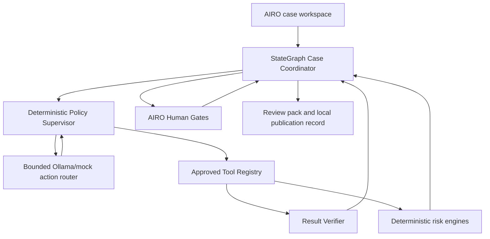

# AIRO Human-Governed Agentic Case Coordinator

A runnable Python demonstration of an AI Risk Triage tool for an AI Risk Oversight Team
(AIRO). It uses a LangGraph `StateGraph` to coordinate a persistent case, deterministic
materiality and 2LoD routing engines, bounded Ollama capabilities, and mandatory or
risk-based human decision gates.

> **Important:** all questionnaire fields, scores, thresholds, dealbreakers, minimum-route
> rules, 2LoD mappings and autonomy policies in this repository are illustrative. They are
> not approved PwC or MRO methodology and must not be used for real risk decisions.

## What the demo proves

- The user works from a case queue rather than manually moving through rigid tabs.
- The Coordinator chooses the next permitted step from case state and approved policy.
- Missing or conflicting evidence creates a task and pauses the case for AIRO.
- Ollama extracts and challenges evidence but cannot calculate, approve or publish a risk
  outcome.
- Materiality and 2LoD engagement are separate, transparent deterministic engines.
- LangGraph interrupts persist the case at Human Gates; the same `thread_id` resumes after
  an AIRO decision.
- A deterministic autonomy policy supports progressive automation without changing the
  architecture.
- A deterministic `PolicySupervisor` assigns the effective profile, allowlists actions and
  tools, enforces budgets and validates every router proposal.
- Tool results pass through deterministic verification; evidence changes archive and
  invalidate dependent stale outputs before selective reruns.
- Every human decision, graph pause/resume and runtime choice is stored in an audit history.
- Historical backtesting and one-answer-at-a-time sensitivity analysis support rule
  calibration; neither changes rules automatically.

## Architecture at a glance



The system uses four activity types:

| Type | Responsibility | Examples in the demo |
|---|---|---|
| **A — Agentic coordination** | Plan, route, pause, resume and re-plan the case | `app/graph.py` |
| **L — Bounded LLM** | Extract evidence and challenge unsupported claims | `app/llm/ollama.py` |
| **D — Deterministic** | Calculate materiality, 2LoD triggers and autonomy gates | `app/engines/` |
| **H — Human judgement** | Confirm facts, resolve exceptions, decide triage and approve writes | LangGraph interrupts |

This is deliberately a **single Case Coordinator**, not a group of role-playing agents.
Separate agents would add coordination and assurance complexity without improving the core
case-management problem.

## Quick start with Ollama

Prerequisites: Python 3.11+ and a local [Ollama](https://docs.ollama.com/) installation.

```bash
ollama serve
ollama pull llama3.2:3b

python -m venv .venv
source .venv/bin/activate
python -m pip install -e ".[dev]"
cp .env.example .env
uvicorn app.main:app --reload --host 127.0.0.1 --port 8000
```

Open <http://127.0.0.1:8000>. API documentation is at
<http://127.0.0.1:8000/docs>.

### Run without Ollama

The deterministic mock is provided for automated tests and architecture demonstrations:

```bash
LLM_MODE=mock uvicorn app.main:app --reload --host 127.0.0.1 --port 8000
```

Mock mode runs the same supervisor, router contracts, registry, verifier, StateGraph,
deterministic engines, SQLite checkpoints and AIRO interrupts as Ollama mode. Only the
variable LLM responses are replaced by protected, repeatable demonstration responses. The
UI labels this as `MOCK · deterministic demonstration runtime`; it does not present the
configured Ollama model as active. In the workflow strip, AIRO-completed Gates, deterministic
policy skips and event-driven Gates that were not triggered are shown as different states.

When `LLM_MODE=ollama` and `ALLOW_MOCK_FALLBACK=true`, the UI visibly reports a degraded
Ollama health state while governed mock fallback remains available. Each case records the
runtime actually used.

### Windows PowerShell

```powershell
py -3.11 -m venv .venv
.\.venv\Scripts\Activate.ps1
python -m pip install -e ".[dev]"
Copy-Item .env.example .env
$env:LLM_MODE = "mock"
python -m uvicorn app.main:app --reload --host 127.0.0.1 --port 8000
```

## Recommended demonstration

1. Create **Human Governed — Policy RAG Evidence Conflict** and start the Coordinator.
2. At Gate 1 inspect the actual router proposal, approved tool, verifier and remaining budget.
3. Add the evidence and answer update shown in `docs/DEMO_SCRIPT.md`; inspect targeted
   invalidation and complete the AIRO Gates.
4. Compare the approved conditional pattern, the deterministically sampled exception case
   and the eligible straight-through demo.
5. Finish with **Advanced — Invalid Tool Proposal** to show allowlist rejection without a
   tool invocation.

See [docs/DEMO_SCRIPT.md](docs/DEMO_SCRIPT.md) for a presenter narrative.

## Human Gates

| Gate | Reserved AIRO decision | Example loop |
|---|---|---|
| Evidence request | Add evidence, proceed with a recorded gap, or cancel | Back to extraction |
| Material input confirmation | Confirm or amend structured facts | Back to extraction |
| Exception resolution | Proceed, amend, seek more evidence, or cancel | Back to evidence/review |
| Final triage | Confirm or override materiality and 2LoD engagement | Back to exception review |
| Publication | Approve local record, save a draft, or cancel | Durable publication pause |

LangGraph nodes containing `interrupt()` may restart from the beginning when resumed. The
implementation therefore keeps side effects outside those nodes and records application
audits at the Coordinator boundary.

### Work queue and durable resume

The UI keeps the work queue deliberately small: it shows at most five Cases, ordered by the
most recent update. Each card distinguishes **start**, **resume at a named AIRO Gate** and
**read-only completed/cancelled review**. An exact Case-ID lookup can restore an older Case;
the selected historical Case replaces one recent card, so the visible queue remains capped
at five. Opening a card never submits a decision. A separate **Continue at current Gate**
control moves the user to the restored Gate form.

Case snapshots live in `data/cases.db`; LangGraph checkpoints live in
`data/checkpoints.db`. Retaining both files allows a Case paused at `interrupt()` to resume
after an application restart using the same `case_id`/`thread_id`. Terminal Cases remain
available for audit but cannot be resumed because they have no pending Gate.

## Progressive automation profiles

| Profile | Recommended UI definition |
|---|---|
| `human_governed` | Every applicable AIRO decision gate is mandatory; Gate 1 is activated when evidence gaps or conflicts exist. |
| `conditional_review` | Clean preparation stages may be skipped, but exception review is triggered when needed and final triage remains mandatory. |
| `exception_based` | Following initial input governance, eligible low-risk cases may skip later review unless exceptions, elevated risk, ineligibility or sampling requires AIRO review. |
| `straight_through_demo` | Only an explicitly eligible low-risk illustrative fixture may complete later permitted decisions and local-demo publication; ineligible cases fail safely to human review. |

`straight_through` remains accepted as a compatibility alias for stored demonstration cases.
New governed fixtures use the more explicit `straight_through_demo`; normal custom cases are
always assigned `human_governed`.

The autonomy policy is deterministic and fail-safe. The LLM never decides its own autonomy.
The normal `/api/cases` request has no autonomy-profile field: custom cases are assigned
`human_governed`. Higher profiles are available only through governed illustrative sample
fixtures, and the supervisor may downgrade them based on risk or evidence conditions.
Production use should start with `human_governed`; moving a case population to another
profile requires approved eligibility criteria, performance evidence and accountable owners.

### Governed scenario library

The UI exposes 15 typed cases in **Core workflow**, **Progressive Automation** and
**Advanced controls** groups. See [the sample coverage matrix](docs/SAMPLE_COVERAGE.md) for
each profile, router/tool behaviour, verification outcome, actual expected Gates and learning
objective. The metadata documents expected behaviour but cannot set runtime outcomes.

> **Warning:** The autonomy profiles and eligibility criteria are illustrative. Production
> progression between profiles requires approved criteria, historical performance,
> calibration, monitoring, sampling and AIRO governance.

## Project map

```text
app/
  graph.py                 LangGraph nodes, routes, loops and interrupts
  coordinator.py           Case service, resume validation and audit boundary
  agent/                    Policy, router, registry, verifier, interrupts and invalidation
  engines/                 Materiality, 2LoD and autonomy rules
  llm/                     Ollama adapter, schemas and deterministic mock
  services/evidence.py     Non-LLM evidence checks and targeted questions
  services/calibration.py  Backtesting and sensitivity diagnostics
  services/review_pack.py  Structured AIRO review pack
  database.py              SQLite case and audit store
  static/                  Single-page demonstration UI
tests/                     Engine, governance, calibration and workflow tests
docs/                      Architecture, development guide and demo script
```

## Tests

```bash
pytest
ruff check app tests
```

There is no configured static type checker in this dependency set. Runtime contracts are
checked with Pydantic and Python syntax/import integrity can be checked with
`python -m compileall -q app tests`.

Tests run with the deterministic mock and require no Ollama service.

## Production gaps intentionally left visible

This demo is a development baseline, not a deployable control. Before production, the team
must replace or extend it with:

- approved, version-controlled questionnaire and rule configuration;
- SSO, role-based access, separation of duties and case-level permissions;
- production database, encrypted evidence storage, retention and legal-hold controls;
- malware scanning, file parsing isolation and prompt-injection defences;
- model gateway, allow-listed models, observability, redaction and data-loss controls;
- formally governed Confluence/SharePoint adapters with idempotency and approval scopes;
- service monitoring, retry/dead-letter handling, backup and disaster recovery;
- golden datasets, expert-labelled backtests, override analysis and change approval;
- security, privacy, model-risk and operational-readiness assessment of the tool itself.

Further detail is in [docs/AGENT_DESIGN.md](docs/AGENT_DESIGN.md), the
[implementation review](docs/IMPLEMENTATION_REVIEW.md),
[docs/ARCHITECTURE.md](docs/ARCHITECTURE.md) and
[docs/TEAM_DEVELOPMENT_GUIDE.md](docs/TEAM_DEVELOPMENT_GUIDE.md).

## Primary framework references

- [LangGraph Graph API](https://docs.langchain.com/oss/python/langgraph/graph-api)
- [LangGraph interrupts](https://docs.langchain.com/oss/python/langgraph/interrupts)
- [LangGraph persistence](https://docs.langchain.com/oss/python/langgraph/persistence)
- [Ollama chat API](https://docs.ollama.com/api/chat)
- [Ollama structured outputs](https://docs.ollama.com/capabilities/structured-outputs)
