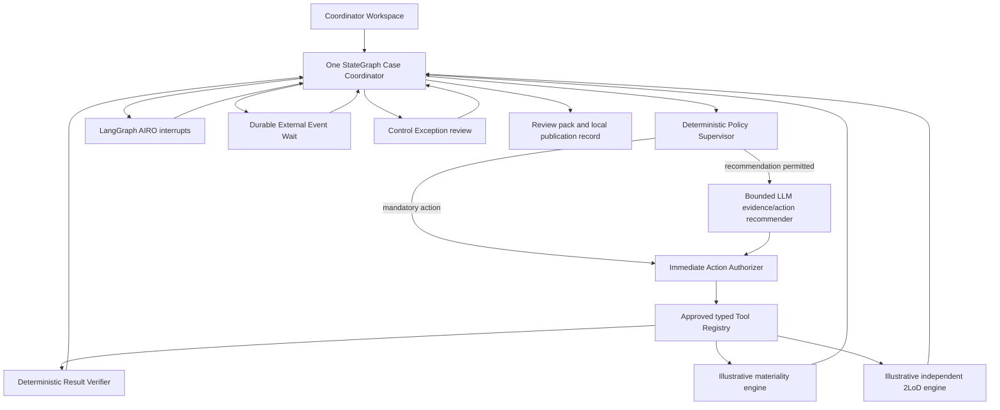

# AIRO Human-Governed Agentic Case Coordinator

A runnable demonstration for the AI Tech & Tooling and AI Risk Oversight (AIRO) teams. One
stateful Case Coordinator uses LangGraph to manage evidence work, deterministic risk
proposals, human decisions and a local publication record. The LLM is a bounded evidence and
action-routing capability; it is not the risk decision-maker.

> **Demo-policy warning:** every materiality score, threshold, dealbreaker, minimum route,
> 2LoD mapping, governed pattern, Progressive Automation profile rule and sampling rule in
> this repository is illustrative. None is approved PwC, MRO or bank methodology. The LLM
> never makes the final risk decision, AIRO retains final authority, and the straight-through
> path is a local demonstration only.

## Governance boundary

> One stateful AIRO Case Coordinator uses a deterministic policy supervisor to control a
> bounded LLM evidence/action router and approved tools. Tool results are verified, evidence
> changes trigger selective replanning, and meaningful judgement is escalated through AIRO
> Gates. Deterministic engines produce materiality and independent 2LoD proposals; AIRO
> retains final decision authority.

The implementation deliberately has one Coordinator, not a collection of independent
agents. The deterministic supervisor—not the model—assigns and downgrades automation
profiles, chooses the allowlists, enforces budgets and determines whether a Gate is required.
Unknown states, profiles, tools and actions fail closed.

## Capability status

| Capability | Delivery status |
|---|---|
| LangGraph `StateGraph`, SQLite checkpointing and Case store | Implemented and tested for a local demonstration |
| Full-state policy supervisor, bounded router, immediate action authorizer, typed tool registry and verifier | Implemented and tested |
| Deterministic materiality and independent 2LoD engines | Implemented and tested with illustrative rules only |
| AIRO `interrupt()` Gates and durable resume | Implemented and tested locally |
| Selective invalidation and superseded-result history | Implemented and tested |
| Lifecycle/domain-phase separation, readiness and completion guards | Implemented and tested |
| Correlated external-event waits and idempotent resume | Implemented and tested with simulated local events |
| Decision-focused Coordinator Workspace, readable domain summaries, six separate evidence panels, explicit completion criteria, connected action/Gate/event/end cycles and stale-result guards | Implemented and tested |
| Control Exception lifecycle and AIRO-authorized recovery | Implemented and tested locally |
| Mock LLM | Implemented, deterministic and used by automated tests |
| Ollama | Implemented local adapter; requires a separately installed model |
| OpenAI / OpenAI-compatible Responses endpoint | Implemented adapter; requires approved configuration and service access |
| Review pack and publication | Implemented as local records only |
| Backtesting and sensitivity | Implemented as diagnostics; never changes rules automatically |
| Confluence, SharePoint, email or task-system writes | Not implemented |
| SSO, RBAC, production evidence storage and enterprise observability | Future production considerations |

## Architecture



Four activity types remain visible in code and documentation:

| Type | Responsibility | Current implementation |
|---|---|---|
| **A — Agentic coordination** | Observe, plan, route, loop, pause, resume and selectively replan | `app/graph.py` |
| **L — Bounded LLM** | Extract cited evidence, challenge assumptions and recommend one allowlisted evidence action | `app/llm/` |
| **D — Deterministic** | Assign permissions, verify results and calculate illustrative proposals | `app/agent/`, `app/engines/` |
| **H — Human judgement** | Confirm facts, accept exceptions, override proposals and approve local publication | AIRO Gates |

See [Architecture](docs/ARCHITECTURE.md) and [Agent design](docs/AGENT_DESIGN.md) for the
control flow and module boundaries.

## Repository structure

```text
app/
  agent/             Supervisor, router, authorizer, readiness/completion, tools, verifier, invalidation
  engines/           Illustrative autonomy, materiality and 2LoD deterministic rules
  llm/               Shared prompts, provider registry, mock/Ollama/OpenAI adapters
  services/          Evidence checks, review-pack generation, calibration diagnostics
  static/            Packaged HTML, CSS and JavaScript demonstration UI
  coordinator.py     Case service, persistence/checkpoint and audit boundary
  database.py        Local SQLite Case and audit repository
  graph.py           One LangGraph StateGraph and all governed transitions
  main.py            FastAPI routes and static UI serving
  samples.py         Eighteen typed governed demonstration fixtures
  schemas.py         Pydantic API, action, tool and decision contracts
  state.py           Authoritative graph-state schema
  versions.py        Runtime, policy, rule, prompt, Gate and tool versions
data/.gitkeep         Empty runtime-data directory; databases are generated and ignored
docs/                 Architecture, provider, development, demo and release documentation
tests/                Deterministic engines, governance, journeys, UI and release contracts
.env.example          Placeholder-only local configuration template
pyproject.toml        Package, dependency, pytest and Ruff configuration
```

## Prerequisites

- Windows with PowerShell.
- Python 3.11 or newer. The declared range is `>=3.11`; the release checks also pass on
  Python 3.13.9.
- No Ollama process, API key, network connection or pre-populated database is needed in mock
  mode.
- Ollama mode additionally needs Ollama and the configured local model.
- Hosted providers additionally need explicit organisational approval, network access and a
  protected secret.

No software licence is declared. The receiving organisation must make that legal/handover
decision; this repository does not choose one on its behalf.

## Windows quick start — mock mode

From the repository root:

```powershell
py -3.11 -m venv .venv
.\.venv\Scripts\python.exe -m pip install --upgrade pip
.\.venv\Scripts\python.exe -m pip install -e ".[dev]"
$env:LLM_MODE = "mock"
.\.venv\Scripts\python.exe -m uvicorn app.main:app --reload --host 127.0.0.1 --port 8000
```

Open <http://127.0.0.1:8000>. OpenAPI documentation is at
<http://127.0.0.1:8000/docs> and health is at
<http://127.0.0.1:8000/api/health>.

If the Windows Python launcher is unavailable, use an installed supported interpreter, for
example `python -m venv .venv`. Selecting a VS Code interpreter does not change an already
open terminal; reopen the terminal or activate the environment with
`.\.venv\Scripts\Activate.ps1`. The commands above intentionally call the environment's
Python directly and do not require activation.

Mock mode runs the same StateGraph, supervisor, router contract, tool registry, verifier,
engines, checkpoints and Gates as live-provider modes. Only variable model responses are
replaced with protected deterministic fixture behaviour.

## Ollama mode

In one terminal, install/start Ollama and prepare the configured model:

```powershell
ollama serve
ollama pull llama3.2:3b
```

In a second terminal from this repository:

```powershell
$env:LLM_MODE = "ollama"
$env:OLLAMA_BASE_URL = "http://localhost:11434"
$env:OLLAMA_MODEL = "llama3.2:3b"
$env:ALLOW_MOCK_FALLBACK = "true"
.\.venv\Scripts\python.exe -m uvicorn app.main:app --reload --host 127.0.0.1 --port 8000
```

If Ollama or the model is unavailable, health is `degraded`. With fallback enabled, bounded
LLM calls use the deterministic mock and record the selected runtime; startup and mock-mode
operation do not depend on Ollama.

## OpenAI and other LLM APIs

The OpenAI adapter uses the Responses API with typed Pydantic output and requests
`store=false` by default. Supply secrets through protected environment configuration—not a
committed file:

```powershell
$env:LLM_MODE = "openai"
$env:OPENAI_API_KEY = "replace-through-an-approved-secret-store"
$env:OPENAI_MODEL = "your-approved-model-id"
$env:OPENAI_STORE_RESPONSES = "false"
.\.venv\Scripts\python.exe -m uvicorn app.main:app --reload --host 127.0.0.1 --port 8000
```

`store=false` is only a request option, not a complete privacy or data-governance control.
Use synthetic data until retention, residency, training use, access, redaction and contract
requirements are approved. See the [LLM provider guide](docs/LLM_PROVIDER_GUIDE.md) for
OpenAI-compatible endpoints and the tested extension contract for a different API.

## Demonstrations

Use mock mode for repeatable presentations. The UI contains 18 samples: eight numbered major
feature Cases, six dedicated Progressive Automation examples and four additional bounded-control
fixtures.

The **Create a demonstration case** catalogue is searchable and filterable by effective
automation profile. Category sections and teaching details are expandable so cases can be
compared without scrolling through every action and tool contract. Every compact card retains
the policy-assigned profile, learning purpose, AIRO focus and expected outcome before the
explicit **Create and open case** action. Creating a Case never starts the Coordinator.

Recommended short journey:

1. Compare **Case 1 — Standard Low-Risk Internal Summary** with **Case 2 — Multiple Permitted
   Evidence Actions** to distinguish deterministic selection from bounded recommendation.
2. Run **Case 3 — Questionnaire/Evidence Conflict** and **Case 4 — Missing Supplier Evidence**
   to show human and external-event evidence resolution.
3. Run **Case 5 — Agentic-AI Autonomy Exception** and **Case 8 — Elevated/High-Risk Protected
   Decisions** to show deterministic elevation, independent 2LoD and mandatory authority.
4. Compare **Case 6 — Stale Outputs and Selective Replanning** with **Case 7 — Tool
   Verification Failure** to show selective recovery versus fail-closed escalation.
5. Compare the conditional, exception-based and eligible straight-through examples. Their
   profiles are policy-assigned; protected teaching controls are explicitly not profile overrides.

The **Coordinator Workspace** is the primary Case page. Its current action is derived only
from the authoritative paused/running state; completed proposals and authorisations appear as
history, not as work still in flight. Policy Supervisor executable actions and AIRO Gate
decisions are deliberately displayed separately. Use **Evidence** for the six non-merged
finding categories and **Technical Trace** for expandable action, HITL, event, StateGraph and
completion cycles. The trace exposes structured control records and concise rationale only,
never hidden model reasoning.

The read-only **Case journey** above the workspace is a projection of authoritative
`lifecycle_status` and `domain_phase`; it is not the LangGraph itself and cannot advance a
Case. It separates domain phases from optional Governance Gates and visibly represents AIRO
waits, correlated external-event waits, Control Exceptions, policy-skipped Gates, reopened
work and stale outputs requiring replacement. An active phase always retains its current wait
or control status; invalidation is shown as a secondary reopening reason. Actual StateGraph nodes and transitions remain
in **Technical Trace**.

User-facing Questionnaire, Assessment, Second-Line and Review Pack views present concise
domain summaries first. Full structured records are available through explicitly labelled
expanders and Technical Trace. At a Human Gate, the decision form appears before expandable
rule/evidence/history support. It identifies every blocking item, the exact evidence or
questionnaire change required, the current and evidence-supported values, and relevant
citations. Allowed decisions are presented as cards, a deterministic recommendation is
labelled as such, common questionnaire corrections use guided controls, and a before-submit
preview states what will change, rerun and remain current. Advanced JSON remains available as
an explicitly labelled fallback. The Human Governance card follows the page's normal scroll
instead of introducing a nested scrollbar; **Continue at current Gate** moves focus directly
to the decision controls. Decision impacts use a compact expandable summary. Evidence cards show counts and a three-item preview,
with longer lists expanded on demand. Case-view tabs support keyboard arrow navigation. The
local server versions the CSS and JavaScript URLs and
serves UI assets with `no-store`, preventing an old script from being combined with newer
HTML or CSS during demonstrations.

Exact actions and expected outcomes for every sample are in the
[Demonstration script](docs/DEMO_SCRIPT.md) and [Sample coverage](docs/SAMPLE_COVERAGE.md).

## Progressive Automation profiles

| Profile | Illustrative demo behaviour |
|---|---|
| `human_governed` | Every applicable judgement loop is mandatory; a clean case does not create a meaningless exception loop. |
| `conditional_review` | Clean preparation may skip, but final triage and local publication approval remain human-owned. |
| `exception_based` | Eligible low-risk fixtures may skip specified review unless exceptions, ineligibility, elevation or deterministic sampling requires AIRO. |
| `straight_through_demo` | One tightly bounded eligible fixture may auto-confirm later demo decisions and publish a local record only. |

`straight_through` is accepted only as a compatibility alias for stored demonstration data.
New fixtures use `straight_through_demo`. Normal `POST /api/cases` input has no profile field
and is always assigned `human_governed`; an LLM cannot upgrade it.

## Human Governance Loops

| Gate | AIRO decision |
|---|---|
| Evidence request | Add evidence/amend answers, knowingly proceed with a recorded gap, or cancel |
| Material input confirmation | Confirm facts, edit answers, return for evidence, or cancel |
| Exception resolution | Proceed with rationale, edit, return for evidence, or cancel |
| Final triage | Confirm or override materiality/2LoD proposals, return for review, or cancel |
| Publication | Approve the local record, save a draft, or cancel |
| Control Exception review | Authorize an available retry/fallback/wait, cancel, or close failed-safe |

`AWAITING_EXTERNAL_EVENT` is not a Human Gate. It is a durable machine wait with a typed
event contract binding Case ID, correlation ID, source, schema and Case State version.

SQLite Case snapshots and LangGraph checkpoints are created automatically under `data/`.
They permit durable resume with the same Case/thread ID, but are local runtime artifacts and
must not be delivered or committed.

## API surface

| Method/path | Purpose |
|---|---|
| `GET /api/health` | Provider-neutral configured/selected runtime health |
| `GET /api/samples` | Typed demonstration catalogue |
| `POST /api/samples/{sample_name}` | Create a governed demonstration fixture |
| `POST /api/cases` | Create a normal human-governed Case |
| `GET /api/cases` | List persisted local Cases |
| `GET /api/cases/{case_id}` | Read a Case, pending Gate and audit history |
| `POST /api/cases/{case_id}/start` | Start a draft Case |
| `POST /api/cases/{case_id}/resume` | Submit an allowed AIRO Gate decision |
| `POST /api/cases/{case_id}/events` | Submit a correlated external event or timeout |
| `POST /api/cases/{case_id}/recover` | Submit a version-bound Control Exception recovery |
| `GET /api/cases/{case_id}/supervisor` | Read the current structured supervisor decision |
| `GET /api/cases/{case_id}/history` | Read decisions, authorizations, tools, results and transitions |
| `GET /api/cases/{case_id}/results` | Read current, stale and superseded result status |
| `GET /api/tools` | Read approved typed tool metadata |
| `POST /api/calibration/backtest` | Run diagnostics on caller-supplied labelled cases |
| `GET /api/calibration/demo-backtest` | Run the three synthetic historical examples |
| `POST /api/calibration/sensitivity` | Run one-answer-at-a-time illustrative sensitivity |

The browser UI uses every Case/sample/health route and the demo calibration routes. The
caller-supplied backtest endpoint is intentionally API-only.

## Tests and quality checks

```powershell
.\.venv\Scripts\python.exe -m pytest
.\.venv\Scripts\python.exe -m ruff check .
.\.venv\Scripts\python.exe -m ruff format --check .
.\.venv\Scripts\python.exe -m compileall -q app tests
.\.venv\Scripts\python.exe -m pip check
```

Tests use mock or injected fake clients and require no live model or key. No static type
checker is configured, so no type-check command is claimed. Pydantic validates runtime
contracts and Ruff/compileall cover configured static quality checks.

## Documentation map

- [Architecture](docs/ARCHITECTURE.md) — current StateGraph, persistence and module ownership.
- [Agent design](docs/AGENT_DESIGN.md) — Code Agency classification and authority boundary.
- [Team development guide](docs/TEAM_DEVELOPMENT_GUIDE.md) — safe change procedures.
- [LLM provider guide](docs/LLM_PROVIDER_GUIDE.md) — switch or add model APIs.
- [Demonstration script](docs/DEMO_SCRIPT.md) — presenter steps for every active sample.
- [Sample coverage](docs/SAMPLE_COVERAGE.md) — expected feature/Gate matrix.
- [Detailed StateGraph design](docs/AGENTIC_STATEGRAPH_AND_PROGRESSIVE_AUTOMATION.md) — expanded current flow.
- [Implementation history](docs/IMPLEMENTATION_REVIEW.md) — prior refactor record, not current release results.
- [Release-readiness report](docs/RELEASE_READINESS_REPORT.md) — baseline, changes and verification.
- [Original target reference](AIRO_Agentic_Case_Coordinator_Reference_Design.md) — future/historical design source, not implemented scope.

## Remaining production limitations

This is a local demonstration, not a production control. It does not provide enterprise
identity/authorisation, separation of duties, encrypted production evidence storage,
retention/legal hold, file malware isolation, enterprise model gateway, DLP, production
telemetry, backup/disaster recovery, approved rule configuration or real external writes.
Submitted evidence is treated as untrusted data, but heuristic prompt-injection detection is
not a complete content-security control.

Production progression requires accountable policy owners, approved rules and data sources,
expert-labelled evaluations, false-low tolerances, sampling, monitoring, change approval and
a tested rollback to `human_governed`. Calibration diagnostics never automatically update
rules, prompts, profiles or thresholds.

## Framework references

- [LangGraph Graph API](https://docs.langchain.com/oss/python/langgraph/graph-api)
- [LangGraph interrupts](https://docs.langchain.com/oss/python/langgraph/interrupts)
- [LangGraph persistence](https://docs.langchain.com/oss/python/langgraph/persistence)
- [Ollama chat API](https://docs.ollama.com/api/chat)
- [Ollama structured outputs](https://docs.ollama.com/capabilities/structured-outputs)
- [OpenAI Responses API](https://developers.openai.com/api/reference/cli/resources/responses/methods/create)
- [OpenAI models](https://developers.openai.com/api/docs/models)
