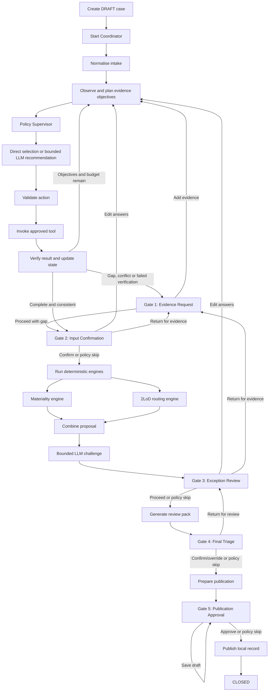

# Agentic AI, StateGraph, and Progressive Automation Design

**Status:** detailed description of the current local implementation. All materiality, 2LoD,
pattern, profile and sampling rules are illustrative demo policy.

## Overview

This application is a governed, stateful AI workflow. It is not a free-running autonomous agent and it is not a multi-agent system.

The design combines:

- a LangGraph `StateGraph` as the workflow controller;
- an LLM for bounded evidence extraction and challenge;
- deterministic Python engines for materiality assessment and second-line-of-defence (2LoD) routing;
- a deterministic autonomy policy for deciding which Human Governance Gates are required;
- LangGraph interrupts for human decisions; and
- SQLite persistence for case state, graph checkpoints, and audit records.

The principal governance boundary is:

> The LLM can identify facts and raise advisory observations, but it cannot calculate the official risk outcome, select the autonomy profile, skip a gate, approve a case, or publish a result.

The workflow is implemented primarily in [`app/graph.py`](../app/graph.py). Application-level creation, execution, persistence, and resumption are handled by [`app/coordinator.py`](../app/coordinator.py).

> This document retains the detailed Progressive Automation walkthrough. The current bounded
> action-loop, tool-contract, verifier and invalidation design is authoritative in
> [`AGENT_DESIGN.md`](AGENT_DESIGN.md).

## End-to-end StateGraph



The nodes and graph edges are registered in `TriageGraphFactory.build()` in [`app/graph.py`](../app/graph.py).

## Case creation and state

`CaseCoordinator.create_case()` creates a case with:

- a unique case ID;
- `status = "DRAFT"`;
- the system-assigned effective autonomy profile, approved maximum, rationale and policy version;
- the questionnaire and submitted evidence;
- empty exception, human-decision, task-plan, and autonomy logs;
- questionnaire, rule, prompt, and workflow versions; and
- an initial publication status.

Creating a case does not run the workflow. The case remains in `DRAFT` until the user selects **Start Coordinator**.

The shared graph state is represented by `TriageState` in [`app/state.py`](../app/state.py). It contains:

- identity and lifecycle information;
- questionnaire and evidence inputs;
- extracted evidence and deterministic evidence findings;
- task-plan and node-completion information;
- materiality and 2LoD results;
- exceptions and follow-up questions;
- human decisions and autonomy-policy evaluations;
- final outcome, review pack, and publication information; and
- version and LLM runtime evidence.

Each graph node returns a partial state update. The materiality and 2LoD branches write to different state keys, allowing them to run as a fork-and-join before the proposal is combined.

## Evidence extraction and Gate 1

### Bounded LLM extraction

The LLM extracts:

- evidence-backed facts;
- possible missing information;
- possible inconsistencies;
- risk signals; and
- references to evidence line numbers.

The adapters in [`app/llm/`](../app/llm/) share governed prompt builders and request typed
Pydantic output. The Ollama transport uses temperature zero; hosted transports send only
supported parameters. All providers treat submitted evidence as untrusted source material
and instruct the model not to make final materiality or approval decisions.

[`app/llm/factory.py`](../app/llm/factory.py) selects providers from an explicit registry and
can fall back from any live provider to the governed `MockLLMClient`. The configured primary,
selected runtime and fallback information are recorded in the case state.

### Deterministic Gate 1 routing

An LLM provider's possible gaps and inconsistencies remain available as advisory evidence
analysis. They do not directly force Gate 1.

Only `deterministic_evidence_checks()` in [`app/services/evidence.py`](../app/services/evidence.py), invoked through the approved Tool Registry, controls Gate 1 routing. It checks for:

- a missing evidence narrative;
- missing supporting evidence terms for declared risk flags;
- personal-data contradictions; and
- contradictions about human review.

This separation prevents speculative model suggestions, such as requesting information about possible future changes, from unexpectedly routing a complete sample to Gate 1.

When a deterministic gap or conflict exists, the graph creates a targeted evidence request and interrupts at **Gate 1 — Evidence Request**. Once Gate 1 is activated, it is mandatory for every autonomy profile.

At Gate 1, AIRO can:

- add evidence and/or amend answers, causing evidence extraction and checking to run again;
- proceed with the known gap, converting the unresolved issues into exceptions; or
- cancel the case.

## Human Gates, interruption, and resumption

Each Human Gate first asks `PolicySupervisor`, which delegates the deterministic Gate rule to
`AutonomyPolicyEngine` after re-evaluating the effective profile. If policy allows the Gate
to be skipped, the graph records the evaluation and moves to the next node. If review is
required, the node calls LangGraph's `interrupt(payload)`.

The gate payload contains:

- gate ID and title;
- a summary of the required decision;
- case ID;
- the autonomy-policy decision and rationale;
- allowed human actions;
- gate-specific case context; and
- a governance message explaining that the coordinator is paused.

The graph checkpoint preserves the exact point of interruption. `CaseCoordinator._save_snapshot()` reads the interrupt from the LangGraph snapshot and exposes it as `pending_gate`; it does not manually choose a pending gate.

When the user submits a decision, `CaseCoordinator.resume()`:

1. confirms that the case is waiting at a Human Gate;
2. validates that the action is allowed at that gate;
3. enforces evidence, override, and rationale requirements;
4. writes a human audit event; and
5. resumes the checkpoint with `Command(resume=decision.model_dump())`.

The case ID is also used as the LangGraph `thread_id`, providing durable, case-specific pause and resume behaviour.

## Deterministic decision engines

After Gate 2 is confirmed or skipped, the graph runs the materiality and 2LoD engines as parallel branches.

### Materiality engine

[`app/engines/materiality.py`](../app/engines/materiality.py) applies transparent illustrative scoring to:

- customer-facing use;
- customer decisioning;
- personal data;
- sensitive data;
- external model or supplier dependency;
- autonomous actions;
- critical-process dependency;
- absence of human output review; and
- financial or business impact.

It then applies minimum-route and dealbreaker rules, including:

- sensitive data sets a minimum route of `moderate`;
- critical-process dependency sets a minimum route of `material`;
- autonomous customer decisions/actions set at least `material`; and
- autonomous action in a critical process sets `severe`.

The result is a deterministic proposal, not an approval.

### 2LoD routing engine

[`app/engines/lod2.py`](../app/engines/lod2.py) independently evaluates specialist-routing triggers. Depending on the questionnaire, it may propose:

- Data & Privacy;
- Third-party / Supplier Risk;
- Conduct / Customer Risk;
- Operational Risk;
- Technology / Cyber;
- Business Continuity; and
- Model Risk / AI IVT.

The graph combines the two engine results into a `PROPOSED_NOT_APPROVED` outcome. At Gate 4, AIRO can confirm or override the proposed materiality band and 2LoD teams.

## Bounded challenge and Gate 3

After the deterministic engines run, the LLM performs a bounded challenge assessment. It may identify possible inconsistencies, unsupported assumptions, or follow-up questions, but it cannot change scores or approve the case.

Free-form LLM exception statements are converted into advisory follow-up observations. They do not directly control Gate 3.

The graph itself creates this deterministic, rule-supported exception when the proposed materiality is `negligible` or `minor` and `approved_pattern` is false:

> The low proposed band is not supported by an explicitly approved pattern.

Only existing exceptions, confirmed inconsistencies, and transparent rule-supported
exceptions are used for autonomy routing. This keeps demonstration behaviour reproducible
with the deterministic mock and across live LLM providers.

## Review pack and final decision

The review pack is assembled by [`app/services/review_pack.py`](../app/services/review_pack.py). It contains:

- the use-case overview;
- proposed materiality assessment;
- proposed 2LoD engagement;
- evidence extraction;
- exceptions and follow-up questions;
- recorded human decisions;
- final outcome, when available;
- workflow, rule, prompt, questionnaire, and LLM versions; and
- a governance statement retaining AIRO responsibility.

At Gate 4, AIRO can:

- confirm the proposal;
- override the materiality band and/or 2LoD teams;
- return the case to Gate 3 for further review; or
- cancel the case.

At Gate 5, AIRO can approve publication, save a draft, or cancel the case. Publication in this application creates only a local-demo reference. Production external writes require a separately governed adapter.

## Progressive Automation policy

The deterministic Gate policy is implemented in
[`app/engines/autonomy.py`](../app/engines/autonomy.py) and is controlled through
`PolicySupervisor` in `app/agent/policy.py`. The LLM is not an input to the Gate decision
beyond findings that have been bounded and converted into approved state fields.

For each gate, the policy considers:

- autonomy profile;
- materiality band;
- exceptions;
- missing information;
- inconsistencies;
- low-risk eligibility; and
- deterministic sampling, where applicable.

### Low-risk eligibility

The current code considers a case eligible when all of the following are true:

- proposed materiality is `negligible` or `minor`;
- `approved_pattern` is true;
- sensitive data is not used;
- customer decisioning is not performed;
- autonomous actions are not performed;
- the solution is not a critical-process dependency; and
- there are no exceptions, missing-information findings, or inconsistencies.

Before the deterministic engines run, there is no proposed materiality band. Therefore,
low-risk eligibility is false at that point. This explains why the `exception_based` and
`straight_through_demo` profiles require initial Gate 2 input governance.

## Profile comparison

| Profile | Gate 1 | Gate 2 | Gate 3 | Gate 4 | Gate 5 |
| --- | --- | --- | --- | --- | --- |
| `human_governed` | Required if activated | Required | Required | Required | Required |
| `conditional_review` | Required if activated | Usually skipped when clean | Required for exceptions or elevated cases | Always required | Required |
| `exception_based` | Required if activated | Required initially | Skipped only when eligible and clean | Required for exceptions, ineligibility, elevated risk, or sampling | Required |
| `straight_through_demo` | Required if activated | Required initially | Skipped when eligible | Skipped when eligible | Automatically approved locally when eligible |

## `human_governed`

Every configured decision gate reached by the workflow is mandatory.

Evidence-conflict journey:

```text
Gate 1 Evidence Request
→ Gate 2 Input Confirmation
→ Gate 3 Challenge/Exception Review
→ Gate 4 Final Triage
→ Gate 5 Publication Approval
→ Closed
```

Complete-evidence journey:

```text
Gate 2 Input Confirmation
→ Gate 3 Challenge/Exception Review
→ Gate 4 Final Triage
→ Gate 5 Publication Approval
→ Closed
```

Gate 3 remains mandatory even when there is no identified exception. This provides full human challenge and sign-off.

## `conditional_review`

This profile can skip clean preparation stages but retains mandatory final accountability.

Before the engines run, a clean case normally skips Gate 2 because there is no exception and no calculated elevated band. After materiality calculation:

- Gate 3 is required if there are exceptions or the band is `material` or `severe`;
- Gate 4 is always required; and
- Gate 5 is always required.

Clean approved-pattern journey:

```text
Skip Gate 2 Input Confirmation
→ Skip Gate 3 Exception Review
→ Gate 4 Final Triage
→ Gate 5 Publication Approval
→ Closed
```

Exception journey:

```text
Skip Gate 2 Input Confirmation
→ Gate 3 Exception Review
→ Gate 4 Final Triage
→ Gate 5 Publication Approval
→ Closed
```

An exact implementation detail is that the autonomy policy defines `elevated` as `material` or `severe`. A clean `moderate` conditional-review case does not require Gate 3 solely because it is moderate, although Gate 4 remains mandatory.

## `exception_based`

This profile requires initial input governance in the current implementation. Before the engines run, no materiality result exists, so low-risk eligibility cannot yet be established and Gate 2 is required.

After Gate 2:

- an eligible clean case skips Gate 3;
- a case with an exception requires Gate 3;
- an ineligible or elevated case requires Gate 3;
- Gate 4 is required for exceptions, elevated risk, ineligibility, or deterministic sampling; and
- Gate 5 remains mandatory.

Eligible journey:

```text
Gate 2 Input Confirmation
→ Skip Gate 3 Exception Review
→ Gate 4 only if selected for deterministic sampling
→ Gate 5 Publication Approval
→ Closed
```

Exception journey:

```text
Gate 2 Input Confirmation
→ Gate 3 Exception Review
→ Gate 4 Final Triage
→ Gate 5 Publication Approval
→ Closed
```

Elevated or ineligible journey:

```text
Gate 2 Input Confirmation
→ Gate 3 Risk/Exception Review
→ Gate 4 Final Triage
→ Gate 5 Publication Approval
→ Closed
```

Deterministic sampling hashes the case ID with SHA-256 and compares the resulting bucket with a 25% threshold. The same case ID therefore always produces the same sampling decision.

If an eligible case is not sampled, Gate 4 is skipped and the proposal receives `AUTO_CONFIRMED_WITHIN_DEMO_POLICY`; Gate 5 still requires human publication approval.

## `straight_through_demo`

This profile also requires Gate 2 initially because eligibility cannot be established until materiality has been calculated.

### Eligible case

```text
Gate 2 Input Confirmation
→ Deterministic engines
→ Skip Gate 3 Human Review
→ Skip Gate 4 Human Decision
→ Automatically approve local-demo publication
→ Closed
```

When Gate 4 is skipped, the final outcome receives:

```text
AUTO_CONFIRMED_WITHIN_DEMO_POLICY
```

When Gate 5 is skipped, publication is initially identified as:

```text
AUTO_APPROVED_LOCAL_DEMO_ONLY
```

The publish node creates a local demo reference and closes the case. It does not perform a production Confluence or other external write.

### Ineligible case

```text
Gate 2 Input Confirmation
→ Gate 3 Risk/Exception Review
→ Gate 4 Final Triage
→ Gate 5 Publication Approval
→ Closed
```

Assignment to `straight_through_demo` does not guarantee automation. The case must first
satisfy the low-risk eligibility boundary. An ineligible case fails safely to human review.

The schema and policy engine also accept `straight_through` as a compatibility alias for
stored demonstration data. Current demonstration cases use the canonical,
explicitly-labelled `straight_through_demo` value.

## Persistence and audit model

The coordinator maintains two related forms of persistence:

- the case repository stores operational state, status, pending-gate payload, and append-only audit events; and
- LangGraph's SQLite checkpointer stores execution checkpoints used to resume the graph at an interrupt.

The audit trail records:

- case creation;
- graph starts, pauses, resumes, and completion;
- pending gate and next graph nodes;
- LLM runtime metadata;
- every submitted human decision;
- rationales and answer amendments;
- materiality and 2LoD overrides; and
- autonomy-policy evaluations in `autonomy_log`.

## Governance safeguards

The main safeguards in the current design are:

- Gate routing is deterministic; the LLM cannot skip gates.
- Gate 1 is driven only by approved deterministic checks.
- Materiality and 2LoD routing use transparent Python rules.
- Free-form LLM challenge findings are advisory.
- Unknown autonomy profiles fail safely to mandatory human review.
- Ineligible straight-through demo cases fail safely to Gates 3–5.
- Human actions are restricted to the allowed actions for the active gate.
- Overrides must change the materiality band or 2LoD teams and require a rationale.
- Human decisions and autonomy-policy evaluations are retained.
- LangGraph checkpoints allow durable interruption and resumption.
- Automatic publication is restricted to a local demonstration record.

## Current implementation nuances

The following details are important when interpreting the policy:

1. The `elevated` flag used directly by the autonomy engine means `material` or `severe`.
2. A `moderate` case is not directly marked elevated, but it is outside low-risk eligibility. It therefore requires review under `exception_based` and `straight_through_demo`.
3. Personal data, customer-facing use, and external suppliers are not standalone exclusions in `_low_risk_eligible()`. They affect materiality scoring, but a case can technically remain eligible if the final band is still `negligible` or `minor` and every explicit eligibility condition passes.
4. If production policy intends any of those flags to be absolute straight-through exclusions, they should be added explicitly to the approved autonomy policy rather than inferred from LLM analysis.
5. The policy is labelled `demo-autonomy-1.0`; materiality and 2LoD rules also state that they are illustrative rather than approved production methodology.

## Production warning

> The autonomy profiles and eligibility criteria are illustrative. Production progression between profiles requires approved criteria, historical performance, calibration, monitoring, sampling and AIRO governance.
