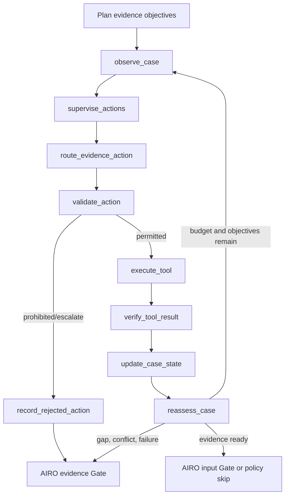
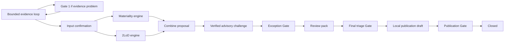

# Human-Governed Agent Design

## Design in one sentence

> One stateful AIRO Case Coordinator uses a deterministic policy supervisor to control a
> bounded LLM router and approved tools. Tool results are verified, changes trigger selective
> replanning, and meaningful judgement is escalated through mandatory AIRO Gates.
> Deterministic engines produce risk proposals; AIRO retains final decision authority.

All profiles, patterns, eligibility tests, scores and routing rules in this repository are
**illustrative demo policy**, not approved PwC or MRO methodology.

## Why one Coordinator

The unit of work is one governed Case with one authoritative state and one trace. Evidence
processing, materiality, 2LoD routing, challenge, pack generation and local publication are
tools used by that Coordinator. They are not independent agents with separate goals or
authority. This keeps dependencies, invalidation and accountable AIRO decisions visible.

The Coordinator is agentic because it observes unresolved objectives, selects among permitted
preparation actions, loops when evidence changes, verifies results, replans selectively and
pauses/resumes a durable case. Its decision and action authority remain constrained.

## Authority boundary

| Component | May do | Must not do |
|---|---|---|
| Policy Supervisor | Assign/downgrade profiles, allow actions/tools, enforce budgets, require Gates, fail closed | Delegate policy authority to the LLM |
| LLM router | Recommend one allowlisted evidence-preparation action with reason/confidence | Execute tools, mutate state, select risk/profile/Gate/approval outcomes |
| Tool Registry | Validate version, inputs, profile, approval and idempotency before invocation | Execute unknown or unauthorised tools |
| Result Verifier | Check schema, identity, citations, confidence, authority and obvious injection/rule-change attempts | Claim semantic certainty that heuristics cannot provide |
| Deterministic engines | Produce versioned materiality and 2LoD proposals | Approve the final outcome |
| AIRO | Confirm facts, accept gaps/exceptions, override proposals with rationale, approve consequential action | Bypass an active mandatory Gate through the API |

The LLM cannot determine or modify materiality scores, weights, thresholds, bands, validation
requirements, final 2LoD engagement, profiles, mandatory-Gate bypasses, final approval, or
approved prompts/policies/rules. `ActionType` contains evidence-preparation actions only.

## Objective and state

Every new case receives the frozen `CaseObjective` version `case-objective-1.0`:

> Prepare a complete, transparent and evidence-linked risk-triage proposal for AIRO review,
> without making or changing the final AIRO risk decision.

Typed completion criteria sit beside the objective. State separates submitted facts,
confirmed facts, evidence claims, mandatory gaps, advisory observations, inconsistencies,
confirmed exceptions and owned open issues. It also records action status, budgets, tool
invocations/results, verification, autonomy assignment, human decisions, invalidations,
superseded outputs and current authoritative results.

Compatibility fields such as `missing_information`, `exceptions` and `follow_up_questions`
remain because the existing UI and journeys use them.

## Bounded evidence-control loop

The supervisor orders foundational extraction and deterministic consistency checks before
dependent advisory checks. When exactly one action is permitted the Coordinator selects it
without an LLM call. When several variable actions are ready, the router receives only the
allowlisted actions and tools. The LLM recommends the action; the approved action contract
deterministically binds its executable tool, required inputs and human-review flag before
supervisor validation. Execution derives its input payload from the same contract and never
from model-authored fields. This prevents a locally hosted model from blocking a valid journey
by pairing an allowed action with the wrong tool or input shape. It never invokes a tool. The
loop is bounded by maximum calls and evidence cycles; exhausted or unknown states fail closed.

Ollama uses a structured `ActionProposal`. The mock implements the same contract. The existing
fallback wrapper routes Ollama transport/structured-output failure to the governed mock and
records the selected runtime.

## Tool registry and verification

`ToolRegistry` is the only invocation boundary used by the bounded evidence loop and the
deterministic engine/review-pack nodes. Each contract records ID/version, purpose, schema,
permission, risk, timeout, retry limit, idempotency, approval, allowed profiles and
implementation status.

The Confluence and email/task entries are safe local demonstrations. They return
`local-demo://` references and report `external_write=false`; execution requires both an AIRO
approver and explicit policy permission. There are no credentials or network writes.

The verifier checks result status, case/tool identity and version, confidence, citations,
source presence, unauthorised external actions and prohibited rule/Gate language. Submitted
evidence is always untrusted data. Prompt-injection indicators create security/advisory
issues; they are not followed. Semantic evidence tools carry the label:

> Advisory observation—AIRO confirmation required.

This label is intentional: deterministic heuristics cannot prove semantic correctness.

## StateGraph and AIRO interrupts

After the bounded evidence loop, the original explicit governance path remains:

`AIROInterruptController` gives each interrupt a gate ID/version, decision, reason,
supporting facts, evidence/citations, deterministic rule, recommendation, uncertainty,
allowed actions/effects, rationale requirement and decision authority. LangGraph
`interrupt()` and `Command(resume=...)` remain unchanged, so SQLite checkpoints still provide
durable resume behaviour. The supervisor is consulted before every Gate; no profile can skip
Gate 1 when a material evidence problem exists.

## Progressive Automation permissions

Normal `/api/cases` input has no autonomy field and defaults to `human_governed`. Only the
separate sample endpoint uses versioned governed fixture IDs. The supervisor derives an
approved maximum, then may downgrade the effective profile for elevated declared risk or
unresolved evidence. It never upgrades automatically.

- `human_governed`: every applicable decision Gate is mandatory.
- `conditional_review`: approved read-only preparation may run; final triage remains AIRO.
- `exception_based`: eligible low-risk fixtures may skip specified later Gates unless an
  exception, elevation, ineligibility or deterministic sample requires review.
- `straight_through_demo`: only an eligible low-risk fixture may auto-confirm later demo
  decisions and local publication. Elevated fixtures are downgraded. `straight_through` is
  retained only as a stored-case compatibility alias.

Each Gate evaluation records effective profile, policy version, eligibility, rationale,
risk/evidence conditions and sampling result where relevant.

## Demonstration contracts

`DemonstrationCase` keeps scenario narrative, learning objectives and expected typed actions,
tools, verification statuses, Gates and deterministic risk outputs separate from the normal
creation request. The graph never reads those expectations. Protected mock modes are explicit
fixture controls—not title matching—and cannot be supplied to `/api/cases`.

The catalogue covers normal bounded routing, deterministic single-action selection,
low-confidence rejection, prohibited-tool rejection, prompt injection, invalid citations,
stable sampling, selective replanning and budget exhaustion. See
[`SAMPLE_COVERAGE.md`](SAMPLE_COVERAGE.md).

## Replanning and invalidation

`invalidation_update()` compares answer changes with explicit dependency sets. Evidence-only
changes invalidate evidence extraction, challenge, review pack and any prior final/publication
output, but do not rerun materiality or 2LoD unnecessarily. A risk-answer change also
invalidates both engines and their dependent proposal. Previous values move to
`superseded_results`; an invalidation record retains version, reason, trigger, materiality and
approval validity. Empty invalidated fields prevent stale results from appearing current.

Material outcome changes set `material_change_requires_airo_review`. Engine outputs are added
back to `current_authoritative_results` only after governed re-execution.

## Extending safely

### Add an evidence tool

1. Add a narrow `ToolIdentifier` and, only if the router may select it, an `ActionType`.
2. Define validated input/output models and a versioned `ToolContract`.
3. Register a bounded handler; default to read-only/advisory.
4. Add the action-to-tool mapping and deterministic readiness conditions.
5. Add verifier checks and limitations appropriate to the output.
6. Test allowlisting, schemas, version, idempotency, timeout/retry policy and failure path.
7. Never give the tool authority over deterministic outcomes or Gates.

### Add a governed pattern

1. Obtain an accountable, versioned illustrative/approved policy decision outside the LLM.
2. Add the pattern ID and maximum profile to the policy registry.
3. Add a fixture whose declared maximum matches the registry.
4. Test eligibility, downgrade, exceptions, sampling and every mandatory Gate.
5. Never add an unrestricted profile field to normal case creation.

### Test a routing rule

Test the supervisor output first, then proposal schema/validation, registry invocation,
verification disposition, state update and bounded reassessment. Include unknown action/tool,
low confidence, model-unavailable and exhausted-budget cases.
