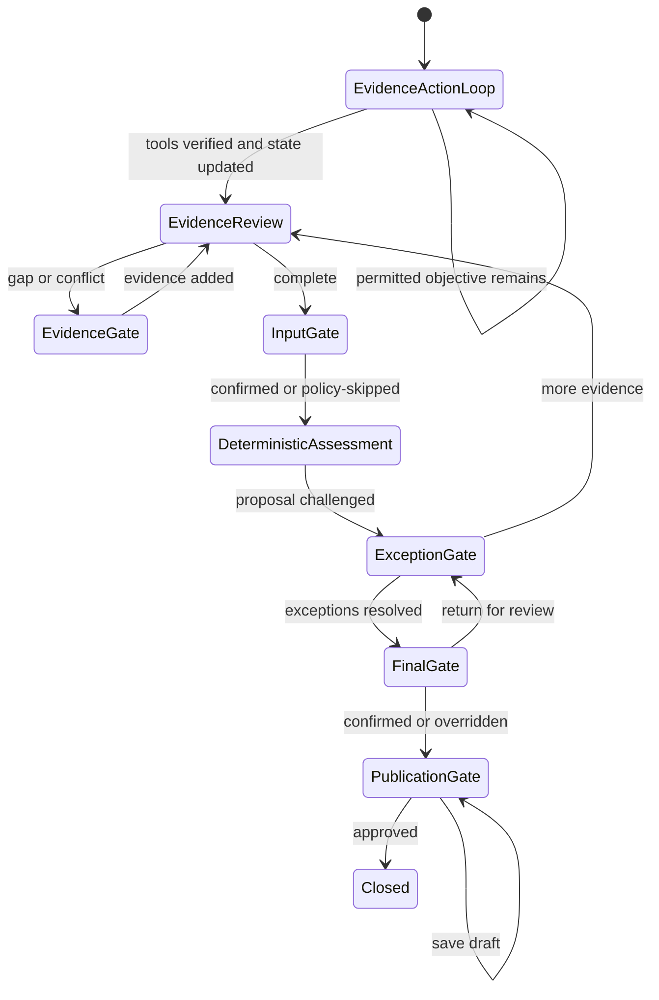

# Architecture and governance design

## Design decision

The demo is a **human-governed agentic case-management system**. Agentic behaviour is used
where it adds value: maintaining case state, selecting the next permitted task, looping when
evidence changes, pausing for human decisions and resuming the same case. Risk decisions are
not delegated to the LLM.

The Coordinator now classifies as **an agent with deterministic orchestration, constrained
decision authority, constrained action authority and mandatory AIRO oversight**. See
[`AGENT_DESIGN.md`](AGENT_DESIGN.md) for the bounded action loop and contract details.

## StateGraph contract

The state contains five categories:

| Category | Main fields |
|---|---|
| Identity/lifecycle | `case_id`, `thread_id`, status, timestamps, autonomy profile |
| Inputs/evidence | questionnaire, evidence text, extraction, gaps, conflicts |
| Coordination | task plan, completed nodes, recommended next action |
| Risk proposal | materiality result, 2LoD result, exceptions, follow-ups |
| Governance/output | human decisions, autonomy log, final outcome, review pack, versions |

Typed extensions distinguish mandatory gaps, advisory observations, inconsistencies,
confirmed exceptions, open issues, action status, tool budgets, trace entries and
invalidated/superseded/current results. The canonical objective and completion criteria are
stored in every case.

Demonstration expectations are deliberately outside this authoritative state. Each
`DemonstrationCase` contains a normal `CreateCaseRequest`, a governed-pattern ID, learning
metadata and expected typed transitions. Only its protected demo controls (stable sampling
key, mock router mode or reduced budget) enter state through the sample-only endpoint. A
normal creator cannot submit these fields or select an autonomy profile.

## Policy, router, registry and verifier

`PolicySupervisor` is injected into the graph with `BoundedActionRouter`, `ToolRegistry` and
`ResultVerifier`. The supervisor alone determines allowed actions/tools, router access,
budgets, confidence, effective profile, Gate requirements and external-action permission.
The router returns one Pydantic `ActionProposal`; it never invokes tools. Every invocation is
versioned and idempotent, and every result receives deterministic checks plus explicit
semantic limitations.

The `case_id` is also the LangGraph `thread_id`. SQLite checkpoints provide durable graph
state; the application database provides an operational queue and append-only demonstration
audit events.

## Boundary of the Ollama capability

Ollama receives line-numbered evidence and schema-constrained prompts. It may:

- extract supported facts with line references;
- identify possible gaps and inconsistencies;
- flag risk signals and suggest follow-up questions;
- challenge unsupported low-risk assumptions.

It may not:

- set scores, thresholds, dealbreakers or materiality bands;
- determine the final 2LoD route;
- decide whether a Human Gate can be skipped;
- approve, override or publish a formal outcome;
- edit rules or learn from decisions online.

The adapter treats submitted evidence as untrusted data, uses structured JSON outputs and
sets temperature to zero. Pydantic validates every response. Production still requires a
model gateway, content controls and adversarial evaluation.

## Why a Coordinator is better than a fixed wizard

| Fixed workflow | Agentic Case Coordinator |
|---|---|
| User decides which tab to revisit | Case state routes to the affected task |
| Steps assume one forward sequence | Evidence, exception and review loops are first-class |
| Missing data is a screen error | Missing evidence becomes an owned task and durable pause |
| Automation is embedded in UI sequence | Autonomy is a separate, versioned policy |
| Hard to process a queue | Every case has status, next action, owner and checkpoint |
| LLM often appears as a generic assistant | LLM tools have explicit permissions and output schemas |

## Deterministic decision boundary

Materiality applies answer-to-score mappings, thresholds, dealbreakers and minimum-route
rules. 2LoD engagement uses independent answer-trigger mappings. Both produce proposals.
AIRO can confirm, amend or override them, with rationale retained.

## Progressive autonomy controls

Autonomy is a policy decision, not an LLM decision. Eligibility should eventually combine:

- approved pattern and materiality boundary;
- no unresolved gap, conflict, exception or dealbreaker;
- stable data, supplier, model, purpose and control design;
- measured false-low and override performance;
- optional deterministic sampling;
- explicit effective dates and change approval.

The demo implements the structural pattern, not final eligibility policy.

Exception-based sample selection uses a stable policy-owned sampling key for protected
fixtures and the immutable case ID otherwise. Every evaluated Gate records its policy
version, effective profile, eligibility, rationale, risk/evidence conditions and sampling
result. Rejected router proposals are first-class trace entries with no invocation/result;
they cannot fall through to tool-result verification.

The 15-case coverage and actual expected Gate routes are documented in
[`SAMPLE_COVERAGE.md`](SAMPLE_COVERAGE.md).

## Integration pattern

The local publication record deliberately does not write to Confluence. A production adapter
should be an allow-listed tool invoked only after the publication gate, with least-privilege
credentials, idempotency keys, page/template restrictions, preview, audit response and retry
handling. The same design applies to SharePoint, email and work-management integrations.
