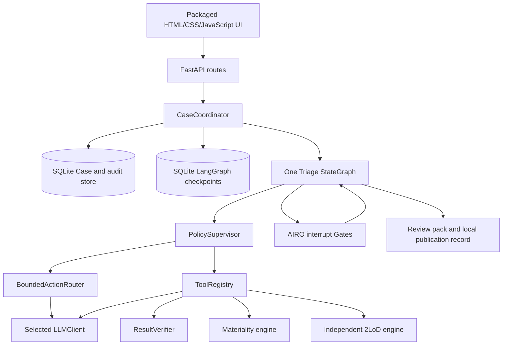
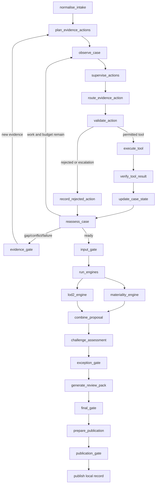

# Current architecture and governance design

This document describes the implemented repository. Future production ideas are identified
as such. All rules and Progressive Automation policies in the current code are illustrative
demo rules; AIRO retains final decision authority.

## Architectural decision

There is one stateful **AIRO Case Coordinator**. Evidence processing, policy supervision,
tool execution, verification, deterministic engines, review-pack generation and local
publication are capabilities of that Coordinator—not independent agents.

The Coordinator qualifies as a human-governed agentic workflow because it observes a Case,
plans bounded work, selects between permitted actions, uses tools, evaluates results, loops,
replans after change and pauses/resumes long-running work. It has constrained Code Agency:
it can coordinate evidence preparation and local records, but it cannot own or expand its
authority. See [Agent design](AGENT_DESIGN.md).

## Runtime topology

The UI does not control workflow progression. It displays saved Case state and submits only
the allowed action at the current Gate.

## StateGraph control flow

`run_engines` is an intentional fork marker: the materiality and 2LoD nodes write distinct
state fields in parallel, then join at `combine_proposal`. All node and edge names above
match `TriageGraphFactory.build()`.

## Authoritative Case state and persistence

`TriageState` is a `TypedDict` containing:

- identity, lifecycle, thread ID and system-assigned profile;
- questionnaire, evidence and submitted/confirmed facts;
- evidence claims, deterministic gaps, advisory findings and open issues;
- objective, plan, action statuses, budgets, retries and tool trace;
- materiality, 2LoD and combined proposals;
- AIRO decisions, Gate/autonomy records and final outcome;
- invalidations, superseded values and current authoritative results; and
- workflow, prompt, rule, questionnaire and LLM runtime versions.

The Case ID is also the LangGraph thread ID. `CaseRepository` stores the operational Case,
pending Gate and append-only demonstration audit. `SqliteSaver` stores graph checkpoints.
Both databases are created automatically; neither is source or required seed data. A paused
Case can resume after Coordinator restart, while a terminal Case remains read-only.

## Deterministic supervisor and bounded LLM router

`PolicySupervisor` is the authority boundary. It:

- assigns the maximum and effective profile from an explicit governed fixture registry;
- defaults every normal Case to `human_governed`;
- downgrades but never upgrades an effective profile;
- orders pending evidence objectives;
- supplies exact action/tool allowlists;
- enforces tool-call/evidence-cycle budgets and confidence;
- validates the single router proposal;
- asks the autonomy engine whether each Gate is required; and
- fails unknown or exhausted states closed to AIRO.

When one action is permitted, `BoundedActionRouter` selects it deterministically without an
LLM call. When several are permitted, the LLM returns one typed `ActionProposal`. The
approved action contract—not model-authored fields—binds its tool and inputs before policy
validation. The router never executes a tool or mutates state.

The mock, Ollama, OpenAI and OpenAI-compatible modes implement one `LLMClient` contract and
reuse the same prompts. LLM output is locally Pydantic-validated. Evidence is untrusted input.
The LLM may extract, challenge and route evidence work; it may not determine materiality,
2LoD, profiles, Gate bypass, final approval, rules or publication authority. See the
[LLM provider guide](LLM_PROVIDER_GUIDE.md).

## Typed tool registry and verification

`ToolRegistry` is the single invocation boundary for the tools used by the graph. Its active
contracts cover evidence extraction/consistency, RAG/autonomy/supplier observations,
citation checks, bounded challenge, both deterministic engines and review-pack generation.
Each contract specifies identity/version, purpose, schema, permission, risk, timeout,
retries, idempotency and allowed profiles.

`ResultVerifier` checks status, Case/tool identity and version, confidence, citation lines,
source presence, preservation of conflicts, unauthorised external-action flags and obvious
rule/Gate manipulation text. Semantic evidence results remain explicitly advisory because
deterministic checks cannot prove their meaning is correct. Rejected proposals have trace
records but no invocation or tool result.

## Deterministic risk engines

`calculate_materiality()` applies transparent scores, thresholds, dealbreakers and minimum
routes. `calculate_2lod_triggers()` separately maps questionnaire answers to proposed
specialist teams. Neither engine reads LLM conclusions. Both outputs are versioned proposals
and all rules are illustrative; AIRO confirms or overrides the final outcome with rationale.

Backtesting and sensitivity call the materiality engine as diagnostics. They report possible
false lows/highs and answer influence; they never mutate code, configuration or Case rules.

## AIRO interrupts

The five possible Gate types are evidence request, material input confirmation, exception
resolution, final triage and local publication. A Gate payload records its ID/version,
decision, reason, evidence/citations, rule evaluation, uncertainty, allowed actions, action
effects, rationale requirements and decision authority.

Graph nodes call LangGraph `interrupt()`. `CaseCoordinator.resume()` validates that the Case
is waiting, the submitted action is allowed and all action-specific evidence/override/
rationale fields are present before `Command(resume=...)`. Interrupt nodes contain no
external side effects because LangGraph restarts the node on resume.

## Selective replanning and invalidation

Evidence-only change archives and invalidates derived evidence, challenge, review-pack and
prior final/publication outputs while retaining deterministic engines whose questionnaire
inputs did not change. A risk-answer change also invalidates materiality, 2LoD and the
combined proposal. Old values move to `superseded_results`; an explicit invalidation record
captures cause, version and material-change effect. Only re-executed results return to
`current_authoritative_results`.

This dependency-aware path prevents both stale approvals and unnecessary full resets.

## Publication boundary

`prepare_publication` creates a structured local draft. The publication Gate controls its
approval unless the explicitly eligible `straight_through_demo` fixture is allowed by
illustrative policy. `publish` adds a `local-demo://` reference and closes the Case. It makes
no network request and has no credentials.

Real Confluence, SharePoint, email or task adapters are not implemented. Those are future
production considerations requiring least-privilege credentials, target restrictions,
idempotency, approval, audit, retry, data and security controls.

## Main module responsibilities

| Module | Responsibility |
|---|---|
| `app/main.py` | FastAPI routes and static UI serving |
| `app/coordinator.py` | Creation, start/resume validation, snapshots and application audit |
| `app/database.py` | Local operational Case and audit persistence |
| `app/graph.py` | StateGraph nodes, routing, loops, Gates and local publication |
| `app/state.py` | Authoritative graph-state keys |
| `app/schemas.py` | Typed API, action, tool, trace and decision contracts |
| `app/versions.py` | Central runtime/version identifiers |
| `app/agent/policy.py` | Deterministic permissions, budgets, profile assignment and Gate interface |
| `app/agent/router.py` | Single bounded action recommendation |
| `app/agent/tools.py` | Active approved-tool contracts and invocation |
| `app/agent/verifier.py` | Deterministic result checks and advisory limits |
| `app/agent/interrupts.py` | Consistent AIRO Gate payloads |
| `app/agent/invalidation.py` | Dependency-aware invalidation/supersession |
| `app/engines/` | Illustrative autonomy, materiality and independent 2LoD rules |
| `app/llm/` | Provider-neutral contract, prompts, registry and adapters |
| `app/services/` | Evidence checks, calibration and review-pack assembly |
| `app/samples.py` | Typed governed fixture catalogue and expected teaching metadata |

## Production boundary

The implemented system is a local demonstration. Production identity, authorisation,
separation of duties, protected evidence ingestion/storage, approved rule configuration,
enterprise model gateway, monitoring, recovery and external integrations are not present.
The original [target reference design](../AIRO_Agentic_Case_Coordinator_Reference_Design.md)
contains possible future ideas; it is not evidence that those capabilities exist.
