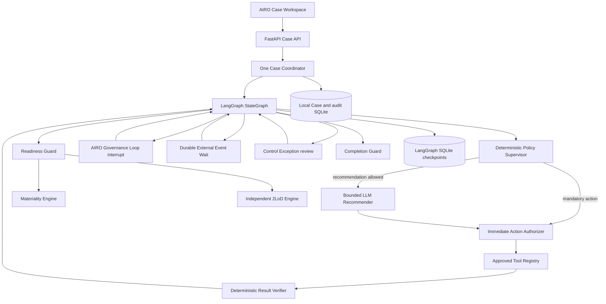
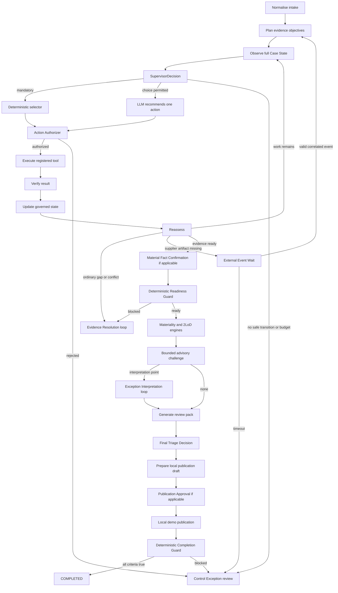

# Current Architecture and Governance Design

This is the authoritative description of the implemented local demonstration. All
materiality, 2LoD, pattern, profile, sampling and autonomy rules are illustrative demo rules.

## Architectural decision

One stateful AIRO Case Coordinator owns one LangGraph `StateGraph`. A deterministic Policy
Supervisor evaluates the complete current Case State and decides what is permitted. When no
action is mandatory, a bounded LLM may recommend exactly one allowlisted evidence action.
An immediate deterministic Action Authorizer checks that proposal before the approved Tool
Registry can execute it. Results are verified before state is updated. AIRO retains authority
for facts, exceptions, final triage and local publication.

There are no independent risk-decision agents and no route by which an LLM can set
materiality, 2LoD engagement, automation profile, policy, a Gate outcome or final approval.

## Runtime topology

## StateGraph control flow

Governance Loops are exception-driven. A clean human-governed Case still requires its
applicable material-fact, final-decision and publication decisions, but it does not create an
empty exception-interpretation interrupt. Evidence Resolution, External Event Wait and
Control Exception review appear only when their trigger exists.

## Case state, lifecycle and persistence

`app/state.py` separates:

- `lifecycle_status`: `NEW`, `OPEN`, `WORKING`, `AWAITING_HUMAN`,
  `AWAITING_EXTERNAL_EVENT`, `CONTROL_EXCEPTION`, `COMPLETED`, `CANCELLED` or
  `FAILED_SAFE`;
- `domain_phase`: intake, evidence review, input confirmation, assessment, challenge, final
  decision or publication;
- compatibility `status`: a UI/work-queue label retained for existing callers;
- candidate facts, AIRO-confirmed facts, deterministic gaps/conflicts, advisory observations
  and confirmed exceptions as separate fields;
- objectives, plans, authorizations, invocations, results and verification records;
- current, stale, invalidated and superseded outputs;
- human decisions, external events, Control Exceptions and transition history;
- Case State, rule, workflow, prompt, provider and tool-contract versions.

`CaseRepository` stores snapshots and append-only local audit events. `SqliteSaver` stores the
LangGraph checkpoint required by `interrupt()`/`Command(resume=...)`. Both databases are
generated local artifacts; neither is required in a fresh repository.

`current_action_proposal`, `current_action_authorisation` and
`current_tool_invocation` are transient execution fields. After a completed or rejected
attempt is written to `agent_action_trace`, these fields are cleared. The Coordinator then
recomputes the supervisor decision after projecting a Gate or external-event interrupt. This
prevents the workspace from presenting a historical tool action or pre-pause allowlist as the
current Case instruction.

## Supervisor, recommender and Action Authorizer

`PolicySupervisor.supervise()` is pure deterministic control code. Its structured decision
records allowed/prohibited actions, allowed tools, mandatory action, whether an LLM
recommendation is permitted, active Governance Loop, expected external event, readiness,
four remaining budgets, effective profile, completion candidacy and any Control Exception.

The LLM receives only actions/tools made available by the supervisor and returns one typed
`ActionProposal`. It cannot execute. `ActionAuthoriser` checks action/tool match,
registration, required inputs, data permission, policy/rule versions, budgets, confidence,
active human authority, profile and external-action authority immediately before execution.
Failure is auditable and enters Control Exception handling without a tool call.

## Tool registry and verification

Every `ToolContract` states identity/version, authority class, schemas, data permissions,
read-only/external-action boundary, allowed profiles, timeout/retry policy, result verifier and
owner. Calls contain Case and rule versions plus an idempotency key.

`ResultVerifier` records `VERIFIED`, `VERIFIED_WITH_LIMITATIONS`, `ADVISORY_ONLY`,
`REJECTED` or `EXECUTION_FAILED`. Checks cover identity/version, confidence, citations and
support, the declared output schema, untrusted-evidence authority, unresolved conflicts and
prohibited external/rule changes. A malformed result uses only its bounded contract retry;
an unresolved failure enters Control Exception review. Only verified or explicitly labelled
advisory output updates its state field.

## Deterministic engines and readiness

The readiness guard blocks engine execution until the questionnaire is valid/current,
mandatory gaps and conflicts are governed, required material facts are confirmed, and input
dependencies are current. Materiality and 2LoD then run independently through registered
tool contracts. Result hashes, drivers, dealbreakers, route rules, triggers and rule versions
are combined as a proposal, not a final decision. All engine rules are illustrative.

## Human decisions, events and replay safety

Each human decision has an ID, reviewer/role/authority, Case/Governance Loop/Gate IDs, Case
State and rule versions, action, rationale and timestamp. Stale, mismatched or replayed
decisions are rejected.

Each interrupt also carries a typed, Gate-independent human-task contract. `required_inputs`
identifies each blocking item, required response/artifact, relevant questionnaire field,
current and evidence-supported values, review items, citations and accepted resolutions.
`action_impacts` describes the required fields and the expected state changes, selective
reruns, preserved current work and next step for every allowed decision. These records are
deterministically derived from authoritative Case State; they are decision support, not an
LLM judgement or a second workflow controller.

External Event Wait is a machine wait, not a disguised Human Gate. Its contract declares
event type, Case ID, correlation ID, source, schema, due time, timeout action and Case State
version. A valid simulated stakeholder-evidence or external-response event appends evidence
and selectively replans; wrong
correlation/source/schema/version/integrity fails closed; duplicate IDs are idempotent; timeout
creates a Control Exception.

Control Exception review exposes only recovery actions possible under remaining budgets.
AIRO may authorize retry, deterministic fallback, external wait, cancellation or failed-safe
closure as applicable. A workflow failure is not a risk rejection.

## Invalidation, completion and publication

Evidence or questionnaire changes create invalidation records, retain superseded values and
schedule dependent evidence actions. Material questionnaire changes invalidate both engines
and later approvals. Gate 5 can record a material-fact amendment before publication; this
supersedes the prior AIRO final decision and returns only affected work to the evidence loop.
Recomputed outputs clear their stale marker.

Each evidence/action cycle records the StateGraph node, observed state, Policy Supervisor
decision, selected action and method, authorisation, full governed Tool Contract, invocation,
tool output, verification, before/after state diff, invalidated outputs and next transition.
The Technical Trace renders these structured records with `[STATE]`, `[DET]`, `[LLM]`,
`[TOOL]`, `[VERIFY]`, `[HITL]`, `[EVENT]` and `[END]` badges; it never exposes hidden
chain-of-thought. Action cycles and the supporting human-decision, correlated-event,
StateGraph-transition and completion cycles are expandable. The Coordinator Workspace also
lists the configured completion contract before the terminal evaluation runs and shows the
latest deterministic check result afterward.

The UI's **Case journey** is deliberately not labelled as the StateGraph. It is a read-only
projection of `domain_phase` with `lifecycle_status`, the active Governance Loop, Gate,
external-event contract, Control Exception and stale-output overlays. A Gate is shown as a
control condition attached to a phase rather than as an independent workflow controller.
Invalidation can therefore mark downstream phases stale and the current phase reopened
without falsely resetting progress to Intake. The real graph node and transition sequence is
available only in Technical Trace.

The presentation layer follows progressive disclosure. The Coordinator Workspace keeps the
current action, lifecycle, proposals, Governance Loop, Gate decisions and completion progress
visible; budgets, allowlists and recent execution history are expandable. Questionnaire and
deterministic-engine views render domain labels and summaries before technical records. Gate
forms render the typed blocking tasks first, followed by allowed-decision cards, guided inputs
for common corrections and a before-submit impact preview. Rule, evidence, uncertainty,
history and the advanced JSON fallback remain expandable. The Human Governance card uses the
same document scroll as the rest of the workspace instead of a nested viewport-height scroll;
the resume shortcut moves keyboard focus directly to the selected decision. The impact summary
stays compact until expanded, and narrow layouts retain the same natural document flow.
Evidence panels show counts and short previews, while longer lists and full typed payloads stay
collapsed. The tab interface exposes keyboard navigation and visible focus states.
`UI_ASSET_VERSION` is injected into
CSS/JavaScript URLs and demo static responses use `Cache-Control: no-store` so incompatible
frontend files cannot be mixed by a browser cache.

The completion guard permits `COMPLETED` only when objectives/actions are closed, blocking
issues and Control Exceptions are absent, both risk proposals and review pack are current, a
final decision exists and local publication is reconciled.

Publication creates an idempotent `local-demo://` record only. Confluence, SharePoint, email
and task-system writes are not implemented. Backtesting/sensitivity never changes live rules.

## Main module responsibilities

| Module | Responsibility |
|---|---|
| `app/graph.py` | StateGraph nodes, routing, Governance Loops, events, recovery and completion |
| `app/coordinator.py` | Case service, version/replay validation, checkpoints and audit |
| `app/state.py` / `app/schemas.py` | Authoritative state and typed contracts |
| `app/agent/policy.py` | Full-state supervision and profile assignment |
| `app/agent/router.py` / `authorizer.py` | Bounded recommendation and immediate authorization |
| `app/agent/tools.py` / `verifier.py` | Capability gateway and result verification |
| `app/agent/readiness.py` / `completion.py` | Engine and terminal guards |
| `app/agent/invalidation.py` | Dependency-aware invalidation and selective rework |
| `app/engines/` | Illustrative autonomy, materiality and 2LoD rules |
| `app/llm/` | Mock, Ollama, OpenAI and compatible provider adapters |
| `app/main.py` | FastAPI contracts and packaged static workspace |
| `app/versions.py` | Central application, state, policy, event, tool and rule versions |

Production identity, RBAC/SoD, secure evidence storage, DLP, observability and approved rule
configuration remain future considerations and are not implemented by this demo.
