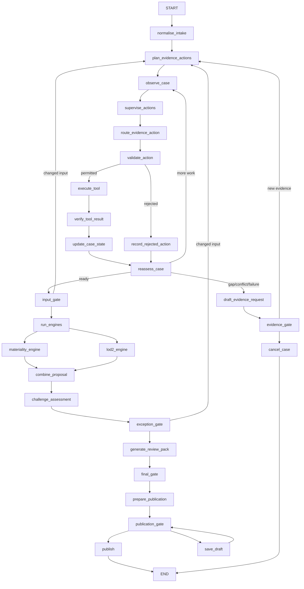

# Current Agent Design Review

Review date: 25 August 2026  
Baseline version: `0.1.0` / workflow `airo-case-coordinator-0.2`  
Audience: AI Tech & Tooling and AI Risk Oversight (AIRO)

This is the mandatory pre-change review for the upgrade to a policy-supervised,
exception-driven AI Risk Triage Case Coordinator. It describes the implementation inspected
before that upgrade. It is evidence for the refactor, not a description of unimplemented
future behavior.

All materiality, second-line, pattern, sampling and automation rules in this repository are
illustrative demo rules. The existing deterministic results are regression constraints and
must not change silently.

## Inspection and baseline

The workspace is not a Git worktree, so `git status`, history and diff evidence are
unavailable. Files were reviewed in place; no reset, checkout, source deletion or application
edit occurred before this report was created.

The review covered every application module, entry point, schema, graph node, engine, LLM
adapter, service, API route, static UI file, sample, test, Markdown document and declared
dependency. Repository-wide searches covered policy, planning, routing, registry,
authorisation, verification, citations, invalidation, replanning, external events, human
validation, automation, completion and exception handling.

Baseline environment: the existing `.venv`, Python 3.13.9.

| Check | Pre-change result |
|---|---|
| `python -m pytest` | 129 passed in 21.89 seconds |
| `python -m ruff check .` | Passed |
| `python -m ruff format --check .` | Passed; 56 files formatted |
| `python -m compileall -q app tests` | Passed |
| `python -m pip check` | No broken requirements |
| Type checking | Not configured; not run |

An earlier baseline attempt with system Python failed during import because that interpreter
did not contain `langgraph-checkpoint-sqlite`; the declared project environment passed. A
transient missing `README.md` was also observed before the current file was restored in the
workspace. Neither was a workflow regression.

## Original architecture found

The repository already implements one `CaseCoordinator`, one compiled LangGraph
`StateGraph`, a deterministic `PolicySupervisor`, one `BoundedActionRouter`, one governed
`ToolRegistry`, one `ResultVerifier`, deterministic materiality and independent 2LoD engines,
SQLite Case/audit persistence, SQLite checkpoints and LangGraph `interrupt()` resume points.
There is no competing agent or second workflow.

The pre-change graph topology is:

The materiality and 2LoD nodes fork from `run_engines`, produce independent versioned
outputs and join at `combine_proposal`. Second-line teams are derived directly from
questionnaire triggers, not from the materiality band.

## Current Case State

The pre-change `TriageState` contains these groups:

- identity and lifecycle: Case/thread IDs, one overloaded `status`, error, timestamps;
- governance: effective profile/assignment, scenario controls, objective and criteria;
- inputs/evidence: questionnaire, evidence, evidence cycle, submitted and confirmed facts,
  extraction, claims, mandatory gaps, observations, inconsistencies, exceptions and issues;
- coordination: task/action plans, pending/completed/failed/prohibited actions, current
  proposal, policy assessment, validation, reassessment and recommendation;
- execution: current invocation/result/verification, action trace, call/evidence budgets,
  retries and timeouts;
- proposals: materiality, 2LoD and combined outcome;
- human control: decisions, autonomy log and current numbered Gate;
- outputs/history: final outcome, review pack, local publication, invalidations,
  superseded results and current-authoritative-result map; and
- versions: questionnaire, rules, workflow, prompts and selected LLM runtime.

Several compatibility lists (`missing_information`, `inconsistencies`, `exceptions`) are
used alongside more strongly typed issue collections. Candidate facts, lifecycle and domain
phase, event contracts, structured authorisations, structured budgets, transition history,
readiness, completion and control exceptions are not yet first-class fields.

## Current human Gates

| Gate ID | Pre-change trigger/ownership |
|---|---|
| `evidence_request` | Mandatory when a deterministic gap, conflict or failed verification exists |
| `input_confirmation` | Profile policy; confirms questionnaire/evidence inputs before engines |
| `exception_resolution` | Profile policy, but `human_governed` reaches it even without a meaningful exception |
| `final_triage` | AIRO confirms or overrides materiality/2LoD; mandatory for human/conditional profiles |
| `publication` | AIRO approves the local demo record except eligible straight-through demo cases |

Interrupt payloads already contain the decision, reason, evidence/citations, applicable Gate
rule, recommendation, uncertainty, allowed actions/effects and AIRO authority. Resume
validation checks the action, rationale and answer/override inputs. It does not yet bind a
decision to explicit Case/Gate/rule versions or provide request idempotency.

## Deterministic, LLM and human boundaries found

| Owner | Current responsibilities |
|---|---|
| Deterministic code | Questionnaire validation; action/tool allowlists; profile assignment/downgrade; Gate policy; budgets; tool/result checks; illustrative materiality and 2LoD; invalidation |
| Bounded LLM | Cited extraction, advisory challenge and recommendation among supplied evidence-action/tool allowlists |
| Coordinator | State observation, planning, tool invocation, loop control, checkpoints and local draft/publication records |
| AIRO | Confirm material facts, accept gaps/exceptions, override proposals, make final triage and approve governed publication |

The `ActionType` schema excludes approval, materiality, 2LoD, profile, Gate-bypass and
publication choices. The LLM cannot invoke tools directly. These boundaries are adequate and
must be preserved.

## Gap classification

### Already implemented and adequate

- One stateful Coordinator and one StateGraph; no multi-agent design.
- SQLite Case/audit persistence and LangGraph checkpoint/resume.
- Unchanged pure deterministic materiality and independent 2LoD engines.
- System-assigned normal-case `human_governed` profile, governed demo-pattern maxima,
  deterministic downgrade and stable exception-based sampling.
- Pydantic provider/action/tool/result contracts and mock, Ollama, OpenAI and
  OpenAI-compatible provider abstraction.
- Deterministic single-action selection and bounded LLM selection only when several
  evidence actions remain.
- Explicit action/tool allowlists, registry-only invocation, idempotency, timeout/retry
  metadata and safe provider/tool failures.
- Result identity/version/confidence/citation/authority checks and prompt-injection
  treatment as untrusted evidence.
- Separate deterministic engine outputs, human final decision and local-only publication.
- Selective invalidation with superseded-result history.
- Backtesting and sensitivity that never change rules automatically.

### Implemented but incomplete

- `PolicySupervisor` covers evidence actions, tools, confidence, Gate policy and two budgets,
  but does not emit the full structured whole-Case `SupervisorDecision`.
- `validate_action` enforces action/tool policy but does not create an immutable,
  append-only `ActionAuthorisation` record with state/version/input checks.
- `ToolContract` has the core controls but lacks explicit authority class, data permissions,
  read-only flag, verifier ID and owner fields requested by the target.
- `VerificationResult` uses lower-case dispositions and a latest-result field; it lacks the
  target status vocabulary and a complete append-only verification-result collection.
- State distinguishes many issue types, but compatibility lists and candidate/confirmed
  evidence concepts are not fully separated.
- Invalidation is selective, but dependency metadata, stale-output status and replacement
  reconciliation are not explicit enough for the requested UI.
- Human interrupt payloads are rich, but governance-loop type, version binding,
  decision-id replay protection and external-event handling are missing.
- Profiles change actual Gates, but the fixed downstream sequence still causes a
  meaningless exception Gate for some routine human-governed cases.
- Action traces record proposal/invocation/result/verification, but not the complete
  observe-policy-authorise-update-transition cycle.
- Completion criteria exist as text but are not evaluated by a dedicated deterministic
  completion policy.

### Implemented differently but reusable

- The existing bounded evidence loop already matches most of the target control pattern.
  Its nodes should be split/renamed only where responsibility becomes more explicit, rather
  than replaced wholesale.
- Numbered Gates are valid audit/UI labels. Workflow decisions can be migrated to named
  Governance Loops while retaining the IDs for compatibility.
- `open_issues` plus specialized collections can be migrated incrementally instead of
  introducing a second issue subsystem.
- `status` is widely used by persistence, UI and tests. It can remain as a projected legacy
  display status while authoritative lifecycle and domain phase become separate fields.
- The Case repository can keep its summary column while event and version contracts live in
  the authoritative JSON state and checkpoint.
- Existing sample fixtures already demonstrate most of the eight required journeys; they
  should be extended with external-event and control-exception behavior rather than replaced.

### Missing and required

- Explicit `LifecycleStatus` and `DomainPhase` fields and transitions.
- Structured full-State `SupervisorDecision`, including prohibited actions, mandatory
  action, governance/event requirements, all budgets, readiness, completion and control
  exception decisions.
- Dedicated deterministic action selector and auditable `ActionAuthoriser` component.
- Explicit deterministic `ReadinessPolicy` before the two risk engines.
- Durable expected-external-event contract, validation, simulated endpoint, resume logic,
  timeout behavior and UI controls.
- Structured `ControlException`, safe recovery actions, AIRO review loop and recovery API.
- Case/rule-version and idempotency checks for human decisions and events.
- Explicit deterministic completion evaluation.
- Coordinator UI fields for lifecycle/phase, open objectives, full policy decision,
  authorisations, budgets, Governance Loop, events, control exception and tagged technical
  cycle trace.
- A missing-supplier demonstration that visibly waits for and resumes on a simulated event.
- Acceptance tests for the new authorisation, readiness, event, control-exception,
  completion and version/replay boundaries.

### Out of scope for this demo

- Real email, Confluence, SharePoint, MARM, supplier or second-line integrations.
- Consequential external publication.
- Enterprise SSO/RBAC, authoritative reviewer-directory lookup and enforceable segregation
  of duties; the demo can validate declared reviewer identity/role only.
- Production event bus, scheduler, malware scanning, artifact signatures and protected
  evidence storage.
- Production rule methodology, approved thresholds, real governed patterns and automated
  calibration changes.
- Raw chain-of-thought or unrestricted model/tool access.

## Refactor decision

There is no ambiguity requiring a change to materiality or 2LoD methodology. Their pure
functions and expected sample outcomes will be retained as regression constraints. The
upgrade will extend and clarify the existing Coordinator in phases, preserving its provider,
persistence, Gate and invalidation foundations rather than creating duplicate components.

